# 华为云PaaS微服务治理技术：P65：18.Kubernetes集群健康检查与测试(2) 🛠️

在本节课中，我们将学习如何解决因镜像拉取失败导致的Kubernetes Pod创建问题。核心方案是搭建并使用私有镜像仓库，并配置Kubernetes节点从该仓库拉取镜像。

## 问题分析与解决方案概述

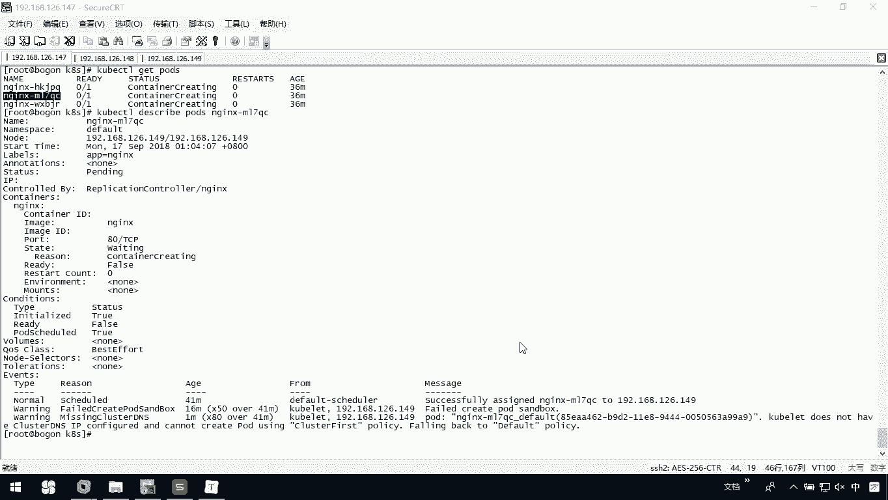

上一节我们介绍了Pod因镜像拉取失败而处于`Pending`状态的问题。本节中我们来看看具体的解决方法。

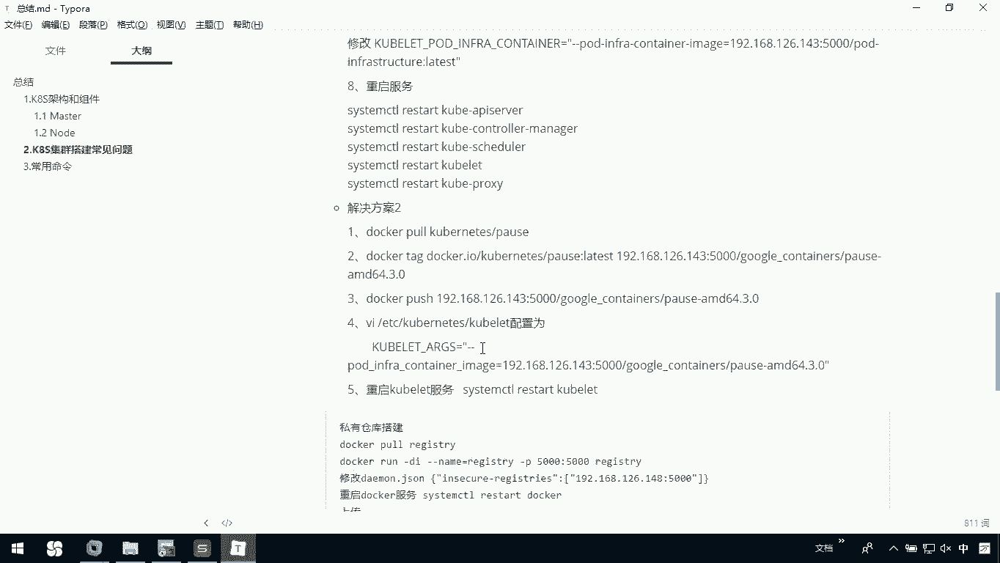

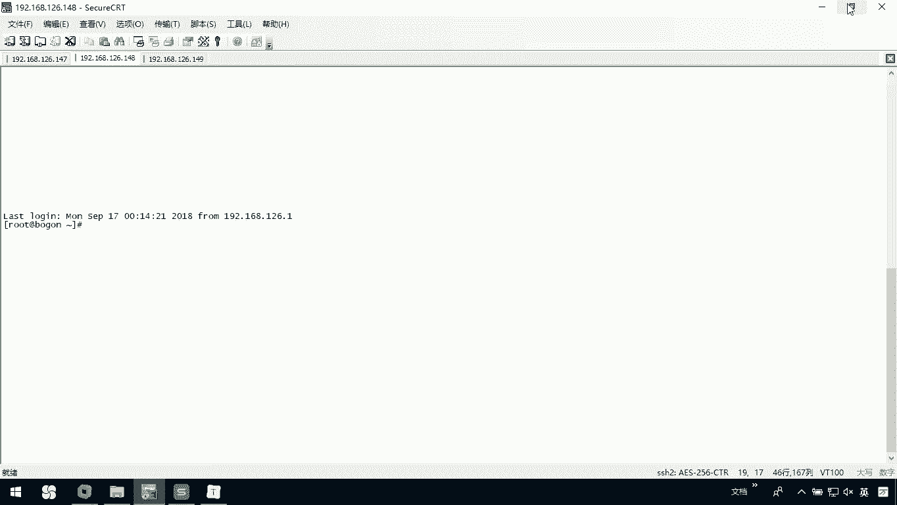

问题的根本原因是默认的镜像仓库（`gcr.io`）无法访问。解决方案是搭建私有镜像仓库，并配置Kubernetes节点从私有仓库拉取所需的镜像。

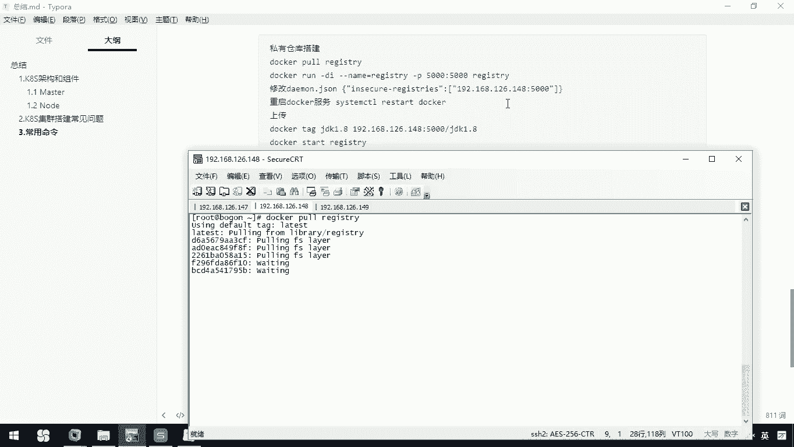

## 搭建私有镜像仓库

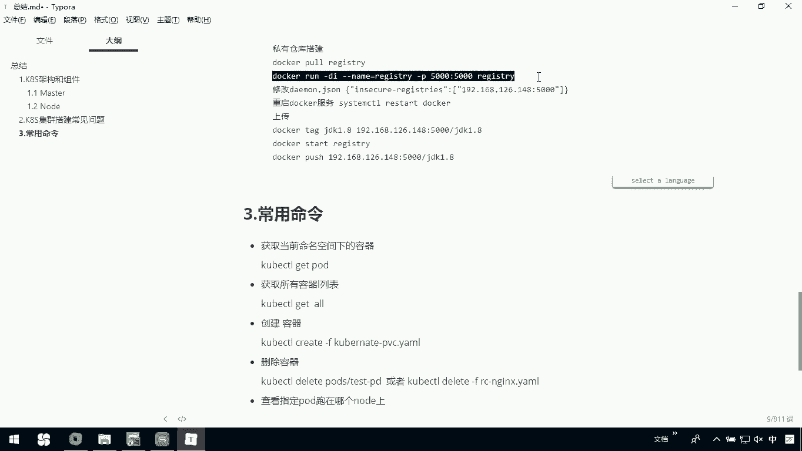

首先，我们需要在一台节点服务器上搭建Docker私有仓库。以下是操作步骤。

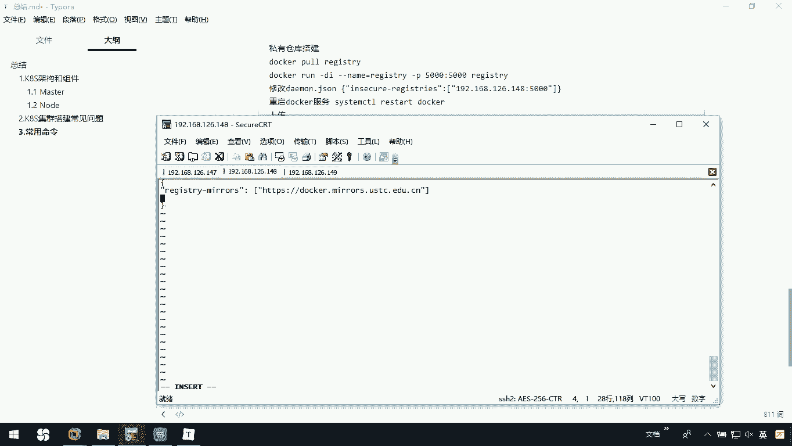

### 拉取并运行Registry镜像

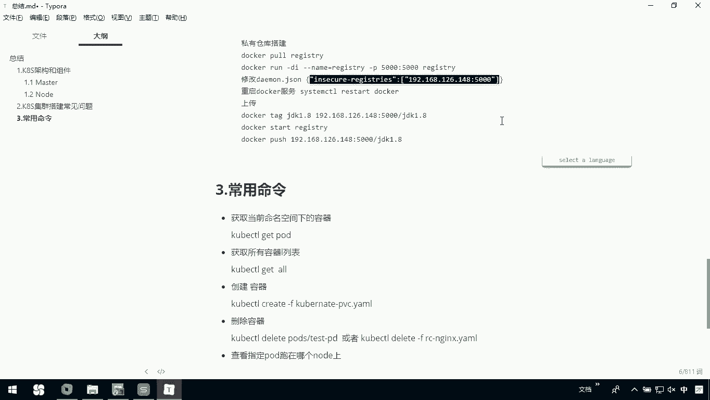

在选定的节点上（例如node节点），执行以下命令拉取并运行Docker官方提供的Registry镜像。

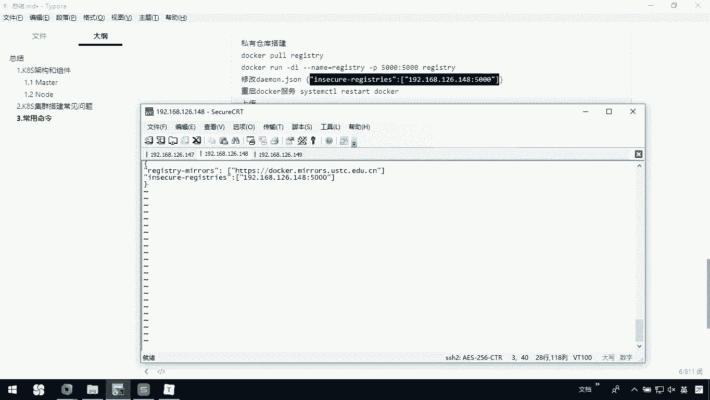

```bash
docker pull registry
docker run -d -p 5000:5000 --name my-registry registry
```
此命令会在本地启动一个私有仓库，并映射到主机的5000端口。

### 配置Docker守护进程

为了让Docker信任这个私有仓库，需要修改Docker的守护进程配置文件。

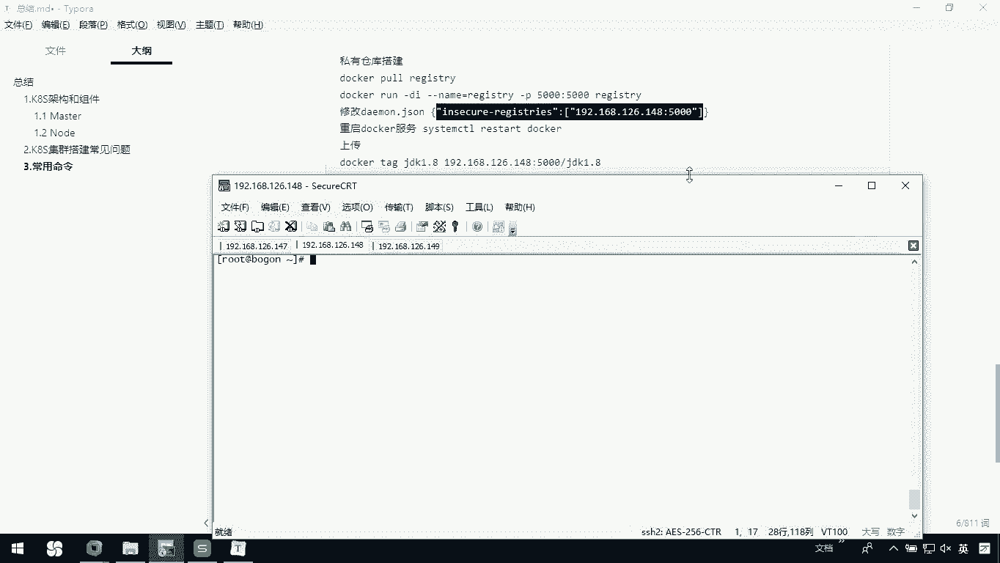

1.  编辑配置文件：
    ```bash
    vi /etc/docker/daemon.json
    ```
2.  在配置文件中添加私有仓库地址。注意JSON格式，每个配置项之间用逗号分隔。
    ```json
    {
      "insecure-registries": ["192.168.126.148:5000"],
      ... // 其他原有配置
    }
    ```
    请将IP地址`192.168.126.148`替换为您自己的节点IP。
3.  保存退出后，重启Docker服务使配置生效。
    ```bash
    systemctl restart docker
    ```

## 推送镜像到私有仓库

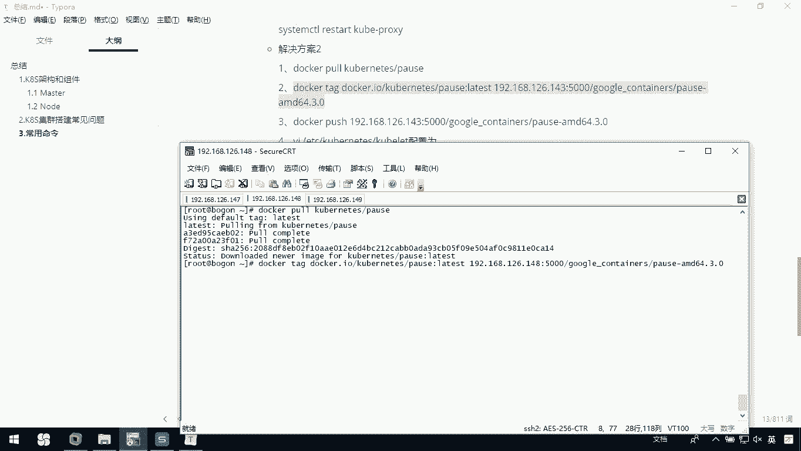

接下来，我们需要将所需的镜像（例如`nginx`）拉取到本地，重新打标签后推送到私有仓库。

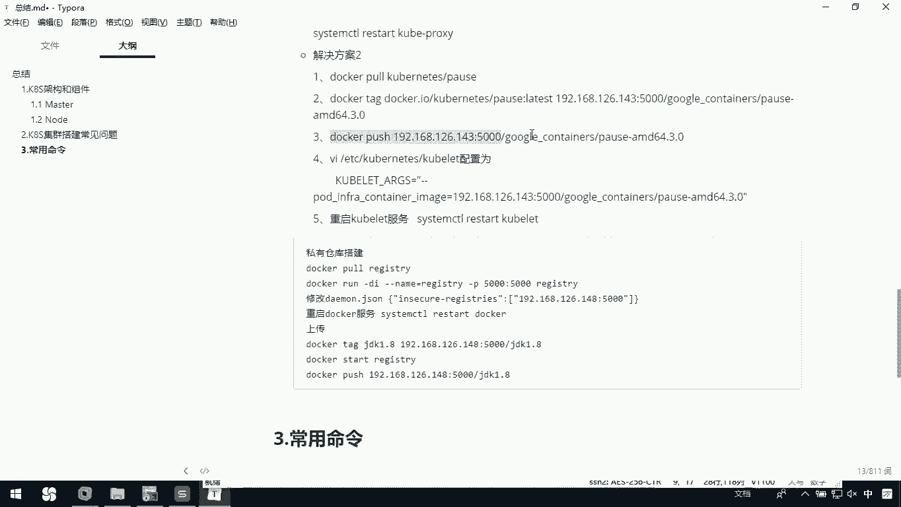

以下是操作步骤。

1.  从公共仓库拉取镜像：
    ```bash
    docker pull nginx
    ```
2.  为镜像打上指向私有仓库的标签：
    ```bash
    docker tag nginx 192.168.126.148:5000/nginx
    ```
3.  将镜像推送到私有仓库：
    ```bash
    docker push 192.168.126.148:5000/nginx
    ```

## 配置Kubernetes节点

最后，需要修改每个Kubernetes节点（包括Master和Node）的配置，指定其从私有仓库拉取基础镜像（Pause容器）。

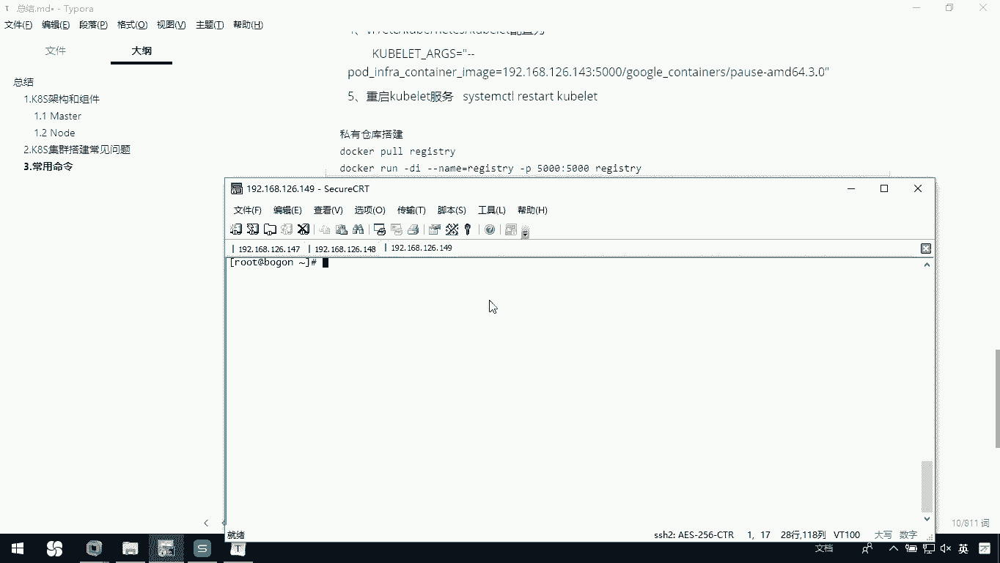

### 修改Kubelet配置

在每个节点上执行以下操作。

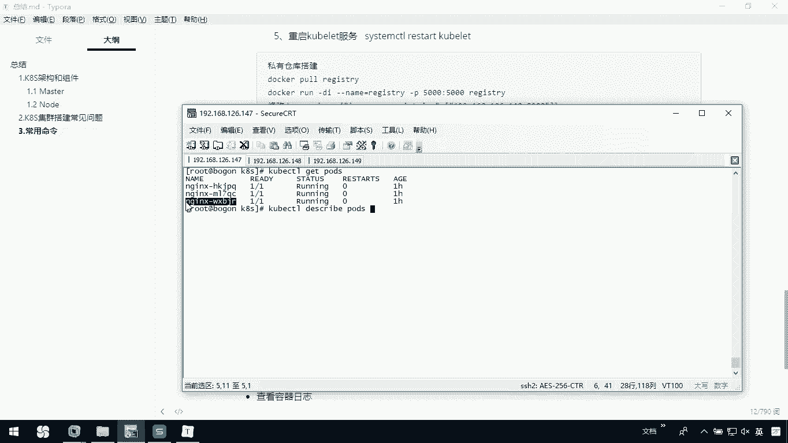

1.  编辑Kubelet的配置文件：
    ```bash
    vi /etc/kubernetes/kubelet
    ```
2.  在`KUBELET_ARGS`参数中添加以下配置：
    ```bash
    --pod-infra-container-image=192.168.126.148:5000/pause-amd64:3.0
    ```
    请确保IP地址和端口与您的私有仓库一致，并且末尾有空格。
3.  保存退出后，重启Kubelet服务：
    ```bash
    systemctl restart kubelet
    ```

### 验证配置结果

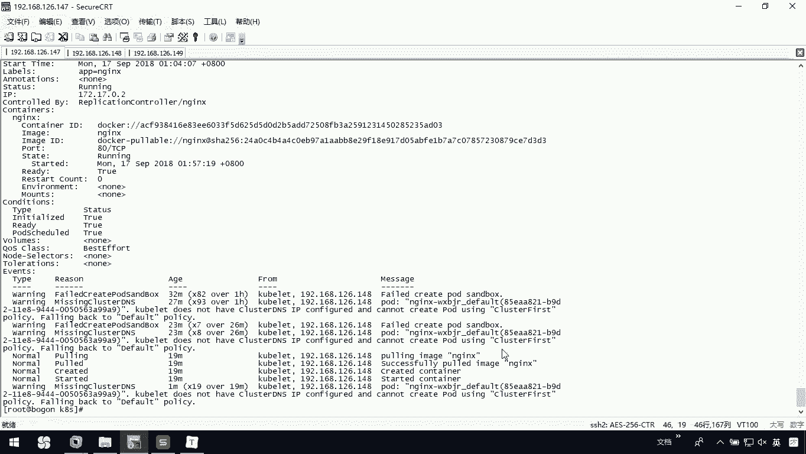

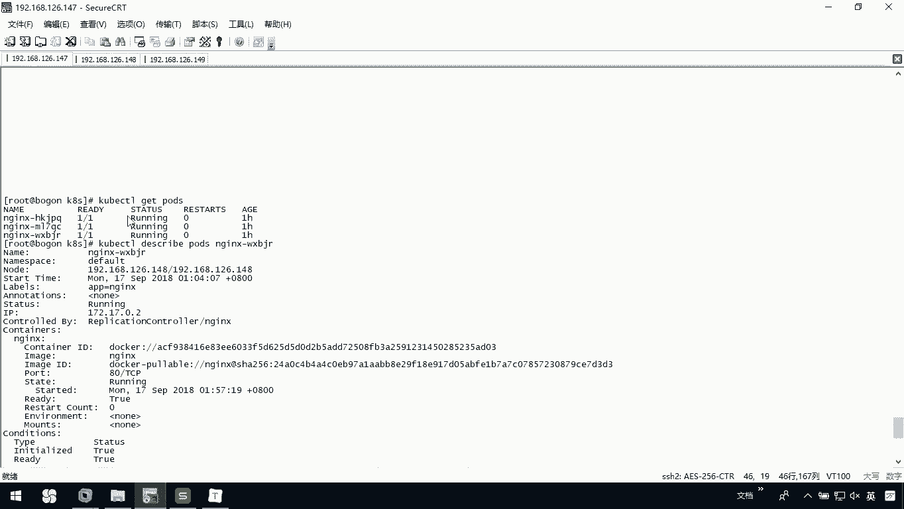

在所有节点配置完成后，返回Master节点进行验证。

1.  查看Pod状态，此时应变为`Running`：
    ```bash
    kubectl get pods
    ```
2.  查看Pod的详细信息，确认镜像拉取成功：
    ```bash
    kubectl describe pod <pod-name>
    ```
3.  在Node节点上查看Docker镜像，确认所需的`nginx`镜像已自动下载：
    ```bash
    docker images
    ```

## 总结

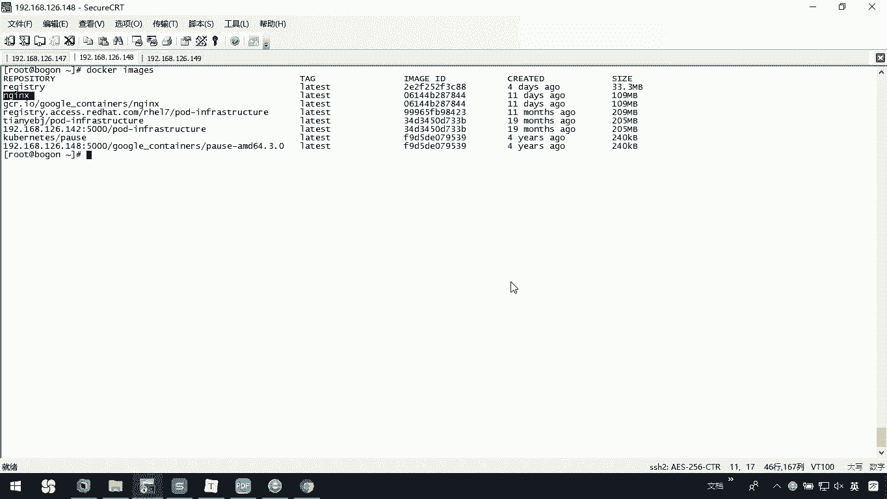

本节课中我们一起学习了如何解决Kubernetes集群中因镜像拉取失败导致Pod创建失败的问题。我们通过搭建私有Docker Registry，将所需镜像推送至私有仓库，并配置所有Kubernetes节点的Kubelet从该仓库拉取基础镜像，最终成功启动了应用Pod。这个方法有效规避了网络对默认镜像仓库的访问限制。