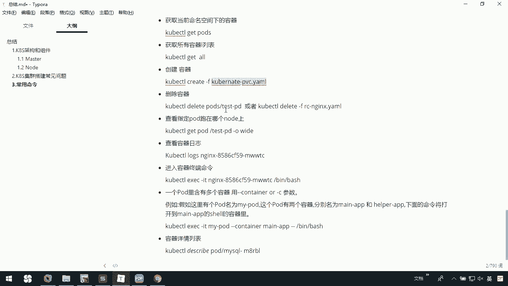
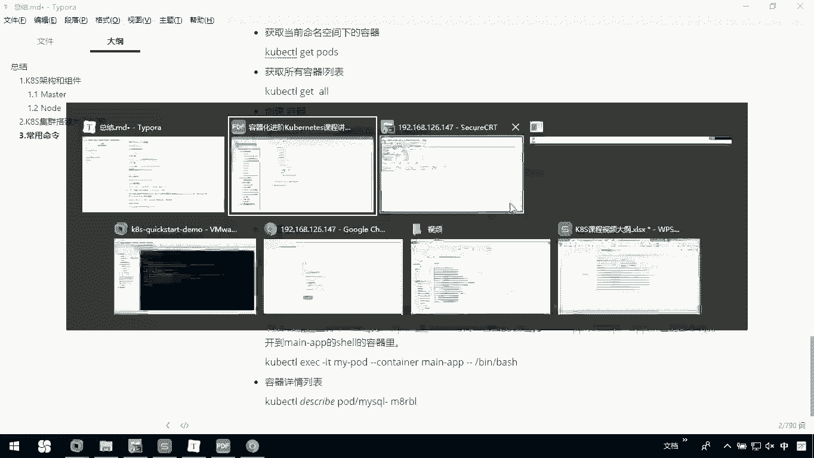
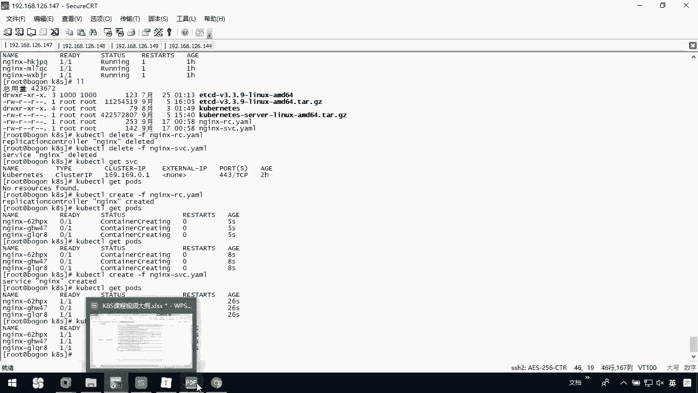
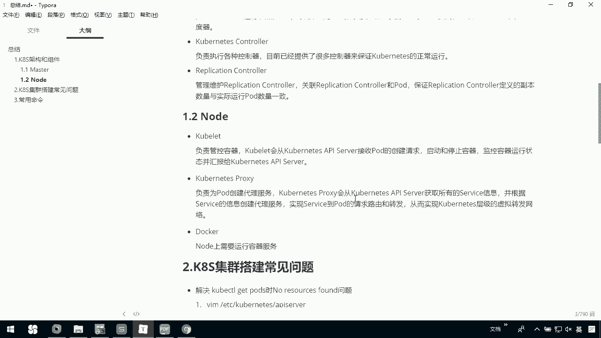

# 华为云PaaS微服务治理技术 - P66：19.Kubernetes集群健康检查与测试(3) - 开源之家 - BV1wm4y1M7m5

下面呢我们把这阶段我们讲的东西啊做一个总结。首先呢来看一下我们这K8S的一个架构和主架。那么我们在这个案例里边，我们用到了coer cTL，然后呢，我们也用到了coer APII server。

还有schedule，还有我们的这个replication controller。那这里边也看到了node，还有我们的master。那大家来看啊。

我们这个用户啊是通过coer cTL提交运行我们的docker的con。也就是说运行我们这个docker的容器，其实就是一个po。那po呢在我们这个里呢，它是以一组这个容器或者是一个容器的这个组合。

那AP service，它是把请求呢存储到我们的具体的ETCD里边，其实就是一个数据库啊。那schedule它是去运行这种呃分配啊扫描。那它呢是确定我们具体当前这个po运行在哪个node节点上。

那co呢它是找到我们自己需要的container在本机上运行。那么我们可以通过用户提交的RC，也就是我们的replicationcontroller来监视我们集群中的这个容器并保持数量。

那我们在之前的这里边可以看一下啊，我们一下我们当前的这个。杠2C。在这个文件里面呢，我们当前的这个就是一个replication controller，它呢是规定了我们是什么样的一个镜像的容器。

就是我们在运行的是什么？然后呢，它也规定了我们当前的什么一个数量。那这个数量呢确定了我们的一个副本的数量啊，所以回来呃刚才我们说到的这个replication controllert。

它是监监视我们集群中的容器，并保持我们的数量的。那么用户呢提交service描述文件，由我们的coer pro呢负责具体的工作流量的转发。那我们刚才呢也是。在这里。

En杠SVC我们在这个文件里面呢来确定具体我们当前这个呃服务。那我们可以去对外映射我们的端口，以及我们这个当前comp所选的这种端口类型啊，我们采用的是这种叫做note port。

那我们整个在这里边master还有我们所说的no，那这两个它俩都具体有什么样的呃服务在里边呢？我的master里边呢有这个 server。

那net就是这部分它呢是整个我们系统一个入口其封装了核心对象的一个常改查操作那它是以这种接口方式呢提供给我们外部客户和内部的这个组件调用。那维持维护我们的re对象的持久化到ET中存储。

那整个我们当前这个master这个 server，它其实就是我们整个的一个入口，所有的无论是我们的这个 node呀还是外部访问其实都是从我们这个入口去走的那它就是一个什么呢协调的它是为新建立的呀进行这种节点选择分配的它就是一个协调相当于一个管家。

它呢规范了我们当前的这个具体在哪一个上去进行那它负责我们集群的资源的调度。抽离，可以方便的替换成其他的这个调度器。那chnet controller，它呢是什么呢？它是负责执行各种控制器。

目前已提供很多种工器来保证chnet的正常的运行。还有呢我们最重要的一个叫replication controller。那它呢是管理我们维护我们当前的一个replication controller。

它呢关联了这个po，保证replication controller的定义的副本数量与实际运营的po数量一致。我们是在我们当前的replication control里面去定义副本的。

这句话说的其实还是刚才大家看到的这个也就说我们通过这个replication去定义我们当前的一个副本的数量。那node呢node才是真正干活的master它是整体上它其实就是一个协调管理。

那node才是真正干活。那我们node呢有我们的kunet用kunet proxy，还有docker，我们note上一定要装docker，它呢是干什么呢？

我们真正的这个容器啊去运行服务都是通过docker去做的那我们。net呢它是通过负责管理这个呃负责管控的一个容器。cnet呢会从compbernet APII server呢接收我们po创建请求。

然后启动和停止容器，监控容器运行状态，并汇报给kunet APII server。也就说它呢会一直去跟这个kunet的API server去关联，一直保持一个同步。那我们的net proy呢。

它是负责为我们的po呢创建这种代理服务。 proxy会从 API server啊获取所有的service信息，并根据那个service信息创建代理服务，实现service到请求路由和转发。

从而实现我们的proxy成级的虚拟转发网络。也就说我们在这里面看到这个proxy啊，它呢其实真正对外访问时，我们可以通过crosy去代理去走到我们这里边。那这是整个我们的一个K8S加go啊。

那我们再往下看，我们在搭建过程中啊所遇到的些问题。这里边呢我主要给大家列举出了这么一些问题。第一个呢就是简单点的，我们在get pose或者是我们在get node时。

如果出现这种叫做no resource的问题，那你呢就需要去改一下我们这个AP service的配置文件里边去掉它里边一个叫做service。那剩下就是一个关于我们这个容器拉取失败。那这个原因呢。

其实其实比较简单，就是因为我们国内的网络啊，它这个在访问一些网站时，可能会因为网络原因产生一些问题。所以呢我们需要去通过docker的一些私有化的仓库去解决。那么在这个过程中。

我们就需要去搭建一个刀私有仓库，把镜线拉取出来以后呢，我们放到私有仓库里边。然后后续呢我们可以去通过私有仓库啊去帮助我们建立数据。也就说我们需要在这整个过程中呢搭建一个docker的私有仓库。

那这是说一下关于我们这个数据拉取失败的问题。那这些说完了以后呢，大家再看一下，下面呢这是一个我们cro里边用到的一些命令。那在我们这个cra里边，我用到了coerer cL的一个ge pose。

那我们可以叫做 pose吧。其实这个呢是我们获取当前命名空间下的这些容器。也说我们在当前这里边通过coerL，我们就可以得到，这是有三个容器。

三个容器呢是当刚才我在re controllert里边去定义的这个副本的一个数量。然后呢我们可以获取容器的列表，你可以。通过coer盖造。coer continuet get all。

我们在这里边可以获得我们整个的一个相关的所有的数据。那这里边不仅仅有什么呢？我们当前的这些po，还有我们的service。那我们这里边刚才看到这个engs，这是我们自己的一个service。

然后我们再来看一下，还有呢，它可以通过这种叫cober create杠F。然后呢你去指定一个我们当前的压盟文件去帮助我们创建容器。那在我们之前的讲义里边，我们在这个里边也是通过这样的一条命令去创建的。

然后我们也可以去删除中件。在这里呢我可以给大家演示一下我们怎么去删除啊。那我们在这儿呢可以看一下。

我现在呢coer CTTLget SVC吧，我们可以哎删除我们的服务。coer cTL deleteelete，然后呢，杠F我们直接把它删掉。哎，我看一下啊，他说我们这个不存在。Sorry。

coer cL get pose吧，我们删这个coer cTL我们deelete杠F啊，sorry，我不是删我那个名字，应该是删的我的这个文件。也就是说这个我们这里面不有两个文件吗？

我们应该这么执行coer cL。DELET我们杠F，我们可以写个N杠RC某。那我们也可以去执行SVC ya某。然后我们可以看coerCLg SVC这时候对服务啊它会干什么呢？去重新建立起来。

我们也再来看这个。coerCRget我们的bose。这时候我们是不是就没有那pose了？那我们可以CRETcate杠F。N杠RRC点 ya某。那我们再来看。

get pose我们就把这几个服务呢又重新建立起来了。然后我们cooper cTL我们把这个。CRETcreate杠FN杠SVC我把这个重新去创建一下，我们再来。get pose一下。当前我这个状态啊。

它呢刚才全都是零，有点问题啊。我呢现在。再执行一遍，你会发现全都起来了。running。

那这个是关于我们当前去删除容器以及创建容器。然后呢，你可以指定po跑在哪一个note上，大家回去呢可以自己看一下，你也可以查看我们的这个日志的一些呃容器的这个整个的状态。也就是说我们可以过来。

清掉啊coer cTL呃，我看一下，get pose吧应该是log4呃，应该这么办吧，get。H子。Q波。CDLlog斯它应该是加上这个名字。我们这里边没有看到这个具体信息是吧？那我们如果看不到的话呢。

可以这么办。呃，coer CTL get pose。现在呢我们可以通过叫做DESC describescribe。DSRB。RIBE然后呢，pose后面加上一个具体的名字，我们去看它的一些具体信息。

那这是刚才我们说看具体信息啊，下面呢还有可以去进入我们的容器的一个终端命令。我们可以在这里边。把这个执行一下呃，那个容器名字呢我们。用它。然后杠。并线的bach。

那这时候呢你就进入到了你当前的这个容器里边，你就可以看到我们其实是已经在这个engject里了。OK我可以通过USSIT退出这个有点跟我们的docker就比较相像了。那你也可以在一个po里边。

还有多个容器用这con或杠C这容器去指定。那容器的列表，刚才我已经给大家看了，然后你还可以通过coer controllert get sVC查看整个容器状态。这个命令呢在之前都给大家演示过。

那整个课程里边呢，其实我们还是一个相对来说比较简单的快速入门课程。后续有时间我们可以去对ron的这个呃学习啊进行一个深入的学习。

