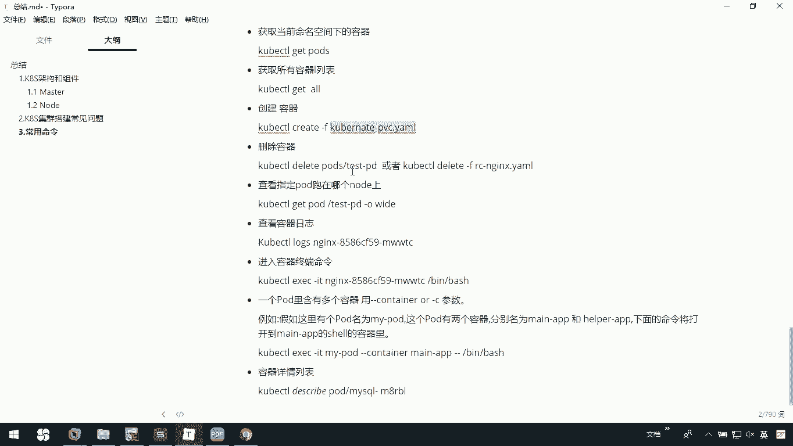
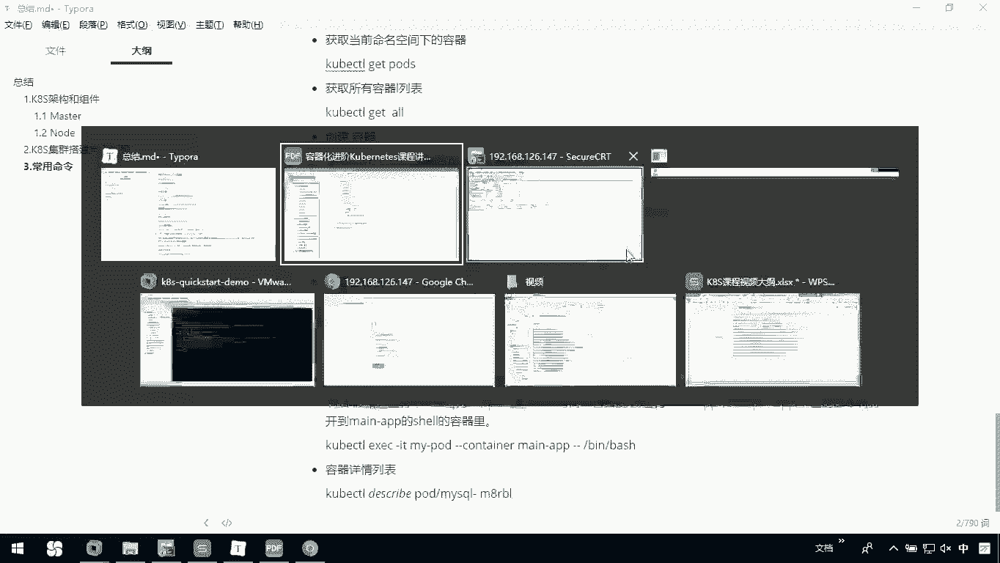
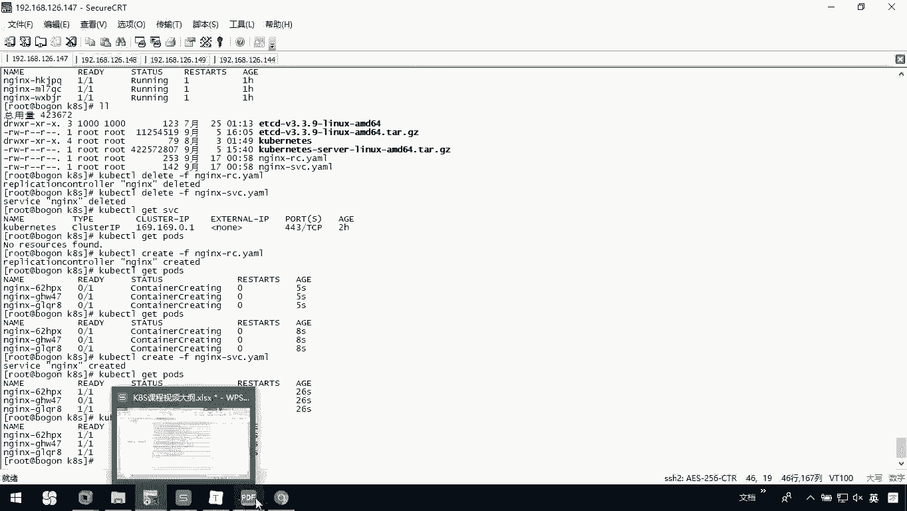
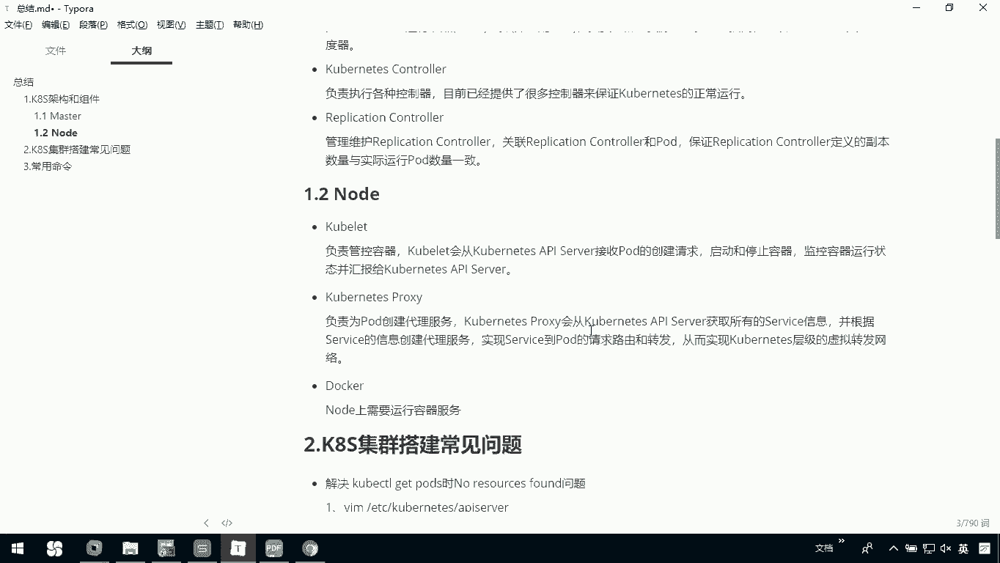

# 华为云PaaS微服务治理技术 - P66：19.Kubernetes集群健康检查与测试(3) - 开源之家

## 概述

在本节课中，我们将对Kubernetes的架构、核心组件以及实践操作进行总结，并回顾在搭建和使用过程中可能遇到的问题及解决方案。

---

## Kubernetes架构与组件总结

上一节我们介绍了Kubernetes的基本操作，本节中我们来看看其核心架构与各组件的职责。

Kubernetes集群主要由Master节点和Node节点构成。用户通过`kubectl`命令行工具提交Docker容器运行请求，该容器在Kubernetes中被称为Pod。Pod可以是一个或多个容器的组合。

`kube-apiserver`是集群的统一入口，它将请求存储到etcd数据库中。`kube-scheduler`负责扫描并决定Pod应该运行在哪个Node节点上。`kubelet`则在Node节点上找到并运行所需的容器。

用户可以通过提交ReplicationController描述文件来监视集群中的容器并保持其副本数量。以下是ReplicationController描述文件的示例：

```yaml
apiVersion: v1
kind: ReplicationController
metadata:
  name: nginx-rc
spec:
  replicas: 3
  selector:
    app: nginx
  template:
    metadata:
      labels:
        app: nginx
    spec:
      containers:
      - name: nginx
        image: nginx:latest
        ports:
        - containerPort: 80
```

用户提交Service描述文件后，由`kube-proxy`负责具体的工作流量转发。以下是Service描述文件的示例：

```yaml
apiVersion: v1
kind: Service
metadata:
  name: nginx-svc
spec:
  type: NodePort
  ports:
  - port: 80
    nodePort: 30080
  selector:
    app: nginx
```

### Master节点组件

Master节点是集群的大脑，包含以下核心组件：
*   **kube-apiserver**：集群的入口，封装了核心对象的增删改查操作，以RESTful接口方式提供给外部和内部组件调用，并将对象持久化存储到etcd。
*   **kube-scheduler**：负责为新创建的Pod进行节点选择与分配，相当于集群的“管家”，负责资源调度。
*   **kube-controller-manager**：负责执行各种控制器，保证集群的正常运行。
*   **Replication Controller**：管理并维护ReplicationController对象，确保定义的副本数量与实际运行的Pod数量一致。

### Node节点组件

Node节点是实际运行工作负载的节点，包含以下组件：
*   **Docker**：Node节点必须安装Docker，用于真正运行容器服务。
*   **kubelet**：负责管理Pod的生命周期。它会从`kube-apiserver`接收Pod创建请求，然后启动和停止容器，监控容器状态并汇报给`kube-apiserver`。
*   **kube-proxy**：负责为Pod创建代理服务。它会从`kube-apiserver`获取所有Service信息，并据此创建代理服务，实现请求的路由和转发，从而构建服务层级的虚拟网络。

---

## 搭建过程中遇到的问题

在搭建Kubernetes集群时，可能会遇到一些问题。以下是常见问题及其解决方法。

**问题一：执行`kubectl get pods`或`kubectl get nodes`时显示“No resources found”**

*   **解决方法**：这通常是因为`kube-apiserver`的配置问题。需要检查并修改`kube-apiserver`的配置文件，移除其中可能导致问题的`--service-cluster-ip-range`参数配置（具体参数需根据实际情况调整）。

**问题二：容器镜像拉取失败**





*   **原因**：由于国内网络环境，从国外镜像仓库（如Docker Hub）拉取镜像可能失败。
*   **解决方法**：搭建私有Docker镜像仓库。先将所需镜像拉取到本地，然后推送到私有仓库中。后续集群部署时，从私有仓库拉取镜像即可。

---

## 常用Kubernetes命令回顾

以下是我们在课程中使用过的一些核心`kubectl`命令。

**获取资源信息**
*   `kubectl get pods`：获取当前命名空间下的所有Pod。
*   `kubectl get all`：获取当前命名空间下的所有资源（包括Pod、Service等）。



**创建与删除资源**
*   `kubectl create -f <yaml-file>`：根据YAML描述文件创建资源。
*   `kubectl delete -f <yaml-file>`：根据YAML描述文件删除资源。

**查看资源详情与日志**
*   `kubectl describe pod <pod-name>`：查看指定Pod的详细信息。
*   `kubectl logs <pod-name>`：查看指定Pod的日志。
*   `kubectl exec -it <pod-name> -- /bin/bash`：进入指定Pod的容器终端。

**管理服务**
*   `kubectl get svc`：查看所有Service的状态。

---

## 总结



本节课中我们一起学习了Kubernetes的核心架构，包括Master和Node节点上各组件的功能与协作关系。我们回顾了搭建集群时可能遇到的典型问题及其解决方案。最后，我们总结了常用的`kubectl`命令，用于管理Pod、Service等资源，进行故障排查和日常操作。本课程是一个快速入门，后续可以在此基础上对Kubernetes进行更深入的学习。