# 华为云PaaS微服务治理技术 - P67：２０ - 开源之家 - BV1wm4y1M7m5

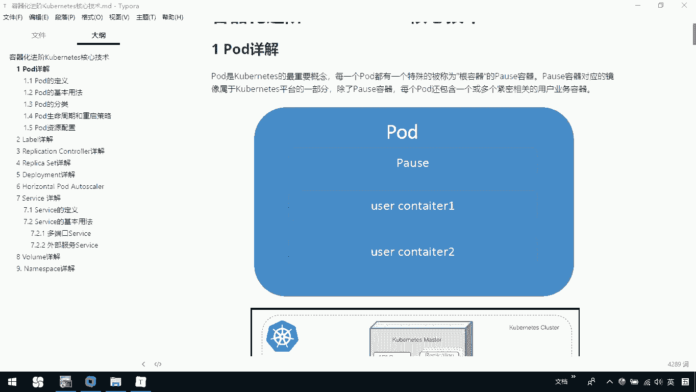

下面呢我们介绍容器化进阶课程的一些核心技术。首先第一个呢我们介绍一下po。那pod呢是ch nice一个重要的概念。那每个po都有一个特殊的被称为根容器的pose容器。

那pos容器呢对应的镜像属于平台的一部分。除了po容器以外啊，我们每个po，还有一个或多个紧密相关的用户的业务容器。那么例如这种这个图，那我们一个po，它有一个根容器pose。

它里边还有一些其他的跟我们的用户的业务相关联的一些user的containers，也就说可以有一个或多个，那这是一个单独的pose的图，大家可以再往下看一下，这是po在我们整个的c机群里边的一个图。

那我们每个po在我们的node上，那一个po里边呢可以有多个container。那对于我们这个po来说，它跟应用有什么区别呢？

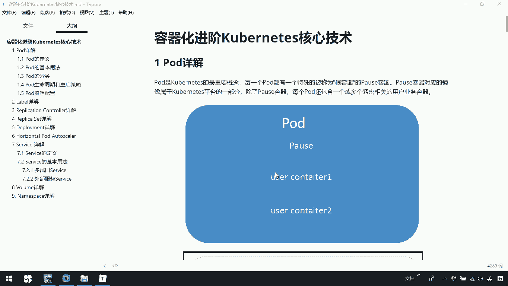

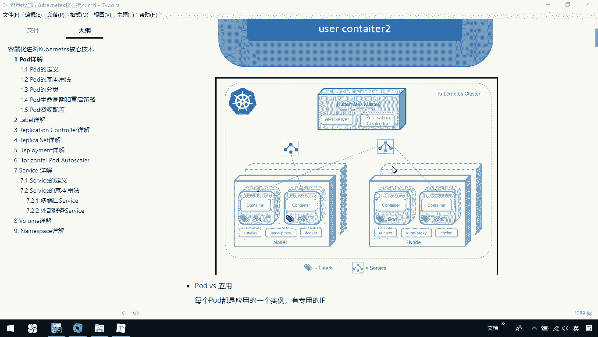

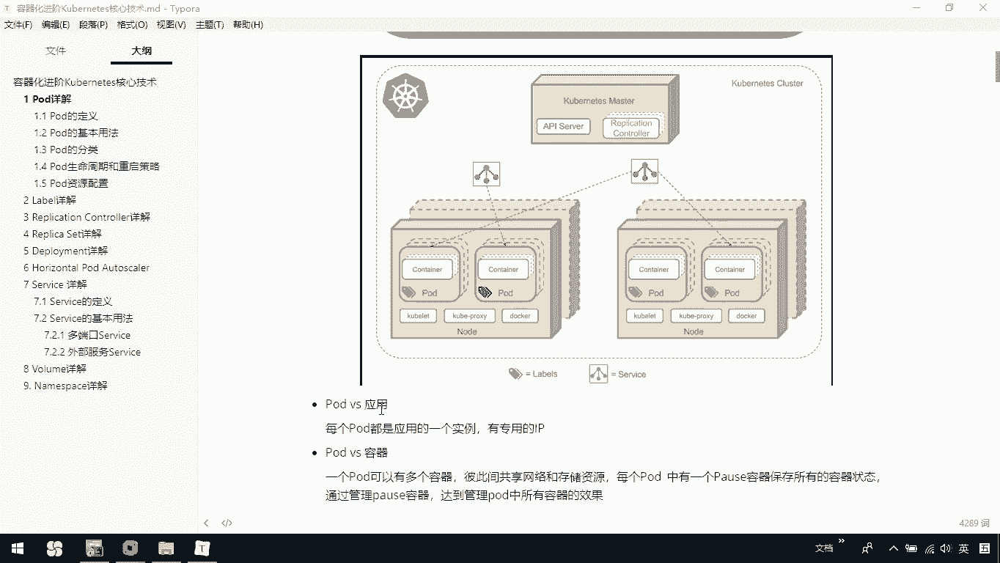

大家可以看一下说每个po都是应用的一个实例，有专用的IP。那么还有一个是po和容器。那po和容器是什么关系？一个po可以包含多个容器，也说我们一个po里边可以有多个container。

那么彼此之间共享网络和存储资源。每个pod中有一个pose容器，它呢是用来保存所有的容器状态。我们是通过管理这pos容器，达到管理我们pod中所有容器的效果。

也就是说我们是通过管理pod中的pose这个容器，以便去帮助我们管理所有的我们的po。

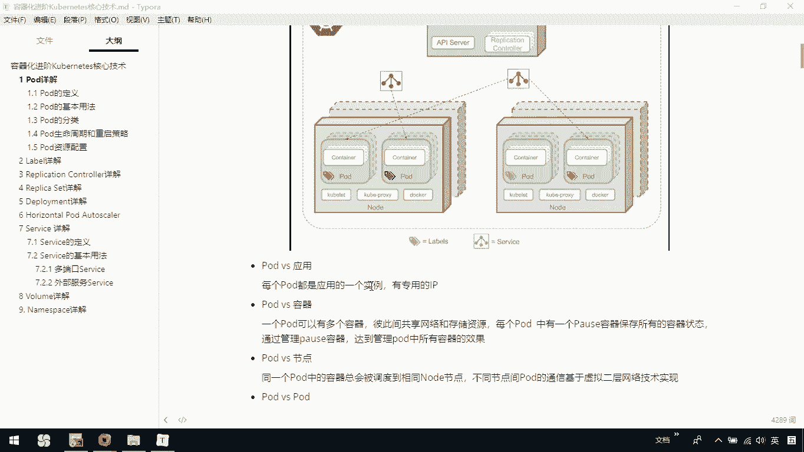

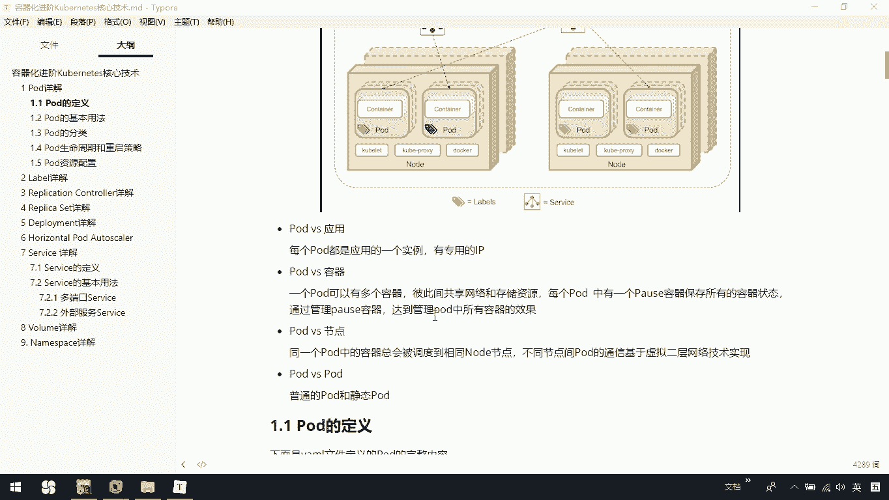

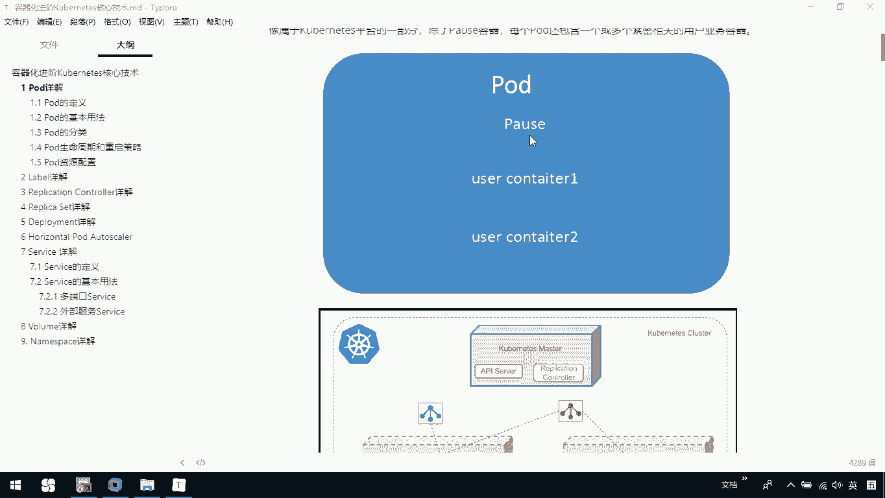

那po跟节点有什么区别呢？大家可以看一下，那同一个pod中的容器啊，总会被调度到相应的node节点。也就说我们一个po会分配到我们某一些node上。那不同的节点间。

po的通信呢是基于一个虚拟的二层网络技术。那po和po之间，那也是有区别的。我们的po其实分成两种，一种是普通的po，还有一个是静态的po。后续呢我们会介绍普通po和静态po。那对于一个po来说。

我们如何去定义它呢？大家下面看到的这部分就是我们定义一个po通过文件这种方式的一个完整的内容。那我们可以给它一个AP它的版本，然后我们告诉他当前的类型是一个po。那我们可以定一些它的语言数据。

例如我们当前的名字，po的名字，它的namespace命名空间，还有它的一些标签。那么namespace和s下面这后续的课程中我们都会讲那再往下呢这是关于pod中容器的详细定义。

也就说SP我们是用来定义我们po中的容器。那这是container。然后我们下边这个容器的名称，这个容器的镜像。那下面这些还有我们容器中一些命令行的启动。

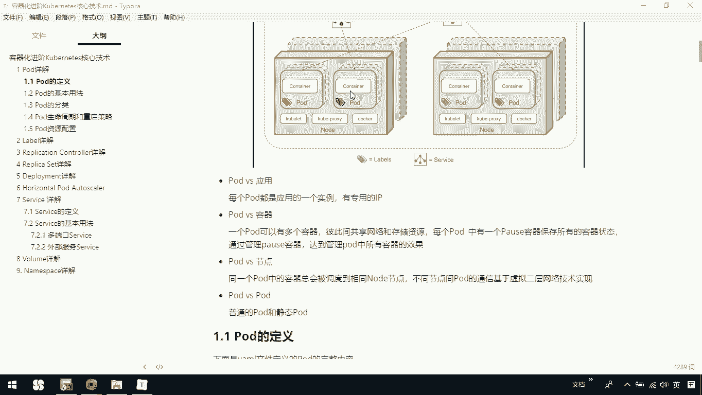

下面这些内容啊很多我们就不过多的一一列举。呃，大家呢可以回头自己去看一下。后续当你看到一个po定义时，某些信息你不是特别清楚，你可以去在这个文档里面去查看一下，具体每一个都代表什么意思。

比如说我们这是一个po很明显，那这是我们的接口，对吧？那这是我的名字，然后container po就是我们容器要暴露的接口。housepo呢是我们容器所在主机监听的接口。

还有呢往下面这些关于我们的resource，这是我们具体这个资源的分配的情况。ok那这是关于我们如何去定义一个po，那对于一个po来说，我们现在已经知道怎么定义了。那我们去如何使用它呢？

那看一下说在中啊，对运行容器的要求为啊容器的主程序需要一直在前台运行，而不是在后台。那我们应用需要改。绕成前台运行的方式。如果我们创建的docker镜像启动命令是后台执行程序。

那则在crolet创建包含这个容器的po之后运行该命令，即认为po已经结束，将立即销毁该po。如果为该po定义了RC，那就是replication controllert。

则创建销毁会陷入一个无限循环的过程。所以这里面告诉你，我们容器它的主进程应该一直是在前台运行的。那对于我们po来说，我们在使用的时候，大家可以看一下，po可以由一个或多个容器组合而成。

比如说在pod里边你可以有多个容器，也可以只有一个。那你现在看到的这个例子，就是一个容器组成的一个po。那这是我们的一个my time kit。然后呢我们对外暴露的是8000端口。

那我们可以看一下当前我们这个CD杠user下的local，我们有一个K8S目录，在这里边我们进入test目录下。

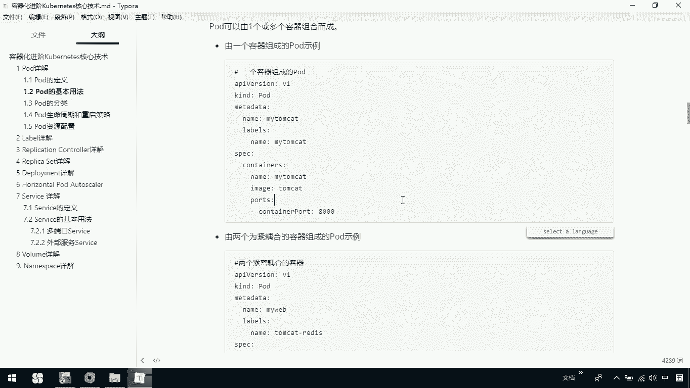

呃，我们可以ca一下demo一点压木文件。

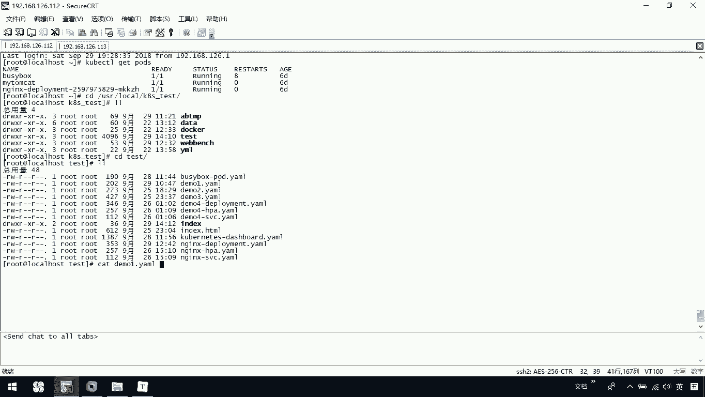

这个文件里边我们就定义了一个我的my time cat。那当前呢我们看一下啊，coer cL get pose，我看我启没启动它，我们这里边已经有了my time cat。

你可以通过coer cTLcoer cTL replace我们当前的。这个文件哦demo一点y，你可以去重新把它啊，它不让我去操作是吧？那这么办，coer cTL我们delete掉大Fdemo。

要不你先把它删掉。😡，然后呢，我再去重新create一份当前的demo一点，我重新把它创建出来。这个时候我们再get pose，你看一下我们当前这个my time，它现在是一个container。

那稍等一会儿呢，它就应该是能帮助我们把它创建成功。ok啊，我这里边可能还是没有创建成功，稍等一下，也就是说我们现在呢可以是在我当前的一个po里边，只有一个容器。而我们也可以是在一个po里有多个容器。

那这个容器呢，这些容器呢是紧密耦合的。下面大家看到的这个例子就是我们有两个为紧密耦合的容器组成的po。那这里边呢是我们创建一个po。那它叫做my web，我们这里边呢有两个容器，一个是我们当前的t。

还有一个是我的read。

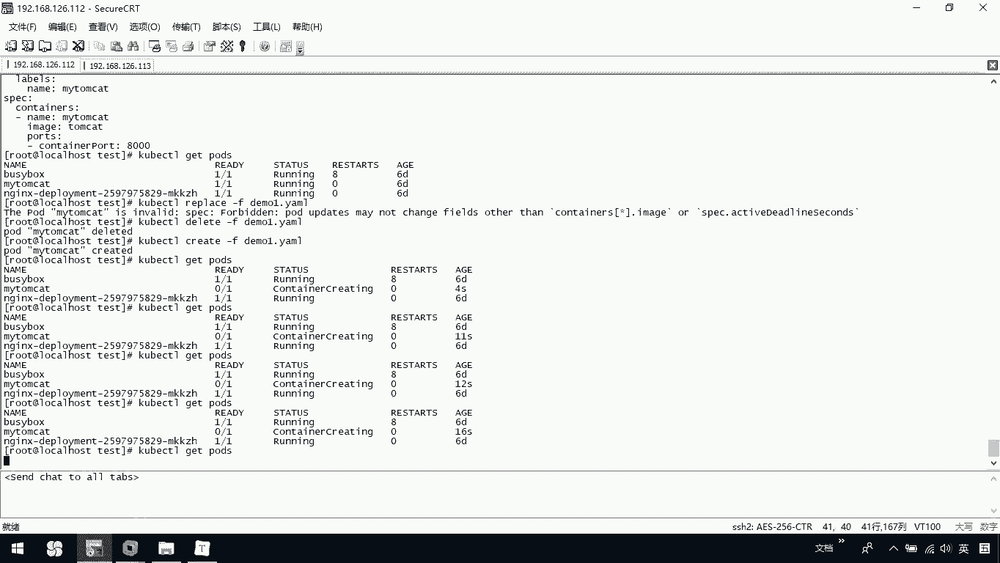

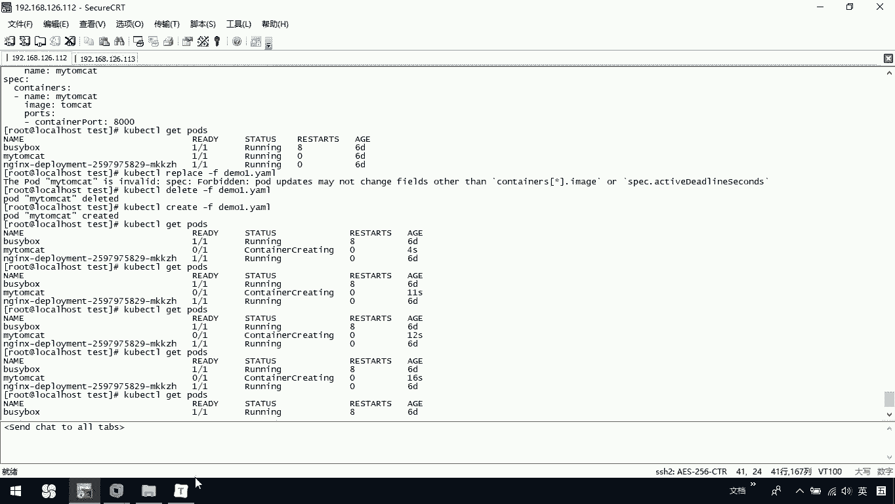

那对外暴露的是8000端口，我们的这个当前的这个readdice是6379。呃，那我们可以看一下。在这里我们应该可以看一下的是。

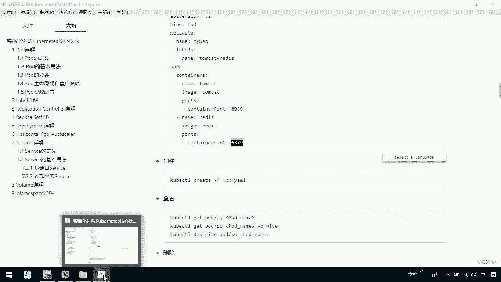

dmo二的这个压模文件，这个文件里边就是我当前。两个紧密耦合的容器在一个po里边，我们也可以。把它这个创建一下，我看有没有这个my web没有，对吧？Ocoer create杠F。然后呢。

我们把这个demo二这个创建一下okK这个时候呢。我们就已经把它充电了啊，应该写错了。coer CTTLge both。那这里边我们就有这个my外了。那好。

这是说呀我们当前呢可以去在一个po里有一个容器，或者是一个pod里边有多个容器。

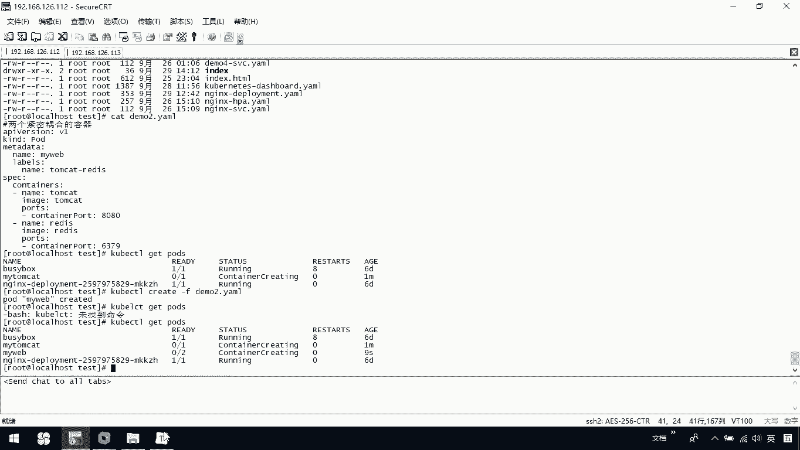

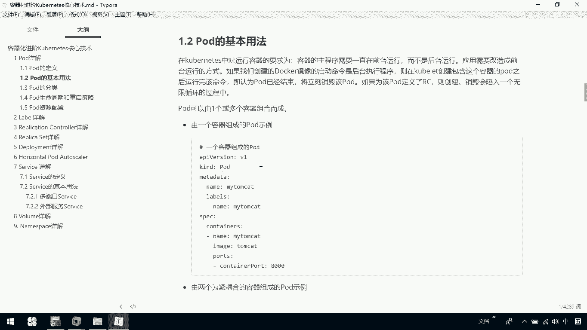