# 华为云PaaS微服务治理技术 - P67：20 - Pod详解

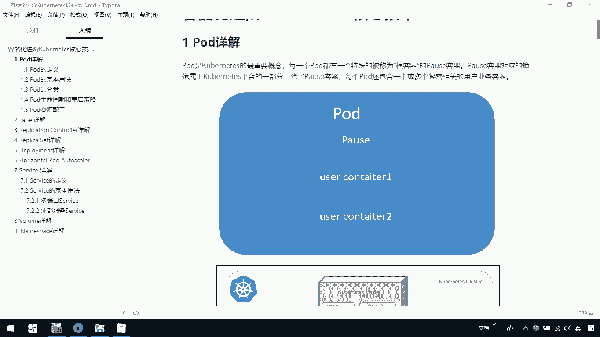


在本节课中，我们将要学习Kubernetes容器化进阶课程的核心技术之一：Pod。我们将了解Pod的基本概念、它与容器和节点的关系、如何定义Pod以及如何使用Pod。

## Pod基本概念

Pod是Kubernetes中一个重要的概念。每个Pod都有一个特殊的被称为“根容器”的Pause容器。Pause容器对应的镜像属于平台的一部分。除了Pause容器，每个Pod还有一个或多个与用户业务紧密相关的业务容器。

例如，下图展示了一个Pod的结构。一个Pod包含一个根容器（Pause）以及一个或多个用户业务容器（User Containers）。

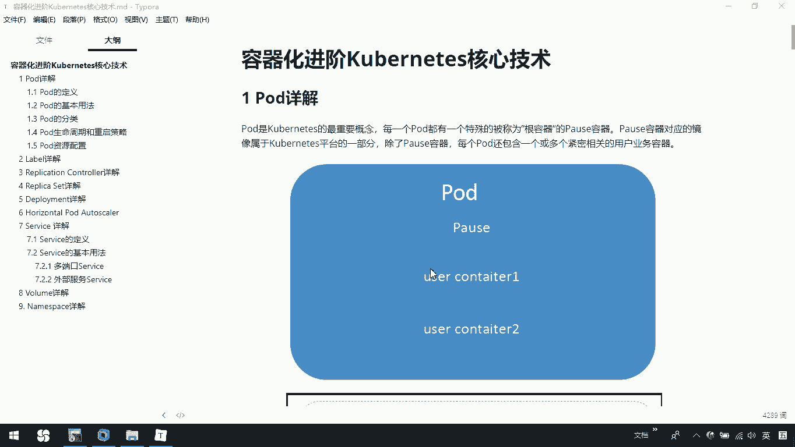


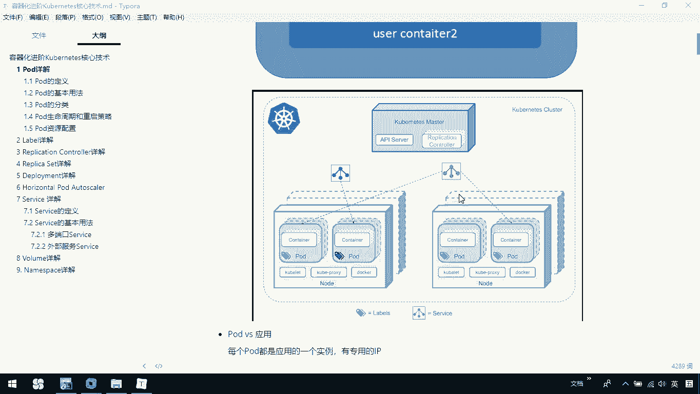

下图展示了Pod在Kubernetes集群中的位置。每个Pod运行在节点（Node）上，一个Pod内部可以包含多个容器（Container）。

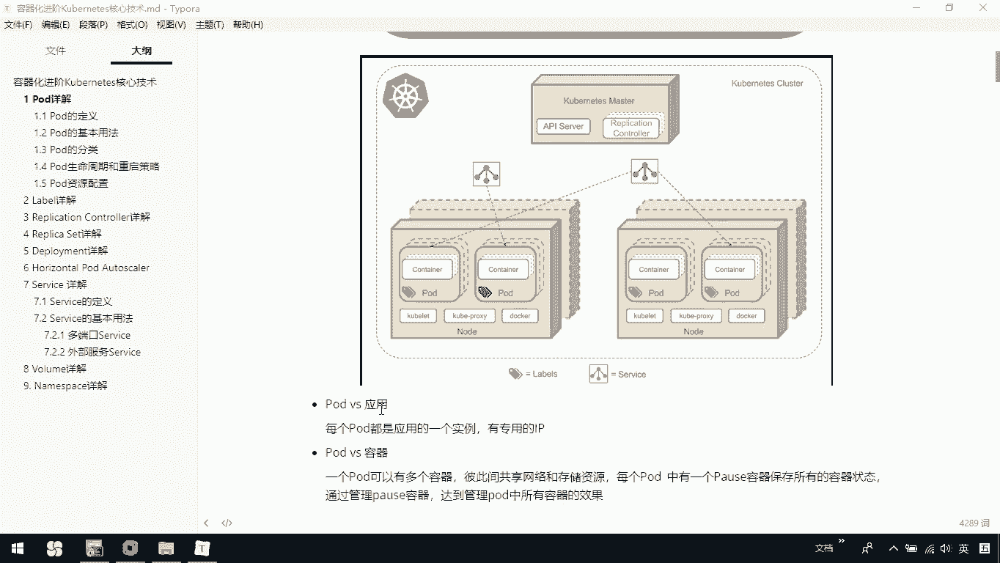


## Pod与容器、节点的关系

上一节我们介绍了Pod的基本结构，本节中我们来看看Pod与容器、节点的具体区别和联系。

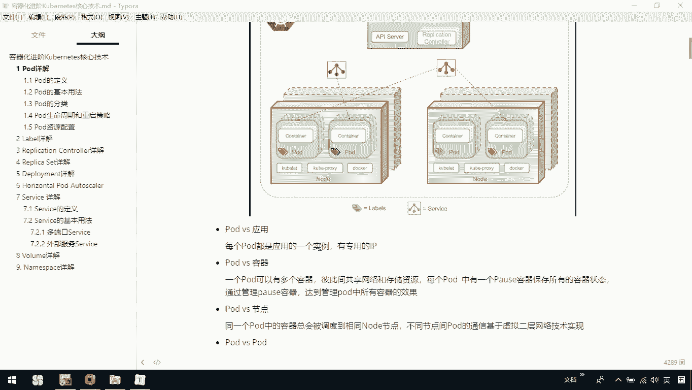

### Pod与应用实例

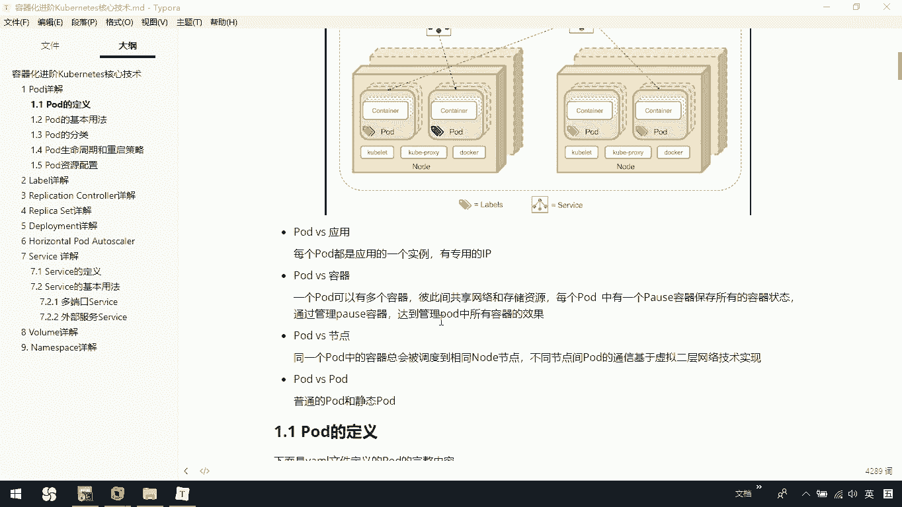

每个Pod都是应用的一个实例，拥有专用的IP地址。

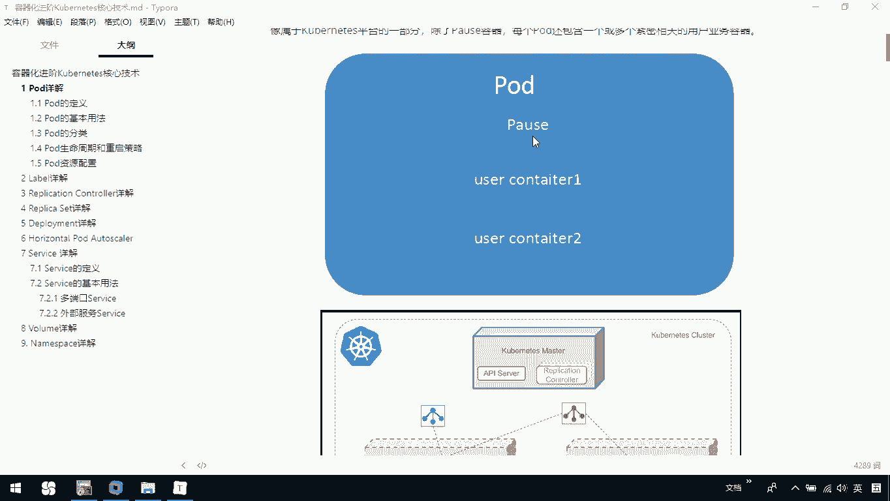

### Pod与容器

一个Pod可以包含多个容器，这些容器彼此之间共享网络和存储资源。每个Pod中都有一个Pause容器，它用来保存所有容器的状态。我们通过管理Pause容器，来达到管理Pod中所有容器的效果。

### Pod与节点

同一个Pod中的容器，总会被调度到同一个Node节点上。不同节点间的Pod通信基于虚拟的二层网络技术实现。


## Pod的类型

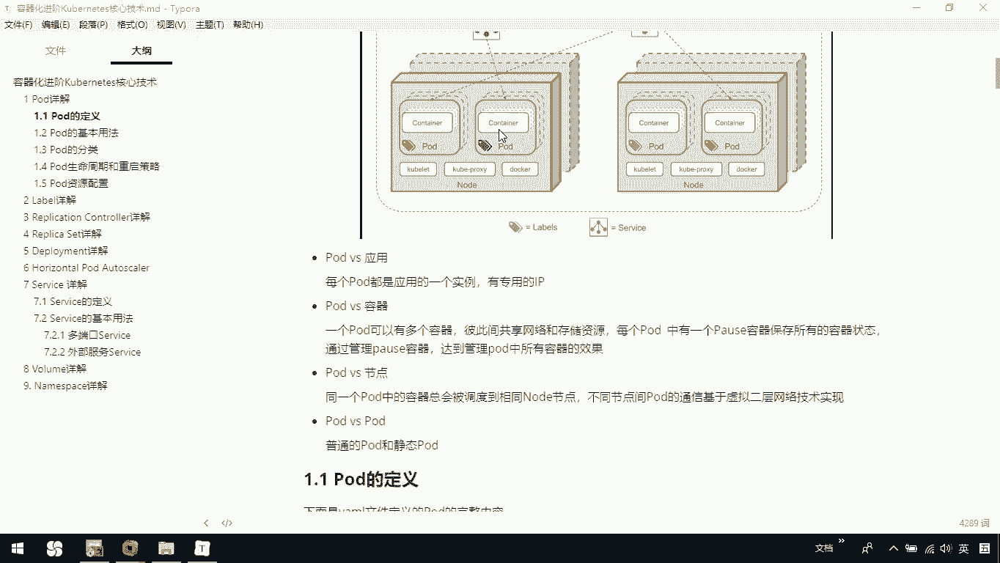

Pod主要分为两种类型：普通Pod和静态Pod。后续课程我们会详细介绍这两种Pod的区别。


## 如何定义Pod

了解了Pod的概念后，我们来看看如何定义一个Pod。Pod通常通过YAML或JSON格式的配置文件来定义。

以下是一个定义Pod的YAML文件示例：

```yaml
apiVersion: v1
kind: Pod
metadata:
  name: my-pod
  namespace: default
  labels:
    app: myapp
spec:
  containers:
  - name: my-container
    image: nginx:latest
    ports:
    - containerPort: 80
    command: ["nginx", "-g", "daemon off;"]
    resources:
      requests:
        memory: "64Mi"
        cpu: "250m"
      limits:
        memory: "128Mi"
        cpu: "500m"
```

以下是配置文件中各部分的简要说明：
*   **`apiVersion` 和 `kind`**：指定资源类型为Pod。
*   **`metadata`**：定义Pod的元数据，如名称、命名空间和标签。
*   **`spec`**：定义Pod的规格，核心是`containers`字段，用于描述Pod中的容器。
    *   `name`: 容器名称。
    *   `image`: 容器使用的镜像。
    *   `ports`: 容器暴露的端口。
    *   `command`: 容器启动时执行的命令。
    *   `resources`: 为容器请求和限制的CPU、内存资源。


## 如何使用Pod

我们已经知道如何定义Pod，现在来看看如何使用它。在Kubernetes中，对运行容器有一个关键要求。

**容器的主程序需要一直在前台运行，而不是在后台运行。** 如果容器镜像的启动命令是后台执行程序，那么在Kubelet创建包含该容器的Pod后，会认为该Pod已经执行结束，从而立即销毁它。如果为该Pod定义了副本控制器（ReplicationController），则创建和销毁会陷入一个无限循环。

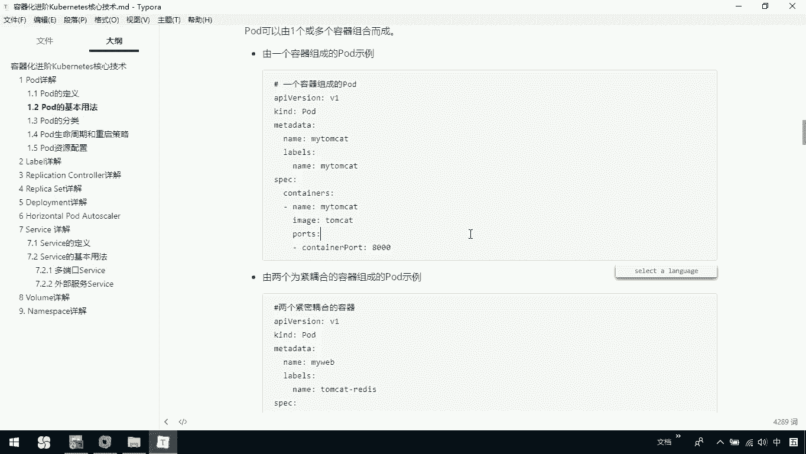

因此，需要确保应用以前台方式运行。

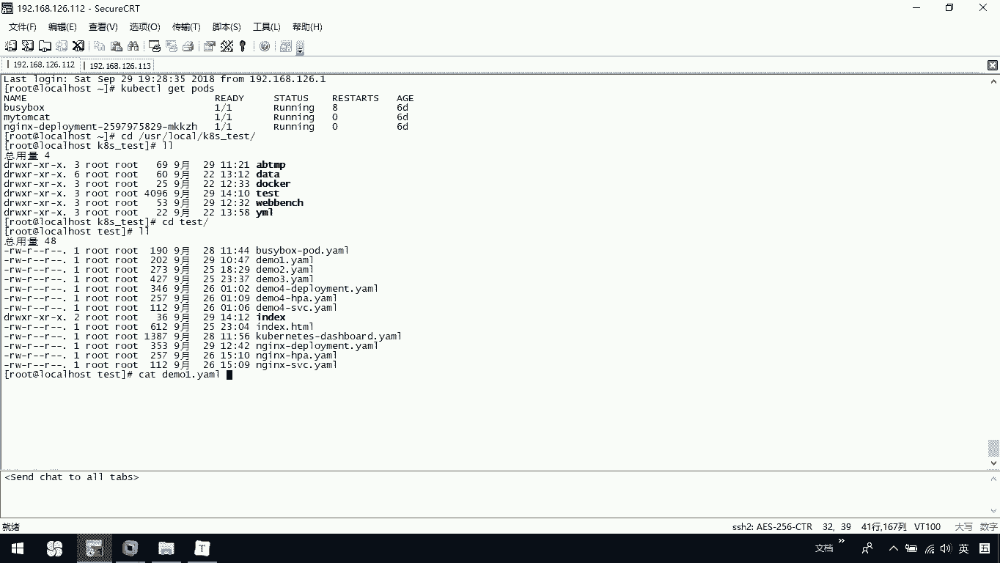

### 单容器Pod

Pod可以由一个或多个容器组合而成。以下是一个由单个Nginx容器组成的Pod示例。

```yaml
apiVersion: v1
kind: Pod
metadata:
  name: my-nginx
spec:
  containers:
  - name: nginx
    image: nginx:latest
    ports:
    - containerPort: 80
```

我们可以使用`kubectl`命令来创建和管理这个Pod：
1.  查看现有Pod：`kubectl get pods`
2.  删除Pod：`kubectl delete -f demo.yaml`
3.  创建Pod：`kubectl create -f demo.yaml`


### 多容器Pod（紧密耦合）

我们也可以在一个Pod中运行多个紧密耦合的容器。例如，一个Web应用容器和一个Redis缓存容器共享同一个Pod。

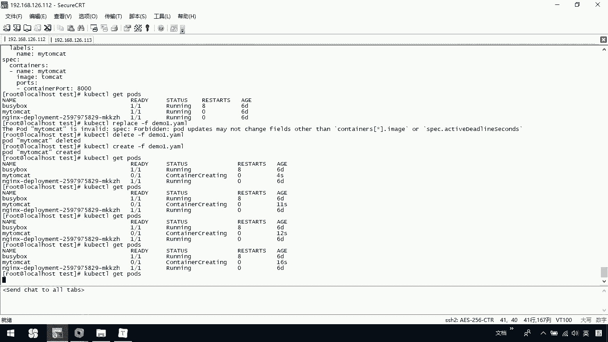

```yaml
apiVersion: v1
kind: Pod
metadata:
  name: my-web-app
spec:
  containers:
  - name: web
    image: my-web-image:latest
    ports:
    - containerPort: 8080
  - name: redis
    image: redis:latest
    ports:
    - containerPort: 6379
```

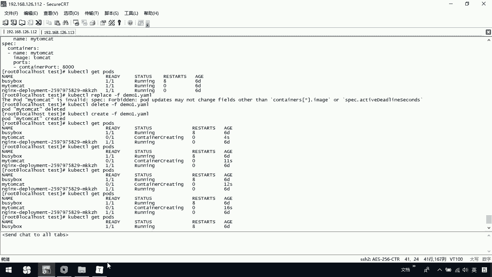

在这个例子中，`web`容器和`redis`容器共享相同的网络命名空间，可以通过`localhost`直接通信。


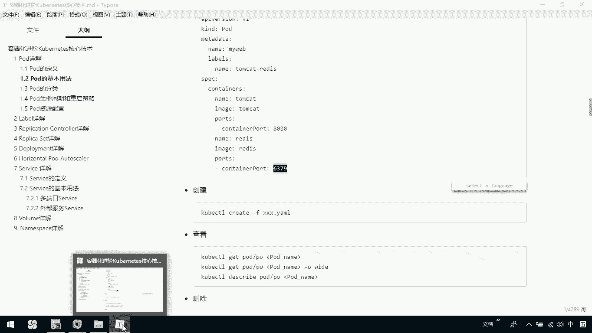

同样，我们可以使用`kubectl create -f demo2.yaml`来创建这个多容器的Pod。

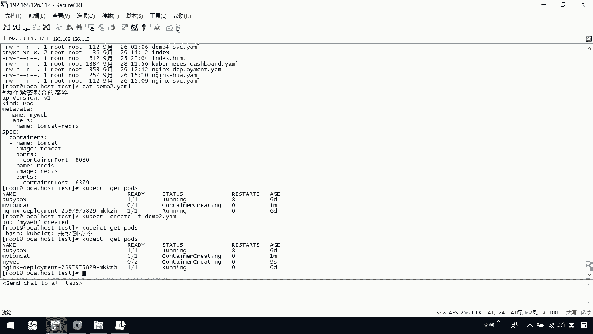

## 总结


本节课中我们一起学习了Kubernetes的核心概念——Pod。
*   我们了解了**Pod是Kubernetes调度的最小单位**，它包含一个Pause根容器和一个或多个业务容器。
*   我们探讨了Pod与容器、节点的关系，以及Pod的两种类型。
*   我们学习了如何通过YAML文件**定义Pod**，包括其元数据和容器规格。
*   最后，我们掌握了**如何使用Pod**，包括运行单容器Pod和多容器Pod，并理解了容器需在前台运行的关键要求。

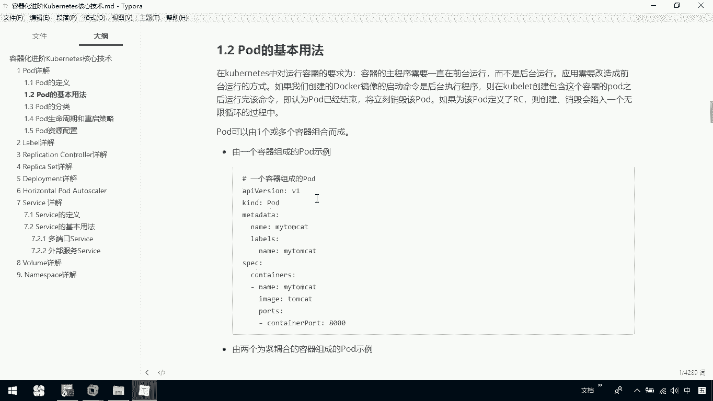

Pod是构建和部署复杂应用的基础，理解它是掌握Kubernetes的重要一步。