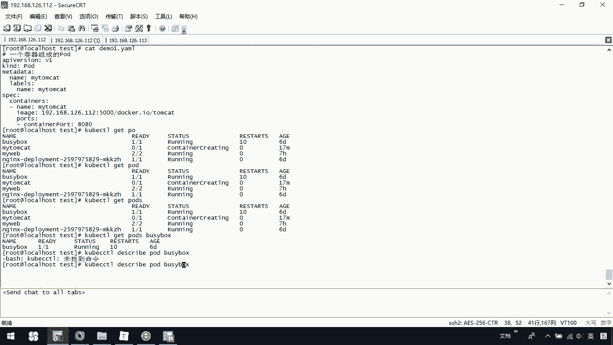
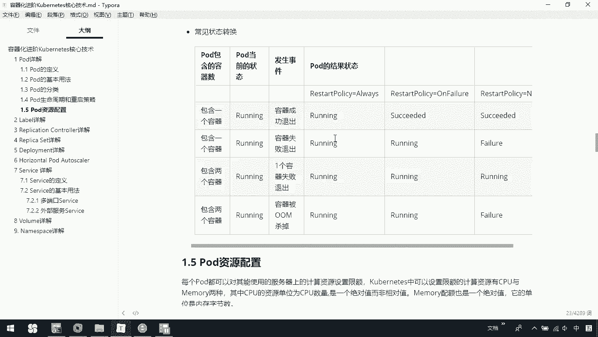

# 华为云PaaS微服务治理技术 - P68：21.kubernetes核心技术-Pod(2) - 开源之家 - BV1wm4y1M7m5

我们可以使用cooper cTLcreate杠F呃，指定我们的压文件这种方式啊去创建一个我们当前的po。那我们可以看一下例子，在我们当前这里边呢。

有我们的demo二点样么文件，这呢就是帮助我们去创建了一个po。

那我们也可以通过coer cLge或者是PO指定一个名字的方式来查看我们当前的这个po。那你也可以去指定PO，然后告外的这种方式，以及describe这种方式去查看一个我们po的详细信息。

那我们可以演示一下，在这里边我们可以coer cL getO或者是我们直接一个po，或者是你直接可以去指定一个叫做po，这都可以去查看我们所有当前的po。那么你后面也可以加上一个名字。

例如我们这里边加上BUSY box，你去查看我们某一个具体的po。那你也可以通过。

DSEIBE然后呢我们去通过一个po一个名字的方式，哎，写错了。

去查看一个pod的详细信息。那这是我们说查看pod的相关信息。那我要想删除一个pod呢，可以通过一个delete杠F，然后呢，po加上一个我们的压文件。

或者呢一个deletepo加上一个杠杠2或者是一个po的名字去删除。那我们这里边呢可以这么办。

coer CTR。delete杠F，然后呢你加上一个当前我们的demodemo一点y。

这样的话呢，我们可以去删除一个pod，也可以。

delete杠刚这样的话呢就是我们哎sorry拉一个po去把所有的pod删除了。那我这里边不去指定删除，大家回去可以自己去尝试一下。那这是说我们去怎样去查看呢？以及我们创建和删除pod。

那下面呢再来看一下我们pod分类。前面我们说过我们pod分类分成两种，一种是普通的pod，还有一种是静态pod。那这两种有什么区别？我们要知道一下。

第一个普通的po它是一旦被创建，就会被放入到我们的ETCD中存储。随后呢会被我们 master调度到我们某个具体的note上，也就会被我们的master调到具体的node上，并进行绑定。

随后呢该对应的note上的进程的实例化一组相关的docker容器并启动它在默认情况下，当po里某个容器停止时，会自动检测到这个问题，并且重新启动这个po里某所有的容器。如果po所在的node宕机了。

那么将会将这个note上的所有的po重新调度其他节点上。也就是说我们的普通po呀，我们是在整个我们当前的管理范围内。如果它出了问题呢，我们会自动的在整个进行中测到。那静态的是什么呢？静态是由进行管理。

仅存在于特定node上，也就是说它是在具体的某一个节点上的，而不而不能通过APIserv进行管理，无法与我们的RC啊，然后develop或者是进行关联，并且呢也无法对它进行健康检查。那对于这种静态的。

我们很少用大家了解一下就行。那我们用的更多的还是这种普通的pod，它是在整个集群管理范围内的那我们可以去对它进行这个创建启动。然后系统呢可以检测到它，如果出了问题呢。

它会帮我们自动的去调度到某一个具体的node上，并重新去创建它。

那这些说完以后呢，我们来看一看啊，我们pod啊是有一个生命周期，还有一个重启策略。那pod的状态。那这里面状态呢一共有这么几种。第一种叫做pending。

它是说我们当前APPS server创建了该po该但po中的一个过多个容器镜像啊还没有创建，包括镜行下载过程。那这个时候呢它就是一个准备p的过程。那如果我们都准备好了，那这时候就变成一个running。

就是说po内所有容器已经创建。但且至少一个容器处于运行状态，正在启动状态或者是正在重启状态，这时候就是一个running。那comp。completed那是pod内所有的容器均成功执行并退出。

且不会再重启。还有一个就是失败状态。说我们pod内所有的容器均已退出，但至少一个容器退出失败。还有一种就是未知状态啊，an know呃，由于某种原因无法获得pos状态，例如网络不畅通。

那我们在这里边可以看一下啊，呃，在这里边要把这个删掉。

coer cTL我们get pose，当我获取这个状态时，你看我们的状态呢是running，就说我们都是正在运行的状态。那大家知道一下，我们po有这么123455种状态。

那这里边还有一个是关于。po的重启策略。那po重启策略呢包含了always，然后呢unfaure，还有是never默认是一个always。那代表什么呢？是说always说当容器失效时啊。

youlet自动重启该容器。那这也是我们前面说的一个普通的po，当它这个呃处理现的问题。那我们master呢会去检测到它。那我们会把它在其他的自动的节点上重新去调度，然后呢去重新去启动它。

那这是因为你指定它的重启策略是always。那如果是失败的是说当容器终止运行器退出码不为零时，youlet自动重启该容器。还有一个never是不论容器运行状态如何，我们let都不会重启该容器。

那下面是给大家做讲做了一个图，这是说一下我们当前的一个常见的转换图，大家呢可以去看一看我们这几个状态的一个转换的情况。

那最后是一个关于我们这个po的一个资源配置。其实简单点就是说当我们创建一个po的时候，我们是可以给它指定一些资源的。例如我们的CPU例如我们的内存。那我们来看啊。

每个po都可以对其使能使用的服务器上的计算资源设置限额。中可以设置限额的计算资源有CPU与mem也就说可以指定我们的CPU和内存，其中CPU的这个资源单位为CPU的数量。

是一个绝对值非绝对这个非相对值mem配合也是一个绝对值，它的单位内存它的单位是内存字节数。

那里面一个计算资源进行配额限定需要两个参数。也就说我们在这里边有个例子啊，当我们制定一个限额时，我们可以指定两个参数，一个是request，还有一个是limit。

那么这个request呢该资源该资源最小申请数系统呢必须满足要求limit呢是该资源最大允序数，也就是说一个是最小的，一个是最大的。那么这个最大呢是不能突破的。

当容器试图使用某个超过这个资源时可能会被掉并重启。那大家可以看一下，这里面这是request是lim。那么request呢我们说me我们是64兆PU呢我们分配250。那我们这里面limit呢。

大家看这是一个必须最小的这是我们这个一个最大的限额。那我们最大呢指定了128CPU指定了500。那这里边就是表示啊我们mycyclcle容器，这我们是一个l的镜像吧。那它呢申请最少0。25个CPU。

也就是说这里边我们指定250是代表0。25个CPU以及64兆的内存。那在运行过程中所使用的这个资源配合为0。5个。那0。5个CPU啊，以及128兆这个内存。

也就是说我们这里边允许最大使用的是这些如果你超过了，那我们可能会被g掉并重启。

那这是关于pod的一些相关的情况。我们关于这个pod分类啊啊周期，还有重启策略，还有它一个资源配合的介绍。

