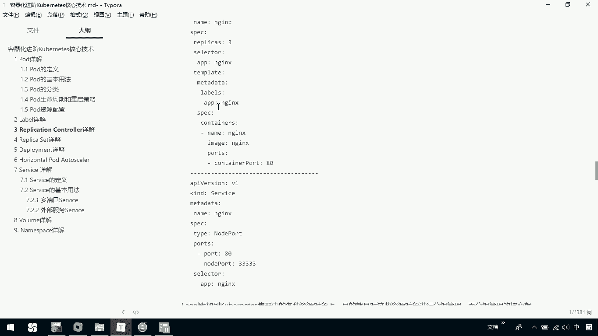

# 华为云PaaS微服务治理技术 - P69：22.kubernetes核心技术-Label - 开源之家 - BV1wm4y1M7m5

接下来呢我们介绍一下label。那label呢是cnet系统中另一个核心概念。那一个label呢其实就是一个KV的兼持对。那其中k和 value呢是由用户自己去指定的。

label可以附加到我们的各种资源上，如我们的note port service RRC等等吧。那一个资源对象呢可以定义任意数量的label。同一个label呢可以被添加到任意数量的资源对象上。

label通常在资源对象定义时确定，也可以在对象创建后动态添加或删除。

那大家看一下label最常见的用法呢是通过mat data labelbel字字段呢来给对象添加label。然后呢，我们通过1个SPECC点select呢来引用对象。下面呢就是我们的一个例子。

在这里边我们当前定义的其实是一个replication。也就是说我们当前的一个RC。那在这里边我们可以看到这部分tlate这一部分呢其实就是相当于我们去定义一个po。那我们前期呢介绍过一个po定义。

而我们在实际操作中啊，其实很少单独定义，那都会是在我们的RC里面去定义。那这部分呢就相当于是说我们定义了一个po。那现在呢在这里边就是我们有一个叫做labels。

然后APP然后我们的end也就说我们在这里边mat date labels在这部分其实我们就定义了一个label，它的key就是APP它的vol就是。而我们在这里边看到SP select。

也就是说我们在这里面看到的SP select，还有下面我们这个service里，我的SPEC这这部分呢都是相当于我们再去引用我们刚才定义的label。

那这个label我们到底干什么用呢？大家可以看一下，label呢是附加到我们coronnet集群中的各种资源对象上。那目的呢就是对这些资源对象啊进行一个分组管理。

而分组管理的核心就是我们的label select。也就是说我们在这里边是说我定义了当前的一个label。而我们可以通过label select去引用它。那也就是说我们可以去把它进行一个方便的管理。

那label和我们当前的label select都是不能单独使用的。它的必须是在一些我们的资源对象的定义文件上去附加。那一般呢是在RC或者是service中定义。那大家看到的我们这个例子呢。

其实就是在我们当前的RC，也是我们的replication controllert和我们的service里面去引用了我们之前定义的我们的label。那我们定义label的目的呢。

其实就是把我们的资源进行一个方便的一个分组管理。那我们也可以看一下，在这里边我们可以看一下我们当前的。

demo3点mo文件在这儿我们是定义了我们当前的一个label，我们matters labelbel这里边有APPAPPde。那我们这里边呢是定义了两种label。然后呢，我们在这里再看一下。

有一个select SP select。那我们这里边是把它去进行了引用。那我们可以来看一下我。Po。我现在呢去获取一下我们当前的pos，这里边有一个叫正的一个名字，这是我这个创建的，我们可以把它呢先。

DELET deleteelete掉，这是我们刚才那个demo3点压模文件。我把它删除掉，删除掉以后呢，大家再来看一下get pose。那我现在这个呃已经没有了。

那我们可以把它去创建一下create杠F，我们demo3点 ya。那我们现在创建成功，我们可以通过DSCIBdescribe，然后杠F我们看一下demo3。

这个时候呢我们可以看到当前我这里边有一个label，这就是我们定义的一个标签。那我们在整个这里边呢是把它先定义出来了。后续呢我们在这里就可以通过我们刚才说的SP去把它引用出来。

O那这是对我们的label做了一个简单的介绍。那么大家知道一下，我们label它存在的意义呢，其实就是用来进行什么资源管理的。

而我们label它是不能单独去定义label select也是一样的那我们必须干什么？在我们的这些资源上啊去定义它，也就说附加到我们当前的某些资源上。

那一般是在我们的replication controllert或者是我的service中。

