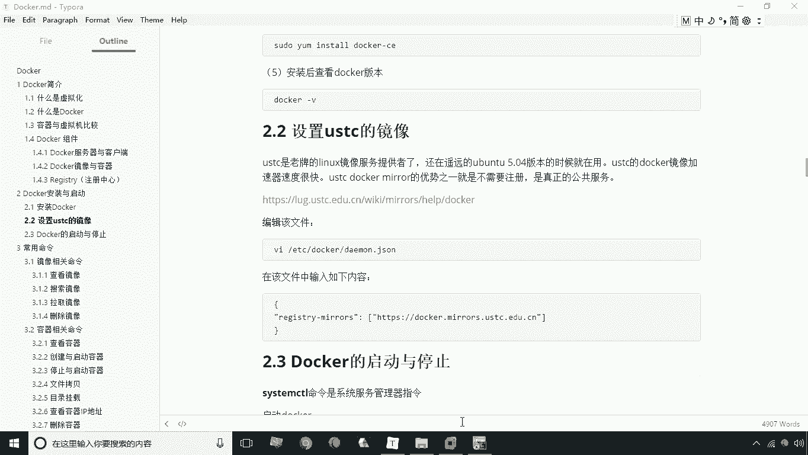
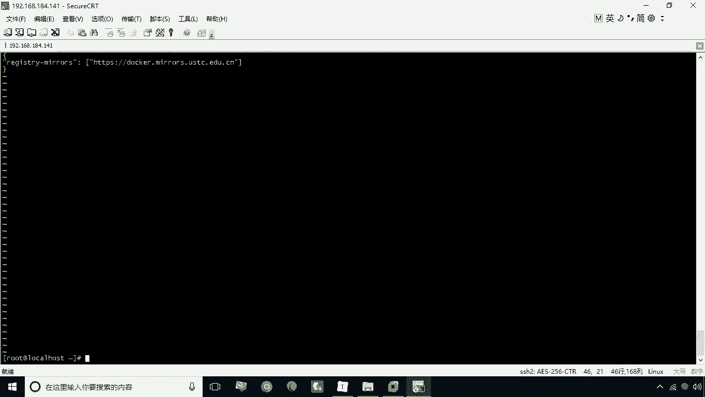
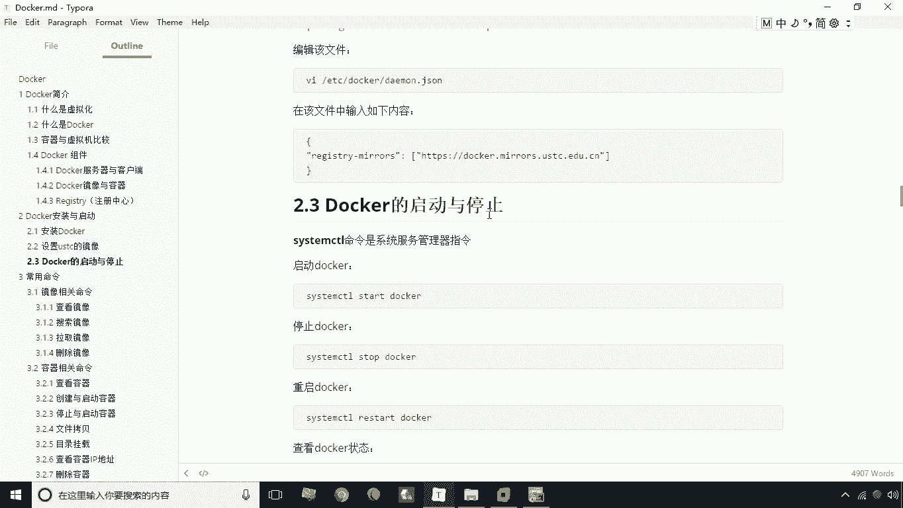
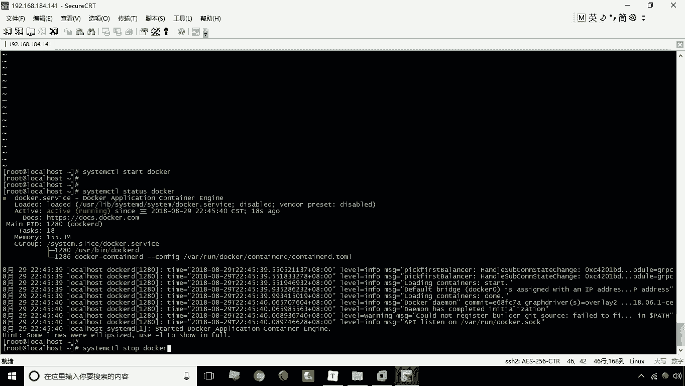
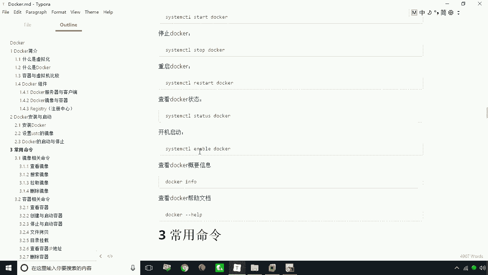
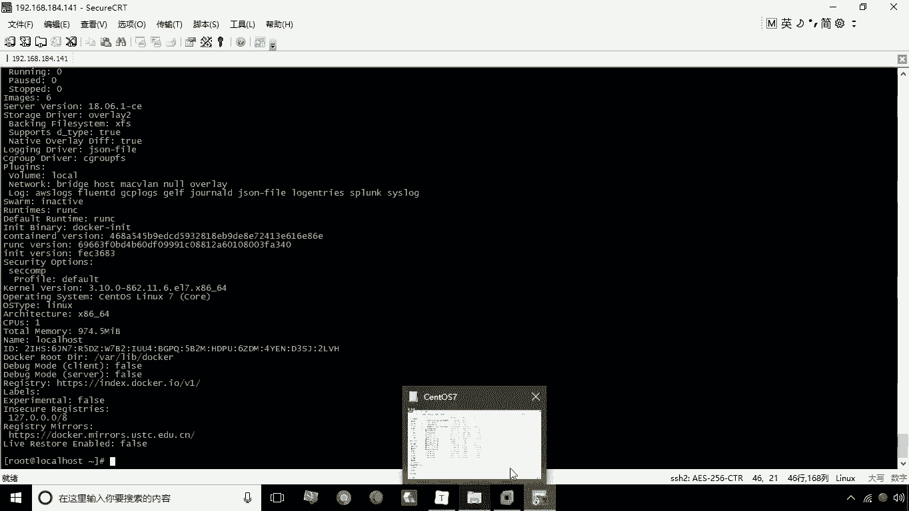
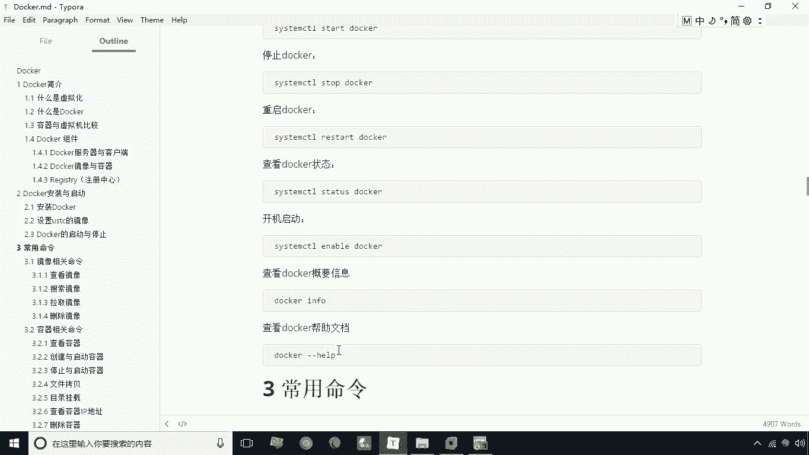
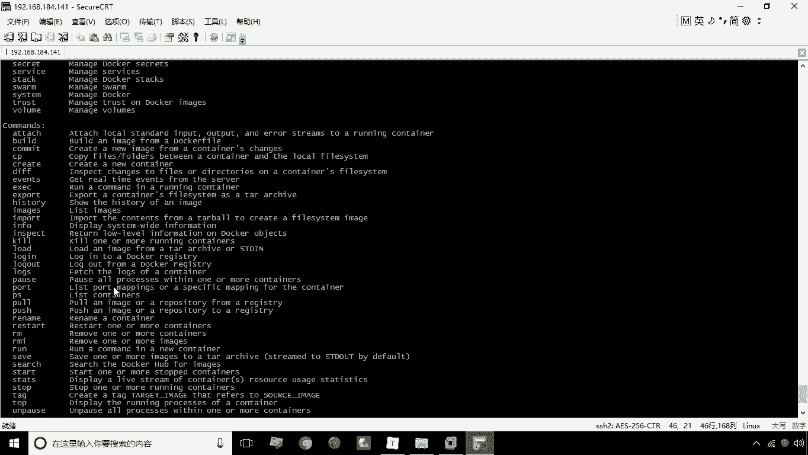
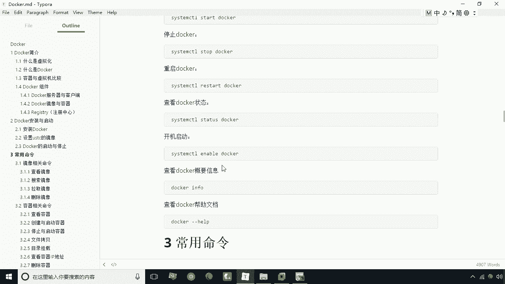

# 华为云PaaS微服务治理技术 - P6：06.docker启动与停止 - 开源之家 - BV1wm4y1M7m5

在安装docker之后，我们需要做一件事情，就是要设置一个国内的镜像站点，因为如果说你不设置这一步呢，你docker啊最常用的一个下载操作，也就是拉取一些镜像啊，去下载一些镜像，这个速度是非常慢。

因为他直接连国外站点，那么怎么样才能加快我们的速度，加快我们的下载速度，就是要设置我们的这个镜像啊，那设置镜像呢其实就是什么呢，就是要修改一个文件，这个文件呢就是在etc下的一个docker下载什么呢。

叫dear my，点JASON这么一个文件啊。

咱们可以打开看一眼，用vi命令打开叫etc目录下的docker，下载什么呢，就是，第二个点JASON打开这个文件啊，这个文件呢如果是你刚安装成功的dock，这个时候呢是这个内容是空的啊。

那这时候呢如果说是空的，你就需要去加上这么一段内容啊，这个内容其实我已经事先加好了，这个内容就是用于指定注册中心的，这么一个镜像地址，这个镜像地址其实就是我们说的USTC啊，这么一个国内镜像，国内镜像。

那么当然我们把这个加上之后呢，我们这里可以去保存退出就可以了啊。

这是因为这部分我已经帮大家做了，所以大家呢就不需要去啊自己完成了，所以说呢呃这里呢就是如果说你是啊，重新搭一个docker的环境的话，这一步呢是需要按照这个步骤来完成的好，那接下来呢我们说镜像设置好了。

那接下来我们就说这个docker怎么去启动呢，啊我们说要启动这个服务之后，我们才能使用docker，因为docker本身呢是一个什么呢。

是服务器客户端的这种架构模式，那么接下来我们来启动这个docker怎么启动呢，就用我们系统提供的一个命令叫system Ctrl这个命令，这个命令后面是加什么呢，就是start就代表启动启动。

谁启动docker服务好，吃完之后呢，这时候docker就已经启动成功了，那么你怎么样才能知道这个，这个docker的启动状态呢，我们仍然是通过SETMCTL这个命令有一个status。

然后接下来就是服务名，这时候我们就可以看到这个呃这个docker啊，他在处于什么状态啊，处于启动状态还是停止状态好了，那接下来我们再去再去停止这个docker服，停止的话用stop docker好。

停止之后呢，我们再次查看这个状态，那大家看一下这个状态是是不一样的是吧，那上面这个状态呢是是一个激活状态，而下面的是什么，是一个停止的状态啊，这是我们说的这个docker它的一个启动与停止。

那当然还有呢就是说我们啊有的时候需要，比如说改了一些配置文件是吧，那这时候我需要去重启啊，那重启呢第一种方式就是先stop，然后stop，当然还有一种更便捷的方式，就是restart，就是什么呢。

就是重启docker啊，这是我们说的重启docker呃，另外呢，假如说我们想让这个docker，在开机之后自动就启动了，那这时候我们需要去使用什么呢，这个system cdl，然后呢enable。

然后呢道口，这时候呢我们说他就啊，实现了一个开机自动启动的这么一个功能啊，开机自动启动的功能嗯，那当然了，我们说这个要查看docker1些概要信息。

那这时候我们可以用这个docker本身的命令docker info，当我们启动之后呢，这个docker命令是可以用的啊，后面还会学习一系列的命令，就是docker它提供了一系列命令啊。

当然title都是docker啊。

再有呢就是我们会呃说一下。

docker本身有一个在线帮助文档啊，啊那个在在线的当帮助文档就用docker杠杠help，这时候呢他就是呃给你列举了这个docker，所提供的一些所有的命令啊，所有的命令。

这是关于docker的这么一个啊启动仪停止。

