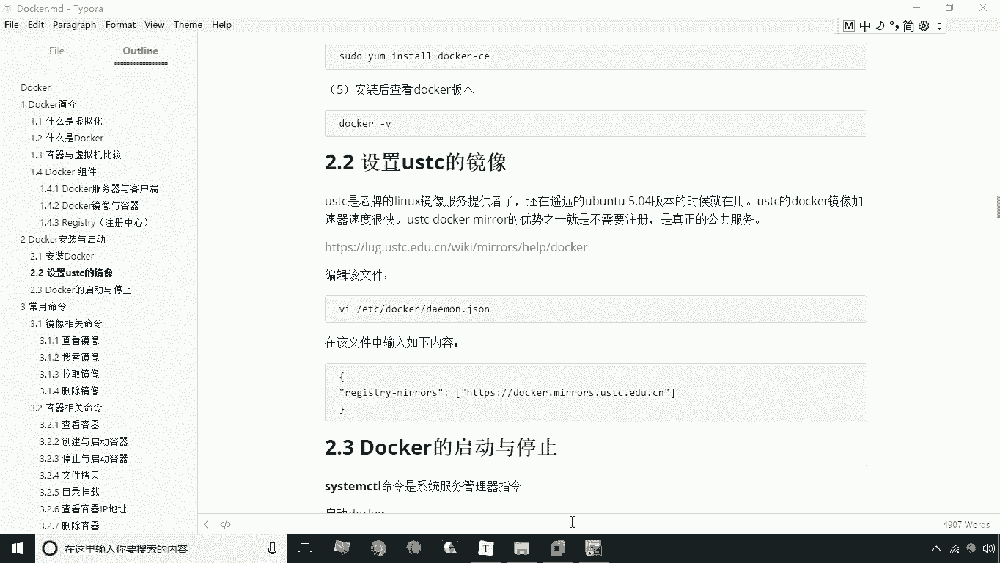
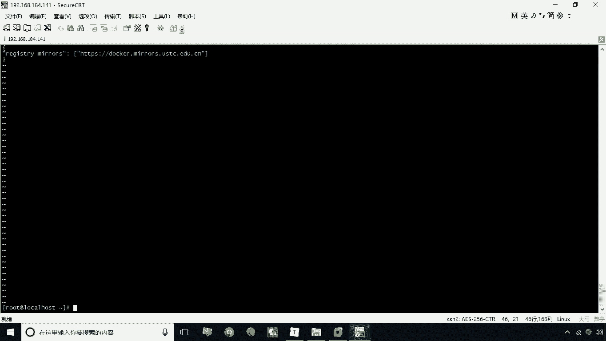
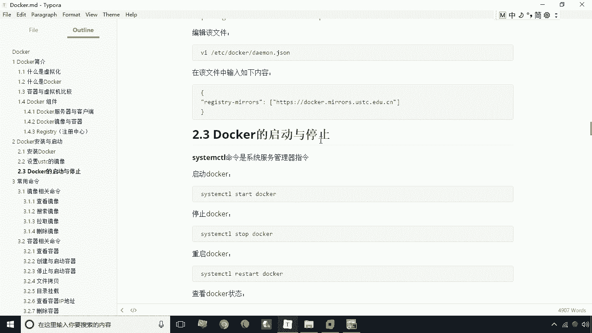
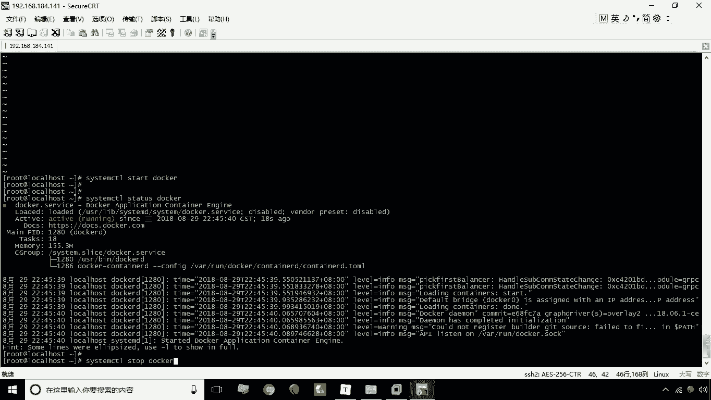
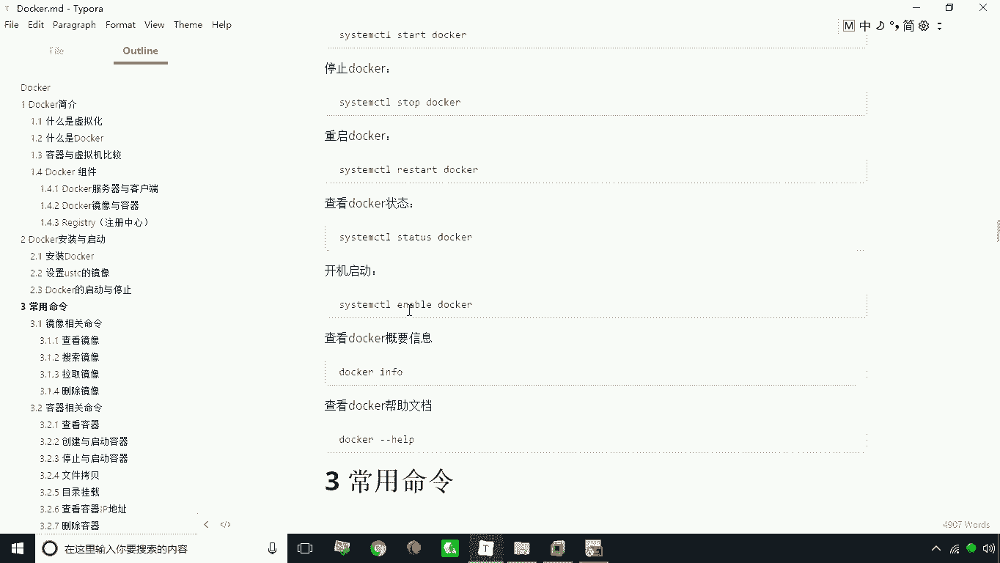
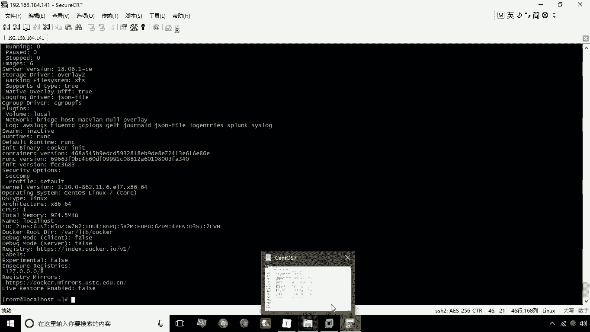
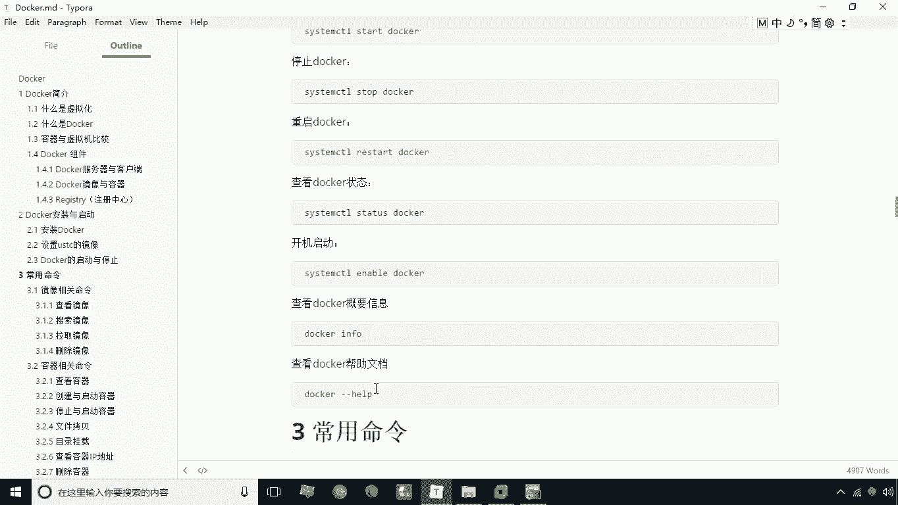
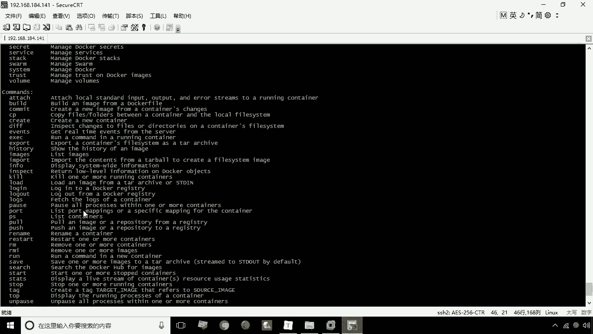
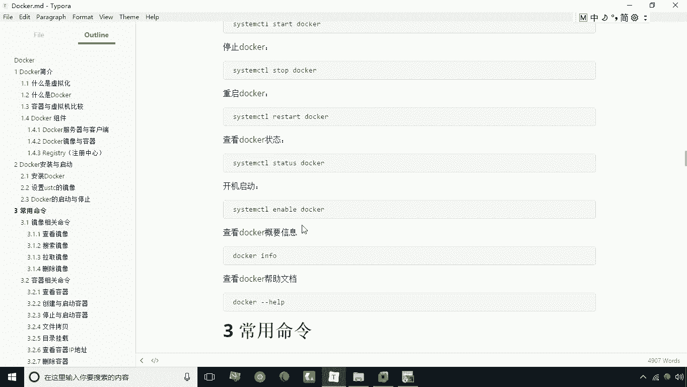

# 华为云PaaS微服务治理技术 - P6：06.docker启动与停止 🐳

在本节课中，我们将要学习如何配置Docker的国内镜像源以加速下载，以及如何启动、停止、重启Docker服务，并查看其状态。这些是使用Docker前必须掌握的基础操作。

## 配置国内镜像源

安装Docker后，需要配置一个国内的镜像站点。如果不进行此设置，Docker拉取镜像的操作会非常缓慢，因为它默认连接的是国外站点。

要加快下载速度，需要修改一个配置文件。该文件位于 `/etc/docker/` 目录下，名为 `daemon.json`。



以下是配置国内镜像源的步骤：

1.  使用 `vi` 命令打开配置文件：
    ```bash
    vi /etc/docker/daemon.json
    ```
2.  如果文件内容为空，则需要添加以下配置。此配置指定了USTC（中国科学技术大学）的镜像地址。
    ```json
    {
      "registry-mirrors": ["https://docker.mirrors.ustc.edu.cn"]
    }
    ```
3.  保存并退出文件。

完成此配置后，Docker拉取镜像的速度将得到显著提升。

## Docker服务的启动与停止

Docker采用客户端-服务器架构，因此在使用前需要先启动Docker服务。

### 启动Docker服务



要启动Docker服务，可以使用系统提供的 `systemctl` 命令。

```bash
sudo systemctl start docker
```

执行此命令后，Docker服务即启动成功。

### 查看Docker服务状态



启动后，可以通过以下命令查看Docker服务的当前状态。

```bash
sudo systemctl status docker
```

此命令会显示服务是处于运行（active）还是停止（inactive）状态。

### 停止Docker服务

如果需要停止Docker服务，可以使用 `stop` 命令。

```bash
sudo systemctl stop docker
```

停止后，再次使用 `status` 命令查看，状态将变为停止（inactive）。



### 重启Docker服务

在修改了配置文件等情况下，需要重启Docker服务。除了先停止再启动，有一个更便捷的命令可以直接重启。

```bash
sudo systemctl restart docker
```

### 设置开机自启

如果希望Docker在系统启动后自动运行，可以将其设置为开机自启。

```bash
sudo systemctl enable docker
```

执行此命令后，Docker服务将实现开机自动启动。

## Docker基本信息与帮助



上一节我们介绍了如何管理Docker服务，本节中我们来看看如何获取Docker的基本信息和命令帮助。

### 查看Docker信息

Docker启动后，可以使用 `docker info` 命令查看其详细的系统级信息。



```bash
docker info
```



### 获取Docker命令帮助

Docker提供了丰富的命令行工具。要查看所有可用的命令及其简要说明，可以使用在线帮助文档。

```bash
docker --help
```



此命令会列举出Docker所提供的所有命令，是学习和使用Docker的重要参考。

---



本节课中我们一起学习了Docker的基础配置与服务管理。我们首先配置了国内镜像源以加速镜像下载，然后掌握了使用 `systemctl` 命令启动、停止、重启Docker服务以及设置开机自启的方法。最后，我们了解了如何使用 `docker info` 和 `docker --help` 命令来获取系统信息和命令帮助。这些是后续使用Docker进行操作的基础。