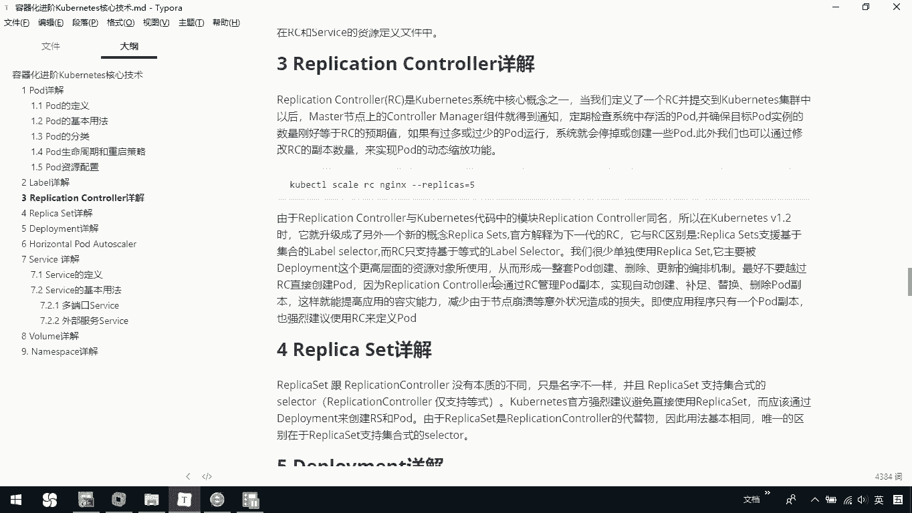

# 华为云PaaS微服务治理技术 - P70：23.kubernetes核心技术-Replication Controller - 开源之家 - BV1wm4y1M7m5

下面呢我们说一下replication controller。那replication controller我们简称RC，它呢也是cmeize和系统中啊核心概念之一。那当我们定义一个RC。

并提交到cmeline集群中以后啊，ma节点上的conttrol manager主件呢就会得到通知。它会定期检查系统中存活的po，并确保我们这个呃目标po的实例，数量刚好等于我们RC的一个预期值。

那这里面大家可以看一下上面这例子。这就是我们定义的一个预期值是3。

那我们在这里边看一下，如果过多或者是过少的po运行呢，系统会停掉，或者是创建一些新的po。那此外呢，我们也可以通过修改RC的副本呢来实现一个动态的缩容。那我们可以看一下，在我们当前的这个例子里边。

我们可以ca一下我们的demo5点demo5的1个24点压模文件。在这里边呢，其实就是你看到这段代码了，我们是创建了一个rereplication controller了。

那现在呢我们当前的印象其实是一个eng。那我们repl就是我们的预期值是3。那现在我们。coer cTLge pose你会发现我们有Nd123这三个这是我们当前预期创建的那我们说你可以去通过呃这样的一段命令呢去查看我们当前的这个或者说动态的去扩容或缩容。

我们可以通过coer cTLSCALERC然后我们这个N杠杠REPLICAS我们假设改成无。

那这个时候就会帮助我们去进行一个扩容。你看我们这里边关于这个N开始了，有5个了。如果我们刚才这个操作我改成一。

那这时候你再查看一遍，你会发现我们这个时候就只有一个。也就说我们可以去完成这种动态的缩放功能。

那由于这个replication controller与我们的chronize代码中的模块，一个叫做replace controller同名。所以呢在这个chron1。2以后啊。

它呢就升级了另外一个新概念，就是我们接下来要讲的这个relicate set那官方解释为是下一代的RC它与RC的区别是什么呢？我们这个re啊，它呢支持这种什么呢？基于集合的label。

而我们RC呢只支持这种等式的label。呃，我们很少单独使用这个replace，它呢一般是和我们这个dloyment这个更高层面的资源对象所使用的。

也说我们re set呢和我们后续要讲呃loyment是一起去使用的我们很少是单独使用一个。

那我们知道一下这个represent和我们那个，它们形成一个整套的一个po创建更新的一个编排机制。那我们最好呢不要越过这个RC直接创建po。这也是我之前跟大家说的说我们在创建的时候。

一般很少像我们之前这种定义的说直接创建，而是在我们创建RC的过程中呢，去直接指定我们当前的这个po的创建过程。那这里边也跟我们说了，我们最好不要越过RC创建po。

而是这个因为replication control啊，它会通过RC来帮助我们管理这些副本，而从而实现呢自动的创建补助替换删除po部本。那这样呢能提高我们应用的一个容灾能力。

减少由于节点崩溃等意外状况造成的损失。那即便使应用程序只有一个po副本呢，我们也是建议要用RC。那这这这张讲解啊，大家知道一下，就说我们。

repl controller呢呃是我们当前整个这个空的一个核心概念。那我们呢在定义它的时候呢，一般不是啊一般是我在这里面可以去定义它的一个期望的副本。

我们也可以通过这样的命令呢去进行一个动态的一个缩放容。那我们知道一下po一般不建议单独去定义，而是在我们这一个RC里面去定义。那在V1。2以后啊，我们的一个新的就是说RC的升级版。

就replication set，它跟RC的区别就是在我们这个label select在选择时呢，我们是可以基于这种集合的。那我们在这个replace使用时也不是单独用。

而是结合我们另外一个叫做dloment一起去使用的那好，这是关于这个replay controller啊，简单跟大家做一个介绍。大家回去可以把自己的代码呢去自己去创建执行一下。

看看我在这里面呢其实已经创建完了，刚才呢我们是一个replication controller，我们也可以通过coer get sVC。大家可以看一下，我其实这里面还有个in。

那这个呢就是我当前的这个servver service。后续呢我们也会去讲这个关于service。

