# 华为云PaaS微服务治理技术 - P70：23. Kubernetes核心技术-Replication Controller 🎯

在本节课中，我们将要学习Kubernetes的一个核心概念：Replication Controller（简称RC）。我们将了解它的定义、工作原理、如何通过它来管理Pod副本，以及它与后续版本中Replica Set的关系。

## 概述

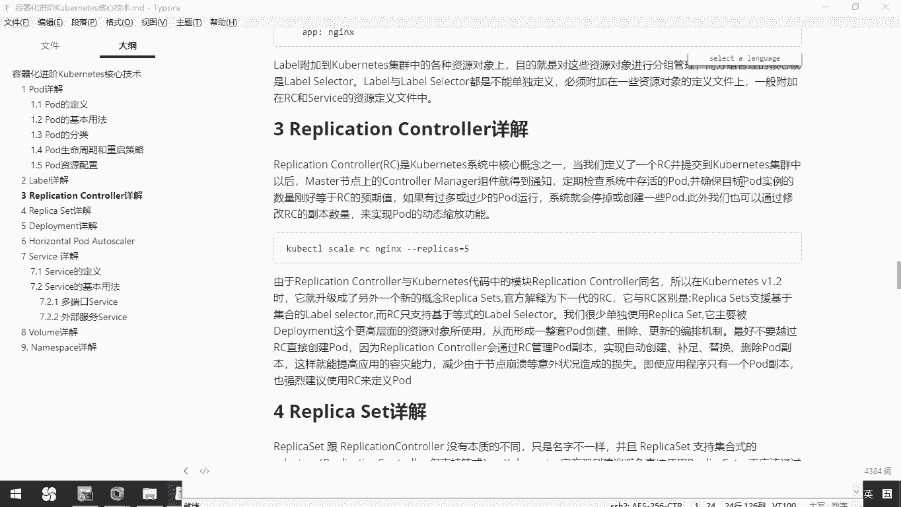

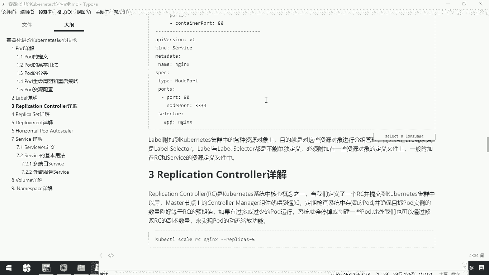

Replication Controller是Kubernetes系统中的核心概念之一。它的主要作用是确保在任何时候，集群中运行的Pod副本数量都与用户定义的期望值保持一致。这为应用的稳定运行和高可用性提供了基础保障。

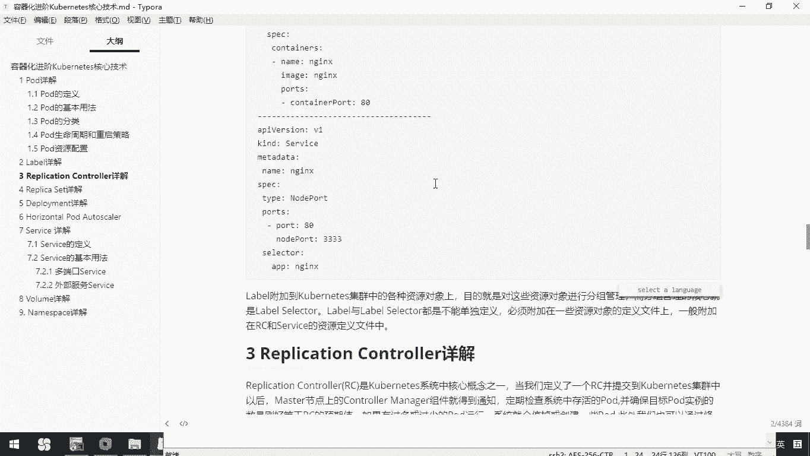

## RC的工作原理

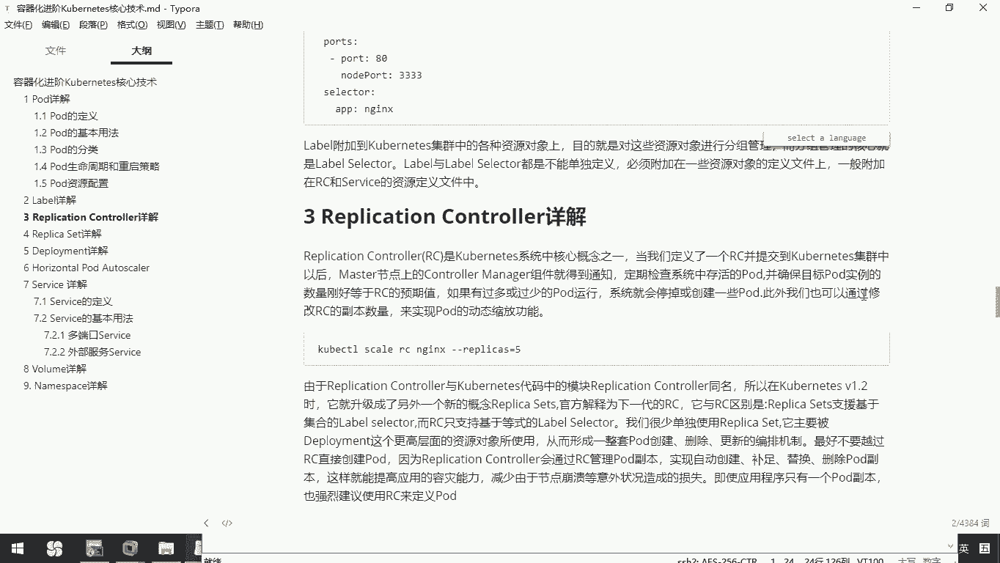

上一节我们概述了RC的作用，本节中我们来看看它的具体工作方式。

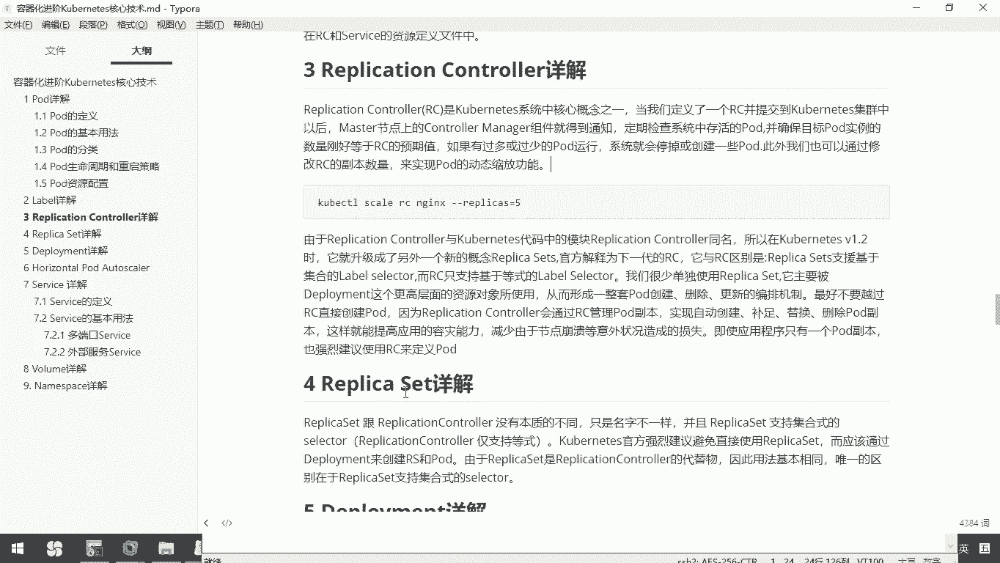

当我们定义一个RC并提交到Kubernetes集群后，Master节点上的Controller Manager组件会得到通知。它会定期检查系统中存活的Pod数量，并确保目标Pod的实例数量刚好等于RC配置中定义的预期值。

如果系统中运行的Pod数量过多或过少，RC控制器会自动停掉多余的Pod或创建新的Pod，以使实际状态与期望状态一致。

## 定义与使用RC

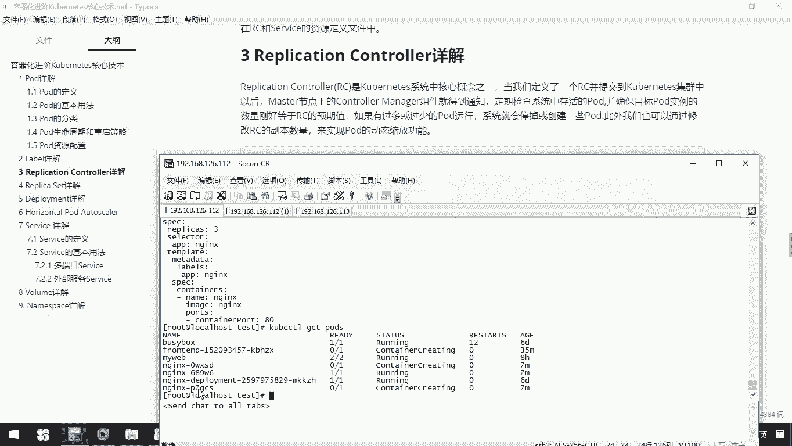

理解了RC的工作原理后，本节我们将通过一个具体例子来学习如何定义和使用RC。

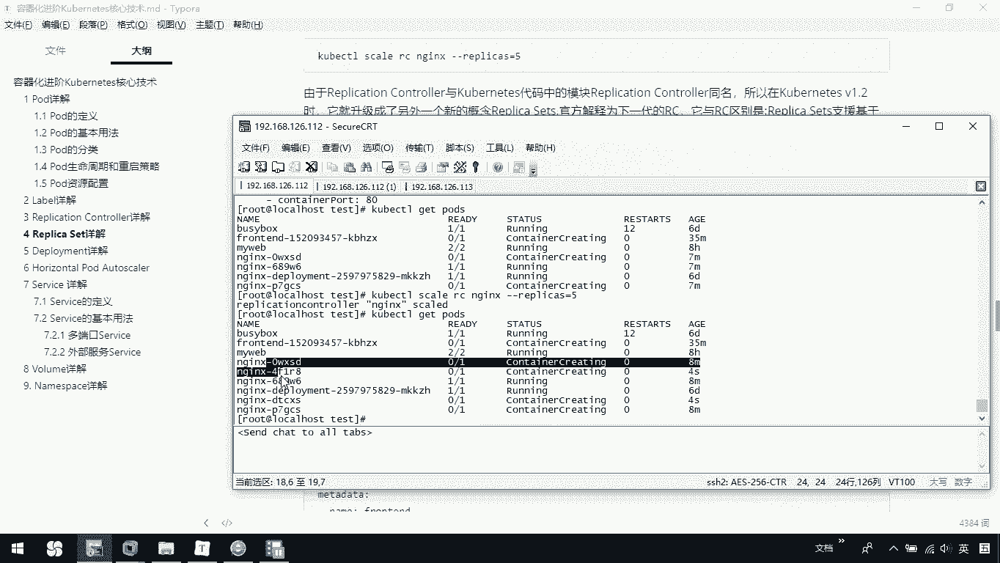

以下是一个RC的定义示例，其预期副本数（`replicas`）设置为3：

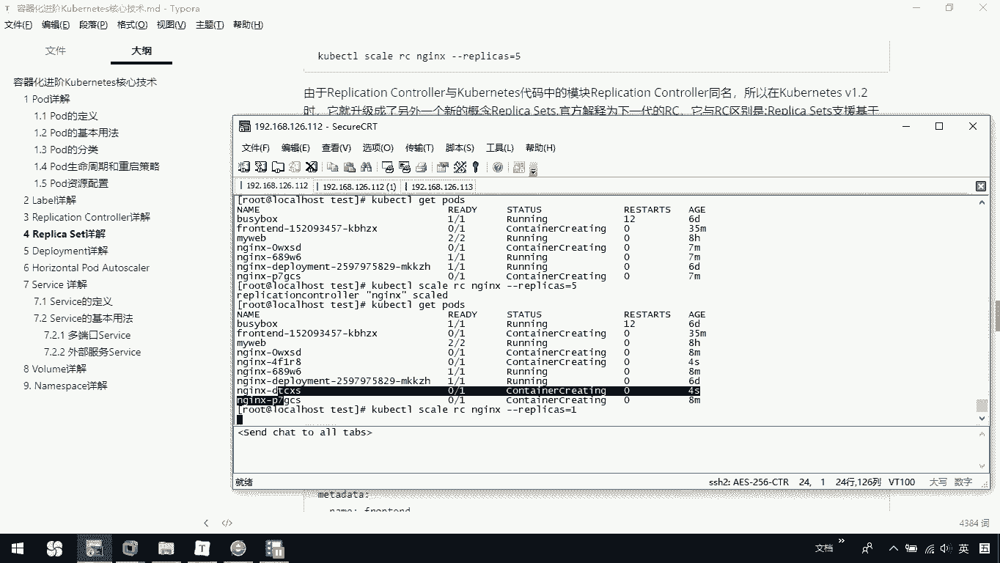

```yaml
apiVersion: v1
kind: ReplicationController
metadata:
  name: demo-rc
spec:
  replicas: 3
  selector:
    app: demo-app
  template:
    metadata:
      labels:
        app: demo-app
    spec:
      containers:
      - name: demo-container
        image: nginx:latest
```

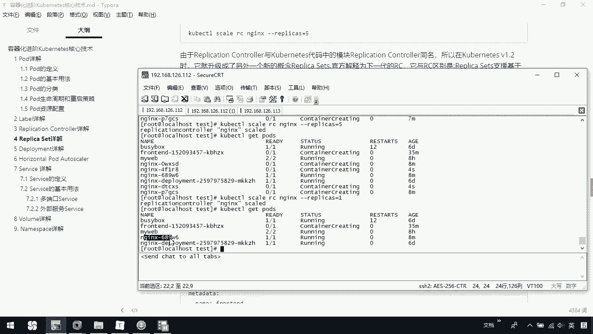

通过`kubectl apply -f demo-rc.yaml`命令即可创建此RC。创建后，使用`kubectl get pods`命令查看，会发现系统自动创建了3个名为`demo-rc-xxxxx`的Pod。

## 动态扩缩容

RC的一个强大功能是支持应用的动态扩缩容。我们可以通过修改RC的配置或使用命令来轻松调整Pod的副本数量。

以下是实现动态扩缩容的操作命令：

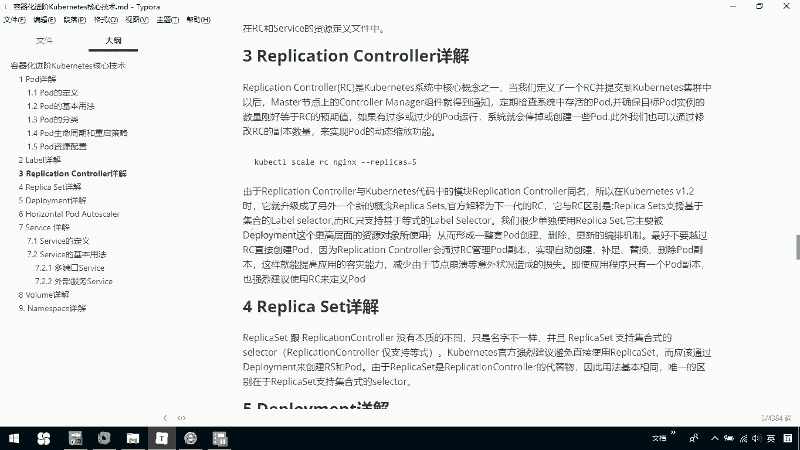

*   **扩容**：将副本数从3个扩展到5个。
    ```bash
    kubectl scale rc demo-rc --replicas=5
    ```
    执行后，RC控制器会立即创建2个新的Pod。

*   **缩容**：将副本数从5个减少到1个。
    ```bash
    kubectl scale rc demo-rc --replicas=1
    ```
    执行后，RC控制器会自动终止多余的4个Pod。

## RC与Replica Set

在Kubernetes v1.2版本之后，引入了一个名为Replica Set（RS）的新概念，可以视作RC的升级版。

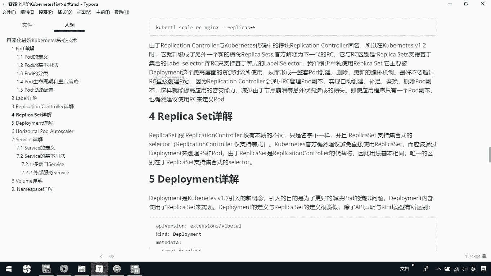

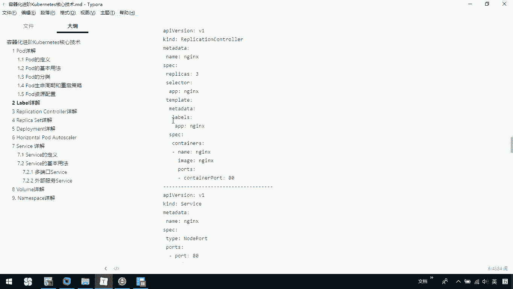

它们之间的核心区别在于**标签选择器（Label Selector）**：
*   **RC** 只支持**等式**的标签选择器（例如 `app=nginx`）。
*   **Replica Set** 支持**基于集合**的标签选择器，功能更强大（例如 `app in (nginx, web)`）。

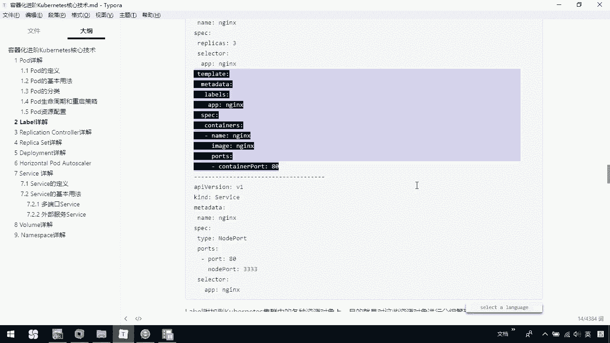

需要注意的是，我们很少单独使用Replica Set。它通常是和更高层面的资源对象 **Deployment** 一起配合使用，共同构成一套完整的Pod创建、更新和编排机制。

## 最佳实践建议

在了解了RC和RS之后，我们需要明确一个重要的使用原则。

**最好不要绕过RC/RS直接创建Pod。** 因为通过RC/RS来管理Pod副本，可以实现Pod的自动创建、替换和删除。这极大地提高了应用的容灾能力，减少了因节点崩溃等意外状况造成的服务中断。因此，即使你的应用程序只需要一个Pod副本，也建议使用RC或RS来定义和管理。

## 总结

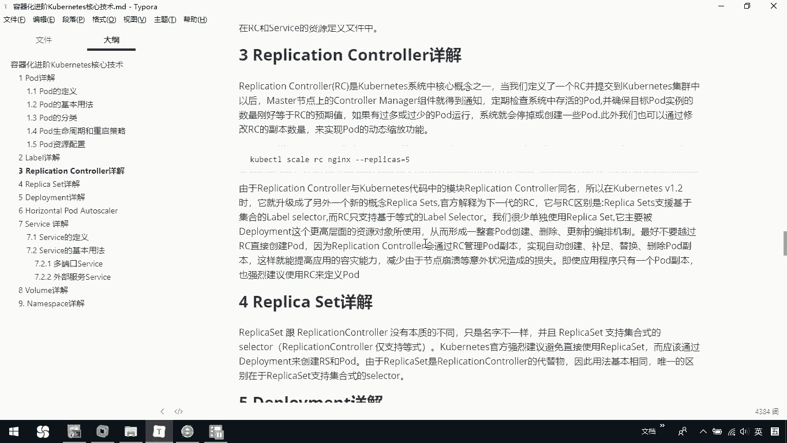

本节课中我们一起学习了Kubernetes的Replication Controller。

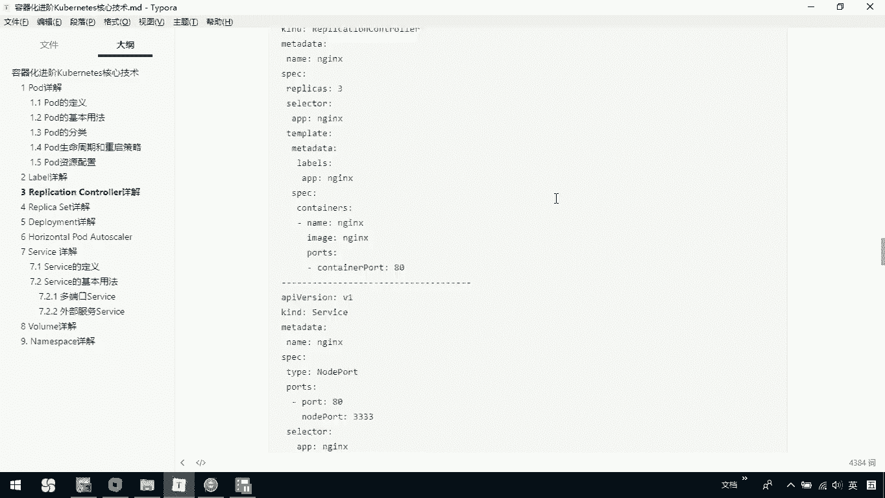

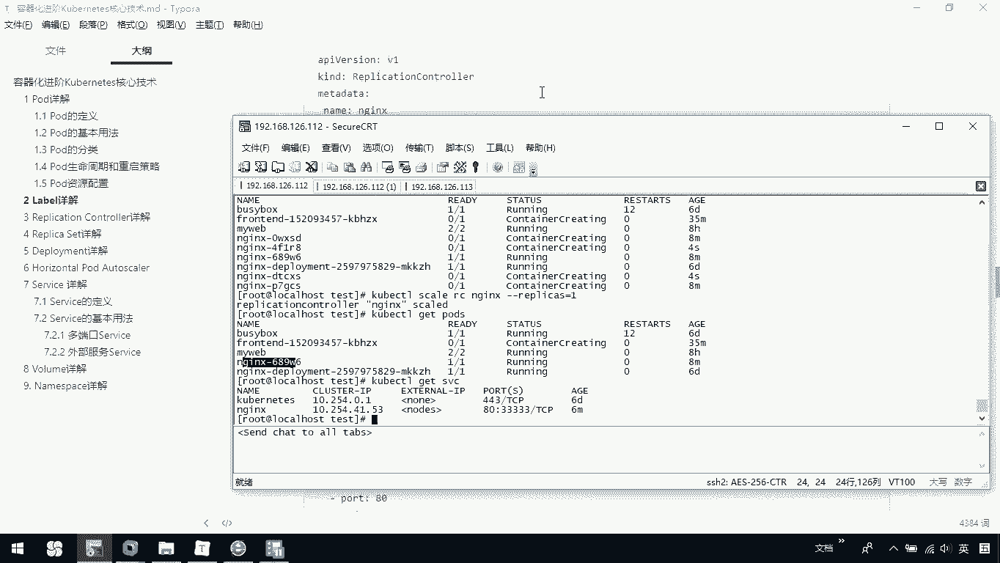

我们了解到RC是用于确保Pod副本数符合预期的核心控制器，并通过命令可以轻松实现应用的动态扩缩容。同时，我们知道了RC的升级版Replica Set支持更灵活的标签选择器，并且它常与Deployment结合使用。最后，我们强调了使用RC/RS来管理Pod是最佳实践，它能有效提升应用的健壮性和可维护性。

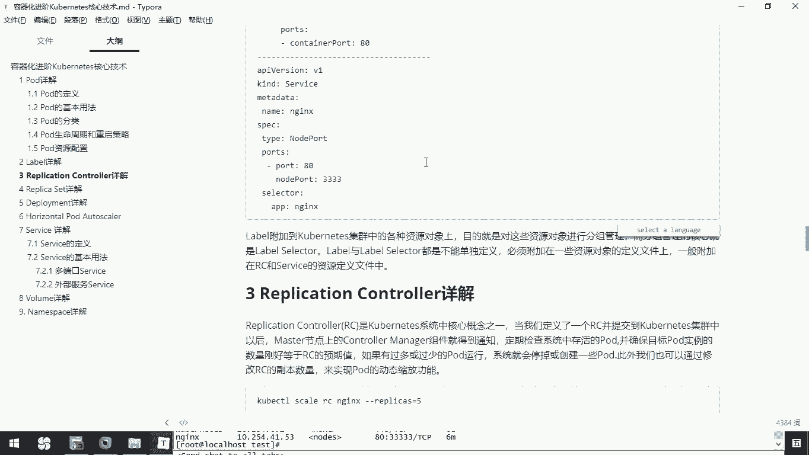

你可以根据教程中的YAML示例和命令，在自己的Kubernetes环境中创建并操作RC，以加深理解。