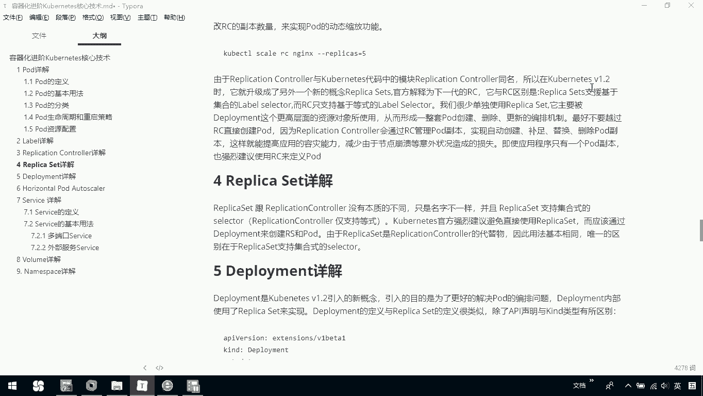
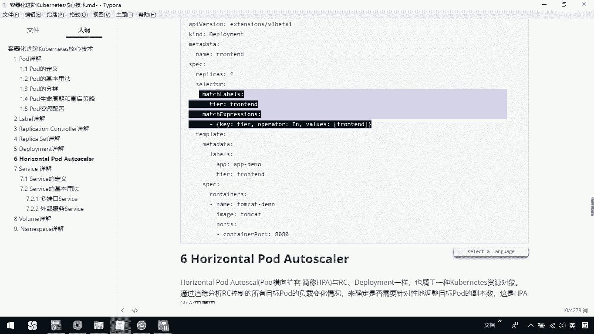
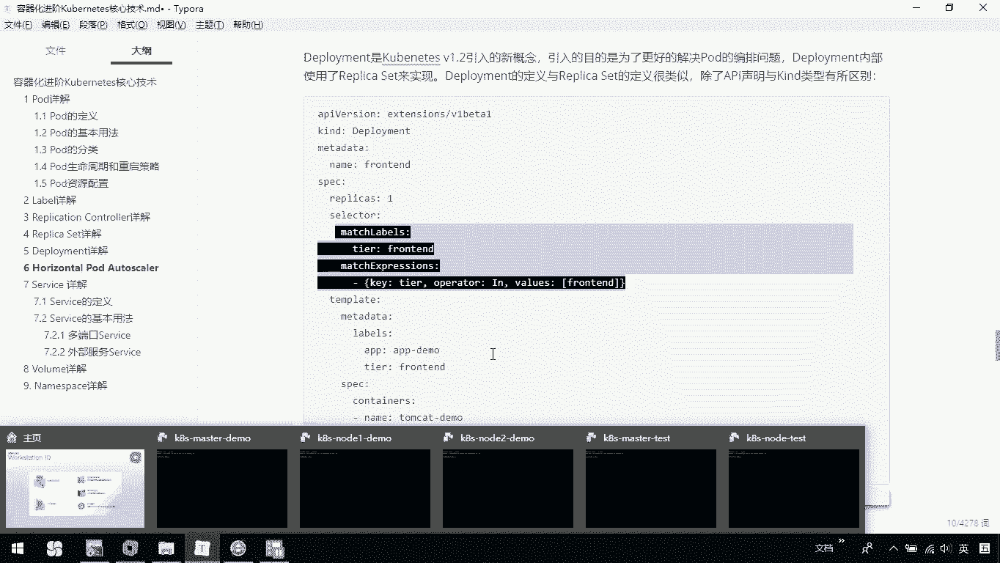
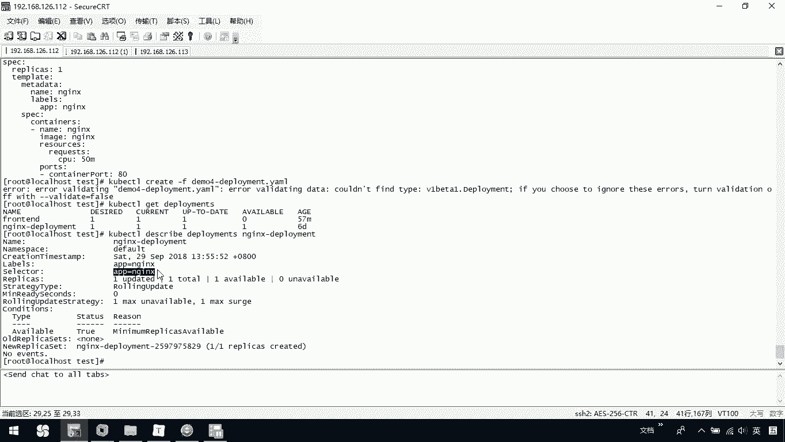
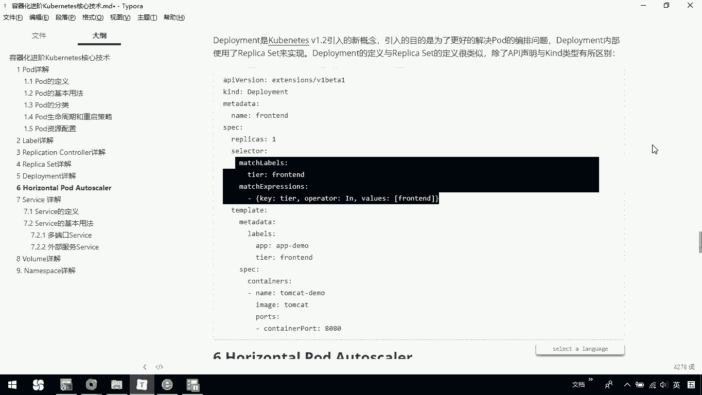
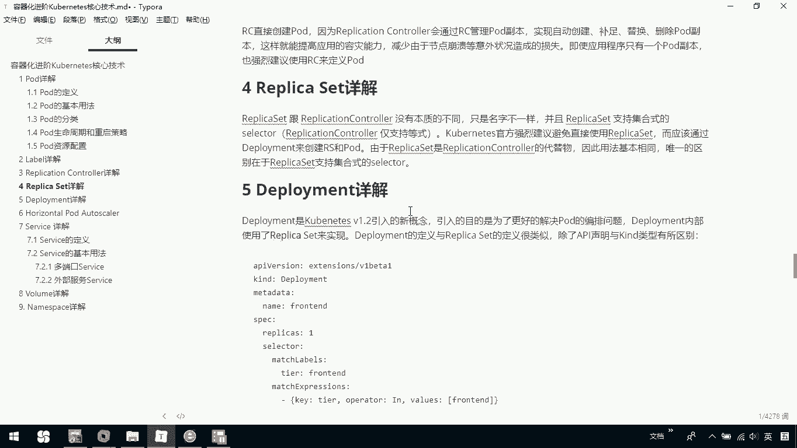

# 华为云PaaS微服务治理技术 - P71：24.kubernetes核心技术-ReplicaSet与Deployment - 开源之家 - BV1wm4y1M7m5

下面呢我们介绍一下这个rely size。那这个repleite啊是跟我们的replication，它其实是没有本质区别的，只是名字不一样。那么前期我们已经说过了，在这个呃酷net1。2以后啊。

升级的新概念就是这个reple set。

那我们知道一下，就是说relicite它呢跟我们那个replication controller区别主要是它支持集合式的selectctor。

也就是说呢我们以前的replication controllert，它只是支持这种等式的那chmeize呢这个官方建议呢避免直接使用representite。也就说我们这reite不要去直接用。

那应该和我们的deployment一起去使用。那由于这个representite是replication的一个替代物，因此呢它使用上呢是没有什么这个呃不同地方基本是相同的。

唯一的区别就是我刚才说的关于我们这个selectctor它是支持这种集合方式的那这里边呢我们也不用先看我们这个relicite怎么定义啊，我们往下看这个关于dloyment。那这个dloment是g1。

2以后引入的一个新概念，引入的目的啊就是为了更好的解决我们的po的编排问题。那dlo的内部呢使用represent来实现。那这是也前期说过的那lo定义与re定义呢很类似那除了声明以及这个类型有所不同。

比如说下面呢这是一个关于dlo一个定义。那我们这个如果想要自己去定义一个represent呢，其实就是这个 server和我们，其他的呢都是一样的那大家可以看一下下面这个例子啊。

下面这里边呢我们定义了一个dloyment那我们可以看在这里面我们tlate是指定我们当前的那我们引用了我们的标签label。

们定一个label叫那我们上面这部分是不是这部分其实就是干什么我们当前的这些bel那这里。大家看我们当前呢是可以去写成这种集合的方式的。那当前这个就是定义了一个deployment。

那我们也可以看一下当前我们自己的一个deployment。在这里边我们可以ca一下我们的demo4杠 deploymentloyment压文件。

这就是我们当前的定义的一个简单的当前的我们的一个dloyment，那我们这里边看预期目标是一。然后我们当前使用的这个po，它里边的容器呢是一个。那我们可以通过coer cLcreate去把它创建出来。

我们这里边可以写成demo4杠我的dloyment。那我们创建呢会有问题啊，因为我之前已经创建过了。那我们创建过以后呢，我们可以通过get dEPLOYMS去查看我们创建的dloyment。

我们的dloyment是这个叫做 deploymentloyment我们可以通过coer cLDSERBRBE。

我们dloyments加上我们当前的这个名字，去查看我当前整个deployment的一个详细的信息。这里面你就会发现我们这里面是不是有labels看到了吧，这也就是我们前期定义的。

然后我们的select，我们的选择的也是APP等于end那这是说我们创建了一个deployment。那这里啊大家一定要知道，就是我们当前这个deployment跟我们的RC对比呢？其实它就是一个升级。

那我们在新的版本里面呢建议使用它它呢可以使用我们它内部啊默认使用的是我们这种叫做replace那这是我们新版本以后推荐使用的它跟我们之前的这种RC呢，其实本质的区别没有还是一样的。

只是它在编排上呢可能会更好一点。那这是关于dloyment。

