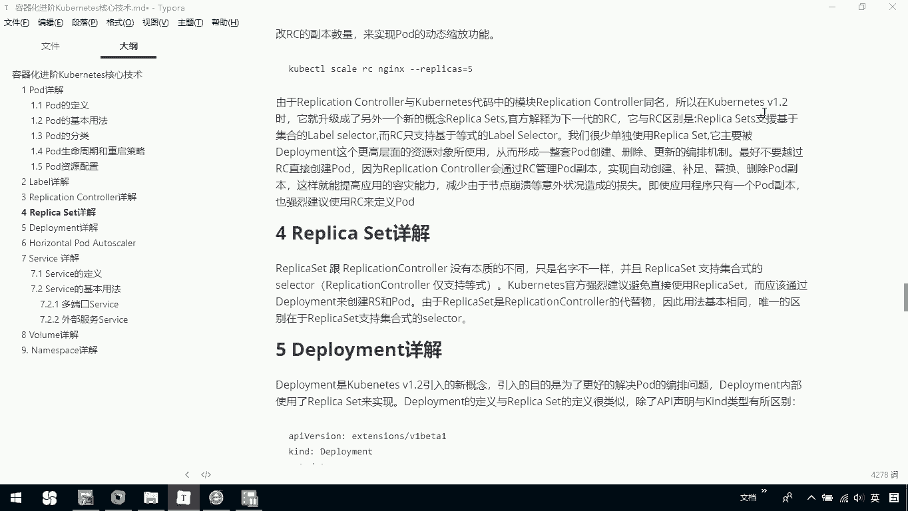
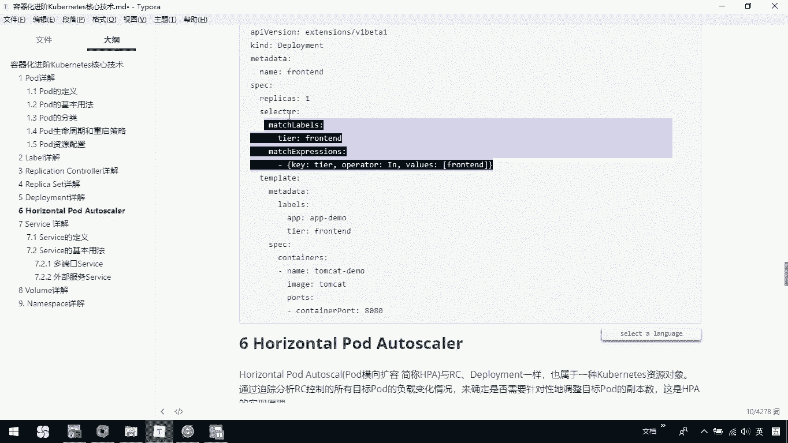
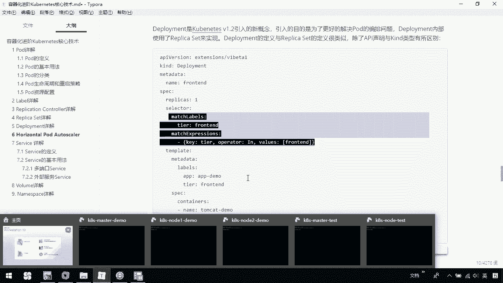
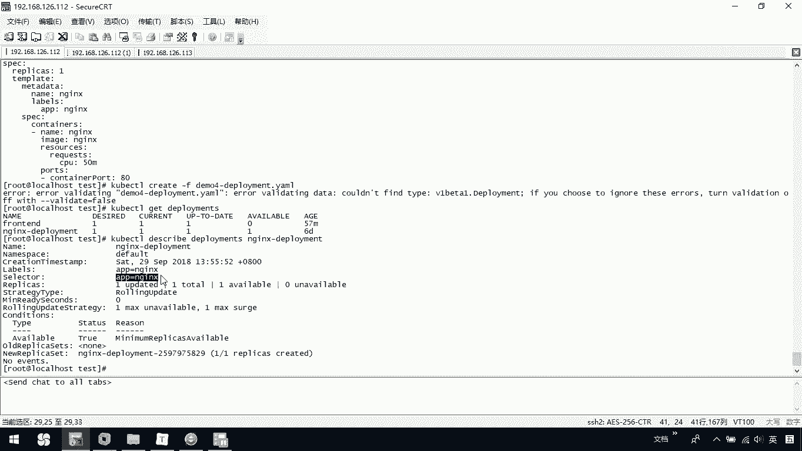
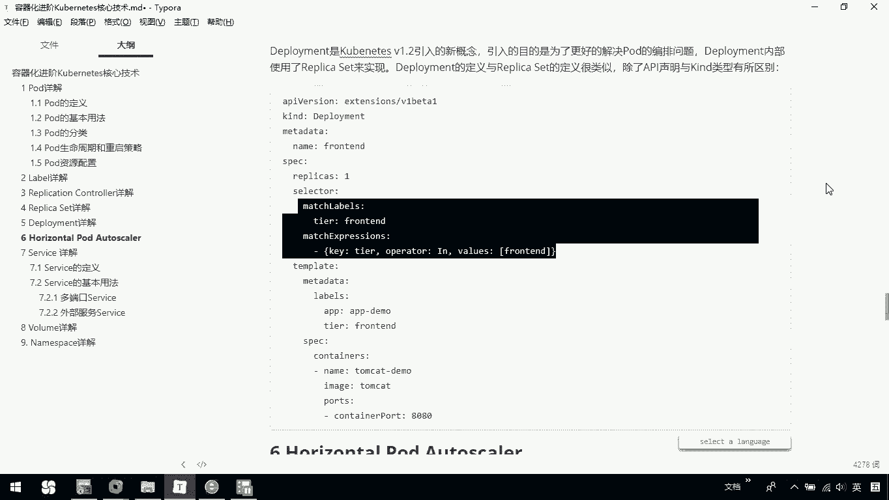
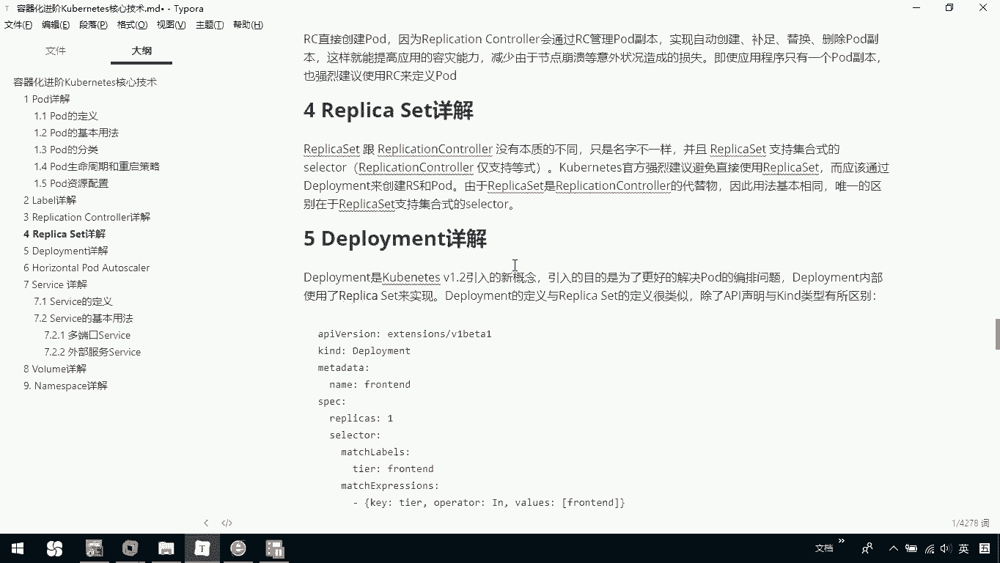

# 华为云PaaS微服务治理技术：P71：24. Kubernetes核心技术-ReplicaSet与Deployment 🚢

在本节课中，我们将要学习Kubernetes中的两个核心控制器：ReplicaSet与Deployment。它们是管理Pod副本和实现应用部署更新的关键组件。



## 概述

ReplicaSet是Replication Controller的升级版，而Deployment则是在更高层次上管理Pod编排的抽象。理解它们的关系和用法，是掌握Kubernetes应用部署的基础。

## ReplicaSet介绍

上一节我们介绍了Replication Controller，本节中我们来看看它的继任者ReplicaSet。

ReplicaSet与Replication Controller没有本质区别，只是名称不同。在Kubernetes 1.2版本之后，引入了ReplicaSet这个新概念。

ReplicaSet与Replication Controller的主要区别在于，它支持**集合式的selector**。而Replication Controller仅支持等式selector。

官方建议避免直接使用ReplicaSet。它应该与Deployment一起使用。由于ReplicaSet是Replication Controller的替代品，因此其基本使用方法相同。唯一的区别就是刚才提到的selector支持集合方式。

## Deployment介绍

了解了ReplicaSet的基础后，我们来看看更常用的Deployment。

Deployment是Kubernetes 1.2版本后引入的新概念，引入目的是为了更好地解决Pod的编排问题。Deployment内部使用ReplicaSet来实现。

Deployment的定义与ReplicaSet的定义很类似，除了API声明以及资源类型有所不同。

以下是一个Deployment的定义示例：

```yaml
apiVersion: apps/v1
kind: Deployment
metadata:
  name: nginx-deployment
spec:
  replicas: 3
  selector:
    matchLabels:
      app: nginx
  template:
    metadata:
      labels:
        app: nginx
    spec:
      containers:
      - name: nginx
        image: nginx:1.14.2
        ports:
        - containerPort: 80
```

在这个定义中，`spec.selector.matchLabels` 部分定义了选择器，这里使用了标签 `app: nginx`。`spec.template` 部分则定义了Pod的模板。

我们也可以查看一个已创建的Deployment。例如，通过以下命令查看一个名为 `demo4-deployment` 的Deployment：

```bash
kubectl get deployment demo4-deployment -o yaml
```





通过 `kubectl describe deployment <deployment-name>` 命令，可以查看Deployment的详细信息，包括标签、选择器以及关联的ReplicaSet和Pod状态。

## 核心操作与对比

现在，让我们总结一下Deployment的核心操作及其与Replication Controller的对比。

创建一个Deployment可以使用以下命令：
```bash
kubectl apply -f deployment.yaml
```

查看Deployment列表：
```bash
kubectl get deployments
```



Deployment与Replication Controller对比，它是一次升级。在新版本Kubernetes中，建议使用Deployment。Deployment内部默认使用ReplicaSet。它与之前的Replication Controller在本质上没有区别，但在应用编排和更新策略上功能更强大、更好用。



## 总结



本节课中我们一起学习了Kubernetes的ReplicaSet与Deployment。
*   ReplicaSet是Replication Controller的升级版，支持更灵活的集合式selector。
*   Deployment是一个更高层次的抽象，用于管理Pod部署和更新，其内部通过ReplicaSet控制Pod副本。
*   在实际使用中，应优先使用Deployment来管理无状态应用，它提供了滚动更新、回滚等强大功能，简化了应用的生命周期管理。