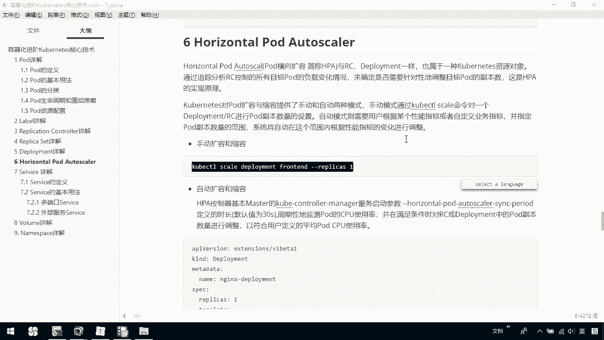
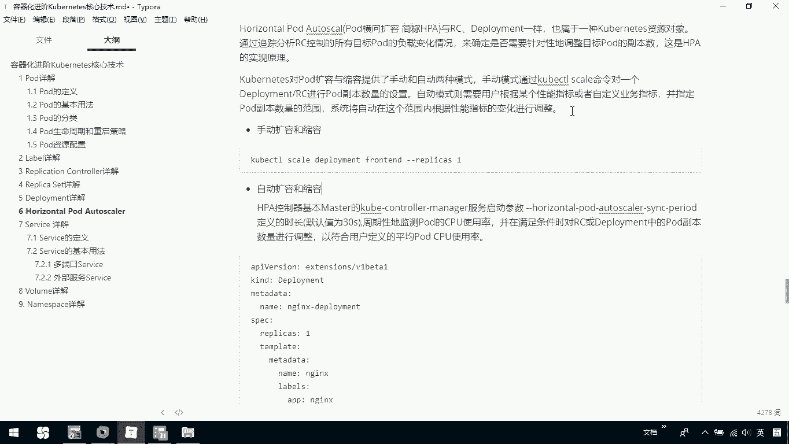
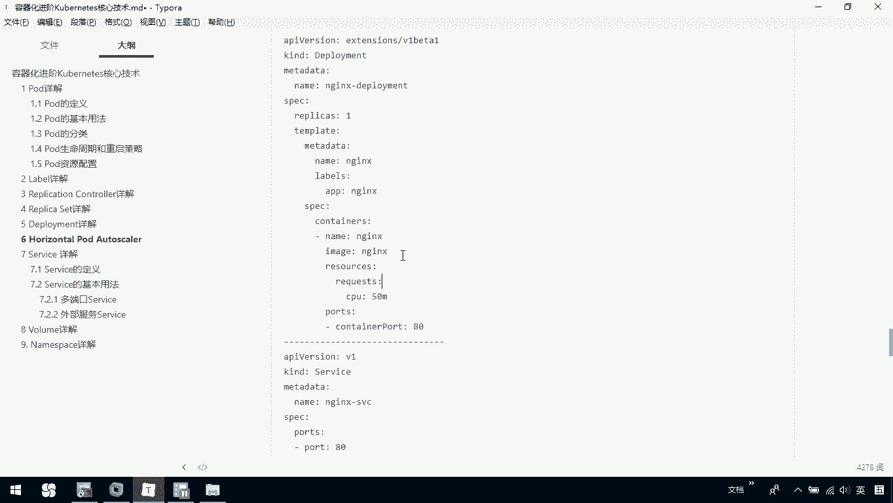
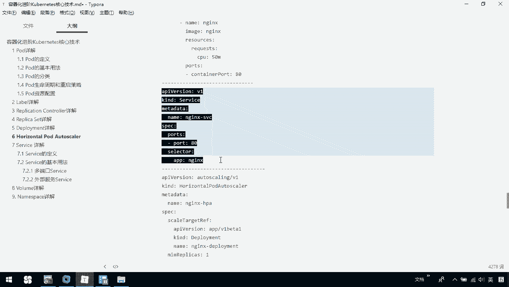
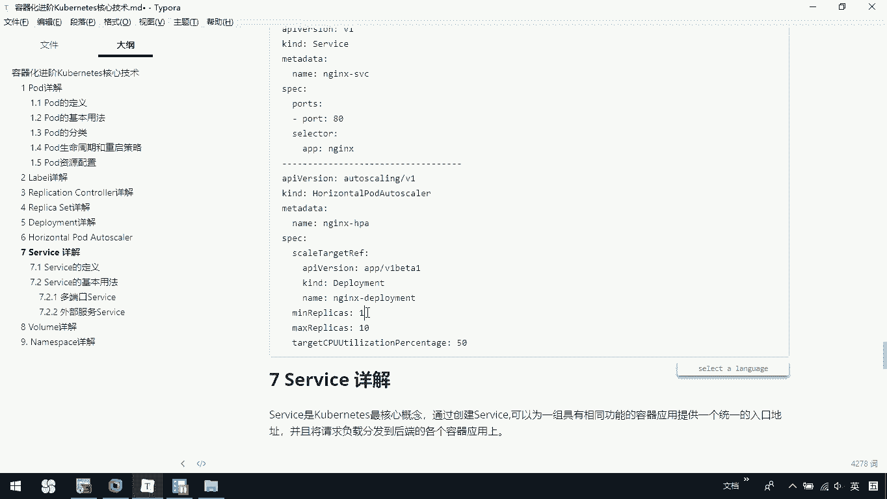
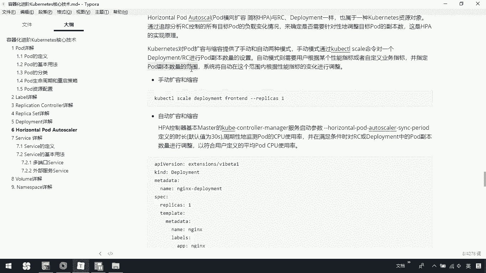
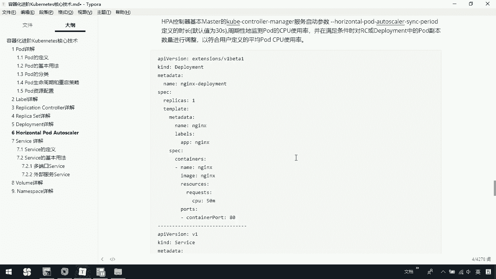
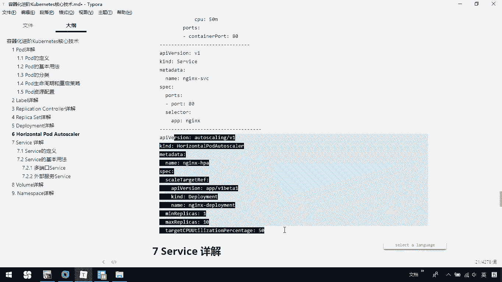
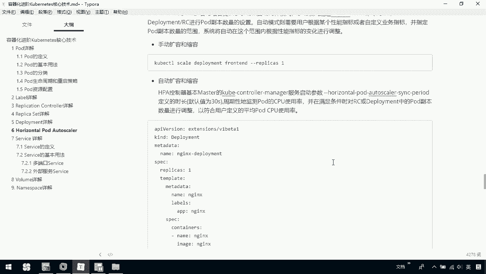
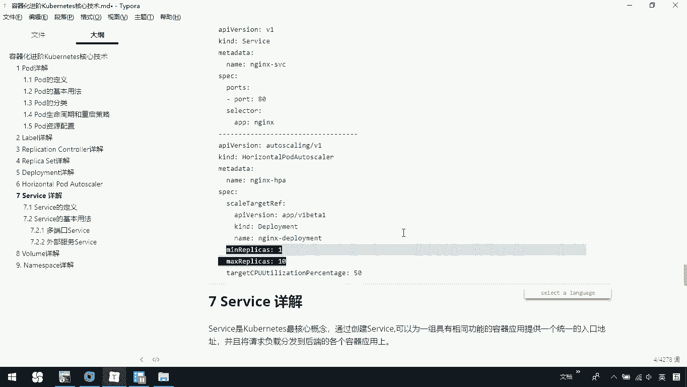

# 华为云PaaS微服务治理技术 - P72：25.kubernetes核心技术-HorizontalPod Autoscaler - 开源之家 - BV1wm4y1M7m5

接下来我们介绍一下这al po autoscale。那么它呢其实简称叫做HPA全称是po的一个横向的扩容。那我们这HPA呢与RC或dloyment啊是一样的那也属于我们的这个co一种资源对象。

那它的是通过分析我们RC控制的所有的目标po的一个负载变化情况，来确定是否呢需要针对性的调整我们目标po的副本数。那这是HPA的一个实现原理。那呢对po的扩容与缩容提供了这种手动和自动两种方式。

那手动的方式呢，前期我们其实已经介绍过了，是通过coer controllert然后呢dlo这种方式。那这是一个手动的那手动模式通过er命令对个lo或RC进行的副本数量的一个设置。

那自动模式呢则需要用户啊根据某个性能指标或者自定义的业务指标，并指定po这个副本的数量的范围系统呢将自动在这个范围根据性能指标的变化进行调整。下面呢是一个自动扩容的一个小的例代码。大家可以看一下。

那这里边说HPA控制器呢是基于master的coer controller manager服务启动参数这项去定义的它默认值为30秒。那它周期性的检测我们的PU的使用率。那在满足条件时对RC或者是lo这。

副本po的副本呢进行一个数量调整，以符合用户定义的一个平均po的CPU使用率。那大家可以看一下，这里我们定义了一个deployment。

我们定义说我们当前这个dlo的名字叫做 deploymentloment。然后呢我们下面呢说期待的一个repl是一，这这下面其实就是我们的po定义，我们当前这里边po它其实是一个end。

那再往下呢这是service没什么好说的。然后再往下这就是定义我们的一个HPA它这里边其实关联了我们当前的这个类型是dloyment，然后呢，name就是我刚才定义的 deploymentlo。

那在这里边我们最小的一个期待数字是数值是一，然后最大的事实，也就说这这个一和十就是刚才在这里面说的，我们是不是定义了我们当前。

预定的一个我们po的副本的数量的范围，这不是指定我们po的副本数量的范围吗？我们现在呢定义的就是一和1。那我们这里边有1个CPU的一个初始的一个使用率或百分比是50。

那如果你当前超过了我们指定的这么一个呃使用率，它就会在我们当前指定的范围内去调整我们当前的这个po的副本的数量。那这是给大家。

写了一个关于我们当前的这个CPU的呃一个调整。也就是说根据我们CPU的使用率进行自动的扩容和缩容。其实我们也可以是基于内存去调整。那大家呢后续可以自己找一找怎么去基于内存去调整。

那这里呢我们可以看一下这个代码。那主要呢是关于我这个HPA这部分，这部分呢就是定义了。我们范围是1到10，那我们初始的时候，这个呃目标，或者说初始的我们这个CPU的一个使用是50。

当超过了我们这个值我们就会可以在指定的范围内去调整我们po的副本的一个数量。

