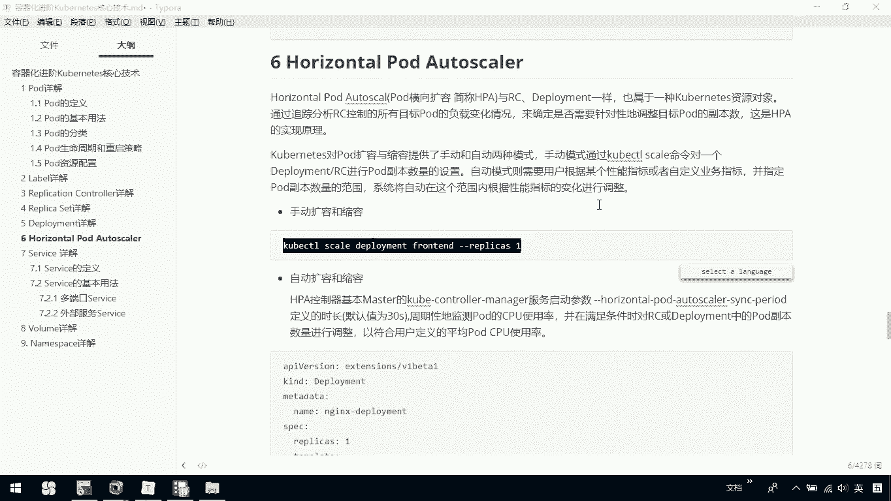
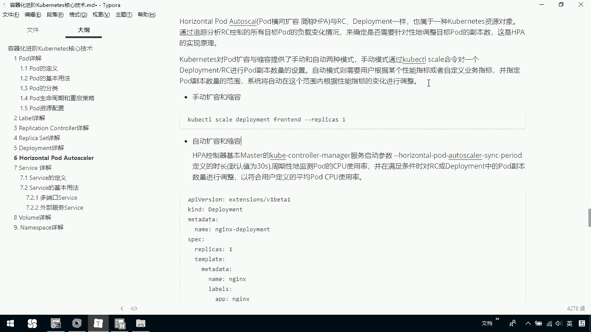
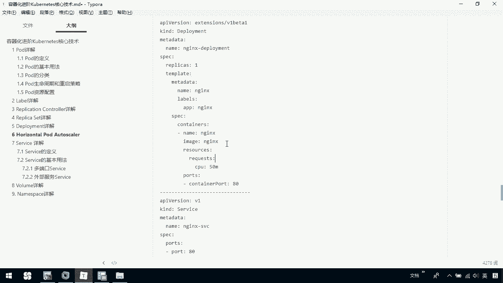
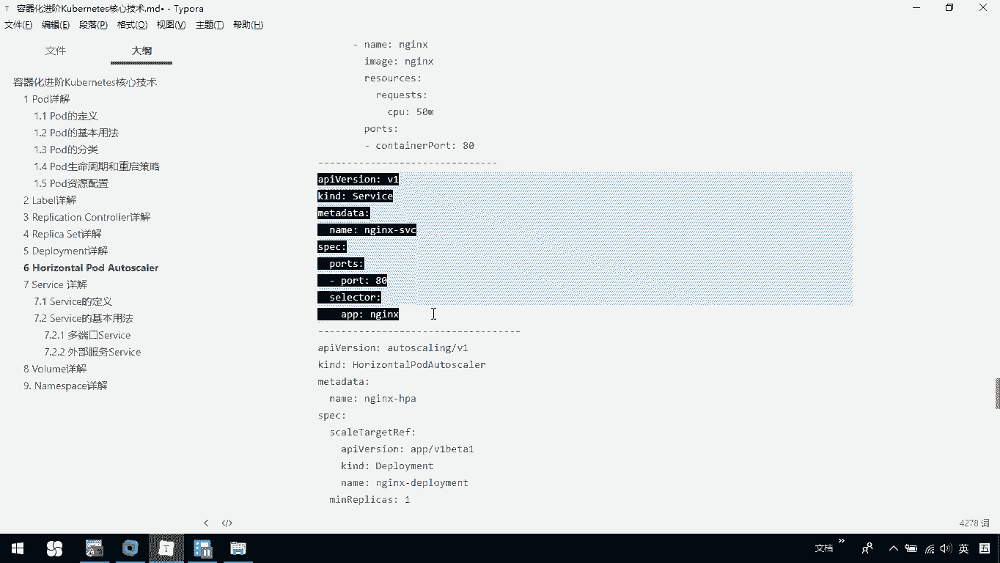
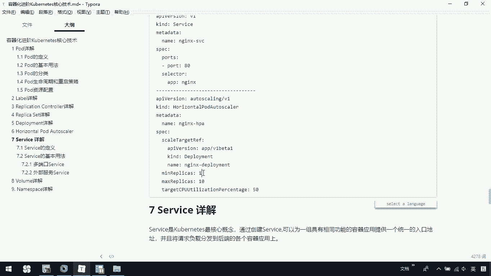
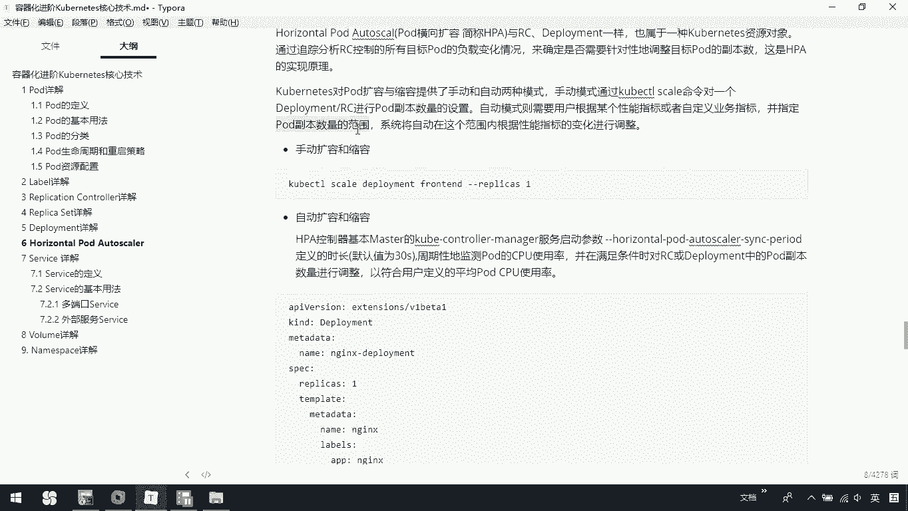
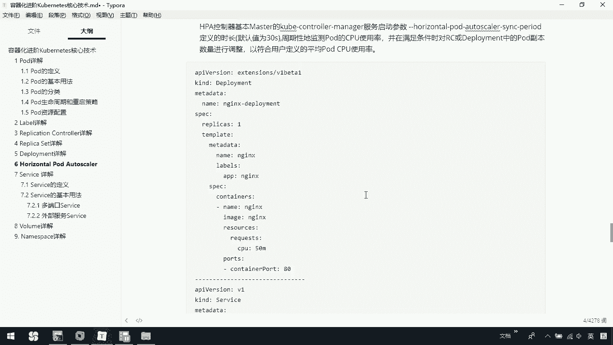
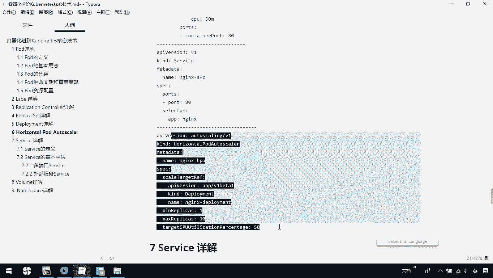
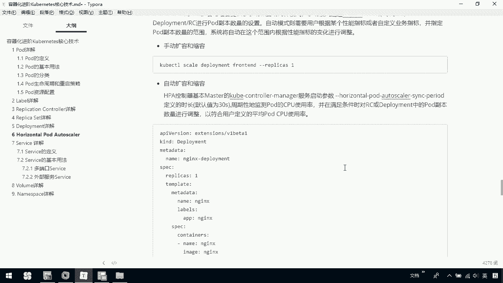
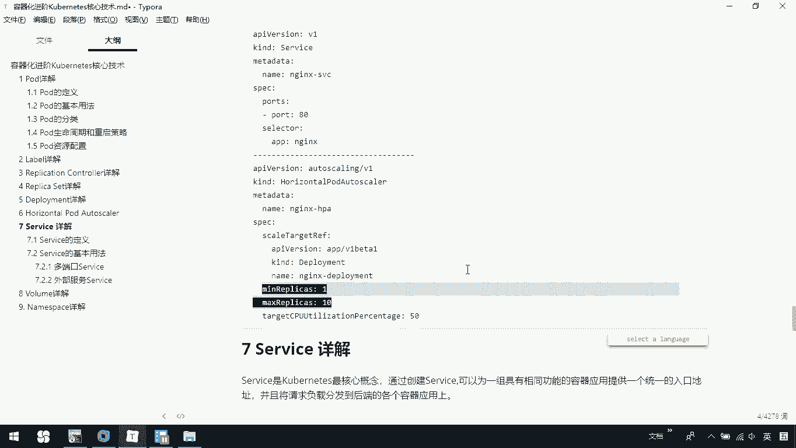

# 华为云PaaS微服务治理技术：P72：25. Kubernetes核心技术-HorizontalPodAutoscaler 🚀

在本节课中，我们将要学习Kubernetes的核心资源对象之一：HorizontalPodAutoscaler（HPA）。我们将了解它的工作原理、手动与自动扩缩容方式的区别，并通过一个具体的YAML示例来理解如何基于CPU使用率实现Pod的自动扩缩容。

## 概述

HorizontalPodAutoscaler，简称HPA，全称为Pod横向自动扩缩容。HPA与ReplicationController（RC）或Deployment一样，都属于Kubernetes的一种资源对象。

它的实现原理是通过分析由RC或Deployment控制的所有目标Pod的负载变化情况，来确定是否需要针对性地调整目标Pod的副本数量。

## 扩缩容的两种方式

HPA对Pod的扩容与缩容提供了手动和自动两种方式。

上一节我们介绍了HPA的基本概念，本节中我们来看看这两种方式的具体区别。

### 手动扩缩容



手动方式前期已经介绍过，是通过`kubectl scale`命令对Deployment或RC进行副本数量的设置。



以下是一个手动调整副本数的命令示例：
```bash
kubectl scale deployment deployment-name --replicas=3
```

### 自动扩缩容

自动模式则需要用户根据某个性能指标（如CPU使用率）或自定义的业务指标，并指定Pod副本数量的范围，系统将自动在此范围内根据性能指标的变化进行调整。

## HPA的工作原理

HPA控制器基于Master节点的`kube-controller-manager`服务启动参数`--horizontal-pod-autoscaler-sync-period`定义周期运行，默认值为30秒。

它会周期性地检测目标Pod的资源使用率（如CPU）。当满足预设条件时，便会对关联的RC或Deployment的Pod副本数量进行调整，以使用户定义的平均Pod资源使用率维持在目标值。

## 实践示例：基于CPU使用率的自动扩缩容





以下是实现自动扩缩容的一个YAML定义示例。我们将创建一个Deployment、一个Service和一个关联的HPA资源。



首先，我们定义一个名为`php-apache`的Deployment，它初始期望的副本数为1，并运行一个Apache服务器。

```yaml
apiVersion: apps/v1
kind: Deployment
metadata:
  name: php-apache
spec:
  selector:
    matchLabels:
      run: php-apache
  replicas: 1
  template:
    metadata:
      labels:
        run: php-apache
    spec:
      containers:
      - name: php-apache
        image: registry.cn-hangzhou.aliyuncs.com/lfy_k8s_images/php-hpa:latest
        ports:
        - containerPort: 80
        resources:
          limits:
            cpu: 500m
          requests:
            cpu: 200m
```

接着，定义一个Service来暴露这个Deployment。

```yaml
apiVersion: v1
kind: Service
metadata:
  name: php-apache
  labels:
    run: php-apache
spec:
  ports:
  - port: 80
  selector:
    run: php-apache
```





最后，定义核心的HorizontalPodAutoscaler资源。它将关联到上面创建的`php-apache` Deployment。

```yaml
apiVersion: autoscaling/v2beta2
kind: HorizontalPodAutoscaler
metadata:
  name: php-apache
spec:
  scaleTargetRef:
    apiVersion: apps/v1
    kind: Deployment
    name: php-apache
  minReplicas: 1
  maxReplicas: 10
  metrics:
  - type: Resource
    resource:
      name: cpu
      target:
        type: Utilization
        averageUtilization: 50
```

在这个HPA定义中，我们指定了以下关键信息：
*   **`scaleTargetRef`**：指定了要扩缩容的目标对象，这里是名为`php-apache`的Deployment。
*   **`minReplicas`** 与 **`maxReplicas`**：定义了Pod副本数量的可调整范围，即1到10个。这就是之前提到的“指定Pod副本数量的范围”。
*   **`metrics`**：定义了扩缩容所依据的指标。这里我们使用了`Resource`类型，监控CPU资源。`target.averageUtilization: 50`表示HPA的目标是将所有Pod的平均CPU使用率维持在50%。

当所有Pod的平均CPU使用率持续超过50%时，HPA控制器就会增加Pod的副本数，但总数不会超过10个。反之，如果平均使用率远低于50%，则会减少副本数，但不会少于1个。这样就实现了基于CPU使用率的自动扩缩容。

除了基于CPU，HPA也支持基于内存使用率或其他自定义指标进行扩缩容，大家可以在后续学习中自行探索。



## 总结



本节课中我们一起学习了Kubernetes的HorizontalPodAutoscaler（HPA）。我们了解了HPA是一种用于实现Pod横向自动扩缩容的资源对象，它通过监控目标Pod的负载指标（如CPU使用率），并在用户定义的副本数范围内自动调整数量，以应对应用负载的变化。



我们比较了手动扩缩容与自动扩缩容的区别，并通过一个完整的YAML示例，详细讲解了如何创建一个基于CPU使用率进行自动扩缩容的HPA。掌握HPA是构建弹性、高可用Kubernetes应用的重要一步。