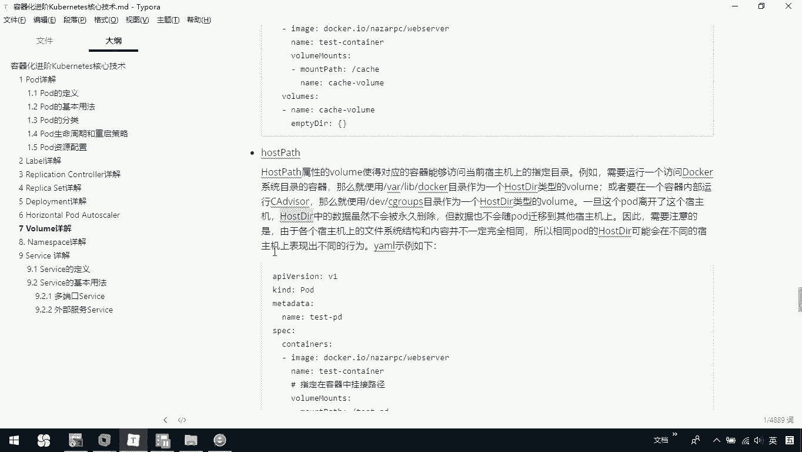
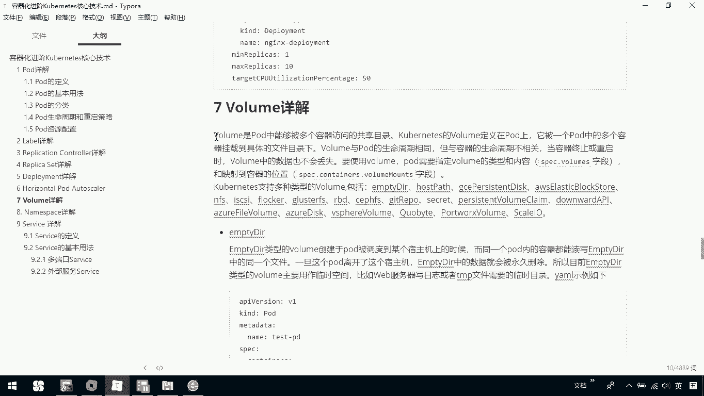

# 华为云PaaS微服务治理技术 - P73：26.kubernetes核心技术-volume - 开源之家 - BV1wm4y1M7m5

接下来呢我们介绍一下volume，那volume呢是po中能够被多个容器访问的一个共享目录。chnet中的volume呢定义在pod上，它被一个pod中的多个容器挂载到具体的一个文件目录下。

那vole梦与破度的生命周期是相同的。但与容器的生命周期不相关，当容器终止或重启时呢，volume中的数据也不会丢失。要使用volume po需要指定volume的类型和内容。

IPC点volume呢是用来定义它的这个类型和内容的那我们可以通过IP点container点volume mouse字段来映射到我们容器的一个位置。

那空meline中支持多种类型的volume，包括了MCDRhouse pass等等。那接下来呢我们就介绍两三种。大家看一下。首先第一个呢叫MCDR。

MTMDR类型的volume呢创建于po被调度到某个数主机上的时候，而同一个po内的容器啊都能读写MTDR中的同一个文件。一旦这个po离开这个数主机，MDR中的数据呢就会被永久的删除。

那么基于这样的特性呢，我们一般用这个MCDR时啊，是用于这种服务器的日志啊，或者是临时文件的这么一个读写。那大家看一下下面是一个简单的MTDR类型的volume的一个定义。首先呢我们定义了一个po。

那我们这里边呢通过一个volumes定义了一个volume。我们给它一个名字叫catch volumee。那它为什么叫MDR呢，其实很明显它就是一个最开始是空的。

那我们这里边呢指定一下我们容器里面的镜像，然后呢我们指定一个volume mouse，我们是把我们当前容器中的这个镜像的里边的路径挂载到我就载到这个我们当前的目录下，也就说我们把容器里边呢。

我们当前的这个镜像的c目录载进来了。那通过内呢指定我们当前是这个volume catch volumee。那这是一个简单的一个MCDR的实例。那么大家再往下看。

这是一个叫做hot pass那ho pass，它的这个这种类型的volume呢使得对应的容器能够访问当前数主机上的一个指定目录。例如我们需要运行一个访问的docker系统目录的容器。

那么我们就使用VR lab下的docker目录，作为housestR类的vole，或者呢要在一个容器内部运行我们ad，那么就使用DIVDVgroup目录作为一个。

vole一旦这个po离开这个数据机。houseDR中的数据啊虽然不会被永久删除。但数据也不会随po迁移到我们其他的数主机上。因此呢。需要注意的是，由于各个数据主机上的文件系统的结构和内容呢并不一样。

所以相同的po的houset dR可能在不同的数主机上啊表现的是不同的行为。下面呢是一个简单的hos pass的定义。那我们可以看一下，这里边我们也是一样，通过volumes指定一下我们当前的一个名字。

那我们数主机上的目录呢是这样的一个目录。然后呢，我们是在我们container下去通过一个volume mouse去定义，我们指定在容器中挂载的一个路径。

其实这个时候就是把我们数主机上的这个目录和我们容器里边的这个目录去关联上了。

那这是一个关于我们house pass类型的那再往下看一个叫做NFS。那NFS类型的volume嘛，它是允许一块现有的网络硬盘的。在同一个pod内的呃同一个pod内的这个容器间共享。

那下面呢是一个简单的例子。那这里边我们是一个development，我们可以通过。这么的一个定义volumes去定义我们当前自己的volume。那我们指定了我当前的这个服务器上的这个路径。然后呢。

我们给它起了一个名字。那它映射到的是我们容器里边，我们当前这个容器啊，它是一个readdies的imreadies嘛。然后呢，我们是映射到我们当前readdis date目录下。

也就是说我们现在是把我们当前这个readdis的这个date目录映射到我们当前这个数主机。

那这是跟大家简单说了一下，关于我们K8S里边的volume。

