# 华为云PaaS微服务治理技术：P73：26. Kubernetes核心技术-Volume 📦

在本节课中，我们将要学习Kubernetes中的Volume（卷）概念。Volume是Pod中能够被多个容器访问的共享目录，用于解决容器内数据持久化与共享的问题。

---

## 什么是Volume？

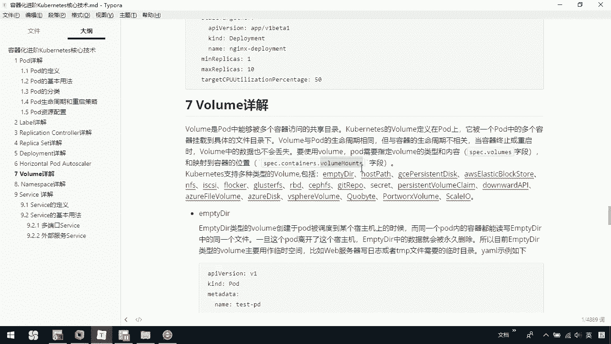

Volume是定义在Pod上的共享目录，可以被同一个Pod中的多个容器挂载到具体的文件目录下。Volume的生命周期与Pod相同，但与容器的生命周期无关。这意味着当容器终止或重启时，Volume中的数据不会丢失。

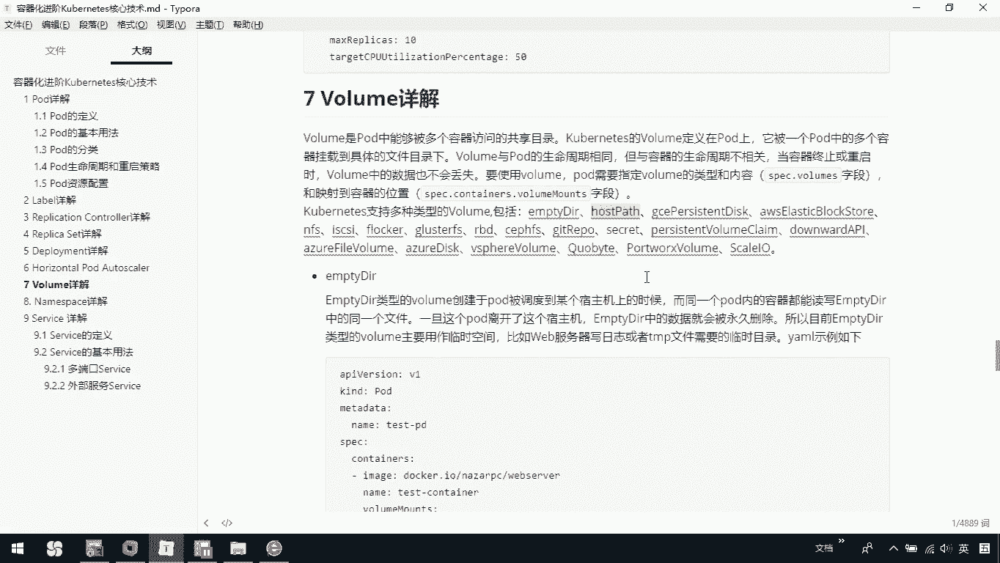

要使用Volume，Pod需要指定Volume的类型和内容。在Pod的配置中，通过`spec.volumes`字段定义Volume的类型和来源，并通过`spec.containers.volumeMounts`字段将Volume映射到容器内的具体位置。

---

## Volume的类型

Kubernetes支持多种类型的Volume，包括`emptyDir`、`hostPath`、`nfs`等。接下来，我们将介绍其中三种常见的类型。

### EmptyDir

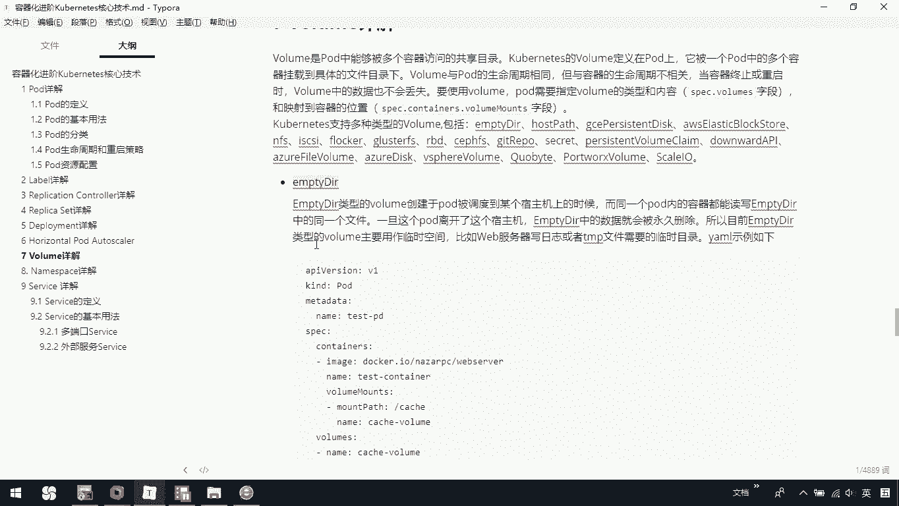

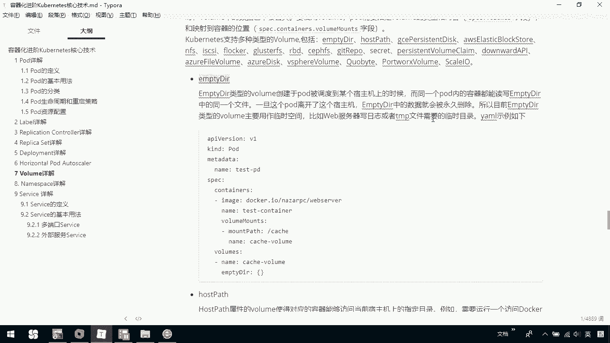

`emptyDir`类型的Volume在Pod被调度到某个节点（Node）时创建。同一个Pod内的所有容器都能读写`emptyDir`中的同一个文件。一旦Pod离开该节点，`emptyDir`中的数据就会被永久删除。

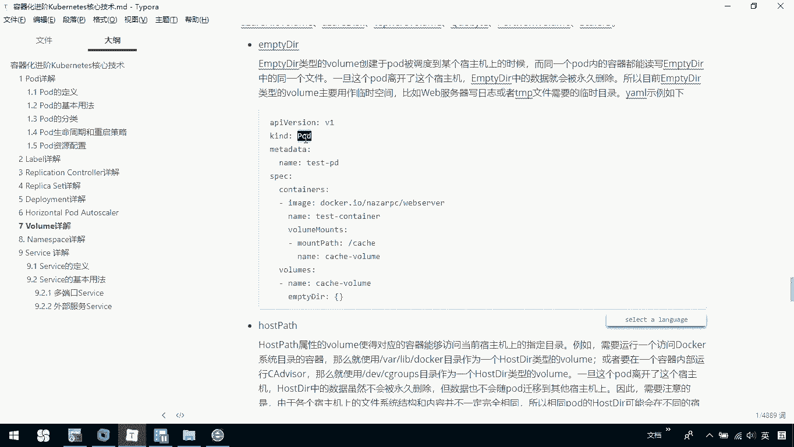

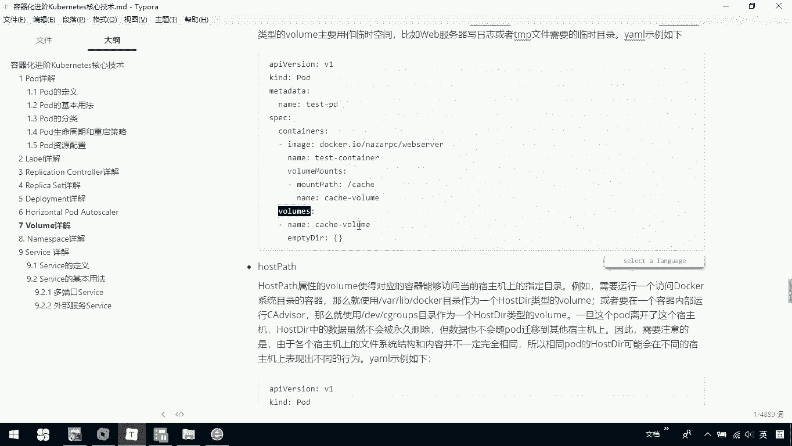

基于此特性，`emptyDir`通常用于临时文件的读写，例如服务器日志或缓存数据。

以下是一个简单的`emptyDir`类型Volume的定义示例：

```yaml
apiVersion: v1
kind: Pod
metadata:
  name: test-pod
spec:
  containers:
  - name: test-container
    image: busybox
    volumeMounts:
    - name: cache-volume
      mountPath: /cache
  volumes:
  - name: cache-volume
    emptyDir: {}
```

在这个例子中，我们定义了一个名为`cache-volume`的`emptyDir`类型Volume，并将其挂载到容器的`/cache`目录下。

---

### HostPath

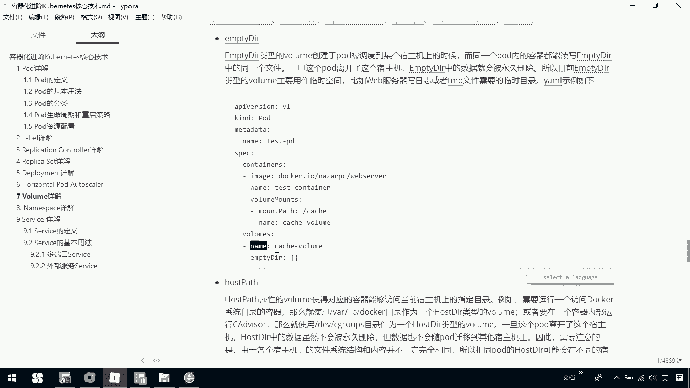

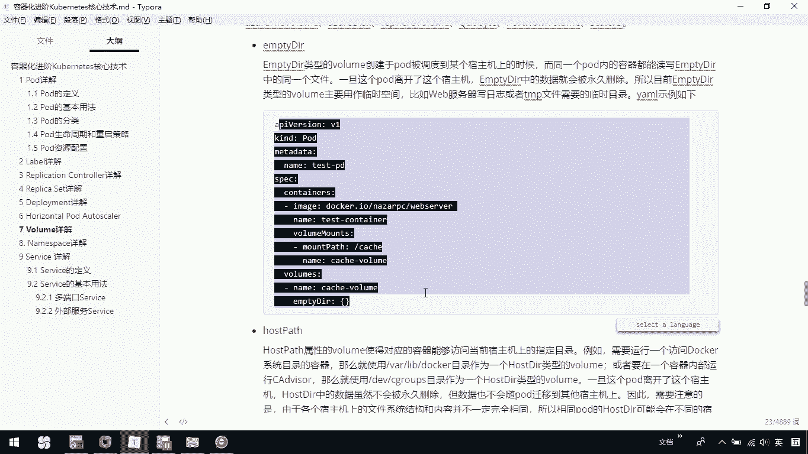

`hostPath`类型的Volume使得容器能够访问当前节点主机上的指定目录。例如，如果需要运行一个访问Docker系统目录的容器，可以使用`/var/lib/docker`目录作为`hostPath`类型的Volume。

需要注意的是，一旦Pod离开该节点，`hostPath`中的数据虽然不会被永久删除，但数据也不会随Pod迁移到其他节点上。此外，由于各个节点上的文件系统结构和内容可能不同，相同的Pod在不同节点上的`hostPath`可能表现出不同的行为。

以下是一个简单的`hostPath`类型Volume的定义示例：

```yaml
apiVersion: v1
kind: Pod
metadata:
  name: test-pod
spec:
  containers:
  - name: test-container
    image: busybox
    volumeMounts:
    - name: hostpath-volume
      mountPath: /host-data
  volumes:
  - name: hostpath-volume
    hostPath:
      path: /data
      type: Directory
```

在这个例子中，我们将节点主机上的`/data`目录挂载到容器内的`/host-data`目录。

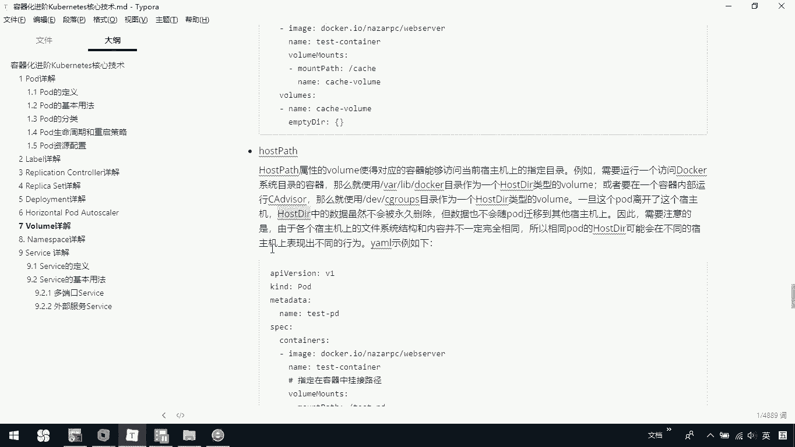

---

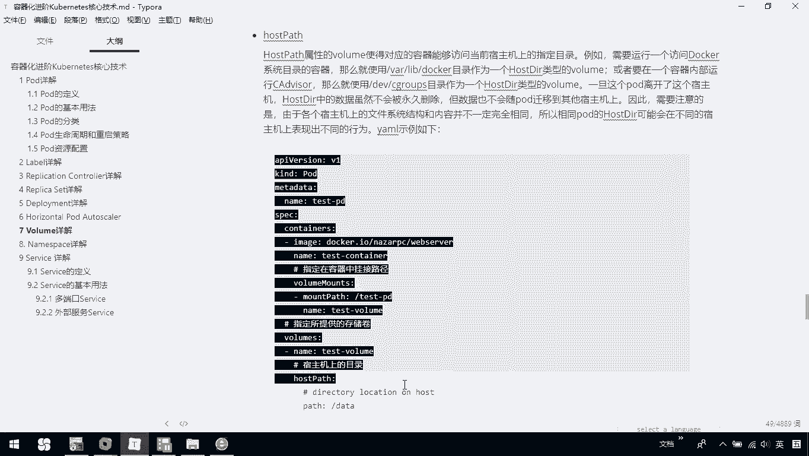

### NFS

`nfs`类型的Volume允许将一块现有的网络硬盘（NFS）在同一个Pod内的容器间共享。这种类型的Volume适用于需要跨节点持久化存储数据的场景。

以下是一个简单的`nfs`类型Volume的定义示例：

```yaml
apiVersion: v1
kind: Pod
metadata:
  name: test-pod
spec:
  containers:
  - name: redis-container
    image: redis
    volumeMounts:
    - name: nfs-volume
      mountPath: /redis-data
  volumes:
  - name: nfs-volume
    nfs:
      server: nfs-server.example.com
      path: /exports/data
```

在这个例子中，我们将NFS服务器`nfs-server.example.com`上的`/exports/data`目录挂载到Redis容器的`/redis-data`目录。

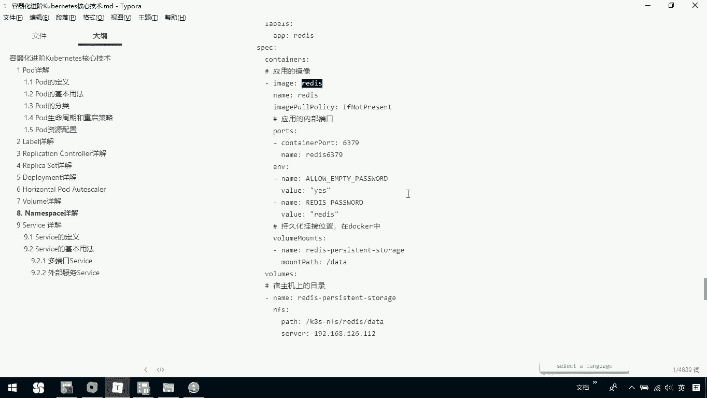

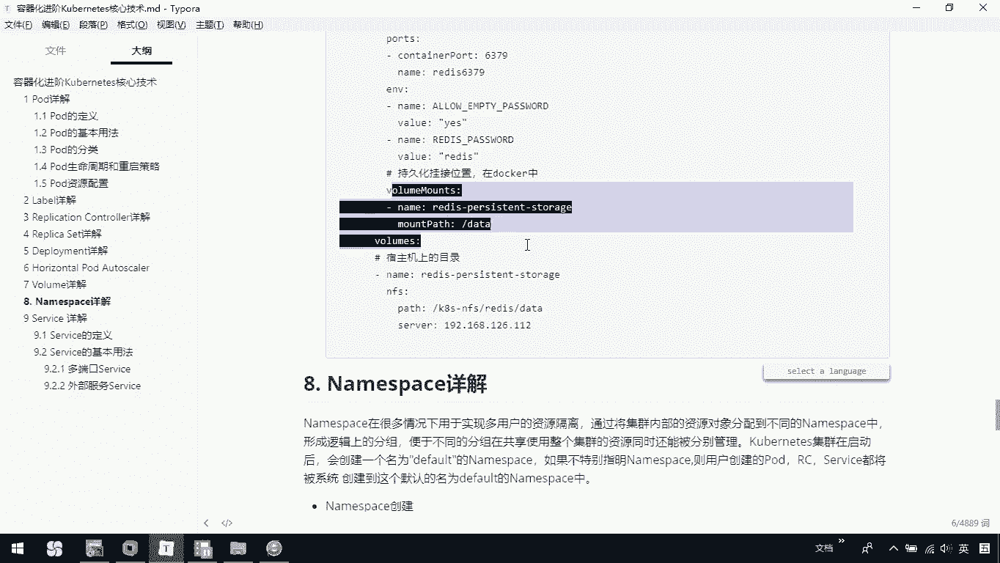

---

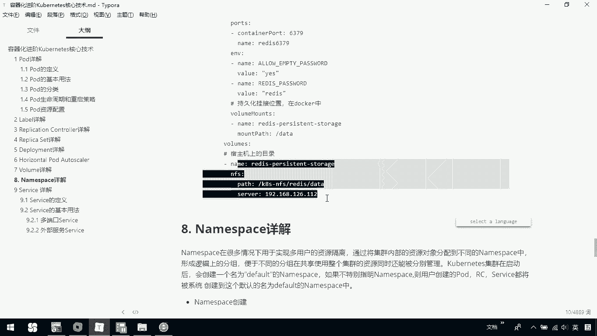

## 总结

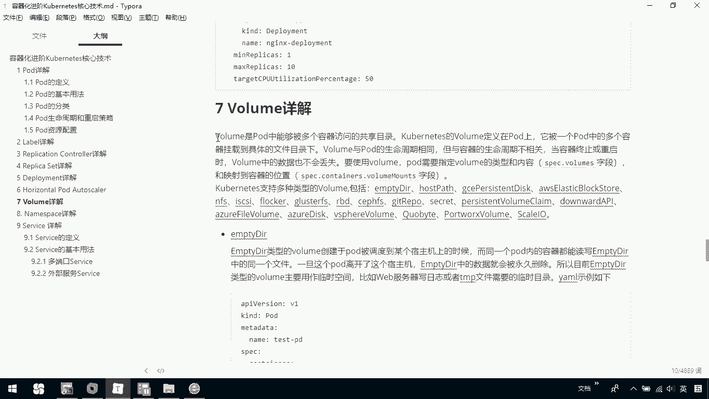

本节课中，我们一起学习了Kubernetes中的Volume核心技术。我们了解了Volume的基本概念，它是Pod中用于数据共享和持久化的共享目录。我们介绍了三种常见的Volume类型：`emptyDir`用于临时存储，`hostPath`用于访问节点主机文件系统，`nfs`用于网络存储。通过合理使用不同类型的Volume，可以满足容器化应用在数据存储和共享方面的多样化需求。