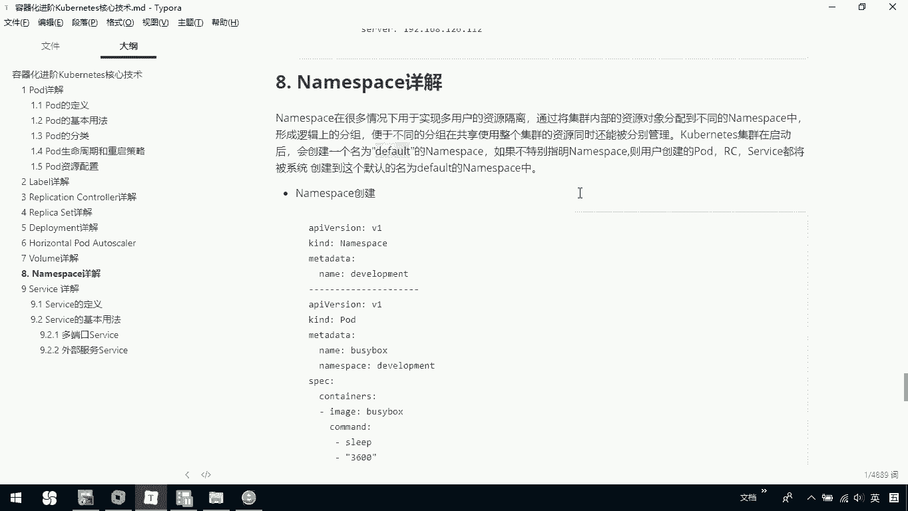

# 华为云PaaS微服务治理技术 - P74：27.kubernetes核心技术-namespace - 开源之家 - BV1wm4y1M7m5

那下面呢我们再介绍一下namespace。那name namespace在很多情况下呢是用于实现多用户的一个资源隔离。

那么我们通过将集群内部的资源对象分配到不同的namespace中啊形成这种逻辑上的一个分组，注意啊，它是一个逻辑上的那么便于不同的分组在共享使用整个集群的资源，同时呢还能被分别管理。

那me集群在启动时会创建一个叫做deund的一个namespace。如果你不指定namespace则用户创建的RC service都将被系统创建到这个默认的de namespace下我们可以看一下L点get。

那我们这里边呢创建了一些po，那我们可以 cLSCB我们可以看一个，假设叫当前这里边有个叫my。

那大家看一下，我们当前这里边它的namespace就是一个de。那这是因为我在前期创建他们时，我根本就没有指定我当前namespace。那它就呢使用了一个默认的namespace。

那么我们也可以去手动创建一个namespace。那大家看一下，这是一个我们创建namespace过程，那这是一个po，我给我这个po呢去指定了当前的namespace是development。

然后呢我们就可以去在查看它的过程中，通过杠杠namespace加上我们一个develop去查看我们当前这个命名空间下的po。那我们可以看一下啊，这里边呢我已经把文件创建出来，我们ca一下有个demo6。

杠我们的name space，这是我们创建了一个name space，这个名字呢就叫做我们的develop。然后呢，大家再看一个demon6杠，我们当前有一个po。

这是我通过创建一个po来指定它的名称空间叫development。那我们可以通过coer cTLge pose。这个时候你在创建它的时候啊。

你是找不到我们develop development下的这些po，而你看到的其实是默认的那如果说我们要看这个develop下面你就可以正版name space等于develop。

这个时候你是能看到我当前。

development这个名称空间下的po。那好，这是说我们namespace怎么去创建，以及怎么查看。那一定要知道，我们通过namespace啊，其实是做了一个什么逻辑上的分组。

那它的作用呢就是为用于我们这个呃对资源的一个分别的管理，或者说一个方便的管理。那么如果我们不去在创建这些呃RC啊po时，你没有去指定它的名称空间，它是一个默认的那你要去想指定呢。

也可以在我们在创建它时可以通过namespace，然后呢去指定你当前的一个namespace。

