# 华为云PaaS微服务治理技术：P74：27. Kubernetes核心技术-Namespace 🏷️

在本节课中，我们将要学习Kubernetes中的一个重要概念——**Namespace（命名空间）**。Namespace主要用于实现多租户环境下的资源隔离，通过将集群内的资源对象分配到不同的命名空间中，形成逻辑上的分组，便于管理和共享集群资源。

---

## 什么是Namespace？

Namespace在很多情况下用于实现多用户的资源隔离。通过将集群内部的资源对象分配到不同的Namespace中，形成逻辑上的分组。请注意，这是一个**逻辑上的**分组，便于不同的分组在共享使用整个集群资源的同时，还能被分别管理。

Kubernetes集群在启动时会创建一个叫做 `default` 的Namespace。如果你不指定Namespace，那么用户创建的Pod、Service等资源都将被系统创建到这个默认的 `default` Namespace下。

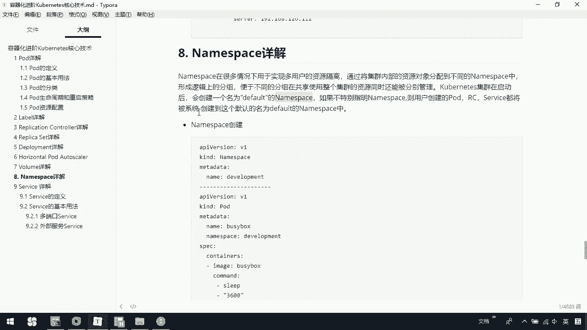

---

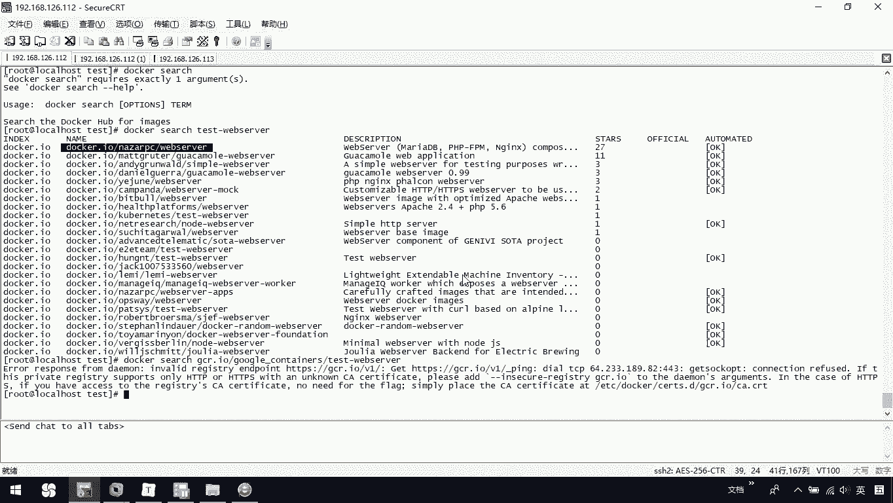

## 查看默认Namespace

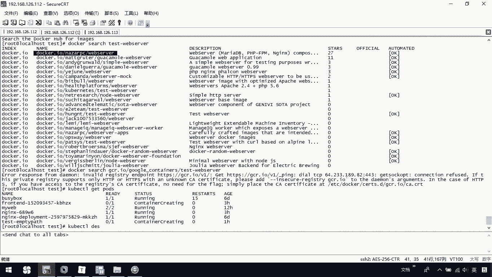

我们可以使用 `kubectl get` 命令来查看资源。例如，查看当前已有的Pod：

```bash
kubectl get pods
```

假设我们查看一个名为 `my-pod` 的Pod，可以看到它的NAMESPACE列显示为 `default`。这是因为在创建时没有指定Namespace，所以它被分配到了默认的Namespace。

---

## 创建自定义Namespace

我们也可以手动创建自定义的Namespace。以下是一个创建Namespace的示例过程。

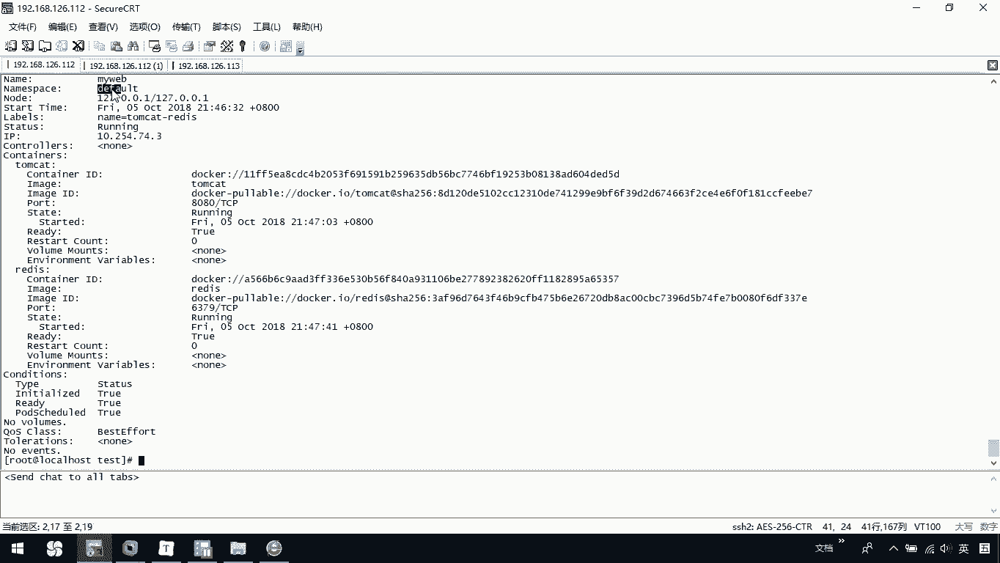

首先，创建一个名为 `development` 的Namespace：

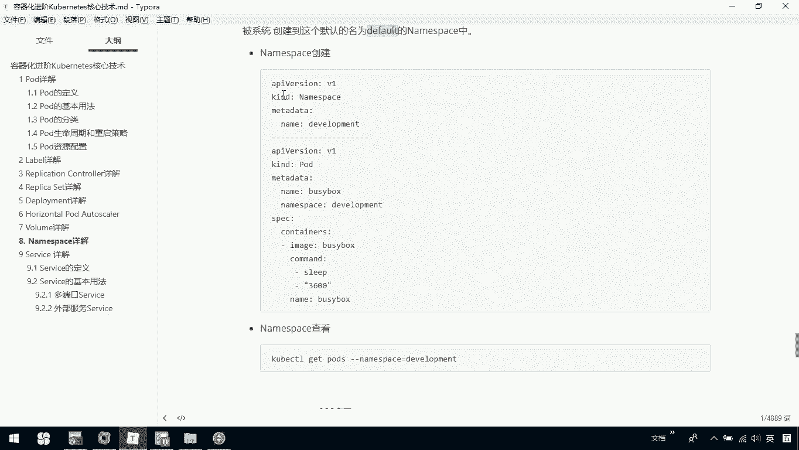

```bash
kubectl create namespace development
```

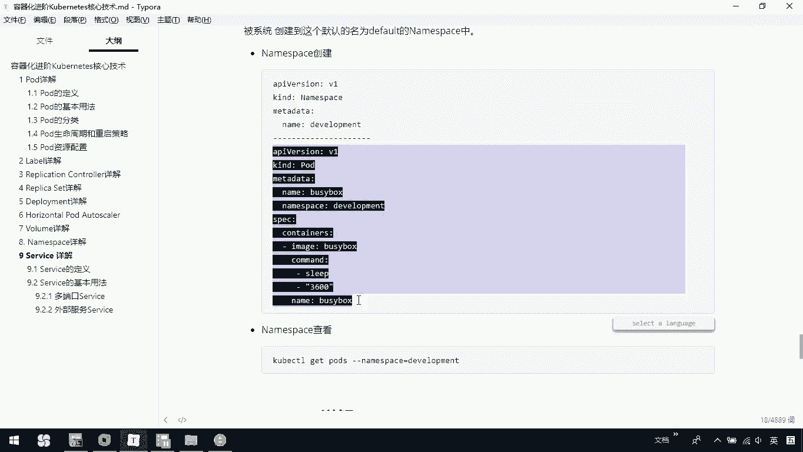

然后，创建一个Pod，并指定其Namespace为 `development`。这通常在Pod的YAML配置文件中通过 `namespace` 字段指定：

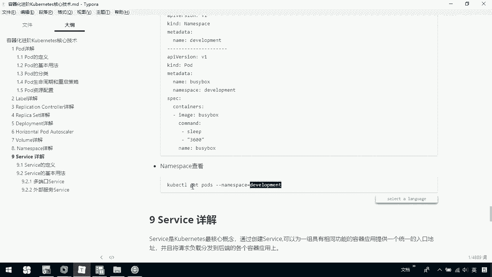

```yaml
apiVersion: v1
kind: Pod
metadata:
  name: my-development-pod
  namespace: development
spec:
  containers:
  - name: nginx
    image: nginx
```

使用以下命令应用这个配置：

```bash
kubectl apply -f pod-development.yaml
```

---

## 查看特定Namespace下的资源

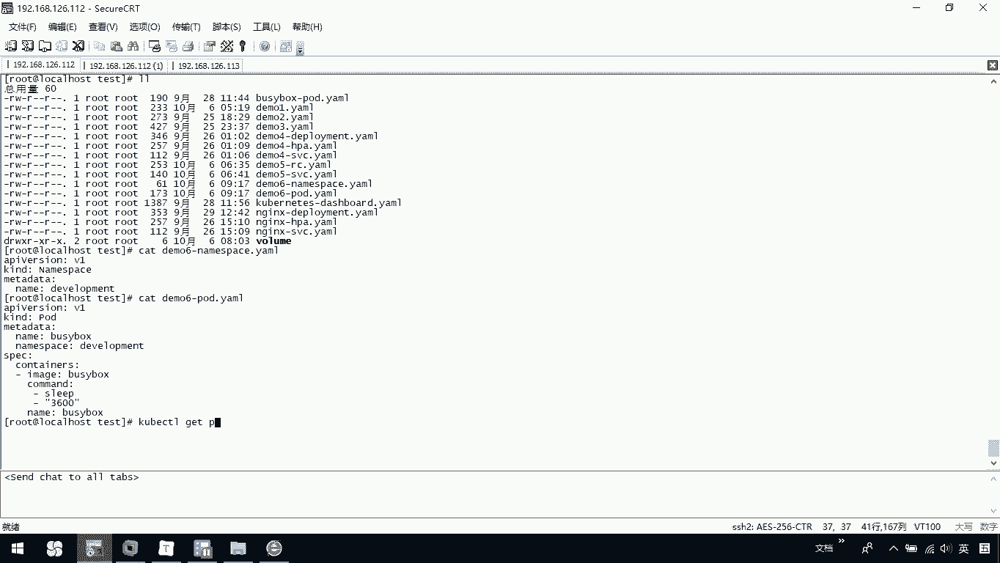

在查看资源时，如果不指定Namespace，`kubectl` 命令默认会显示 `default` 命名空间下的资源。例如，直接运行 `kubectl get pods` 将看不到 `development` 命名空间下的Pod。

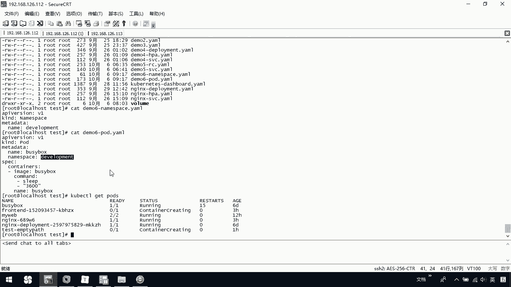

要查看特定Namespace下的资源，需要使用 `--namespace` 或 `-n` 参数：

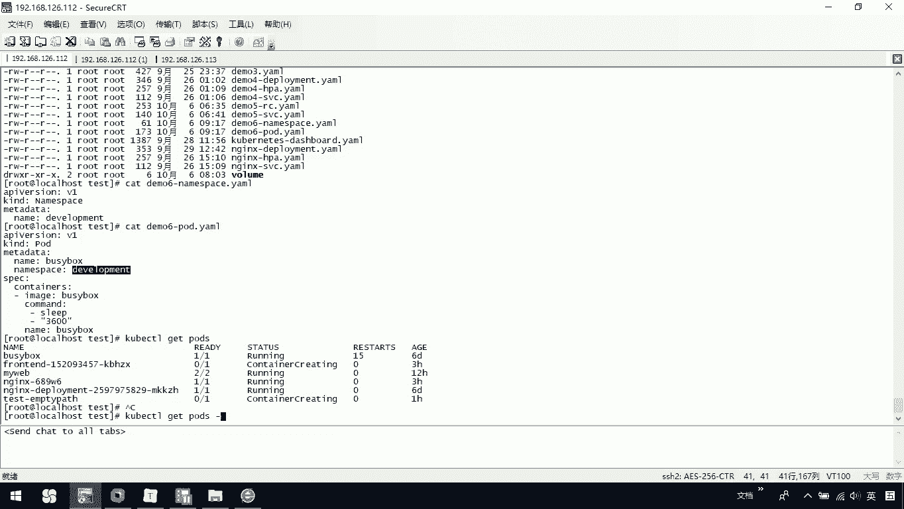

```bash
kubectl get pods --namespace=development
# 或者使用缩写
kubectl get pods -n development
```

通过这个命令，你就可以看到 `development` 这个命名空间下的所有Pod了。

---

## Namespace的作用与管理

Namespace的主要作用是为资源提供**逻辑上的分组**，方便对不同项目、团队或环境的资源进行分别管理。

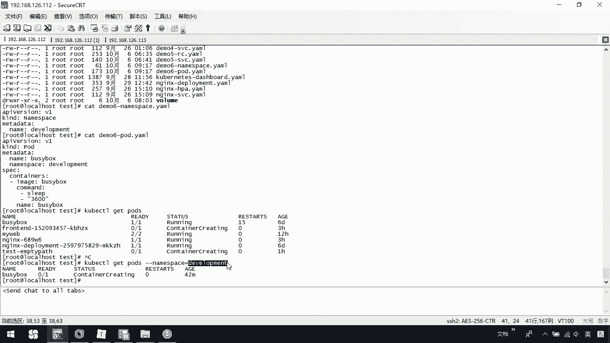

以下是使用Namespace时需要注意的几点：
*   如果在创建资源（如Pod、RC、Service）时没有指定Namespace，它将被创建到默认的 `default` 命名空间。
*   若要指定Namespace，可以在资源的YAML定义文件的 `metadata` 部分添加 `namespace: <your-namespace-name>` 字段。
*   在通过命令行操作时，可以通过 `-n` 或 `--namespace` 参数来指定目标命名空间。

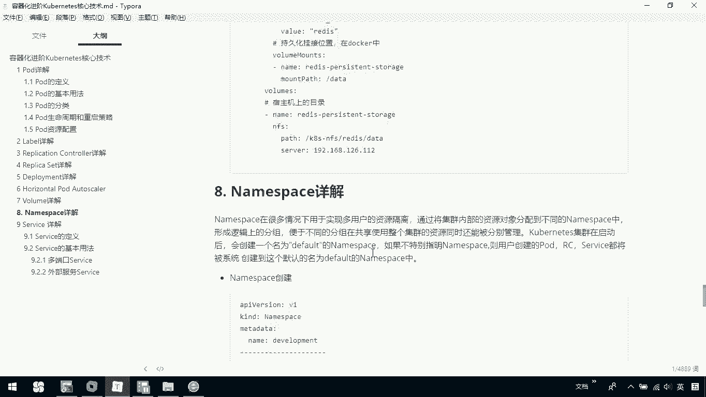

---

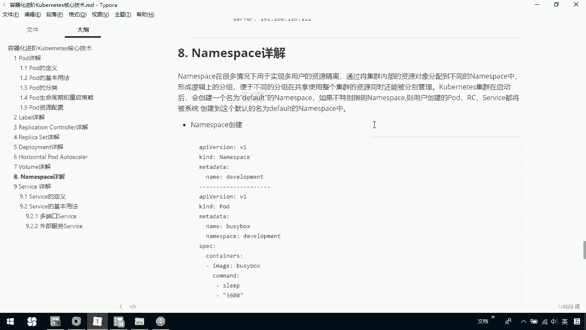

## 总结

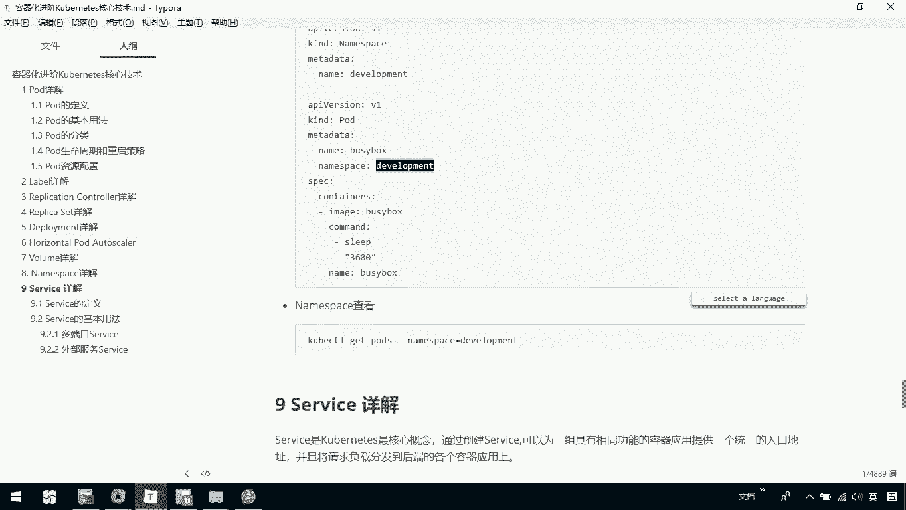

本节课中我们一起学习了Kubernetes的**Namespace**核心概念。我们了解到Namespace是用于逻辑隔离和组织集群资源的机制，系统默认提供 `default` 命名空间。我们学习了如何创建自定义Namespace，如何将资源部署到指定的Namespace中，以及如何查看和管理不同Namespace下的资源。掌握Namespace的使用，是进行多项目或多环境Kubernetes集群管理的基础。