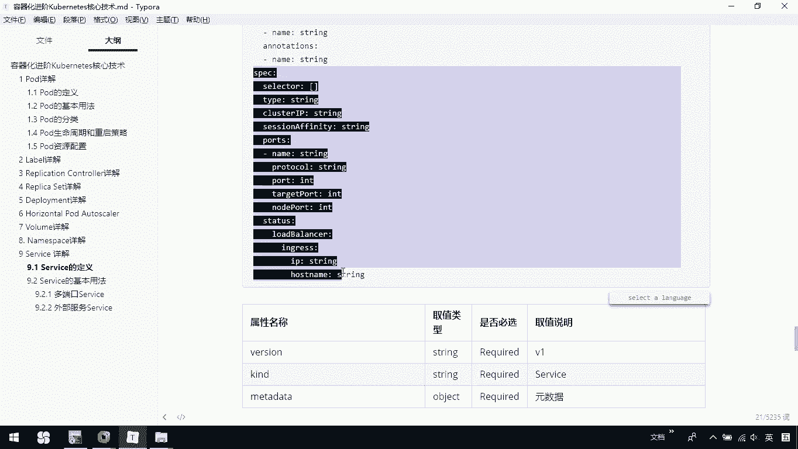

# 华为云PaaS微服务治理技术 - P75：28.kubernetes核心技术-Service(1) - 开源之家 - BV1wm4y1M7m5

下面呢我们介绍最后一个service。那大家看一下啊，service呢是我们cro最核心的一个概念。那么我们是通过serverice啊，可以为我们一组具有相同功能的容器啊。提供一个统一的入口地址。

并且呢将这个请求负载分发到我们后端的各个容器上。下面大家看到的这个呢是一个完整的ym格式的service的定义文件。这里边我们的版本，我们的类型，然后呢我们的原数据它的namespace这个labs。

那这里边都有关于它的定义，下面给大家列了一个表，这个表里边呢说明了一下我们每一个字段呢代表的意义。那这里边我们就不过多细看，大家呢回去可以参考看一下，那么我们说完这些以后啊，我们要来看一下。

对于一个service，我们的基本的用法。那前面我们说过service，我们用它主要目的是什么？是不是它可以为我们这个相同的功能容器提供一个统一的入口，对吧？那怎样去提供一个统一的入口。

我们通过它的一个基本用法呢？让大家去感受一下。首先呢来看一般说啊对外提供服务的应用程序呢，需要通过某些某种机制来。

实现对于容器应用最简单的方式呢，是通过TCPIP的机制以及监听IP和端口号来实现。那创建一个最基本的service。那大家看到的这个代码呢，其实就是我创建一个最基本的service。

那我们这这时候呢它是叫做这不是service。这是我一个RC。那我这时候呢创建了一个RC。它那里面有个po，其实是一个my webP它的镜像是他们看一看。😊。

我们可以看一下我当前的代码，我这里边呢应该有一个叫做cat demo7杠2RC点压母文件。

这个文件呢就跟我讲义上的这个文件啊差不多。那我们创建了这么一个当前的自己的RC。那我们真实的镜像其实是一个tom。那我这个文件呢其实已经创建出来，我们可以ge pose。

大家可以看到我们这里边有一个叫做my web APP的这么一个po。那我们也可以通过coer cL get RRC，我们去看到，我们应该有一个叫做my webAPP的RC。那我创建完它以后呢。

大家往下我们可以通过这样的一个命令啊，来获取我们当前po的IP地址。

也就是说。我们在这里边。把这个代码粘过来，我们可以去。获取我当前的这个po的IP地址。那我可以通过CURL加上我们当前的IP地址去访问我们当前的应用。CURL。CURL我看一下。

我们对外的端口是8080。比如说我们在这里边可以通过8080去访问，我们可以得到我当前的这些页面，对吧？但是呢这种访问呢是我直接访问po，它是不合适的那为什么呢？说我们这个po呢这么说呃。

因为当我们的po的IP地址和端口，通过这种IP地址和端口号来访问时啊，我们这个是我看一下通过它的端口号访问时呢，我们这种访问是不可靠的。因为当我们的po所在的node发生故障时啊。

po将被我们重新调度到另一个node，那这时候你的po的地址就会发生改变。那我们再访问它呢就访问不到了。那我们应该怎么去访问呢？刚才我们强调了说我们可以通过service为我们提供一个统一的入口。

那来访问它，那当你的po这个失效了，调分配到另外的一个node上，我们的service还是存在的。我们还是可以去访问它。

那这个时候呢我们就可以去创建一个service。在这里呢大家可以看一下，我们创建一个service，我们可以通过访问它的8081端口去映射到我们真正的8080端口去访问。那我们来看一下代码。

I我们有一个demo7杠5的SVC的一个文件，这就是我们真正映射到我们自己的那个叫做my webAPP这不是嘛，我们的标签。那我们可以看一下。

现在呢我们可以通过LVC获取到我当天有一个叫my web杠VC就是它它的这个IP地址是10254163。4。也就说我们在这里边CUL点它然后呢我们的端口是8081。刚才我们说了，我们通过8081端口。

也可以访问到我们刚才的po。也就是说我们原来可以去通过的IP直接访问，但是这个IP访问有个问题，问题就在于说我的当前如果失效了。那我们的集群呢重新帮我们把这个调度到另外一个node上，那我这个I。

就失效了。但是呢我可以通过一个service去帮助我们做一个统一的入口。无论你后台的po是否失效，只要你这个service跟这个po对应上，那么我们可以访问我的service。

以达到访问我们后台po的效果。

