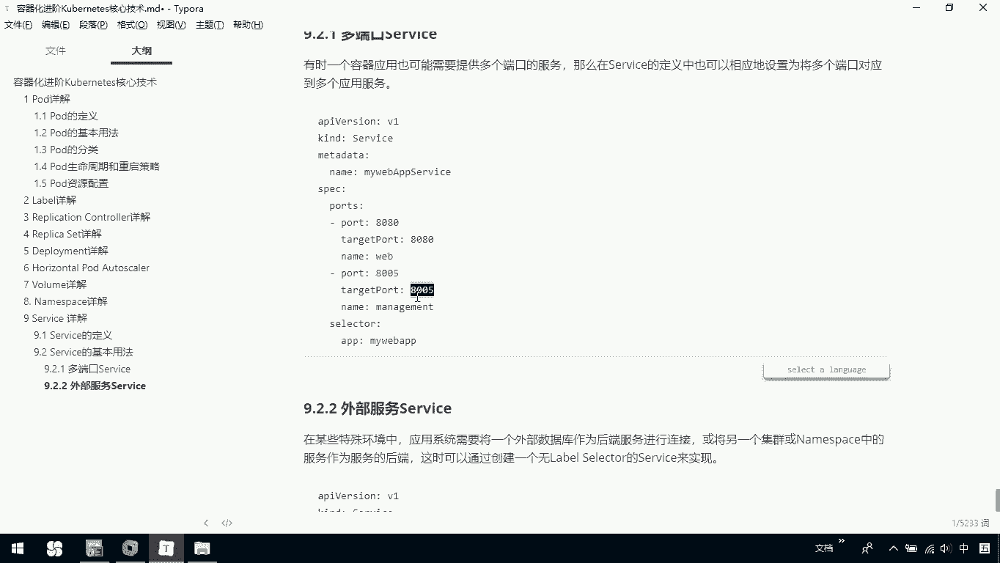
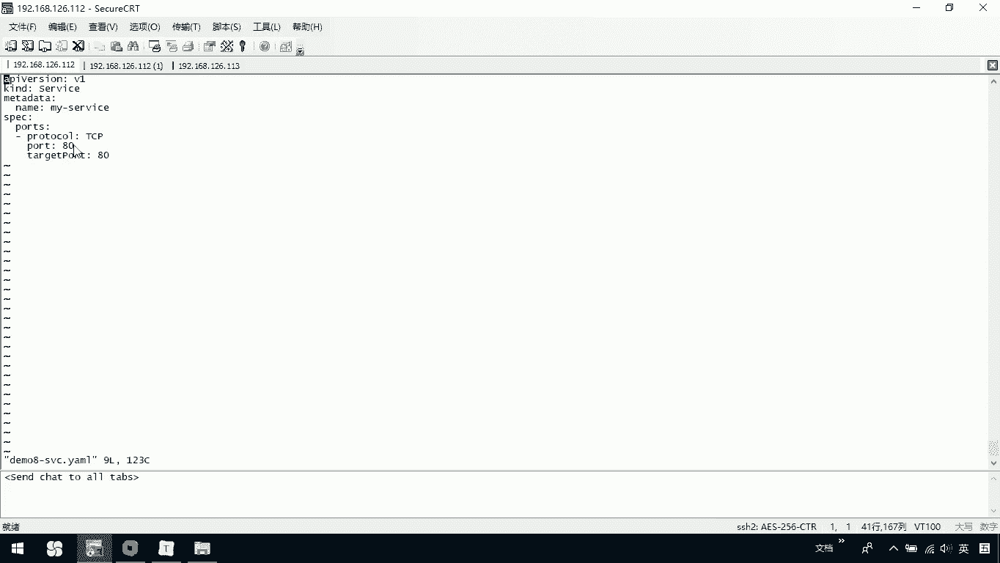
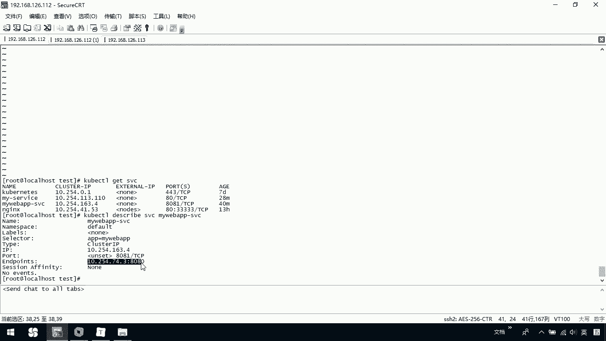

# 华为云PaaS微服务治理技术 - P76：29.kubernetes核心技术-Service(2) - 开源之家 - BV1wm4y1M7m5

下面呢我们说一下叫做多端口的service。那么有时呢我们一个容器应用啊，也可能需要提供多个端口的服务。那么在service的定义中也可以相应的设置为将多个端口对应到多个应用服务。

那下面大家看这个例子啊，我们当前呢其实就是在这里边设置了多个端口，我们一个8080端口映射到我们实际的8680，那给它起个名字。那我们这个80008005呢映射到实际的8005，我也给它起个名字。

那它真正对外的呢，还是我这个my webAPP。也就是我们这上面的这个t。那这是允许我们说帮将一个容器啊应用，可以去提供多个端口的服务。那这种情况呢，大家知道一下，无非就是在我的这个posts下面啊。

我去定义多个pot。然后呢，你可以去通过映射不同的这个tet pot去指定。那这是说我的一个多端口的service啊，我不去给大家演示了。

那我们再来看下面一个叫做外部服务service。那这些这个外部服务service是什么意思呢？他说啊在某些特殊环境中，应用系统呢需要将一个外部数据库作为后台的服务进行连接。

或将另一个集群或者namespace中的服务作为一个服务的后端，这时呢可以通过创建一个无laor select的service来实现。这里边啊。

他说你可以创建一个无laor select的service。那大家往上看，无论我们上面怎么玩，我们在创建某一个service的时候，我们都会去写一个selector，然后APP指定。

那它的目的是为了什么呢？最终关联我们真正的这个控制器里面的我们当前的这个。

old比如说我们这里边old是谁？我们可以通过这个selectAPPmy web去找到它。因为你是在这里面去定义的对吧？那现在呢我们这时候呢一个叫做we部的service。

它呢是说我创建了一个service。而这时这个service，它根本就没有去指定labor，那大家可以看我们在这里呢。

VI一下我们当前的demo8的SVC当天我就创建了一个我们的service，它呢是没有指定label的。也就是说你不知道它真正要访问呢，具体是哪一个后台的，对吧？那我们可以怎么办呢？

我们可以去创建一个叫做underpoint，你可以创建一个它通过指定一个相同名字，这个名字啊一定要跟我们当前的这里边的我们service的名字一致，来去重新映射我们自己的underpoint。

也就是说去重新映射一下它的IP地址。那大家看一下啊，这个IP地址是什么呢？我们可以来简单看一看。

coer CLgeSVC那我们找一下，当前我们有一个叫做my web APPSVC对吧？然后在这里边coerCLBSERBE我们SVC是它。你看一下在我们当前的这个my appPVC里边。

它真正的underpoint注意这是我们原来的是不是1025474。3。那我呢在这里边定义了一个underpoint，我也把它定义成1025474。3，是不是就相当于说我这个service。

虽然你最开始没有labbel，但是我通过一个underpoint，指定我们要真正访问的我们那个poI地址。那这个时候我们就可以干什么？把它关联到我们一个具体的po。那我们可以看一下我们自己的。

mo8杠我们的一个叫underpoint这个文件。这个文件里边我们名字这个名字一定要跟我们当年创建service时啊，这个名字一致。然后呢，我们在自己的andpoint里边去指定了1个IP地址。

我指定完IP地址以后，注意我们er cTL get sVC注意看我们自己的这叫my service的SVC。那么我访问它。

BUL。我们对外端口是80，那我是不是可以不写默认访问的就是80。你会发现它其实也帮助我们访问了我们tom cat的首页。

那么是不是也就相当于说虽然我当前的这个service没有通过我们的label select去具体访问哪一个po，但是呢我做了一个underpoint，它的名字和我的service名字一致。然后呢。

我只定了1个IP地址IP地址？那这个IP地址呢，其实就是我们最开始的时候，我们定义的这个po的IP地址。

那么我们在访问时，你访问这个service是不是也是帮助我们分发到我们当前的这个po上了，这啊。

这个po上okK所以呢这是我们最后一个关于说外部服务的一个service，大家可以回去尝试看一下。

