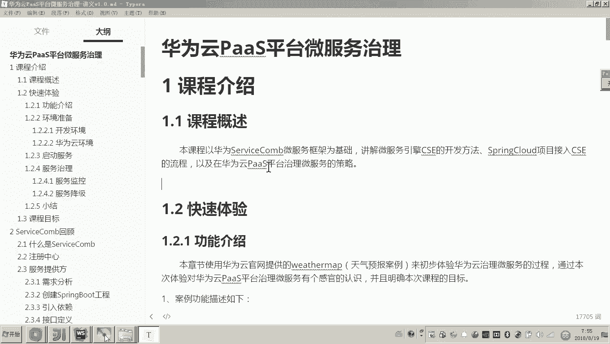

# 华为云PaaS微服务治理技术 - P77：1.课程介绍 - 开源之家 - BV1wm4y1M7m5

大家好，今天我们讲解一个课程，名字叫华为云pass平台微服务治理。

那初次看这个名字呢，可能大家一次性想不出来哎，这个课程的内容是什么？下面呢我来介绍一下这个课程的内容。

本次课程是以华为servicecom微服务框架为基础，讲解微服务引擎CSE的开发方法。

那servicecom这个大家之前应该学过是一个微服务开发和治理的框架。它和spring cloud类似，都是用于微服务开发和治理的。那本次课程呢我们不会讲servicecom的具体开发的细节了。

我们会讲什么呢？就是servicecom的一个商业版本，叫CSE的开发方法。那CSE又是什么呢？我简单介绍一下，华为哎提供了一个针对servicecom的一个商业版本。😊。

哎，这个商业版本呢叫CSE它是一个平台，就不光包括哎微服务开发的技术框架，还包括基于云平台微服务治理的一系列解决方案。因为最终我们的目的啊就是要把我们的微服务上云，哎，通过云平台来进行治理。

所以哎我们今天讲的第一个方面的内容呢，叫微服务引擎CSE它的开发方法。那么我们的项目采用微服务引擎CSD开发完成之后呢，嗯我们就可以将我们的项目呢采用哎华为云pass平台来进行治理了。

那么当然你要用云平台治理。我们第二个方面的内容呢，就是要将我们的项目上云。😊。

哎，通过把我们的项目上云之后呢，就可以采用华为云pass平台来治理我们的微服务了。😊，好，那么这个课程呢总共包括哎刚才我说的这几个方面的内容。我简单总结一下。

首先我们要采用微服引擎CSE来开发我们的微服务。😊，然后呢，我们将我们的这个哎项目呢接入CSE，然后将我们的项目呢上云。哎，第二个方面是尚云。那么采用云平台来部署我们的项目。然后部署成功之后呢。

我们讲我们的这个项目呢，使用云平台，哎pass平台来治理我们的微服。好，这个是我们今天这个课程的大概内容。那么这个课程我们讲完之后有什么意义呢？大家知道我们之前学习过微服务开发一个大的项目啊。

他这个微服务的数量是很多的。那么这么多微服务的数量呢，啊你开发完成之后，最终是不是要部署？哎，要维护。所以说这个如果没有一个非常有效的方法，哎，一个有效的平台，那么这个成本是很高的。

所以今天我们的课程学完之后，就是要解决微服务开发完成之后的上线部署和运维。

所以那么那么我们学习完这次课程，那么就可以解决企业当中数量众多微服务后期的这个上线部署和维护的需求。

好，那么这个呢就是我们本次课程的一个介绍。

