# 华为云PaaS微服务治理技术：P77：课程介绍 📚

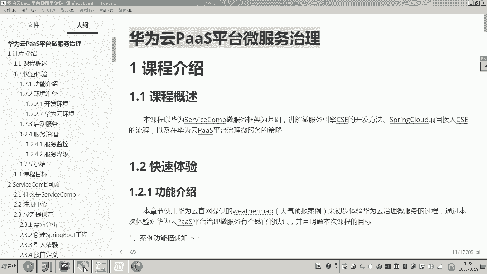

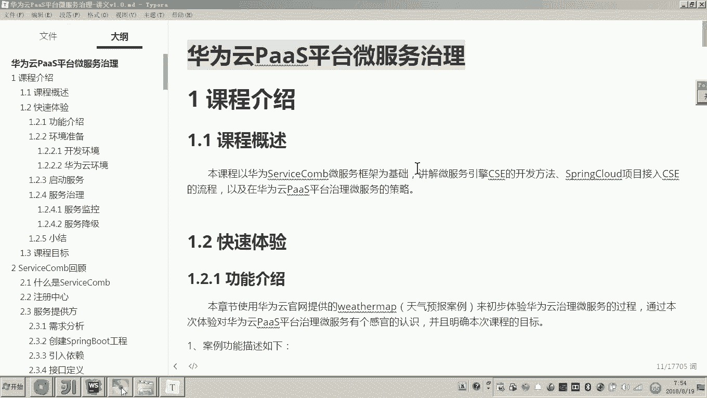

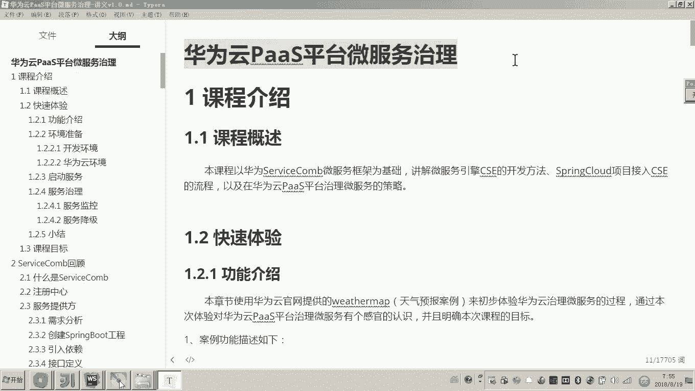

在本节课中，我们将要学习《华为云PaaS微服务治理技术》这门课程的整体内容与目标。课程将以华为ServiceComb微服务框架为基础，讲解微服务引擎CSE的开发方法，并最终实现将微服务项目部署上云，利用华为云PaaS平台进行治理。

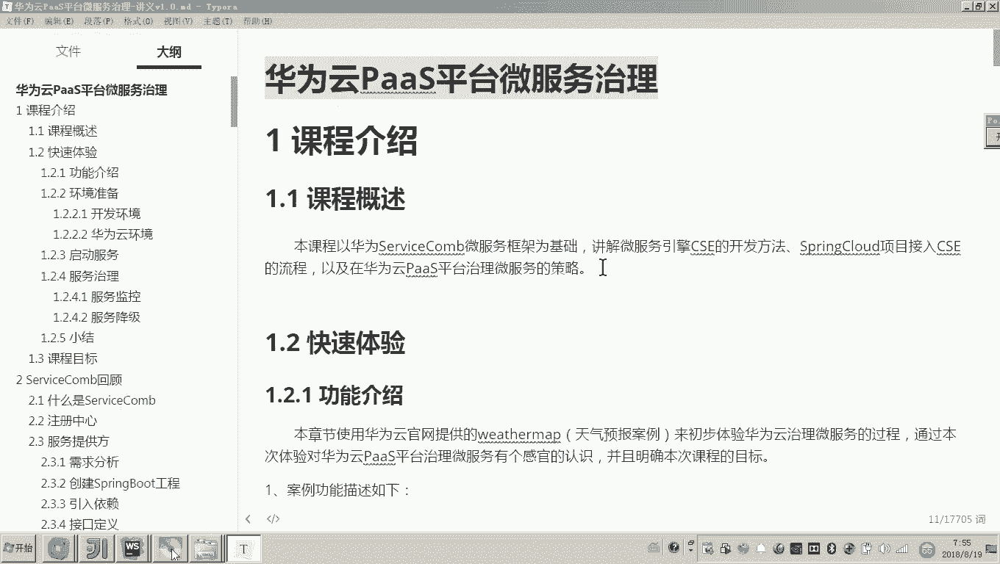

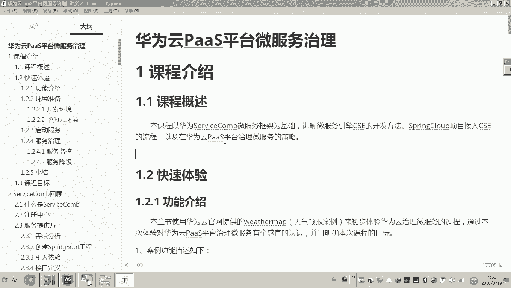

## 课程内容概述

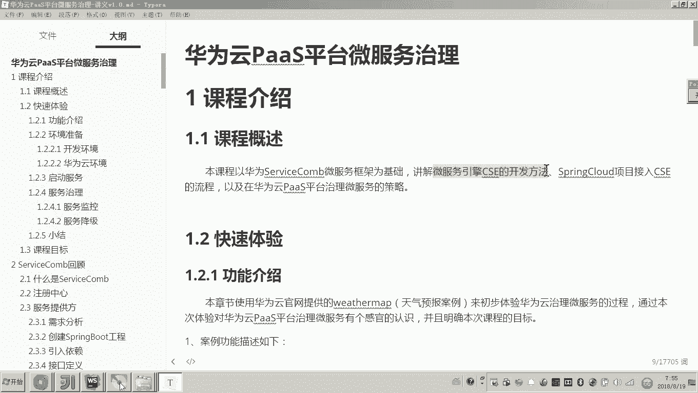

本次课程的核心是围绕华为云微服务引擎CSE展开。ServiceComb是一个与Spring Cloud类似的微服务开发和治理框架。本课程不会深入讲解ServiceComb框架本身的开发细节，而是专注于其商业版本——CSE的开发方法。

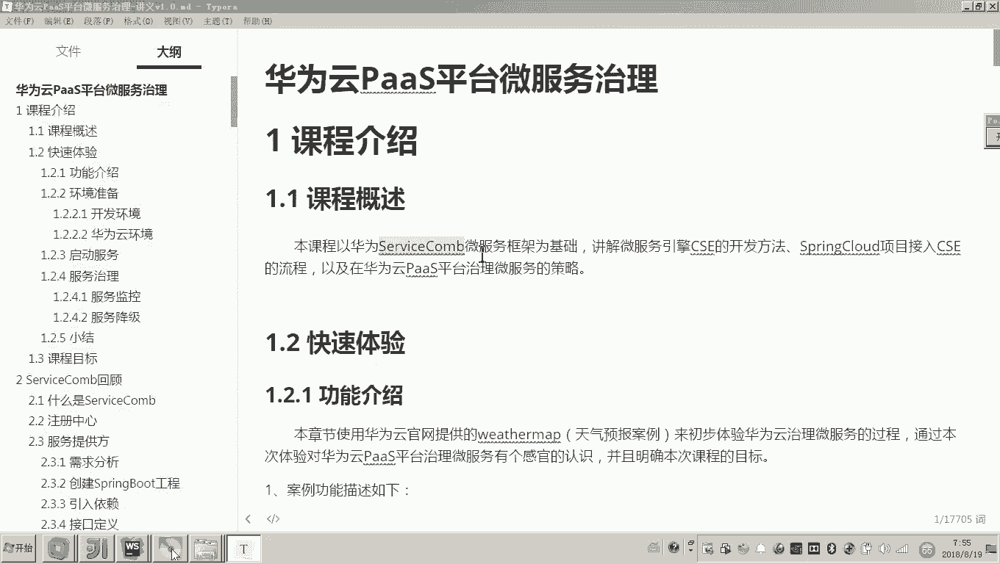

CSE是华为提供的一个商业平台，它不仅包含微服务开发的技术框架，还提供了一系列基于云平台的微服务治理解决方案。我们的最终目标是将微服务部署到云上，并通过云平台进行有效治理。

## 课程主要内容

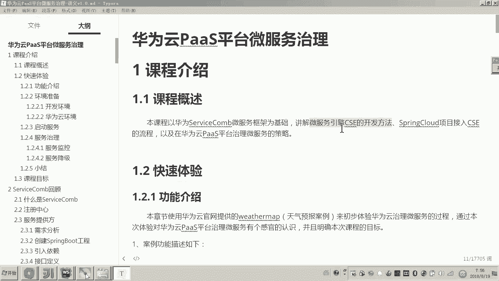

以下是本课程将涵盖的几个主要方面：

1.  **微服务引擎CSE开发**：学习如何使用微服务引擎CSE来开发我们的微服务项目。
2.  **项目上云部署**：在项目开发完成后，学习如何将项目部署到华为云PaaS平台。
3.  **云平台微服务治理**：项目成功部署后，学习如何使用华为云PaaS平台来治理我们的微服务。

## 课程意义

在微服务架构中，一个大型项目通常包含数量众多的微服务。这些微服务在开发完成后，面临着部署、维护和运维的巨大挑战。如果没有一个高效、统一的平台，这些工作的成本会非常高。

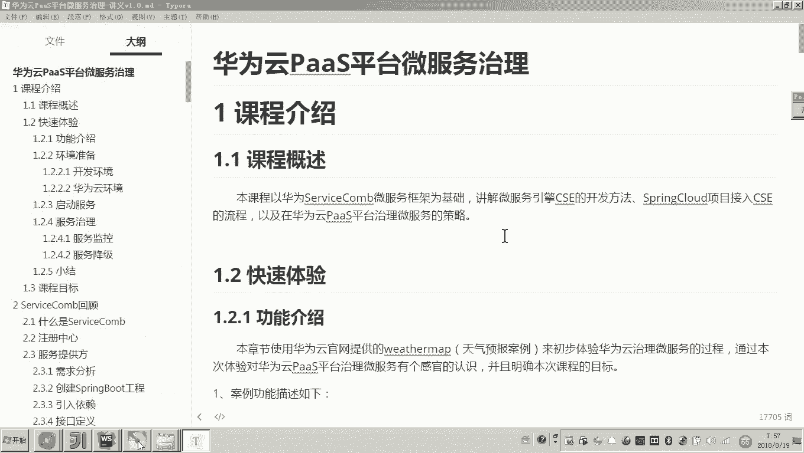

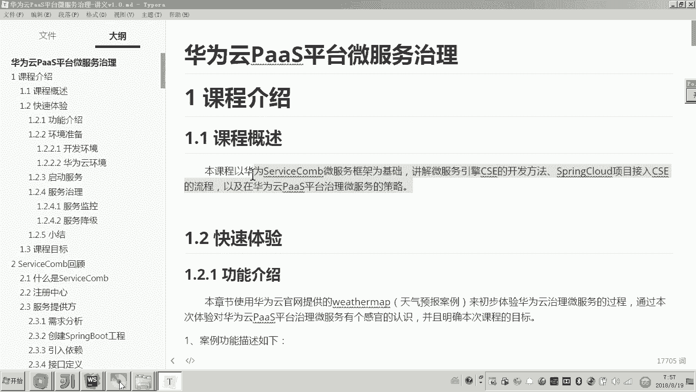

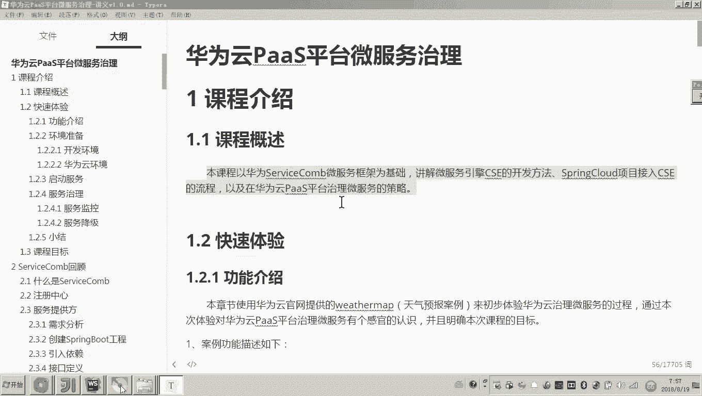

学习本课程后，你将能够解决微服务开发完成后的上线、部署和运维问题，满足企业中对大量微服务进行高效后期管理的需求。

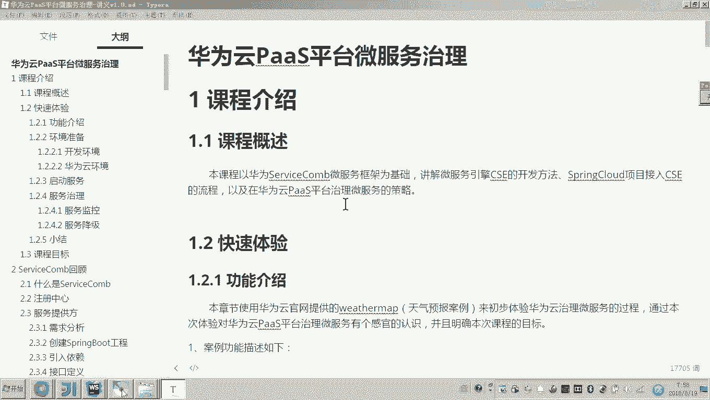

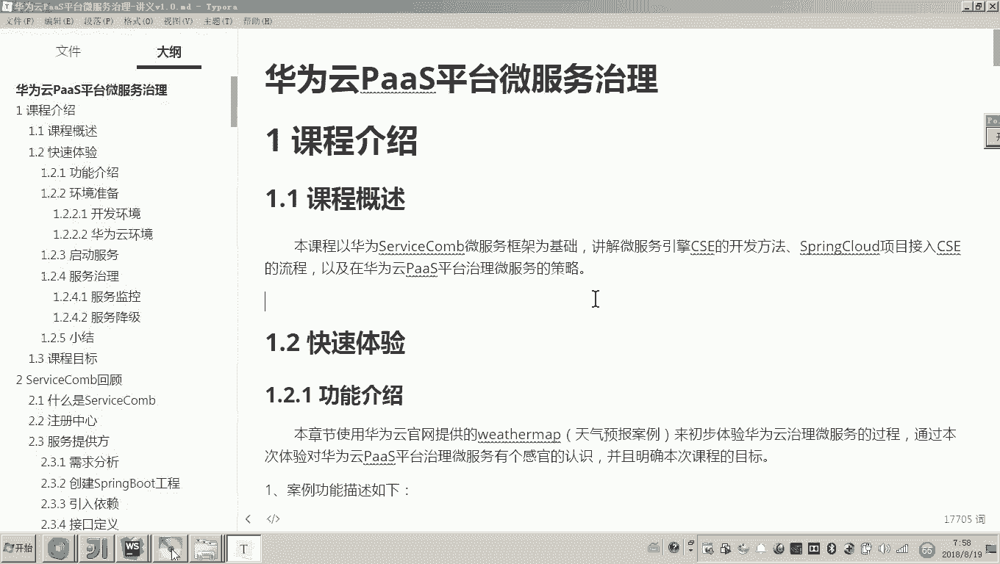

## 总结

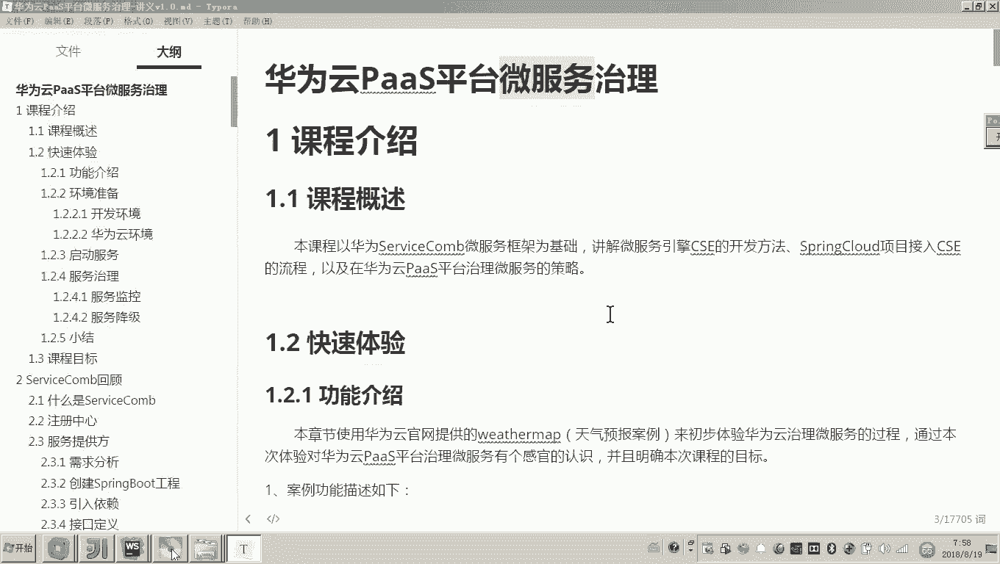

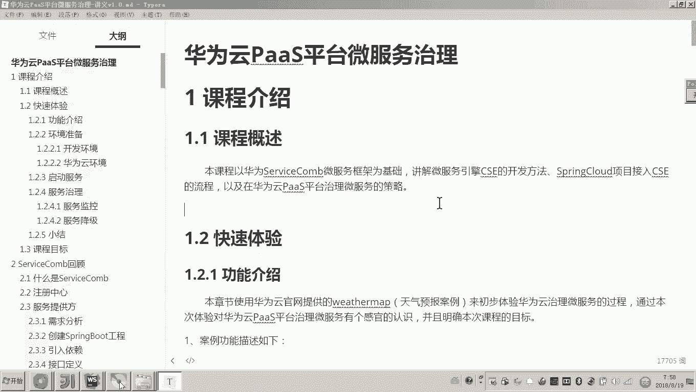

本节课我们一起学习了《华为云PaaS微服务治理技术》课程的整体介绍。我们了解到，本课程将引导我们从使用CSE开发微服务开始，到将项目部署上云，最终利用华为云PaaS平台实现微服务的有效治理，从而应对企业级微服务架构的运维挑战。