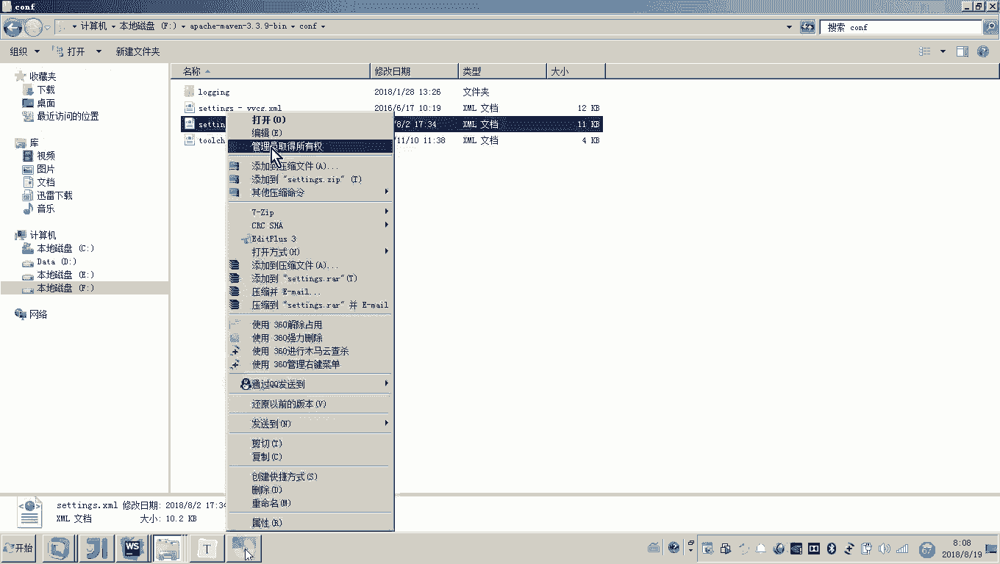
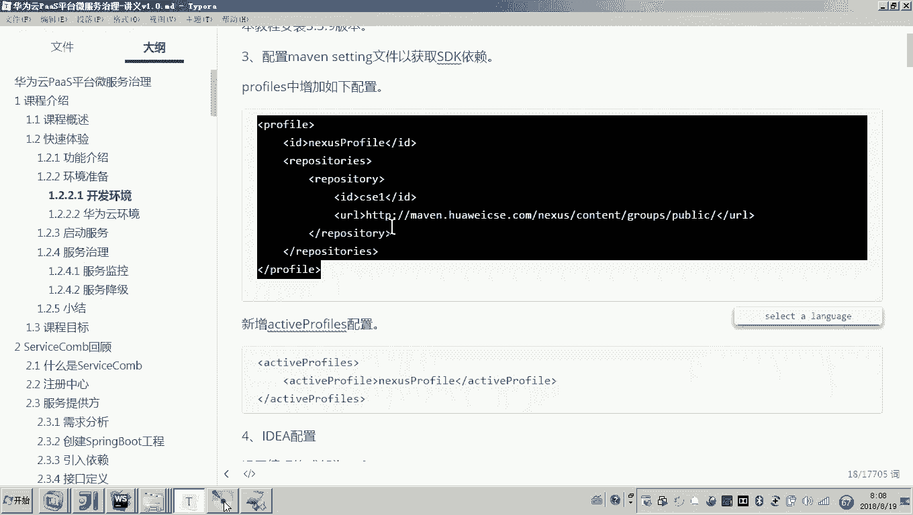

# 华为云PaaS微服务治理技术 - P78：2.快速体验-功能介绍和准备环境 - 开源之家 - BV1wm4y1M7m5

好，那么接下来呢，我们来快速体验一下这个如何使用啊pass平台来治理我们的微服务。好，那么通过这次快速体验呢，还是要对我们本次课程的内容呢有一个呃直观大概的了解。这样的话我们后边学习起来呢。

才有这个兴趣。哎，才有才知道我们这个课程的主题思路是什么。嗯，好，那么这个快速体验的功能，我先介绍一下啊。在这个华为云官网啊给我们提供了一个叫wether map的哎这么一个天气预报的案例。

那么这个wether map呢，最终我们的初步体验呢就是采用华为云来治理我们的微服。通过本次体验呢，我们对华为云pass平台治理微服务啊有一个感官的认识。哎，哎对我们这个课程的目标呢也就更明确了。

首先我们来看吧，简单来看一下这个weer map的它的大概的一个操作的流程。呃，这个是天气预报哎，那这个项目部署啊，在我们这个本地启动起来之后呢，我们就可以干嘛呀？去来访问我们这个项目啊。

这个就是项目的主界面啊，这个主界面呢，在左侧这一块呢，会显示那么当前这个这个这个城市的当前的天气信息。然后右边会显示未来36小时，就是未来一段时间的天气情况。😊，哎，这个就是一个大概的界面的内容。好了。

那么这个操作的流程我们清楚了之后啊呃，作为这个程序员，你马上要想到的是哎，那这个系统啊那如果采用微服务的话，它会有几个微服务呢？所以下边我们再来看一下这个微服务的结构哎，流程是什么。😊。

那以下呢就是一个微服务，就是wether map的一个微服务的结构。首先呢一个用户啊来请求什么呢？来请求你看大家看这个应该了解过吧。node GS就是一个前端的一个工程。啊，通过请求前端工程。

各位是不是就打开了这个操作界面了啊，然后呢，然后这个如果现在我要输入城市名称来搜索这个城市的天气的这个时候呢，这个前端呢会把请求发送给一个叫fusion呃weer这么一个java工程。😊，呃。

通过这个工程将我们这个请求呀转发到哎下边两个微服务。好，那这两个微服务的职责是什么呢？这个fusionweer它的微服务的职责是什么呢？哎，我们来看这个重点呢，就是咱们说的这三个微服务了。

那么这个fusion weather呢，其实它就相当于一个什么哎，我们后边会讲到的一个网关。哎，就是所有的请求呢都过哎fusion weather，它可以把这个什么信请求进行转发。

并且呢可以把这个信息呢进行一个汇聚啊，因为你也知道前端是不是通过这个fusion weather呢来进行请求。将来这个信息呢也是通过它呢给它给响应回去。哎，所以说呢它就是一个呃信息汇聚的一个服务。哎。

相当于一个网关。😊，那么这个请求假如我现在要查询一个城市的天气了，那么他会请求查询一个城市什么呀？当天的天气情况，这个时候呢，他会去请求一个叫weather的服务，就是这个服务。

这个服务呢就是用于当天天气的查询。😊，那么你也知道了，在刚才的这个界面上边，左侧显示的是不是就是当天的天气。所以你应该知道左侧的这块数据啊，其实是来源于下边这个weer这个服务他所提供的信息。😊。

那么右侧呢是这个城市未来一段时间的天气情况。

那这个未来一段时间的天气情况，这个数据的提供者是谁呢？哎，这里边是不是有一个叫做什么叫做forecast，这个叫哎天气预报的这个微服务。😊。

所以啊我们在进行快速体验的这个wether map这个案例的时候呢，我们呢先要对这个wether map的它的哎系统的微服务的这个结构啊有一个大概的了解。哎，为什么有一个大概了解啊？

因为最终我们是不是要把要通过微服务这个华为云平台来治理这些微服务呀？所以现在在我们的脑子里边是不是基本上已经清楚了，大概这个wether map它的一个结构啊。😊，好，那现在我们说这个结构明白了之后呢。

现在我们是不是就可以来干嘛呀？来部署吧啊，当然在部署之前呢，我们是需要去准备一下环境的啊，准备一下。虽然我们说这个呃具体的这个代码开发没有啊，但是我们也需要把这个环境搭建一下。

因为这些服务呢想在本地跑起来，是需要依赖于这些环境。第一个环境是GDK的版本啊，GDK环境要求版本在1。8以上。还有一个me文啊，me文用于项目的构建要求3。3。0哎以上。那本教程我们用的是3。3。9。

😊，那另外的话就是说呃这个我们说这个项目要运行起来的话，是不是需要去下载一些架包，对吧？就是maeven依赖的一些架包。所以这个时候呢我们就用到华为云的一个私服啊。

这里边我们要在这个ma的sing文件当中来配置这个私服。好，这里边我简单给大家说一下啊啊，我首先打开我这个本地这里边用到了一个哎，我就用这个目录下面的这个me程序了。然后呢，你打开这个sing文件。😊。

然后呢，把它移到基本上是最下边啊，在这里呢，我们配置一个profile。然后呢，我们说这个这就是一个私服的地址啊，然后在下边呢，我们再配一个叫哎激活这个profile。

这样的话我们说这个私服呢就可以用了。哎，就把这一段呢配过去就可以了。在我的这个文档上提供的也很清楚。好。😊。

然后呢呃这个ide的这个虽然我们这次呢呃快速体验用不到这个ide，但是呢你也按照我这个章节的内容呢，把它配置一下。因为后边呢我们就会用到了ide的编码格式设置UTF杠8。

然后按照我这里边的提示呢都把它配一下，并且啊把这个ide这个的配置也配一下啊。最后呢呃由于这个快速体验这，它是不是用到了note GS呀，所以嗯我们说这个项目运行需要依赖于note GS。

你在你的本地安装nodeGS。😊，这个是我们本地的开发环境啊。你如果刚才不是说了吗，要把这个呃微服务是不是通过云平台来治理啊？所以啊你还要配置一个华为的云环境。😊，那这个云环境怎么配呢？哎。

你进到这个网址呢，注册一个云账号，哎，注册一个云账号。好，这里边呢我们来看一下。其实这个快速体验这里边这个环境配置呢，也是后边我们这个呃云开发啊云平台最终采用CID开发的一个环境。好。

这里边我先登录一下。😊。

这里面这个账号呢，我是之前注册的啊。

好，那这里边我们登录成功之后呢，各位呃，这个账号我是不是就注册成功了吧，注册成功之后呢。😊。

下面有一个云环境的配置，就是有一个叫AKSK的一个访问密钥。那这个AKSK又是什么意思呢？哎，就是说你的本地要和云平台进行通信，需要有一个什么，有一个密码，有一个密钥。😊，那这个AKS跟密钥怎么获取呢？

这里边有一个获取的步骤啊，就是在这个单击用户名啊，就是在右上角这里边是不是就是我的用户名啊，你单击一下哎，单击单击哪个呢？有一个叫账号中心。😊。

好，我们点开点开这里边，是不是大家可以看到有一个叫管理我的凭证，对吧？好，那么你你刚才你你进去以后也点你管理，也点击这个管理我的凭证啊。然后在这儿在这儿是不是有一个叫做访管理访问的密钥。你初次打开之后。

其实这里边啊，这里边是空的啊，是空的。所以呀你又你就点干嘛呀，点新增访问密钥，点新增，然后呢，这里边你输入你的手机号以及登录密码，然后确定这个时候它就会自动把这个密钥呢下载到你的什么本地了。

那么在你的本地哎，就包括了这个密钥。那么这个哎我们我们下载成功之后呢，然后我我这个账号的密钥呢，它就给我了。那这里大家可以看到这里边就有一个哎密钥，这就是AKSK它的这个密钥，一会儿呢。

我们就要把这个密钥干嘛呀，把它配置到我们的工程。😊。

这个配置文件里面，我为什么要配置？因为我们的工程是不是要和云平台进行通信啊，要向云平台进行注册。😊，好，那么呃以上呢就是我们说的这个快速体验这个wether map的一个呃介绍。

以及我们的这个环境的准备。哎，后边呢我们就会去启动服务，然后呢去进行微服务的治理了。好。

