# 华为云PaaS微服务治理技术：P78：2.快速体验-功能介绍和准备环境 🚀

在本节课程中，我们将通过一个天气预报案例（Weather Map）来快速体验如何使用华为云PaaS平台治理微服务。本次体验旨在让大家对课程内容有一个直观的了解，明确学习目标，并为后续深入学习建立基础。

## 功能介绍 📋

华为云官网提供了一个名为“Weather Map”的天气预报案例。我们将通过华为云平台来治理这个案例中的微服务，从而对华为云PaaS平台的微服务治理能力形成初步的感官认识。

首先，我们了解一下Weather Map的操作流程。项目部署并启动后，可以访问其主界面。界面左侧显示指定城市的当前天气信息，右侧则显示该城市未来一段时间的天气情况。

了解了操作流程后，作为开发者，我们需要思考其背后的微服务架构。以下是Weather Map的微服务结构图：

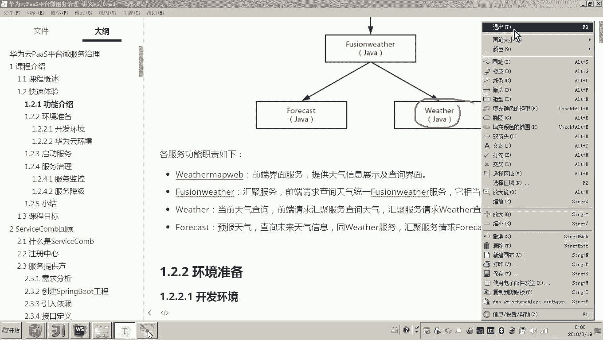


其微服务结构解析如下：
*   **前端工程 (Node.js)**：用户首先请求前端工程，从而打开操作界面。
*   **网关服务 (fusion-weather)**：当用户输入城市名称搜索天气时，前端会将请求发送给这个Java工程。它相当于一个网关，负责将请求转发给下游微服务，并将返回的信息汇聚后响应给前端。
*   **当日天气服务 (weather)**：用于查询指定城市的当天天气情况。主界面左侧的数据即由此服务提供。
*   **天气预报服务 (forecast)**：用于查询指定城市未来一段时间的天气情况。主界面右侧的数据即由此服务提供。

通过以上分析，我们清楚了Weather Map系统由多个微服务协作完成。接下来，我们将学习如何为运行和治理这些微服务准备环境。

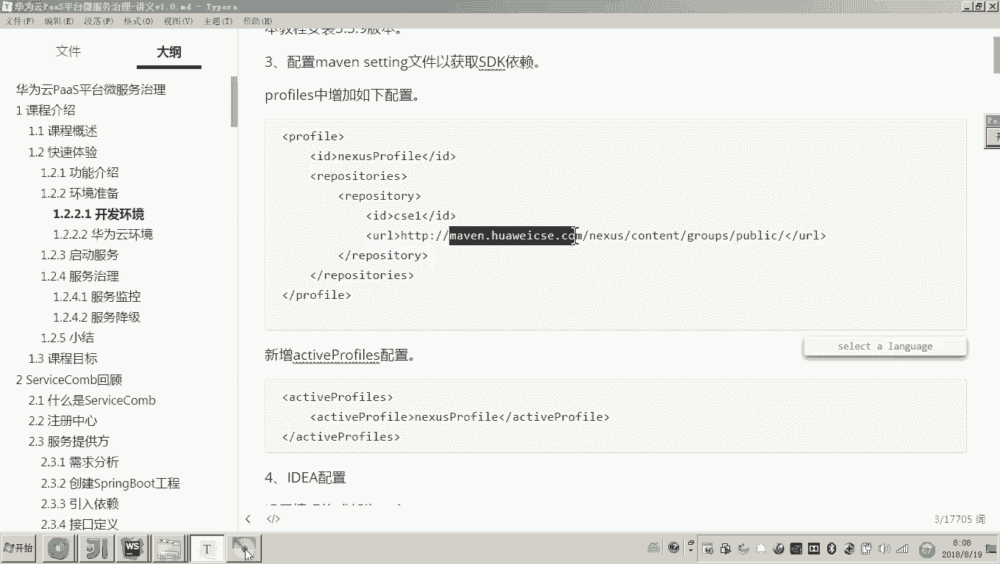

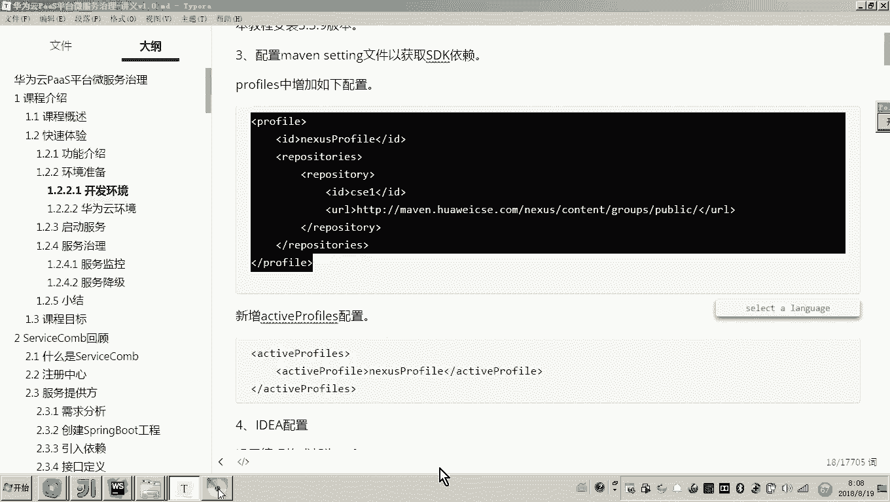

## 环境准备 🛠️

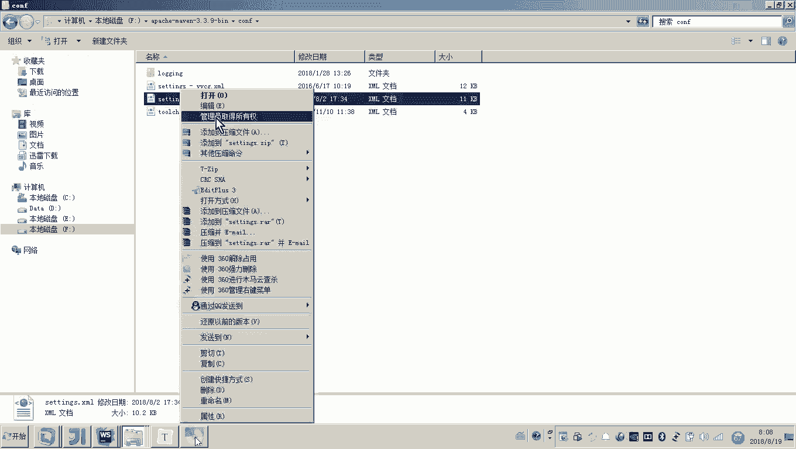

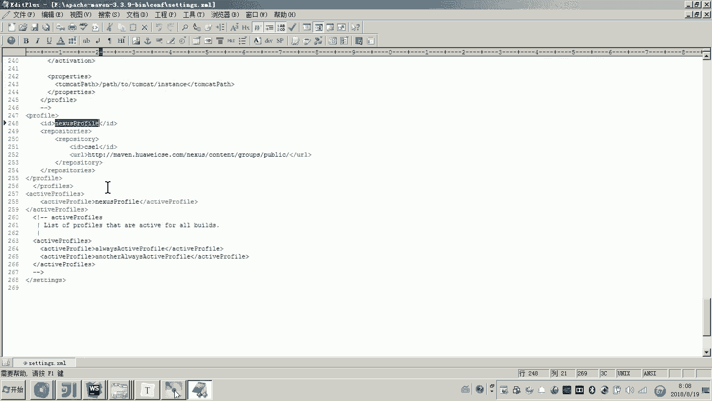

虽然本次体验不涉及代码开发，但需要在本地运行这些服务，因此必须搭建相应的环境。准备工作分为**本地开发环境**和**华为云环境**两部分。

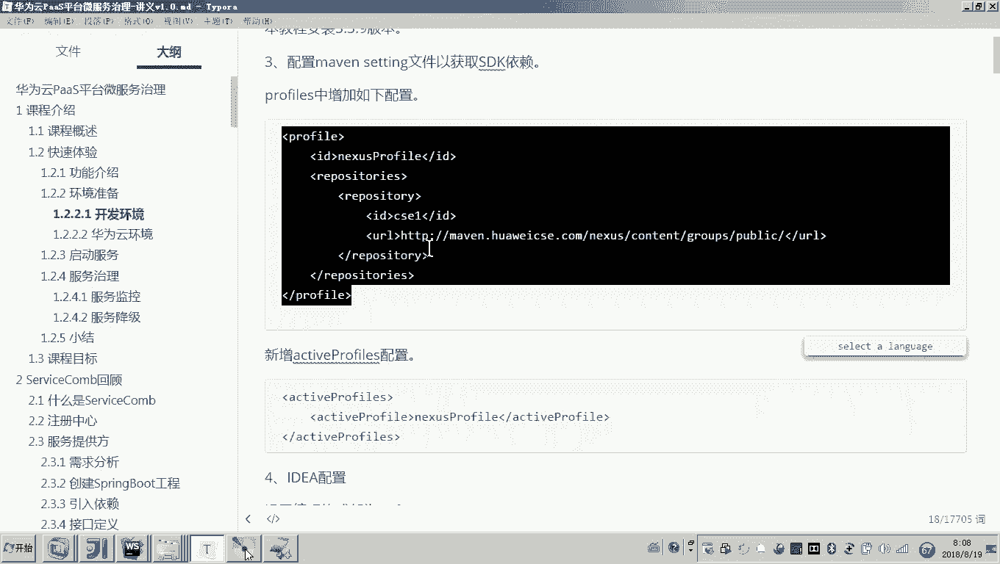

### 本地开发环境

需要在你的计算机上安装并配置以下组件：

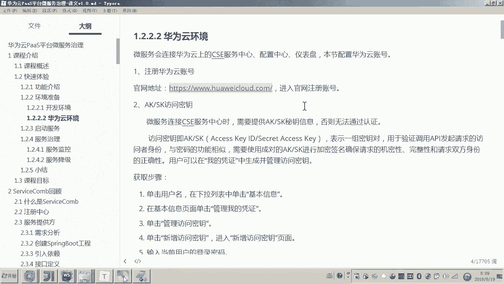

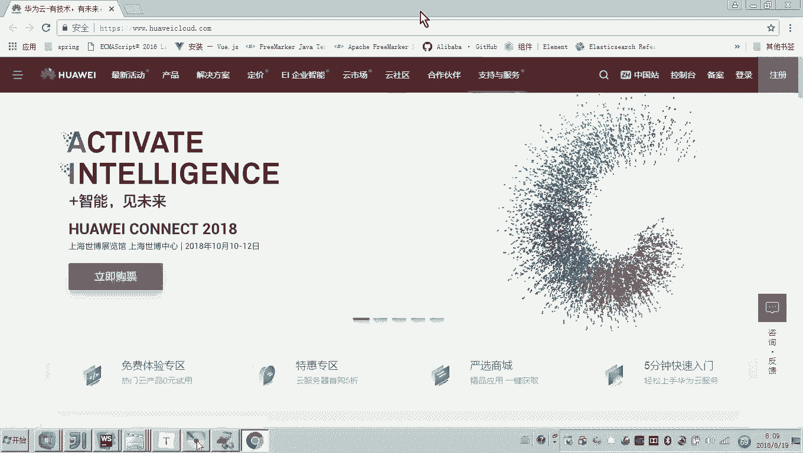

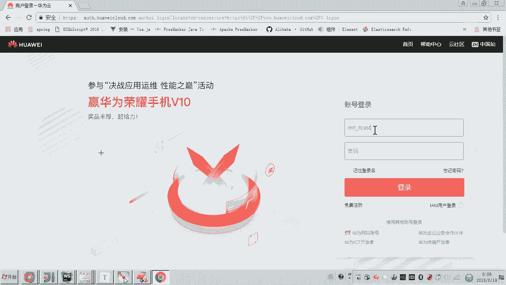

1.  **JDK**：版本要求为1.8或以上。
2.  **Maven**：用于项目构建，版本要求为3.3.0或以上。本教程使用版本为 `3.3.9`。
3.  **配置Maven私服**：项目运行需要下载依赖包，需在Maven的 `settings.xml` 文件中配置华为云私服。具体操作是在文件末尾添加一个profile并激活它。
    ```xml
    <!-- 示例配置片段 -->
    <profiles>
        <profile>
            <id>huaweicloud</id>
            <repositories>
                <repository>
                    <id>huaweicloud</id>
                    <url>https://repo.huaweicloud.com/repository/maven/</url>
                </repository>
            </repositories>
        </profile>
    </profiles>
    <activeProfiles>
        <activeProfile>huaweicloud</activeProfile>
    </activeProfiles>
    ```
4.  **IDE配置**：虽然快速体验暂不编码，但建议按教程提前配置IDE（如IntelliJ IDEA或Eclipse），包括设置编码为UTF-8等，为后续开发做准备。
5.  **Node.js**：因为项目前端部分依赖Node.js，所以需要在本地安装Node.js环境。

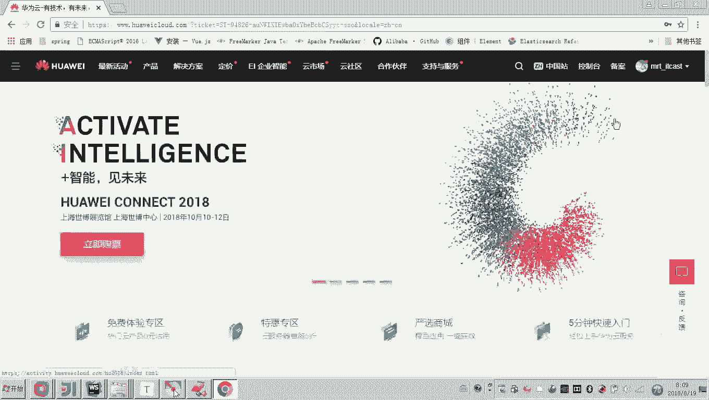

### 华为云环境

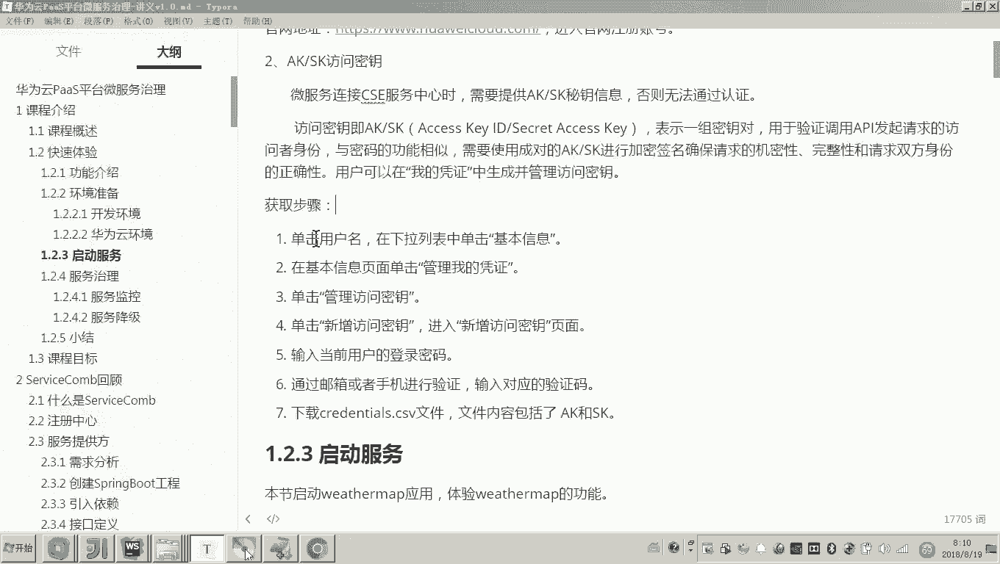

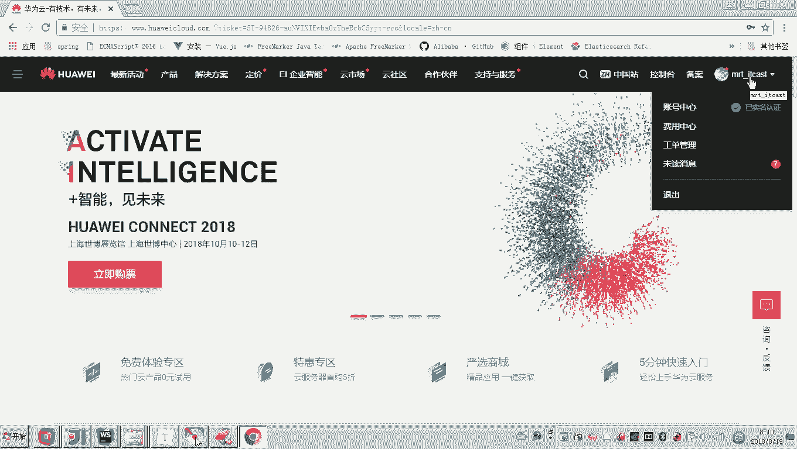

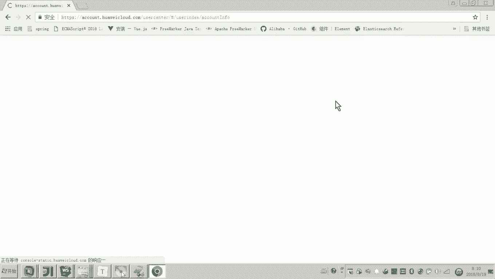

为了将本地微服务接入华为云平台进行治理，需要配置云环境。

1.  **注册云账号**：访问华为云官网并注册一个账号。
2.  **获取访问密钥 (AK/SK)**：本地服务与云平台通信需要进行身份认证，这需要通过访问密钥实现。获取步骤如下：
    *   登录华为云控制台。
    *   单击右上角用户名，进入“账号中心”。
    *   在左侧导航栏选择“管理我的凭证”。
    *   在“访问密钥”页签下，点击“新增访问密钥”。
    *   根据提示验证身份（通常需输入手机号和登录密码），验证成功后系统会生成并下载密钥文件到本地。文件中包含的 `Access Key Id (AK)` 和 `Secret Access Key (SK)` 需要配置到后续的工程配置文件中，以便服务能成功注册到云平台。

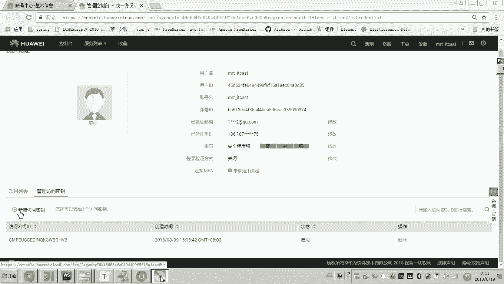

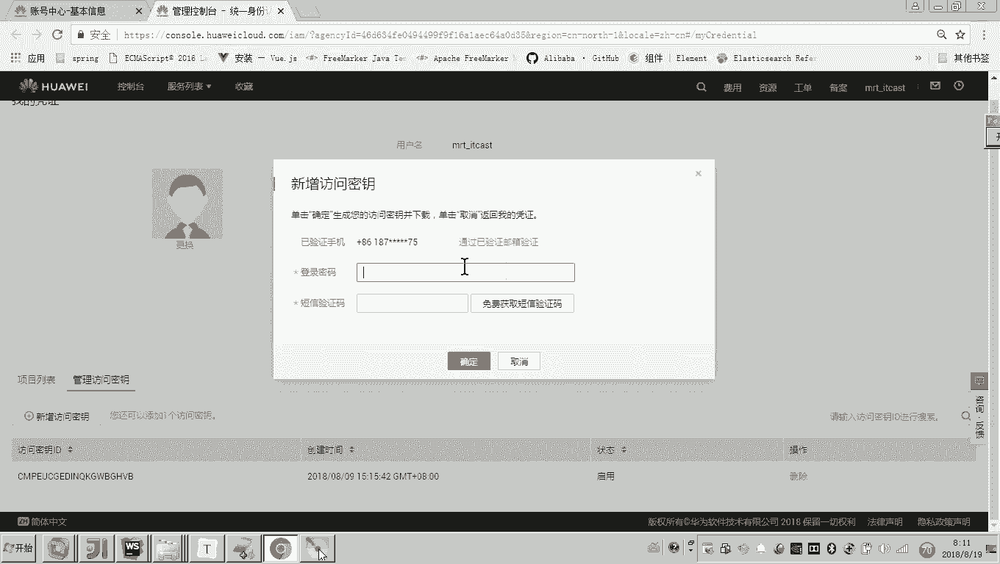

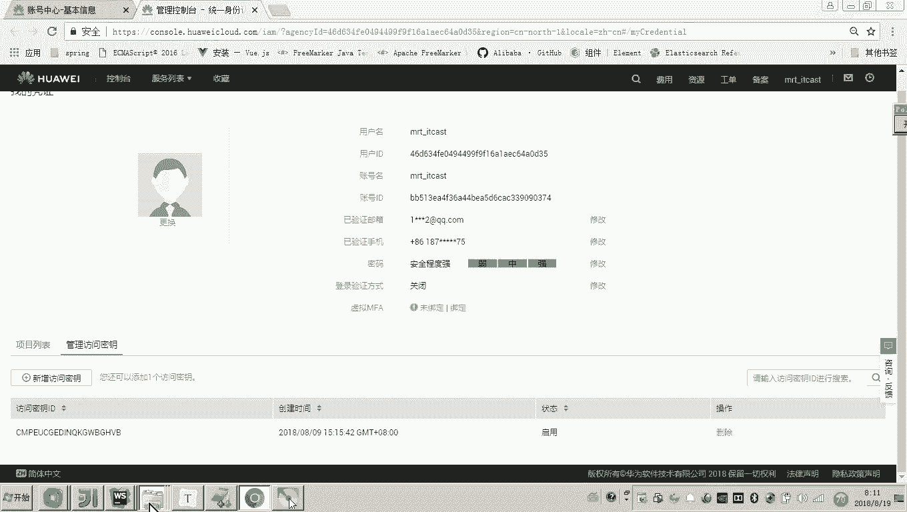

---

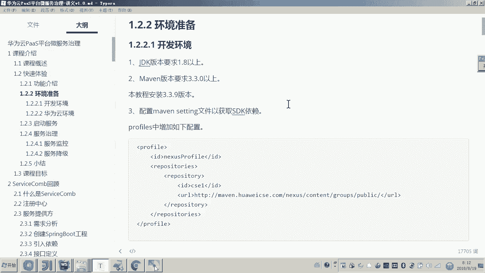

本节课中，我们一起学习了华为云微服务治理的快速体验案例Weather Map的功能与架构，并完成了本地及云上环境的准备工作。下一节，我们将启动这些微服务，并开始体验华为云PaaS平台的治理功能。