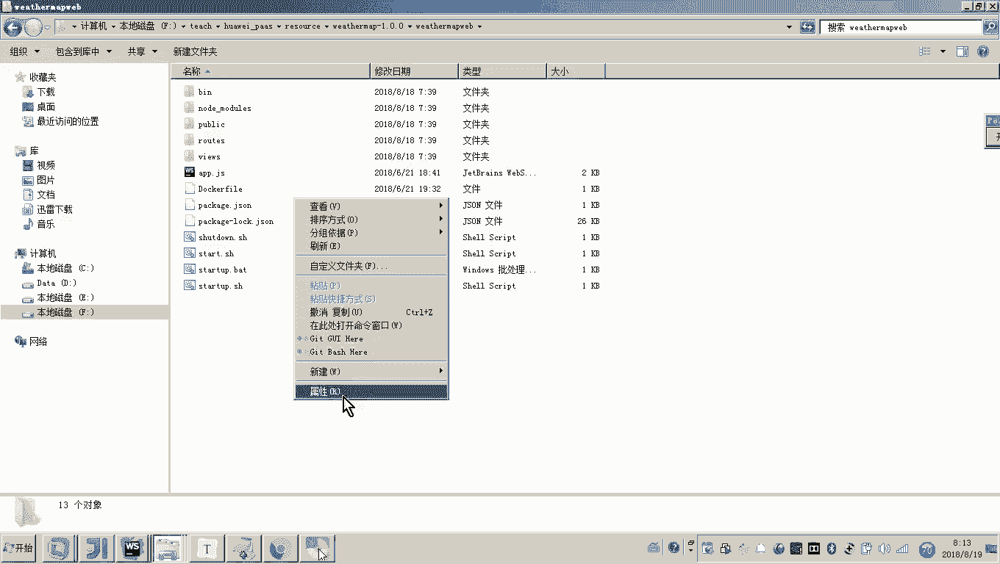
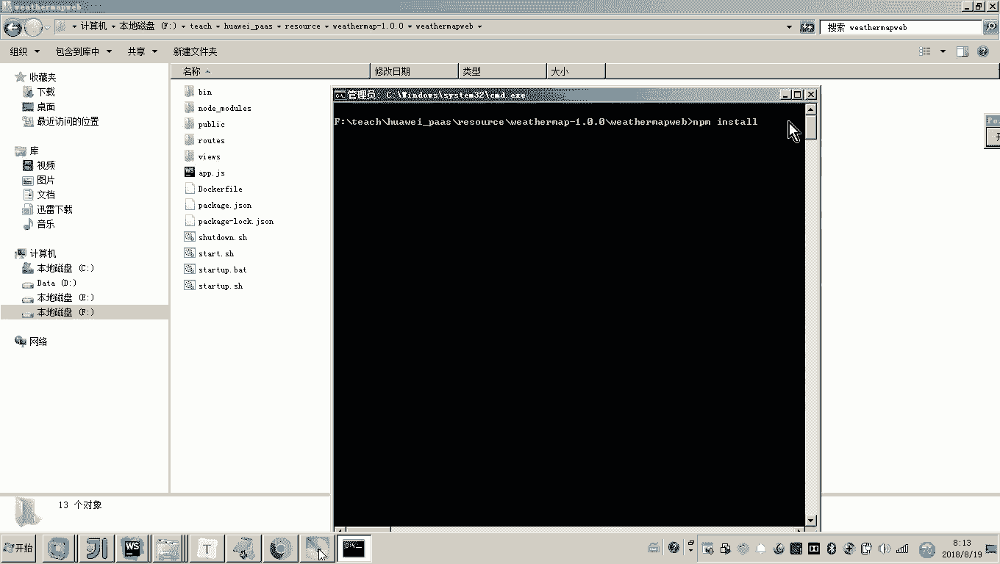
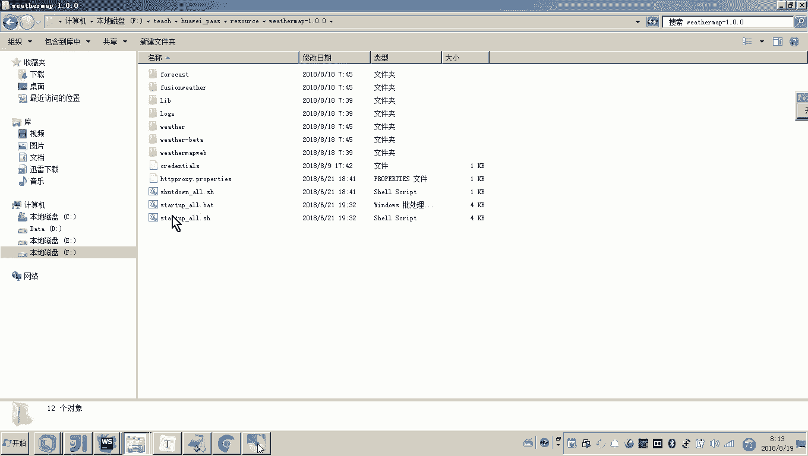
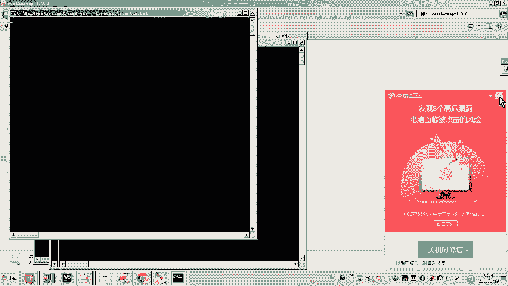
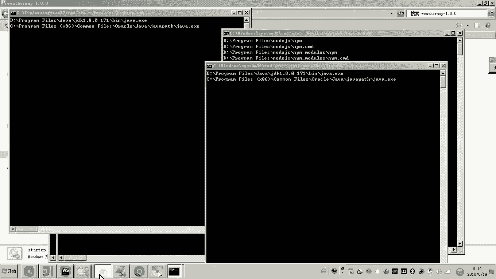
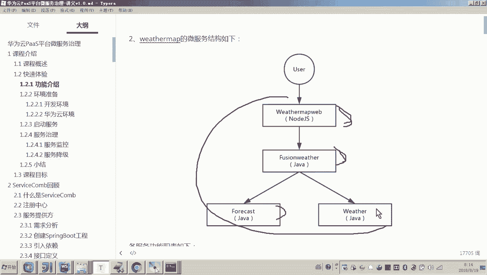
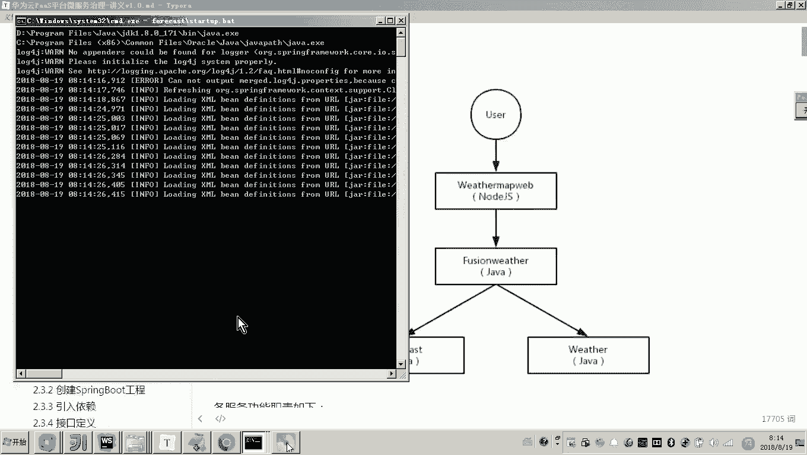
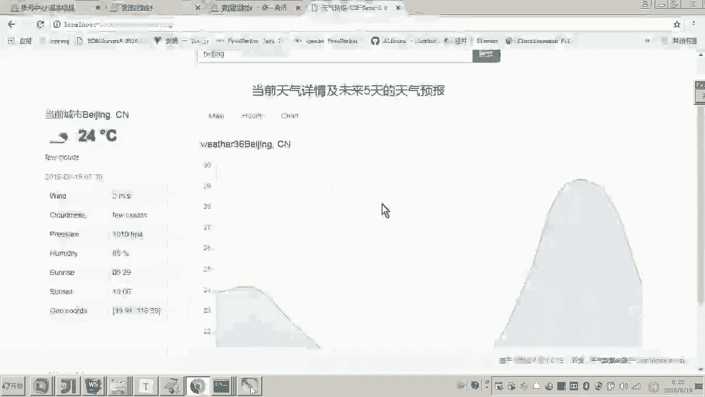

# 华为云PaaS微服务治理技术 - P79：3.快速体验-启动服务 - 开源之家 - BV1wm4y1M7m5

好，那么接下来呢我们就可以来启动我们的服务。好，那么呃在启动之前呢，这个服务是这个这个代码是需要从官网去下载的。然后这里边呢我们就把它下载到我的本地。好，那注意这里边我要说一下。

由于这里边用到了一个nodeGS因为它下载下来的这个这个这个原来的这个项目啊，各位啊原来这个项目啊呃，这里边呢，各位我们可以看一下这个工程就是它的一个前端工程。嗯，你默认下载完了之后呢。

呃这个nodeGS，因为这个工程要依赖很多的GS包，所以呢呃你下载完成这个目录是没有的。这个是要从联网啊哎通过这个NPM这个包管理工具去下载GS的这些依赖包的。

所以由于可能你的这个网络存在问题或者什么呢。然后我呢就已经自动把这个包啊给你就装好了。啊，如果你下载完成之后，你想安装包啊也也是可以的，很简单，那这里边呢也就是打开这。😊。

这个目录的啊命令窗口，然后呢运行1个NPM音s到，这样的话它就会自动的哎把这个前端工程所依赖的一个介S包呢下载到这个目录里面了。

好，那么呃我这里边呢就给大家把这个呃。把这个wether map的这个包呢下载下来之后呢，呃包括这个刚才前段的这些依赖包已经自动下载到本地了。现在呢我们就可以来运行了呃，运行的时候我们点击哪个呢？

叫star up哦这个BAT这个好，我们点击。😊。

那点击完了之后呢，各位可以看一下它是不是启动了很多的黑窗口呀。因为因为刚才我们了解到这个这个小案例啊，它其实包括很多的这个微服务啊，这是前端的对吧？这个是我们就说类似于网关的一个微服务啊。

这是前端的一个工程，这是网关的微服务，这个是不是用于天气预报的，这个是当前天气查询的，所以啊这里边呢它就启动了一系列的黑窗口。那每一个黑窗口是不是就是一个进程啊，就是一个我们的这个服务啊，对吧？嗯。😊。

好，那么我们来看现在我们说它启动起来之后呢，我们嗯打开我们说的这个黑窗口啊来瞧一下。那这个是是这个是这个前端的啊，来我们看一下。那启动起来，我们说那如何访问呢？哎。

因为这个这个工程这个项目它不是我们写的。哎，我们现在呢就是想快速体验一下这个云平台到底是怎么治理的。😊，那现在呃，我们就参考我们的这个。讲义我们来看启动起来之后，我们访问这个界面。😊，啊，这个地址。

然后我们访问这个地址呢，大家哎来看一下嗯来看一下啊。😊，好，他就进来了。现在我们进来了之后呢，各位可们稍微刚开始是有些慢的啊，说这个获取天气数据失败，因为他要他要联网去获取的。好。

我们刷新一下来看一下这个左侧呢是不是就显示了当前城市是不是叫深圳啊，默认的是深圳这个城市啊，然后左侧就显示了当前天气，也就是当天的天气情况。😊，哎，然后呢，这个右边呢就显示未来哎一段时间的天气情况。

这里边你看是不是还有一个图形展示，对吧？哎，好，下边是一些图标好。😊，那么这个就是一个大概的功能。那这里边如果我要我要输入一些呃其他一些城市的名称呢，大家可以看到它也可以看回车。

然后是不是就查询了北京天气的情况。嗯，这个就是这个案例的一个内容。你看大家可以看到我现在访问的是不是就是loc house的，就是访问我本地启动的这些服务，这现在就运行起来了吧。好了，到这儿呢。

我们这个服务呢就启动起来了。那有同学就说老师，那你启动起来之后，怎么这个服务治理是怎么治理的呢？注意看。😊，在启动服务的时候，我这里边有一系列的步骤，先不要着急服务治理啊。

因为你初次把这个zip包下载到你本地啊，你要想启动起来，像我这样去运行，它还需要做几个工作啊。😊，首先一个工作呀，就是。😊，你回头直接我给你提供这个zip包，哎，就是我这里边你会发现啊。

我刚才是不是介绍过这个前端的这个我已经把GS包下载到我本地了是吧？所以哎你就直接把我这个zip包解压完了之后啊，然后啊哎你呢就需要配置我们刚才说的AKSK这个怎么呀密钥。

打开这里边在这个wether map里边有一个叫ent这个文件。😊，好，我们找到。找到里面是不是有一个叫ent哎，这个文件呀，这个文件里面就是配密钥的。大家可以看到它的配置方式就这么配。😊。

那这个来源于哪里呢？这个密钥啊，刚才我是不是解解释过了，就是在我们的这个呃云平台登进去之后，点击账号里边是不是有一个叫管理我的凭证，对吧？管理我的凭证点进去。

然后哎这里边是不是就可以看到有一个叫管理访问密钥呀，你这如果没有的话，你是不是要新增啊，一新增是不是要输入这个手机验证码登录密码，然后一确定，然后它就会自动给你下载到本地，然后下载到本地之后呢。

你拿到这个文件，这个文件，你打开它第一个就是我们可以可以看一下这个这个这个这个信息啊，这个就是AK这是就是SK你按照这个格式，把这个信息写进去就可以了。😊，好，那么这个密钥我们只要配置成功。

我们现在就运行s大up o，那么它就可以把所有的微服务呢都起来了。起来之后你就可以来访问这个微服务了。好了，你看到这个功能是不是就可以正确的使用了？但是我们最终是不是要实现这个微服务的治理啊？

那么微服务就是云平台来治理这个微服务。好，云平台，它怎么就知道你这个微服务的情况呀，对不对？哎，是因为微服务在启动的时候呀，要把已经把自己注册到云平台的服务注册中心了。

那我们之前学习过的这个呃spring cloud呀，或者说serv啊这些微服务框架。我们说他要进行微服务治理，嗯，它是不是需要有一个叫微服务的注册中心呀，那这个注册中心各位你也看到了。

我的本地其实没有起注册中心吧，其实这个注册中心在哪里啊，就在云平台，就是说我们这个本虽然这个微服务在我的本地起来了。那么这个本地的微服务已经和云平台的这个注册中心通信了。😊。

那这个微服务的信息已经注册到这个云平台了。那么我们怎么去查看这个微服务注册到云平台呢？好，注意看。我们打开我们说的这个用你的账号登进去啊，登进去。那这里边啊这里边啊有一个服务列表。

在服务列表里边我们去找有一个叫应用服务。应用服务下边有一个什么呢？有一个叫做微服务引擎CSE。😊，因为我刚才在课程介绍的时候，我是不是说过第一方面内容是不是就要讲这个微服务引擎CSE了。

所以你点微服引擎CSE这里边我们是不是就打开了哎一个界面吧，在这个界面当中，我们有一个叫微服务管理。你点击微服务目录。好，注意看。😊，那么这里边就有一个叫weathther map。好。

大家可以看到这里边是不是就是有三个微服务呀？😊，这个是不就是我们说的那个网关啦，这个就是提供什么未来天气信息的微服务吧。这个是不是就提供当前天气的对，那有说老师，那你这个。😊。

这个这个这个这个实力是啥意思呀？就是这个一个黑窗口是不是就跑一个进程呀？在在这一个进程就对应一个什么，对应一个实例。😊，那有人说老师，那你这个weer怎么有俩实力啊？😡，哎。

这个weather其实他因为因为一会儿要要要去要去演示这个什么呀？这个微服务的治理啊，他默认其实把这个这个这个实例，你点开看一下啊，你点开看一下就知道了。它其实是两个实例哎，属于两个版本哎。

这个这这两个版本呢，在我的本地它都自动给我起起来了。嗯，那那哪里啊，你看到上边吧，你看上边上面是不是有一个叫做weer这这是不是就对应一个这个微weer服务的一个实例，这下边还有叫weer是吧？

所以这这两个实例，就对应于上面这两个实例。嗯，那下边有一个叫做什么呢？focast，这是不是就是我们说的未来天气的那个微服务的实例。😊，这个是不是就是我们说的那个网关的实力？对，好。😊。

那这个就是我们说的这个什么呀？微服务微服务啊，现在已经启动成功，并且已经把微服务的信息注册到哎云平台。这个是公网吧，公网云平台的注册中心。这样各位我们现在是不是都已经可以看到这个服务呢。

在我的本地也可以使用了。对，那有人说老师我们要想治理微服务是不是第一步要做的，就是我们的微服务要注册到公网的这个注册中心啊？没错，所以说现在你看到的，就是我们已经把服务注册到公网的注册中心了。😊，对。

那当然那你现在看到这个工程不是我们开发的嘛啊，它是自动你打开运行之后呢，它就注册到公网的注册中心。那后边我们去讲解这个微服务引擎CSD开发的过程啊。

我就会教大家怎么样把我们的服务注册到云平台的这个注册中心。那这是第一步嘛。嗯好启动服务呢？我们现在已经启动成功，并且呢可以正常的来使用了。😊。

