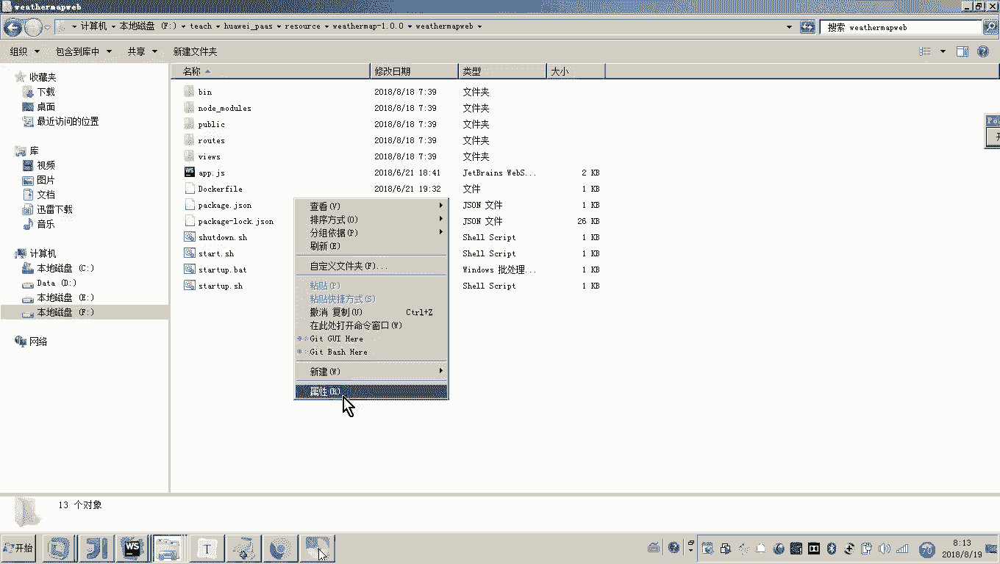
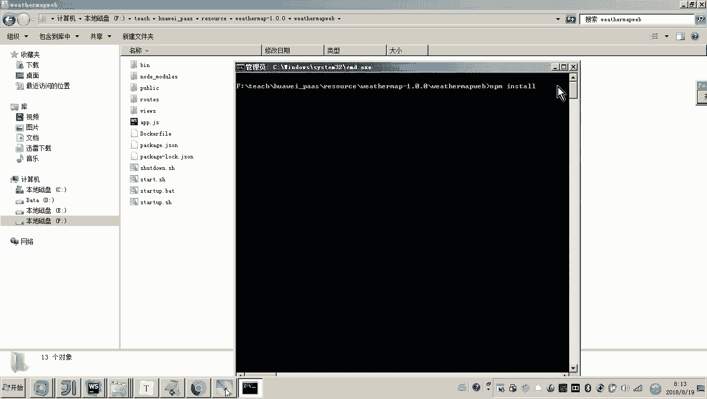
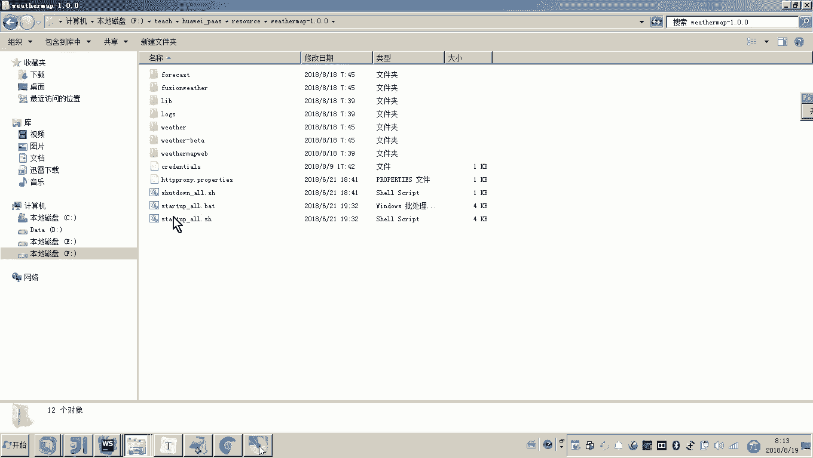
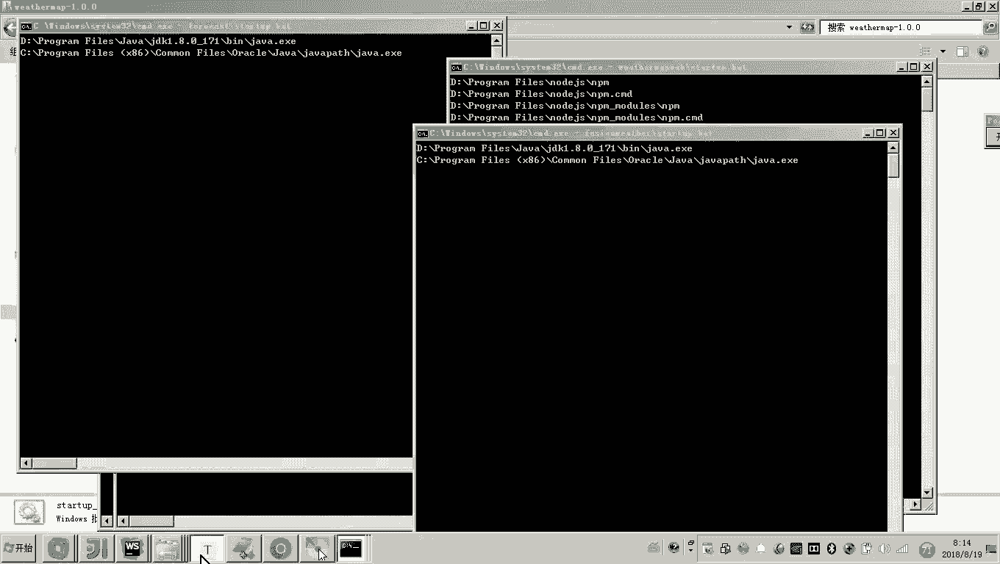
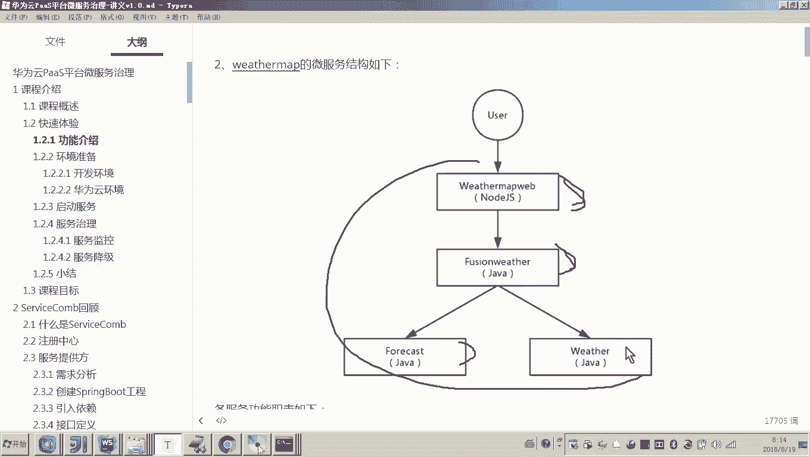
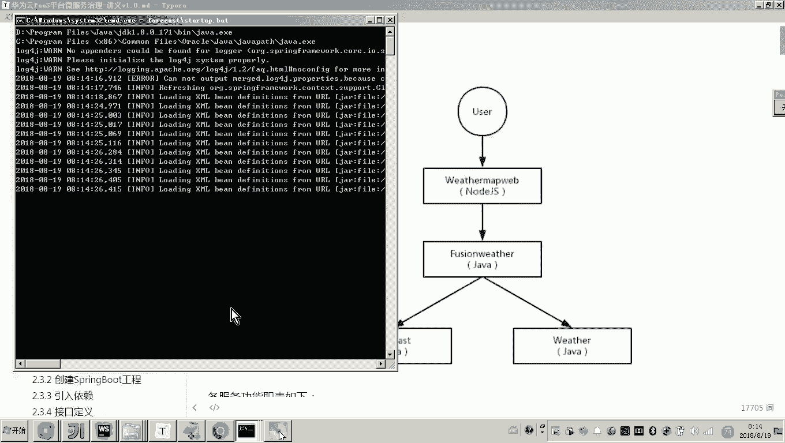
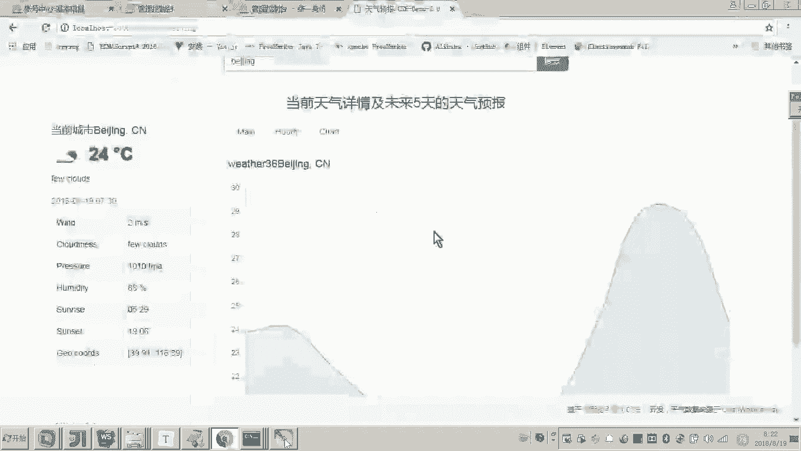

# 华为云PaaS微服务治理技术 - P79：3.快速体验-启动服务 🚀

在本节中，我们将学习如何下载并启动一个微服务示例项目，并将其成功注册到华为云平台的微服务引擎中，为后续的治理功能体验做好准备。

## 概述

我们将通过一个天气预报的微服务示例项目，演示从本地启动服务到服务自动注册到云平台注册中心的完整流程。这个过程是体验云平台微服务治理能力的第一步。



## 下载与准备项目



首先，需要从官网下载示例项目的代码到本地。该项目是一个前端工程，依赖于Node.js环境。



下载完成后，项目目录中不包含前端工程所需的JavaScript依赖包。这些依赖包需要通过NPM包管理工具联网下载。

由于网络原因可能导致下载失败，因此教程中已预先将依赖包安装至本地。如果你想自行安装，操作也很简单。

以下是安装依赖包的步骤：




1.  打开项目前端工程所在的目录。
2.  在命令行窗口中运行命令 `npm install`。
3.  该命令会自动将前端工程所需的所有JavaScript依赖包下载到当前目录的 `node_modules` 文件夹中。





至此，项目所需的 `weather-map` 前端依赖包已准备就绪。

## 启动本地微服务

现在，我们可以开始运行整个微服务项目。

运行的方法是双击项目根目录下的 `startup.bat` 批处理文件。

点击运行后，系统会启动一系列命令行窗口。每个黑窗口都代表一个独立的进程，即一个微服务实例。这个示例案例包含了多个微服务，例如：

*   前端工程
*   网关微服务
*   天气预报微服务
*   当前天气查询微服务

这些窗口的启动，意味着所有本地微服务都已成功运行。

## 访问与验证服务

服务启动后，我们需要验证其是否正常运行。

根据讲义指引，在浏览器中访问指定的本地地址（例如 `http://localhost:8080`）。

首次访问时，页面加载可能较慢，并可能出现“获取天气数据失败”的提示，这是因为服务需要联网获取真实的天气数据。刷新页面即可。

页面成功加载后，其功能包括：

*   左侧默认显示“深圳”城市的当前天气情况。
*   右侧显示未来一段时间的天气预报，并配有图形化展示。
*   在搜索框中输入其他城市名称（如“北京”）并回车，即可查询该城市的天气。

此时，我们访问的所有数据都来源于本地启动的这些微服务，证明本地服务集群已成功运行。

## 关键配置说明

在将下载的ZIP包解压并直接运行前，还需要完成一个关键配置，即设置华为云平台的访问密钥（AK/SK）。

配置文件位于 `weather-map` 目录下的 `env` 文件中。配置格式如下：
```bash
# 华为云访问密钥配置
ACCESS_KEY=你的AK
SECRET_KEY=你的SK
```
密钥来源于华为云平台。登录云平台后，依次点击“账号” -> “管理我的凭证” -> “管理访问密钥”。如果没有密钥，需点击“新增”并完成手机验证，系统会生成并下载密钥文件。打开该文件，将其中的`Access Key Id`和`Secret Access Key`分别填入配置文件的对应位置。

正确配置密钥后，再运行 `startup.bat`，所有微服务才能正常启动并与云平台通信。

## 服务注册到云平台

我们的最终目标是实现云平台对微服务的治理。云平台之所以能感知和管理微服务，是因为微服务在启动时，已经将自身注册到了云平台的服务中心。

与我们之前学习的Spring Cloud等框架类似，微服务治理需要一个注册中心。在本示例中，注册中心并不在本地，而是位于华为云平台。虽然微服务进程运行在本地，但它们已经与云平台的注册中心建立连接，并将服务信息注册了上去。

我们可以通过以下步骤在云平台查看已注册的微服务：

1.  使用你的账号登录华为云控制台。
2.  在服务列表中找到并进入“应用服务”。
3.  选择“微服务引擎 CSE”。
4.  在CSE管理界面，点击“微服务目录”。

在微服务目录中，我们可以找到名为 `weather-map` 的应用。其下展示了注册成功的三个微服务：
*   **gateway**: 网关微服务。
*   **forecast**: 提供未来天气信息的微服务。
*   **weather**: 提供当前天气信息的微服务。

每个微服务名称旁的“实例数”表示该服务正在运行的进程数量。例如，`weather` 服务显示有两个实例，这对应本地启动的两个不同版本的服务进程。`forecast` 和 `gateway` 服务各有一个实例。

至此，我们成功实现了：本地微服务启动 -> 自动注册到公网云平台注册中心。这是利用云平台进行微服务治理的第一步。后续课程将详细讲解如何开发自己的服务并注册到云平台。

## 总结



本节课我们一起完成了微服务治理的快速体验第一步：启动服务。我们学习了如何准备示例项目环境、启动本地微服务集群、验证服务功能，并理解了通过配置AK/SK将本地服务注册到华为云微服务引擎（CSE）的关键过程。现在，服务信息已在云平台可见，为后续学习流量治理、灰度发布等高级功能奠定了基础。