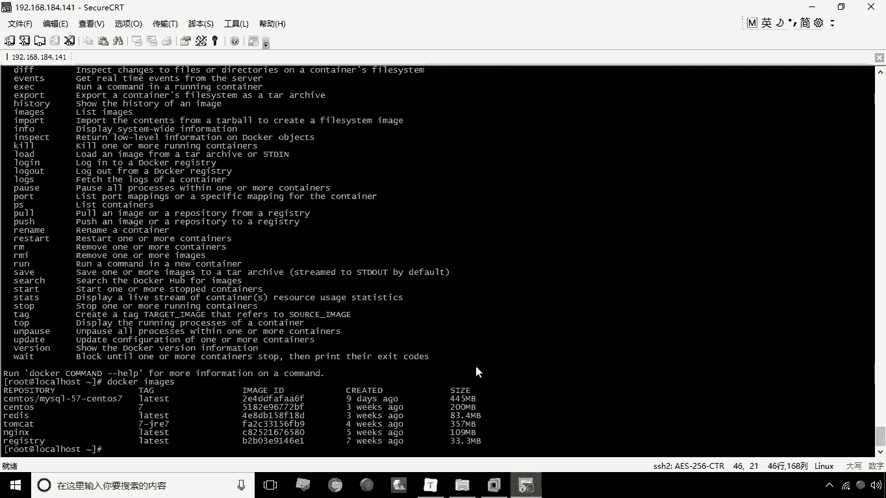
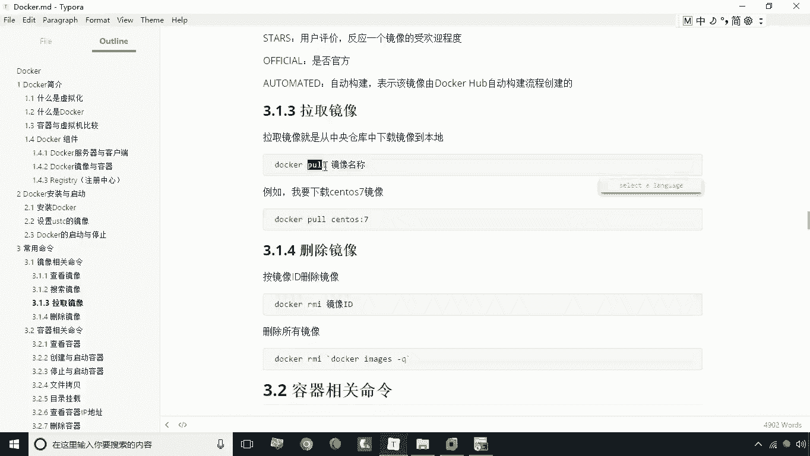
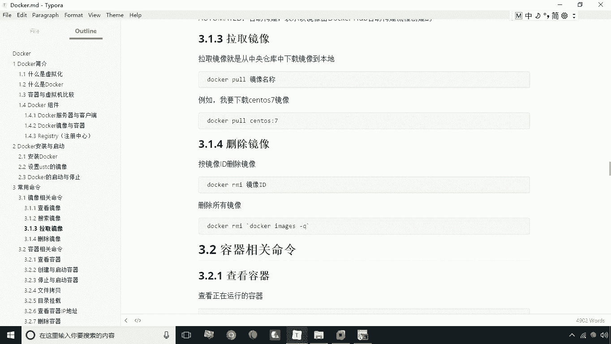

# 华为云PaaS微服务治理技术 - P7：07.镜像相关命令 - 开源之家 - BV1wm4y1M7m5

好咱们现在呢来学习第三小节的内容，常用命令，那么常用的命令呢其实主要包括两大类，第一大类呢就是镜像相关的操作，第二个方面呢就是容器相关的一些操作，好我们首先来看一下第一个就是镜像相关，镜像相关的命令呢。

咱们先看一下第一个命令就是要查看镜像，那么所谓查看镜像呢，就是查看你本地啊已经存在哪些镜像。

咱们来看一下啊，这时候我们用docker命令docker，image images这个命令大家看一下呃，当我们输完这个命令之后，大家会看到有这么一个列表对吧，那么列表第一行就是指的是标题啊。

那第一个repository啊，那这个是什么呢，就是我们指的这个镜像的名称啊，这一列指的是镜像的名称，那么镜像名称后面有一个tag是什么呢，就是标签，这个标签是什么意思呢，就是一般条件来说呢。

就是这个镜像的一个版本区分啊，就是一个版本区分，因为我们说镜像很有可能会出现重名，那么重名的话有可能就是版本有区别啊，所以通常我会把版本作为set the t，还有呢就是后边有一个什么image id。

就是我们的镜像id，这个镜像id呢就是一个唯一的一个id，是一个唯一的id，那么后面这部分呢created就是什么呢，creating呢就是这个这个镜像啊，它所产生它所创建的时间啊。

他创建的时间有多长时间，还有呢就是后边就是size，就是这个镜像所占用的大小啊，所占用的大小，这是我们说的这个呃，关于第一个命令，那我们说当我们在刚刚装完的docker之后呢，其实你在输这个命令。

你是看不到这些数据的，你之所以能看到这些数据，是因为我给大家所提供的这个森，这个这个森透S镜像已经下载好了，这些镜像了啊，这些镜像是已经提前下载了，那么这样的话，同学们就可以在没有网络的环境下也可以啊。

就是学习学习和练习本章的一些内容啊。

这是我们说的一个第一个命令就是啊查看镜像，第二个我们要学习的这个命令呢，就叫搜索镜像啊，搜索镜像，那么搜索镜像的话，就是我们搜的商是互联网上的这个镜像啊。

搜索的是互联网镜像，那么怎么来做呢，用这个用这个docker search这个命令查询查询什么，比如说我现在要搜索渗透S名称，含有渗透S这样镜像都有哪些好，我们现在就输入这样一个命令。

这时候呢大家看到这个列表中所列出来的，实际上就是什么呢，就是这个所有啊这个镜像名称中，包含渗透S的这么一个查询结果，那我们现在呢就可以基于这个查询结果啊，来进行什么呢，来进行这个啊这个相应的这个下载啊。

就可以对照这个名称来进行下下载。

这是我们说的第二个命令啊，就是搜索镜像啊。

那么搜索镜像呢，这里头包括了一些啊，这个标题的这个字段信息啊，我们来这里简单解释一下内容，就是我们的镜像的名称啊，后面那个部分呢就是指这个镜像的描述啊，就指这个镜像，它是呃它是具体的内容是什么啊。

这里有个简单的描述，Hero stars，Stars stars，这是什么呢，是说我们的星啊，就是我们的什么。

就是它的一个评价啊，用户的评价，那么这个评价数越多啊。

就是好评度就越多啊，就stars后面这个这个字段表示什么呢。

表示的是是否是什么呢，官方提供的镜像是否是官方提供的啊。

啊还有呢就是后边这个是有一个呃，就是automated，就是我们说的是否是由这个dog hub自动构建。

流程所创建的一些镜像啊，这是我们说的一个搜索镜像啊，啊讲完搜索镜像之后呢，我们再讲拉取镜像啊，那么拉取镜像如何拉取呢，这时候我们用的命令叫破啊。

破就拉取，那好我们现在呢就来拉取一个其中一个镜像啊，啊你比如说啊，我们现在拉一个拉取一个哪个镜像呢，doer我们可以拉取这个镜像，total gusto s好，现在我们回撤。

这时候呢当你没有指定这个标签的时候，没有指定这个标签的时候，那这时候呢它就采用的是默认是拉拉test，这么一个，默认的，就是它是一个最后版本的这么一个镜像啊，那么如果说你要指定个具体的这个呃。

只指定具体tag来进行下载的话，我们就加上冒号啊，然后呢这个tag名称就可以了，好大家看一下现在的这种情况呢，就是他正在去下载这个镜像啊，就下载这个镜像，当我们下载成功之后呢，我们就可以通过什么呢。

刚才的image这个命令，来去查看到这个已经下载完成的镜像啊。

这是关于这个拉取镜像啊，那么接下来呢我们再说一下这个删除镜像啊，那么这个删除镜像怎么来删除呢，我们可以按照镜像的id来进行删除，也可以按照镜像名称来删除，那不管是镜像id还是镜像名称。

我们这里头它的命令是什么呢，叫rmi docker，RMI后面是镜像名称或者id啊，但一般来说最好是指定id啊，那么如果说你要删除所有的镜像，那这时候呢我们就可以使用什么呢，可以使用这个命令啊。

就RM后面注意啊，后边这个不是普通的单引号哈，这个引号是什么呢，是你键盘上ESC键，也是左上角那个ESC，在ESC键下面那个那个键所敲出来的字数，并不是那个引号啊，并不是那个单引号的。

那这个这个命令呢就是用来删除所有镜像，删除所有镜像，那这个删除所有镜像呢，这里的部分这个引号里的部分啊，实际上就是也是一个命令，我们可以把这个命令的结果作为什么呢，作为这个命令的参数来执行啊。

这是我们说的这个删除镜像，主要有这么两种两种写法。

好现在呢这个镜像呢已经快要下载完成了啊，一会儿呢我们就可以这个呃，用这个这个刚才下载的这个镜像啊，来练习我们的这个镜像的这个删除好。

接下来呢我们来演示一下如何来删除镜像啊。

嗯比如说我们现在啊，先查看一下我们docker中都有哪些镜像，比如说我们要删除删除这个镜像，那怎么办呢，啊这时候我们就可以小刀RMI，这是我们的命令啊，删除镜像命令，这时候你可以使用这个名称。

也可以使用这个ID啊，我们可以把ID复制一下，好这时候呢他就进行删除了，删除后咱们现在看一下，再通过这个命令，大家看一下，是不是就已经在列表中查询不到了啊，就表示我们已经删除成功了。

呃，那么下面这个命令呢我们就不给大家演示了啊，因为如果说你要把所有镜像都删除掉的话，你后边所有的这个命令都就没法玩了啊，你还得需要重新去去下载啊，这个速度就会比较慢。

好这是我们说的这个关于镜像相关的操作命令，这里需要大家掌握的就是比较长，这四种一个是查查看，另外一个就是搜索啊，第三个就是如何去拉取。

