# 华为云PaaS微服务治理技术 - P7：07.镜像相关命令 🐳

在本节课中，我们将要学习Docker中与镜像相关的核心操作命令。镜像作为容器运行的基础，掌握其管理命令是使用Docker的第一步。我们将从查看本地镜像开始，逐步学习如何搜索、拉取和删除镜像。

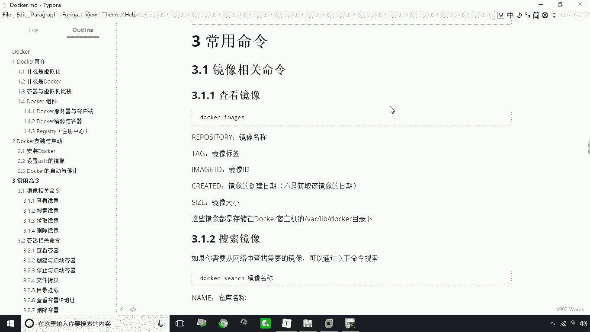

---

## 查看本地镜像 👀

上一节我们介绍了Docker的基本概念，本节中我们来看看如何管理镜像。首先，我们需要知道如何查看本地已经存在的镜像。

使用 `docker images` 命令可以列出本地所有的Docker镜像。

```bash
docker images
```

以下是该命令输出结果中各列的含义：
*   **REPOSITORY**：镜像的名称。
*   **TAG**：镜像的标签，通常用于区分版本。例如，`ubuntu:20.04` 和 `ubuntu:22.04` 是不同的镜像。
*   **IMAGE ID**：镜像的唯一标识ID。
*   **CREATED**：镜像的创建时间。
*   **SIZE**：镜像所占用的磁盘空间大小。

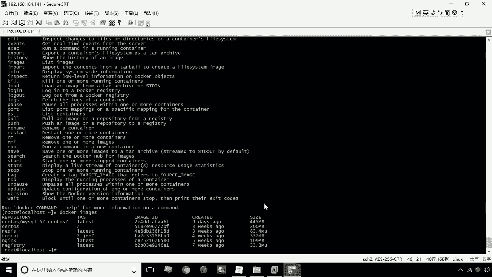

> 注意：新安装的Docker执行此命令可能没有输出。课程提供的环境中已预下载了部分镜像，以便离线学习和练习。

---


## 搜索远程镜像 🔍

了解如何查看本地镜像后，我们可能需要从互联网上的镜像仓库（如Docker Hub）查找所需的镜像。这时就需要使用搜索命令。

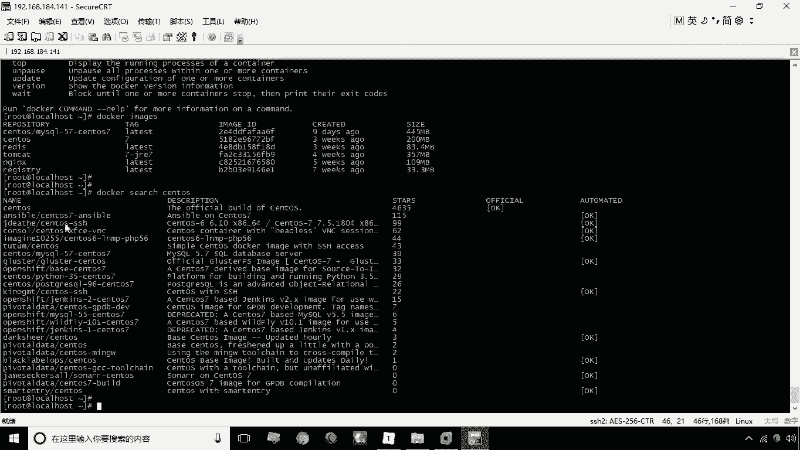

使用 `docker search` 命令可以在Docker Hub等仓库中搜索镜像。

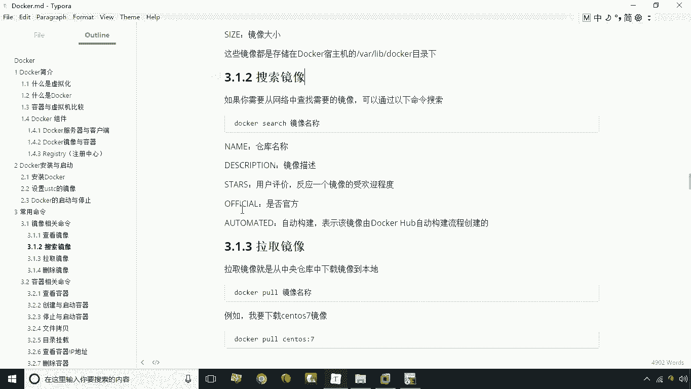

```bash
docker search centos
```

以下是搜索结果中各字段的含义：
*   **NAME**：镜像的名称。
*   **DESCRIPTION**：镜像的简要描述。
*   **STARS**：用户的点赞数，可以理解为镜像的受欢迎程度或评价。
*   **OFFICIAL**：标识是否为官方提供的镜像。
*   **AUTOMATED**：标识是否由Docker Hub的自动构建流程所创建。

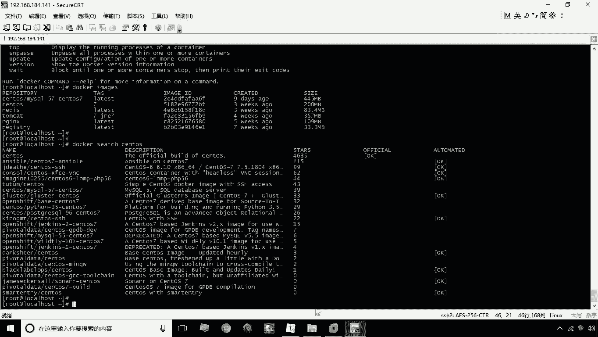

---

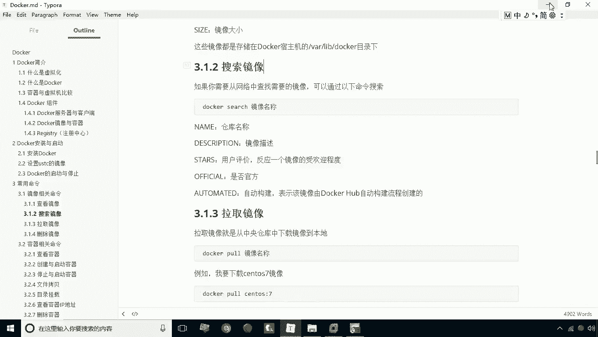

## 拉取远程镜像 ⬇️

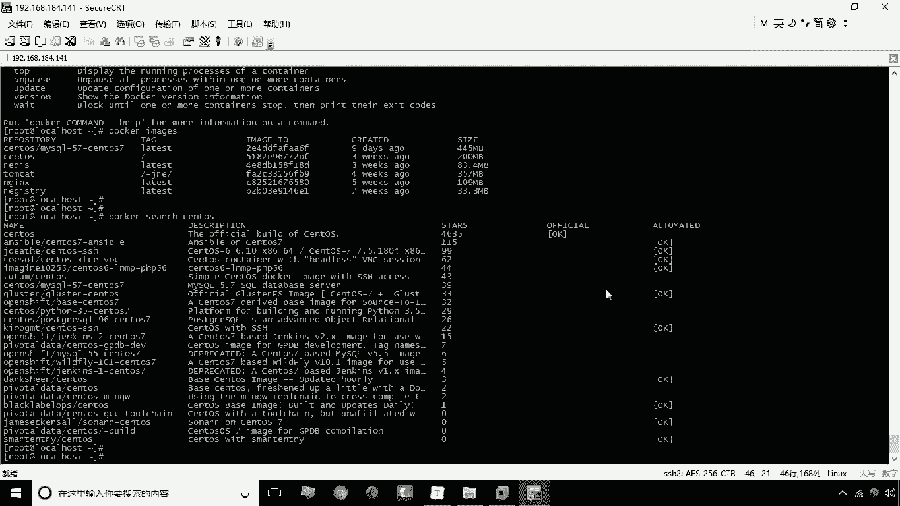

搜索到合适的镜像后，下一步就是将其下载到本地，这个过程称为“拉取”。

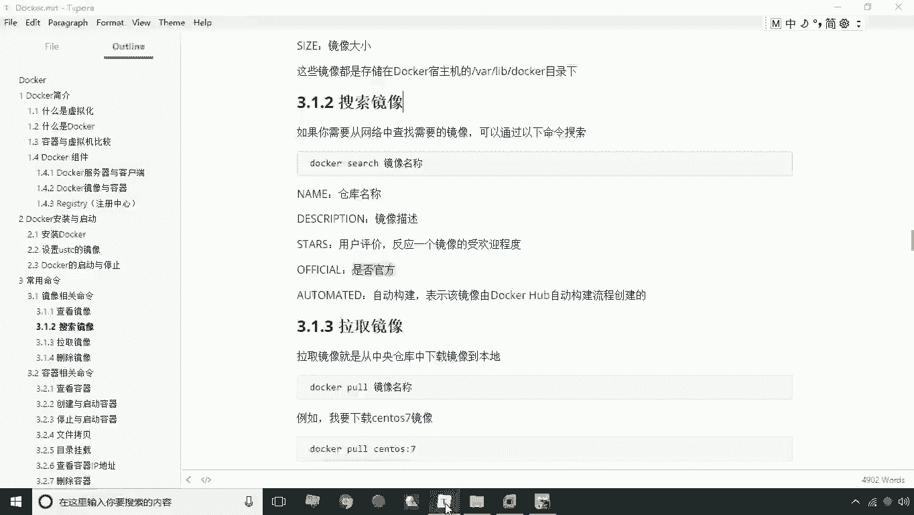

使用 `docker pull` 命令可以下载指定的镜像到本地。

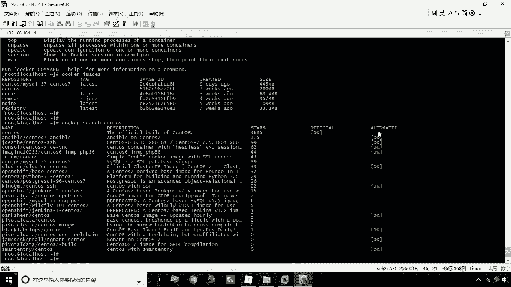

```bash
docker pull tutum/centos
```

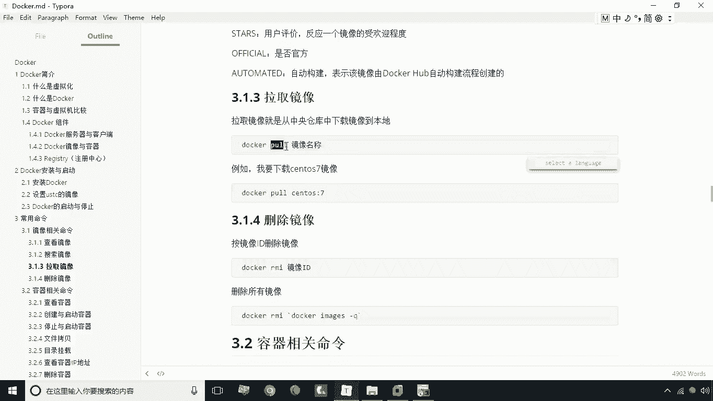

*   如果不指定标签（TAG），命令会默认拉取标签为 `latest` 的镜像（通常代表最新版本）。
*   若要拉取特定版本的镜像，需要在镜像名后使用冒号指定标签，例如：`docker pull ubuntu:20.04`。

拉取完成后，可以再次使用 `docker images` 命令确认镜像已成功下载到本地。

---

## 删除本地镜像 🗑️

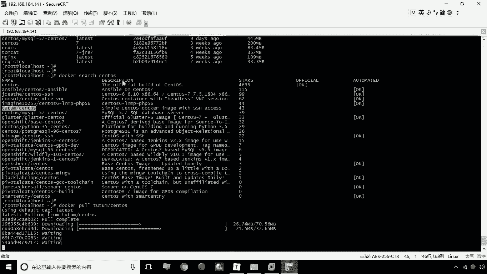

当本地镜像过多或不再需要时，可以将其删除以释放磁盘空间。

删除镜像的命令是 `docker rmi`，可以基于镜像ID或镜像名称（包含标签）进行删除。

```bash
# 通过镜像ID删除
docker rmi <镜像ID>
# 通过镜像名称删除
docker rmi <镜像名称>:<标签>
```

> 提示：通常建议使用镜像ID进行删除，以避免因名称重复而导致误删。

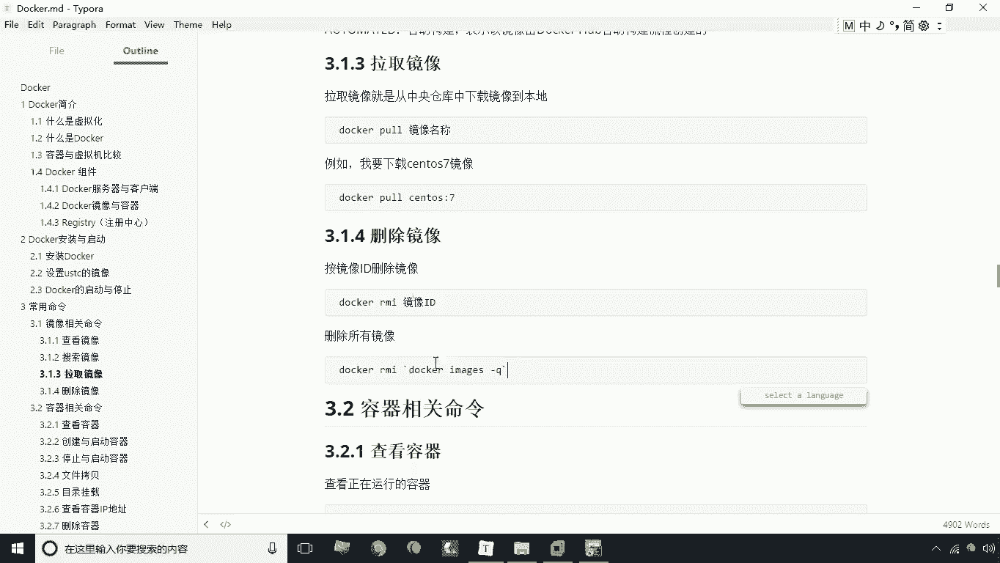

如果需要删除所有本地镜像，可以使用以下组合命令：

```bash
docker rmi $(docker images -q)
```

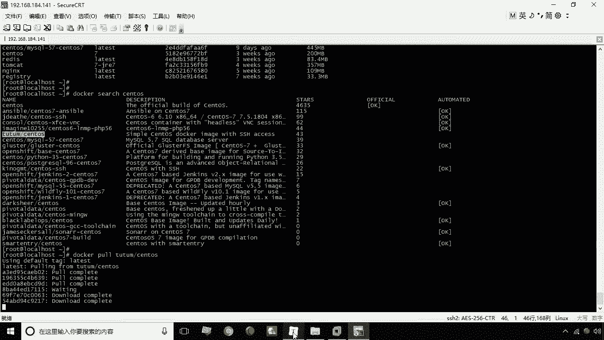

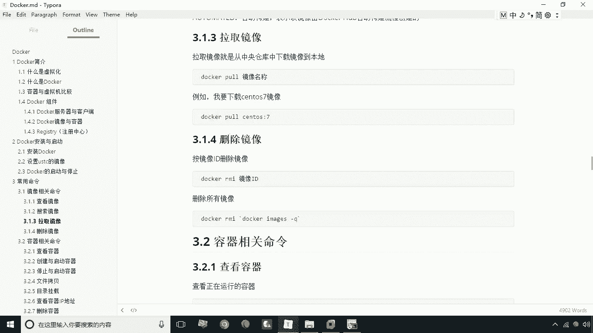

*   该命令中，`docker images -q` 会输出所有镜像的ID列表。
*   `$(...)` 会将这个ID列表作为参数传递给 `docker rmi` 命令，从而实现批量删除。

> 警告：删除所有镜像的操作不可逆，请谨慎使用。删除后如需使用，必须重新拉取。

---

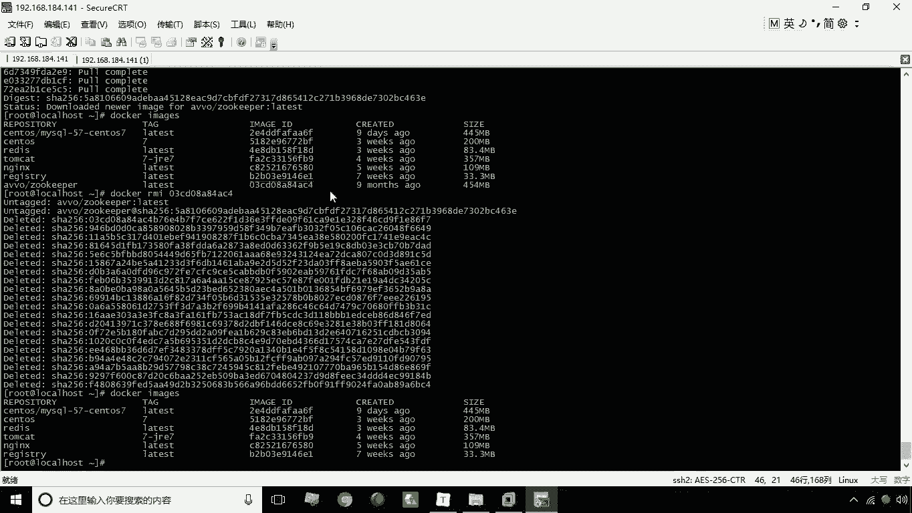

## 总结 📝

本节课中我们一起学习了Docker镜像的四大核心操作命令：
1.  **查看镜像**：使用 `docker images` 命令列出本地所有镜像及其详细信息。
2.  **搜索镜像**：使用 `docker search` 命令在远程仓库中查找可用镜像。
3.  **拉取镜像**：使用 `docker pull` 命令将远程镜像下载到本地。
4.  **删除镜像**：使用 `docker rmi` 命令删除本地指定的或全部的镜像。

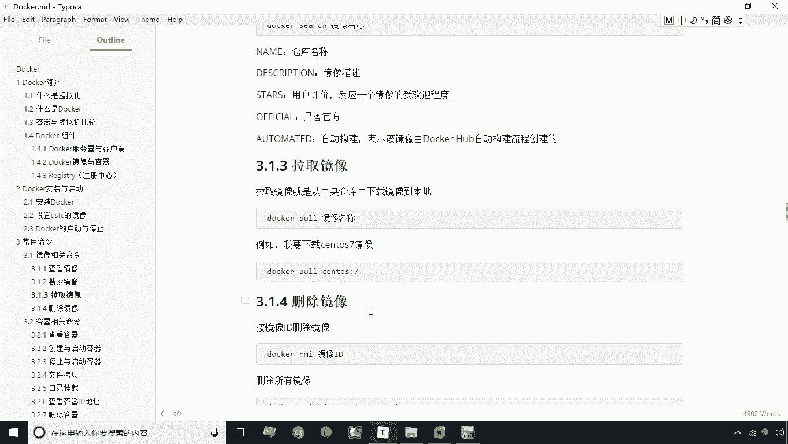

熟练掌握这些命令是高效管理和使用Docker镜像的基础。下一节，我们将学习容器相关的操作命令。