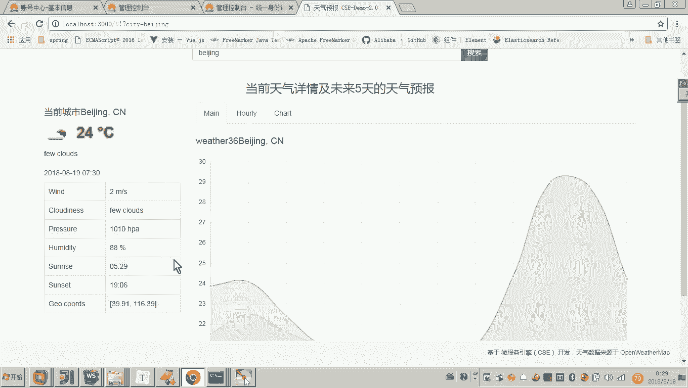

# 华为云PaaS微服务治理技术 - P80：4.快速体验-服务治理和课程目标 - 开源之家 - BV1wm4y1M7m5

好，那下边呢我们就来看一下这个weer map的哎微服务哎，如何在云平台进行治理。

刚才我们已经完成了服务的启动，并且呢这个服务呢信息已经注册到云平台。在云平台的这个微服务引擎的这个界面中，服务目录里边显示的就是已经注册到云平台的这些服务实例。好，那现在呢我们就点击这个菜单。

叫服务治理这个菜单。我们看到这个界面，在这个界面当中呢，我们主要看前边第一个啊，后边呢都不是我们说的这个wether map，我们就不要看了。我们看前边这个叫wether map。

本身这个是不是就已经亮起来了，说明现在这个服务是不是就当前正在用，对吧？好。😊，那么这个图形啊，各位我们来看一下能看懂吗？啊，那么上边这个实例。

一这个fusion weatherer这个是不是就是我们说的那个网关服务啊，就是说我们现在前端前端要去访问哎，要去搜索访问，是不是首先去请求到一个叫网关的这个服务对吧？

fusion weatherer然后后边fusion weatherer它是不是就会把这个请求哎，转发到具体的这个微服务当中，这个具体的微服务是是有哪几个服务呀，是不是服务总共有两个，但是实例有3个。

因为这个weather刚才我说了这个当前天气查询的这个服务，它有它启动了两个实例对应了两个版本啊，然后呢还有一个叫focast这个是未来天气查询的这个服务。😊。

那这个箭头其实是不是就表示了这个网关要请求这个微服务来获取数据啊？所以说这是他们之间的一个什么调用关系吧。哎，好，那你看到这个图形，哎，包括你看到这个服务目录里边的这些哎这个这个这个这个信息。

是不是就是说明了这个服务已经注册到注册中心，并在服务治理页面呢，也能看到这个服务当前是亮的，说明这个服务实力当前已经正在运行吧。😊。

好了，那么有人说老师，那你怎么去治理呢？这个治理微服务啊，哎我们应快速体验，因为治理微服务包括很多的策略啊，一会儿我会简单的介绍一下。😊，那么这个服务治理就是用云平台哎，用图形化界面。哎。

快速的来对服务进行监控和管理。首先第一个我们来看服务的监控。那么下面这个图呢是服务监控的一个示例图。那你看到这里边密密麻麻的写的很多的这种什么呀，类似于这种指标，对不对？指标。

那这里边呢对指标呢也有一个大概的解释，大家可以简单了解一下。好呃，一会儿呢我现在就打开这个图形。好，那这个图形怎么去打开呢？这个是这是一个示例图嘛？

我们说我想现在看一下我们现在这几个服务的一个什么一个指标。哎，就是在它这个监控的示例图，那怎么看呢？哎，那这里边其实我们就干嘛呀？点击点击我们点开了之后。

我们来看这一块东西是不是就是当前是fusion weather，它的一个哎性能情况呀？这里边有什么吞吐量有熔断的状态以及实例数，哎，还有这个什么各种各种这个指标。那这个指标的这个介绍啊。😊。

大家呢来，因为我们是快速体验啊，我们先简单来过一遍，大家知道这个请求数哎，每秒请求多少个。哎，然后呢请求失败的数量，哎，还有这个请求的超时数量。😊，各位，我们现在呢要想有呃。

现在你看到我们这个图形是不是就都是零啊，对吧？因为因为这个图形显示的就是近10秒的信息，所以我们现在来刷新一下啊，我我们准备让它有一些数据嘛？哎，先刷新一下啊，这里边我们来看一下啊。

输入哎郑州来看一下它的城市。好，那现在呢我们再来回过来，大家看现在是不是有数据了。就是说当这个服务已经哎对外哎接收对外外部的请求的时候，你会发现它是不是就已经有数据了。哎，所以这就是一个服务的监控。

那你说哎我是不是就可以通过图形界面很直观的看到这个服务运行的情况呀，这就是微服务治理的一个呃一个内容吧，就是服务监控。好，那现在我们再快速体验另外一个叫服务降级。这个服务降级是什么呢？

降级是容错的一种形式，容错又是什么呢？容错是。😊。

微服务遇到错误的一个什么哎处理的一个能力，就是你不能说遇到错了，呃，那你就就死了。所以容错就是遇到错误的一个处理能力。那这个降级是什么样的处理能力呢，就是当前如果服务的这个什么呢？这个压力比较大。

然后资源不够用。这个时候我们可以降级，哎将一些服务呢给它关掉。哎，比如举个例子啊，现在我们说啊现在我们这个啊双十一来了，现在呢有大量的用户要下单。啊，有大量的用户下单。好，我们呢就可以保留订单服务。

那将其他的比如说哎这个用户一般就不再修改密码了，不再维护个人信息了，我们就可以把个人信息这个服务呢给他先当掉。这样的话，他是不是就把资源给省出来了。这样我们说让这个订单服务呢哎来去用我们系统的资源。

所以这个系统降级的意思，就是当我们说的出现资源不够用的时候呢，我们可以把一些不重要的服务。😊。

啊给它关掉。那就说老师关掉还不简单吗？关掉的话，那你就把这个进程撒掉不就完了吗？注意你进程撒掉了，你是不是将来还要起进程呀？所以我们说如何用这种呃云平台呃图形化界面呃，云平台啊。

这种比较智能的呃来解决这个服务降级的这个问题呢？其实都非常简单了。比如举个例子，现在我要把它降级一下，怎么降呢？😊。

啊，我现在呢就想呃只说只查看当前天气，未来的天气呢，不要查看了。未来的天气不要查看，那怎么去降级呢？嗯，你点击一下，点击这个fuion weather，然后呢。

因为这个fe weather是不是要请求未来天气这个forcast请求weather，所以点击fuion weather，然后呢点降级，然后点新增，然后在所有的微服务这里边我们选择focast。

然后因为我们说啊所有的方法当前都要关闭，不要再请求了。那你就所有的方法，如果是某一个方法，那你就选择这一个方法，你看很智能的啊，因为这个微服务提对外提供的是很多方法嘛。

都是对外部请求可以请求它的很多方法。那么现在我们说所有方法都不让访问都要降级。那你就确定。😊，这时候这个降级的这个策略呢就启动成功了。那有说老师这个我应该怎么测呢？各位。

我刚才这个配置是不是就表示这个服务我要把它关掉了，也就是说他是不是就请求不到这个服务了？😊，所以现在各位我们就可以来看一下，来点击天气预报，我们刷新各位在中间这个是不是就空了？

但是这个这个这个当前的这个天气情况，各位你也看到了，它是不是就可以正常显示，为啥呢？因为当前的这个天气的这个服务，我是不是没有把它降级啊？对。

所以各位这是不是就是非常快速的就可以把我们说的这个服务进行降级啊？😊。

哎，那呃也肯定要比你说哎，我们说不想让这个服务跑了，我们把这个进程撒掉，一会儿我们再起来，那不行。那这个是不是就没有我现在演示的这个降级的这种方法，这种呃比较智能一点，对吧？

那就说老师现在我们说呃这个压力过了。哎，我们想把所有服务这个降级放开，那怎么办呢？啊，很简单，你要么把它就删掉就可以了，对不对？要么把它删掉。😊。

看啊我们是不是就把它删掉了，删掉的话，这个降级是不是就解除了？降级一旦解除，各位，你说现在我要再去请求哎，看是不是就有了。😊。

所以我们通过这个企业呢，哎我们就可以非常直观的去了解到嗯通过这个云平台来治理我们的微服务呢，其实呃是非常智能的，哎，是非常高效的，是非常有利于我们去减少我们系统的这个维护的成本。好。😊。

当然这个服务治理这里面包括很多的策略，有负载均衡，有限流容错、熔断哎等等啊，这样我们在这个后期的课程，我们都会去讲这些策略。呃，现在呢我们主要是快速体验。😊。

好了，那到这儿呢，我们是不是就快速体验了一下，就是这个微服务如何用云平台进行治理啊。我们现在小结一下吧。首先我们要想进行云平台来治理我们的微服务。首先我们的微服务是不是要干嘛呀？

要把我们的服务信息部署到呃要把我们的服务信息注册到云平台呀。云平台注册，我们怎么查看云平台注册。刚才是不是都知道了在服务目录，是不是这里边会看到注册成功的服务呀。嗯，好了，那这个服务注册成功之后呢。

我们就可以用服务治理的功能来哎就是通过图形化界面智能的来进行服务治理。各位其实在这个快速体验当中啊，呃，我们说快速体验的目的是什么？就是让你对本次课程的目标有一个直观的理解哎，了解，呃。

但是其实这个快速体验还少了一步啊，因为我们刚才在讲课程介绍的时候，是不是说过，就是我们把微服务采用引擎这个CSE引擎开发完了之后。😊。

我们还要将我们的项目上云，对不对？你可注意啊，可不是说这个呃把我们的服务注册到这个服务中心，就是上云了。呃，这不是上云。上云的意思是什么？就是我们要用云平台进行。😡。

啊，我们要将我们的服务部署到我们的云平台。哎啊最最简单的解释就是我们要把我们的服务哎部署到云平台服务器哎，啊采用这个刀cker容器化技术呢来快速的呃智能的哎来进行部署。😊，好，那是这个快速体验当中呢。

我们没有体验。那后期的课程呢，我们会去讲，到时候我会讲一个呃里边有一个叫什么呢？叫做云容器引擎的东西。好，那通过它呢就可以呃基于这个容器化技术来把我们的这个微服务呢部署到云上。哎，部署到云上。

那部署到云上，哎，结合我刚才快速体验哎给大家演示的功能呢，哎就可以可以通过云平台来治理我们的微服务。😊。

好。😊，那么到这儿呢，我们整个快速体验呢就体验完成了啊，那我希望通过这个快速体验呢，你大概了解哎我们最终的目标是把我们的微服务哎采用CSE引擎开发。然后呢上云啊，最后呢我们用云平台来治理我们的微服务啊。

那这个课程目标哎，我们来看一下本次课程包括三个部分的内容。啊，第一个部分就是采用微服引擎CS来开发微服。第二个，我们要将微服务在华为云上部署。第三个我们要采用云平台来治理。嗯，然后呢。

整个课程呢我们会以全直播课加vaEE学科的一个大型实战综合项目叫学程在线一个在线教育的平台作为课程案例呃，那么来讲解那最终我们会讲解这些知识点。然后最终要实现的就是要把这个学程在线项目啊，部署到云平台。

并且用云平台。😊，来进行什么来进行治理。好，以上呢就是我们这次快速体验。哎，我们也明确了本次课程的什么目标。😊。

