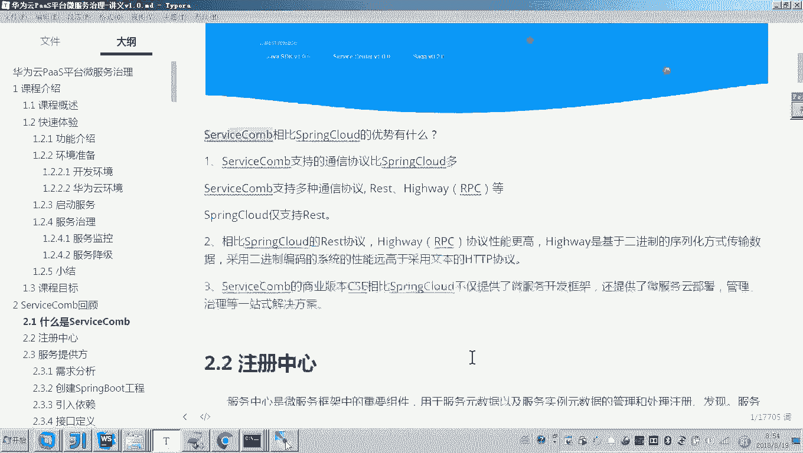
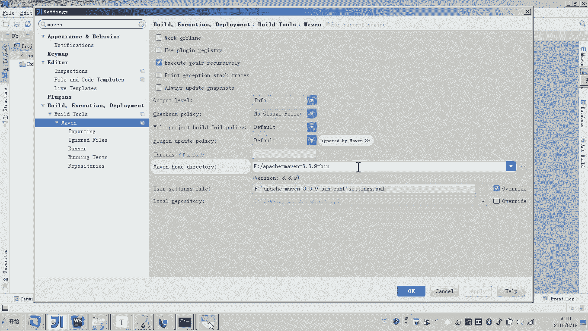
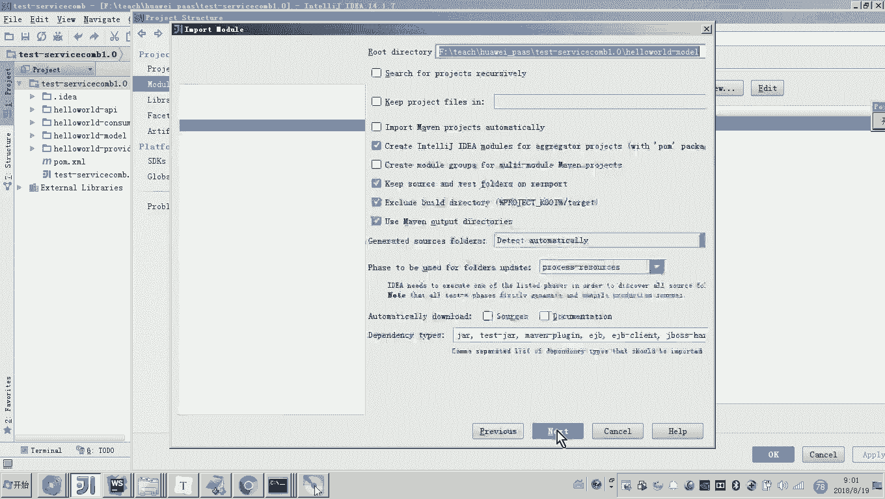
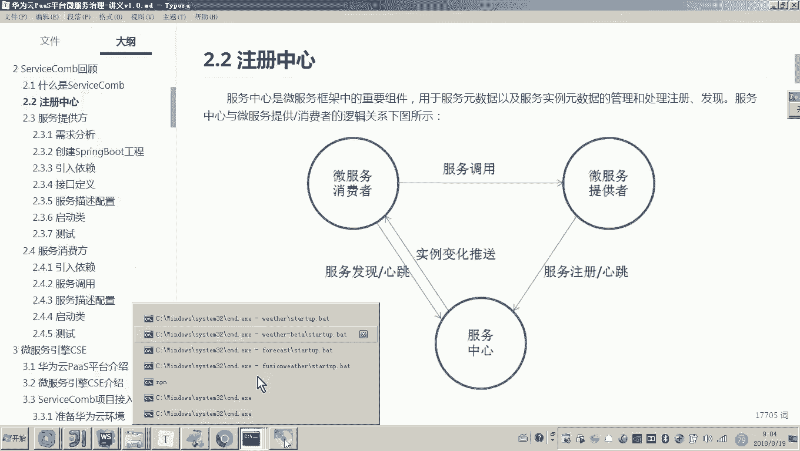

# 华为云PaaS微服务治理技术 - P81：5.ServiceComb回顾-注册中心和导入工程目录 - 开源之家 - BV1wm4y1M7m5

好，那下面呢我们就开始课程的内容讲解了。那么我们说本次课程的第一部分内容是微服引擎CSE的开发，对吧？那么呃我们说CSE是基于呃servicecom的一个商业版本。

所以呃虽然前边我们讲了这个servicecom啊，那么现在呢我们呃我觉得非常有必要给大家回顾一下servicecom的一个开发流程，也是为后边我们去快速的有效的来讲解CSE这个引擎的开发。啊。

我们做一个基础。好，下边呢我们来回顾servicecom。

那么什么是sicecom呢？它是华为在2017年开源的一个微服务框架。呃，那么这个微服务框架呃和这个spring cloud呢都差不多，他们都是。进行微服开发和治理的。

但是servicecom呢其实在华为内部已经用了很长时一段时间了。那么也就是说在内部实践中沉淀了啊非常丰富的经验。那么这个项目呢在2017年12月份呢，也进入了阿帕奇啊孵化器。啊。

作为这个阿法奇的一个开源项目。好，那他这个官方网站的地址呢，大家可以进去看一下啊。好了，那么servicecom和spspring cloud啊，我们的课程之前是不是学过spring cloud呀？

那么他们之间的优势？哎，有什么呀？就是spring cloud相这个servicecom相比spring cloud它有哪些优势呢？哎，我们简单来看一下哎，为什么要说这个优势啊？

因为呃大家应该是有疑问的，说这个我们用spring cloud哎来做微服务开发已经挺好了，啊，为什么还要学习这个servicecom呢？😊。

啊，除了是一个原因，是因为我们要用这个华为云的这个呃微服引擎CSE平台来治理我们的微服。因为它是servicecom的一个商业版本。

哎，如果说我们采用servicecom来把我们这个项目开发出来的话，那么就可以非常无缝的去接入华为云平台。哎，当然如果你的项目是spring cloud呢，也是可以去接入云平台的啊。哎。

所以说这个servicecom呢呃是这个华为云平台的一个基础的一个哎框架。😊。

好，那么另外一个原因呢就是说啊那我我用之前用spring cloud为什么还要用这个servicecom呢？因为它还是有一些优势的啊啊，这些优势有什么呢？呃，第一就是servicecom呢。

它的通信协议要比spring cloud多。哎，因为大家用过spring cloud知道啊spring cloud其实就支持一种协议叫什么HTTP的re对吧？哎，res的方式来开发我们的接口。

但servicecom呢它不光支持res，还支持RPC。😊，好，那么当然相比spring cloud rest的协议。那么这个RPC协议的性能应该是更高的对吧？所以所以我们用servicecom呢。

它这个协议上有优势。哎，另外还有一个就是servicecom的商业版本CSE它是一个平台，我在前面是不是简单介绍过呀。那么它提供了不光有微服务开发的一些框架的技术。

它还提供了微基于云平台的微服务治理的一系列的解决方案。所以这个servicecom的商业版本CSE相比spring cloud呢不仅提供了微服务开发框架，还提供了微服务的云部署管理治理等一站式解决方案。

嗯，这应该是servicecom比spring cloud的优势。😊，好，那么我们现在了解了什么是servicecom。那接下来我因为本次课程是回顾啊，我就不再去详细的讲解它里边的各个API了。

我就把servicecom的这个开发的流程给大家串一下就行了啊。因为后边呢我们用这个讲这个CSE开发呢呃是。😊。

对，基于sfacecom来做的。所以啊我们回顾一下啊，回顾一下第一个注册中心。因为我们要做微服务的这个开发啊，微服务之间要进行调用，是不是要把这个微服务的信息要注册到这个注册中心呀？哎。

那么那这个注册中心呢，当然servicecom呢也是提供的那这个注册中心哎它的这个作用啊，大家可以看这个图应该是比较熟悉的啊，这个微服务呢先把这个。😊，啊，自己哎给他给他干嘛呀。

通过心跳把这个信息注册到注册中心。哎，然后呢，微服务之间要调用的话，它也是从注册中心获取对方微服务的地址呢，然后来进行调用。嗯，好，那现在呢我们把注册中心起起来啊呃，servicecom的这个注册中心。

我们从官网呢把它下载一下，这里面提供了linux和windows两个版本啊。啊，现在我的开发环境是windows啊，所以我就用windows来启动了。呃，来打开我这个目录。😊，然后在这个。注意看一下啊。

在这个目录当中，然后有一个啊下载到的一个windows版本的这个注册中心，啊，就service centererservice centerer。然后我们打开打开之后呢，大家来看啊。

它是呃有两个启动脚本，大家看吧，这个就是注册中心，注册这是注册中心服务，然后上面这个就是注册中心的一个前端什么意思呢？就是你现在要启动注册中心啊，你肯定要启动这个注册中心服务嘛？

这个就是一个进程是不是就起起来了，起起来之后，你说我想哎我想看一下注册中心里边有哪些服务。那你就要通过前端的这个界面，哎来来看了，就看我这个大家可以看到这里这这个界面，这就是一个前端界面，对吧？

所以那你在双击上边的这个脚本。嗯，那就启动了这个前端。好，这个前端启动起来之后呢，大家可以看到它的当前是不是就在30103这个端口啊，所以呢你就复制它，然后呢。😊。

哎，让我们把它贴进去。然后这样的话，我们是不是就进到了这个对进到了这个前端，可以看到。那这里边当前这个服务中心里边是不是就是哎哎有一个默认的这个service serviceice。

这是什么servicecenter，对吧？service center它的这个它的这个本身呢，它这个服务啊，然后其他的我们自己开发的服务这里面还没有啊，然后这里边你也可以看到呃，就是一个统计。

然后这里边是一个服务列表。好，那到这儿其实这个服务中心，我是不是就提起来了，那接下来服务中心我起来之后呢，下边要干嘛呢？是不是就是要对要开发服务提供方和服务消费方对吧？好，呃。

那么这个服务提供方和服务消费方的开发，呃，这怎么做呢？😊。

我们做一个简单的程序，就是hello world啊，大家可以看这个图啊，哎服务提供方就一个客户端来请求哎，我们的这个这这是客户端，对吧？这是浏览器嘛？浏览器来请求到一个叫这是什么？

这是不是一个服务消费方呀？😊，那么这个服务消费方最终要调用我们的服务提供方。哎，然后呢，这个提供方把信息给消费方返回，然后这个消费方，然后把这个信息干嘛呢？给这个前端浏览器返回。

大家可以看到是这样一个流程吧。好，那这样的话我们来看一下，我们开发啊，这个这个这个这个呃回顾的这个hel word这个程序呢是基于spring boot的呃，所以这里面呢注意看啊呃。😊，我们我们这样做。

因为这个工程包括好几个工程啊，所以我就快速的把这个工程给它导进去啊，但是导进去这个工程呢只是一个结构，里面的代码都没有啊。那后我给大家快速的把这个代码写一遍啊。

写代码的过程呢也是让大家去干嘛呀去熟悉这个servicecom的流程，开发流程。😊，呃，在哪里呢？啊，在这里。这就是一个原始的代码结构啊，这里边包括四个工程。这四个工程，我我简单解释一下啊。

这个API就是里边放接口的工程。好，然后呢就是这个啊这是这个模型对象的工程。好，下边呢这是服务提供方的工程，这是服务消费方的工程。好，现在呢我们把它导进去啊，怎么导呢？嗯这儿哎我建一个目录吧。

我单独建一个目录啊，因为在这个这个ressource目录呢，是我提供的一些。😊，一些资料，然后呢，我在在这。建目录。干脆啊干脆这样，我把这个ressource这个下边的这个这几个我给它拷进去，看好啊。

看看怎么弄。那当然了，你我这个ressource目录我会提供给大家，你在你在你的这个需要放代码的这个位置呢创建一个放代码的目录。哎，然后呢这个目录里面是不是包括4个工程呀，然后呢用这个idea。

然后我们来打开刚才的你那个目录，哎，这样的话我们再通过idea来开发。嗯。😊。

找到这个找到我们说的那个目录的位置啊，刚才我是不是建了一个叫做testservicecom1。0，对吧？好，我们打开。这个过程呢稍微有一些慢啊稍微有些慢，那注意看啊。😊，呃，那么我们就。来看一下。

这是我之前的环境啊，不管它好，那现在就打开了。打开这个目录之后呢，因为这是一个新的项目嘛，所以你你首先要做的就是配置ma环境啊，这个mave应该在我快速体验的时候呢，已经让大家安装了3。3。9。

我用的3。3。9啊，但是你要用3。3。0以上的版本啊，所以这里边我这个mave都已经配好了。好，这个ma配好了之后呢，呃那么这里头注意看现在我打开的这个目录里边这些工程。

你看到这个图标其实并不是一个什么并不是一个ma工程的图标，所以你现在是需要做一件事啊，要把这些哎全部导到我们的这个项目当中，要把这些工程的目录啊，哎然后怎怎么做，然后点击inport。

然后这里边我们首先导嗯导mod吧。😊。

好，就这样。

就这样做。好，然后呢完成注意看你看你看都是你一旦导成功的话，这里边是不是有这么一个图标，这个就是一个工程的图标，这是一个目录的图标啊，这不是这不是工程，所以你需要把它一个一个都导进去。好。

然后再import。😊。

然后再导API吧。就是这些工程呢其实就是一个工程的结构啊，里边其实是没有这个详细的代码的啊，好我们快速的把它导进去。快速导进去之后呢，我们就基于这个工程结构呢，然后给大家来快速的提呃。

回顾一下这个servicecom。好。😔。

好，这样的话我是不是就导完了吧。导完了之后呢，注意看一下啊，注意看一下呃，这个是副工程的泡m文件啊，副工程的泡m文件在这个副工程当中呢是包括了一些依赖的库啊，这是这是一些最基础的。比如我要访问my啊。

还有一些这个common的工具类库。嗯，好，然后呢现在大家来看一下这里边啊呃在model当中在model当中，各位哎这里边我建了一个啊类型叫sdent啊。

这个sdent类型呢就是一会儿我在接口里边会用到啊，这个API工程，大家看这个API工程应该是空的对吧？一会儿我在这里边就填接口了啊，然后呢这个是消费者的工程。这里边各位看一下是不是也是空的。好。

只有一个启动类啊，这个启动类是一个什么呀？叫做注意这这还报错了，因为我现在。😊。

注意看一下。你看这个这个。叫服务提供者，我们来看一下。好，这里边是不是就是空的呀？好。注报错这个也没有关系啊啊，因为一会儿我们这个开发顺序啊，我会怎么做呢？呃，我会先做这个服务提供者。

然后再做服务消费者。好，到这儿，其实我们说的这个工程这个结构我已经倒成功了啊。😊，好，我再总结一下。本章节我们是要回顾一下servicecom的开发流程。目的只有一个。哎，我们说第一回顾了流程之后呢。

后边我们要做这个微服引擎CSE的开发呢。哎，我们呢呃就会基于基本上和这个刚才我们这个开发流程是一致的。哎，也是为我们后边CSE开发讲解呢做准备。呃，第二点呢就是呃我们来看呃在回顾的过程当中。

我们就也去再去回回顾一下servfaceicecom的这个开发流程啊，里边用到的呃接口定义呀啊，服务提供者服务消费者他们之间的交互方法呀，我们回顾一下好，那到这儿呢咱们就把这个呃工程目录都已经导进去了。

另外服务注册中心，我们现在是不是已经也启动起来了。好。😊。

