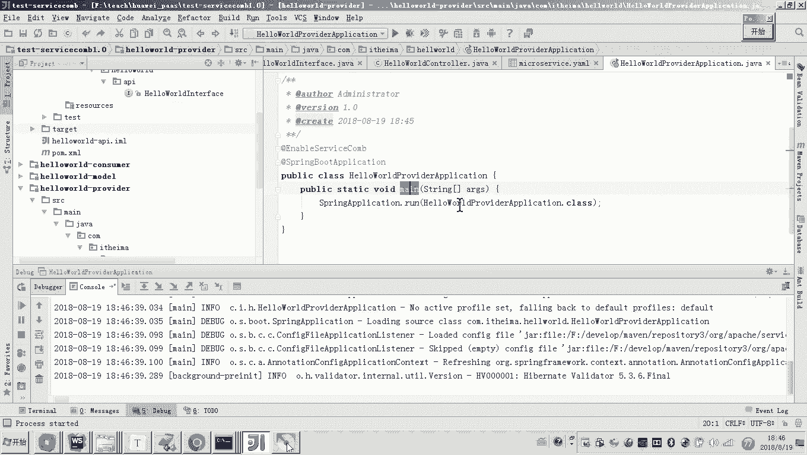

# 华为云PaaS微服务治理技术 - P82：6.ServiceComb回顾-服务提供方 - 开源之家 - BV1wm4y1M7m5

好，那下边呢我们就来实现服务提供方。哎，那首先我们来看一下服务提供方的交互流程。呃，那么这里呢首先它是一个客户端，会请求服务的什么消费方，对吧？呃，请求服务消费方，消费方要提要请求服务的提供方。

那现在我们要做的是不是就是这个呃服务提供方呀？它对外提供一个接口叫做hello啊，然后呢这个接口呢传递一个参数叫内幕。然后呢，这个提供方接到请求之后呢。会给这个请求方。

就是这个服务消费方返回一个student的对象。然后这个消费方最终把这个对象的信息格内容。返回给这个客户端。好，那大概我们了解了这个流程之后呢。

现在呢我们就来呃体验再回顾一下啊这个servicecom的它的开发流程。首先第一步啊，我们首先要干嘛呀？引入依赖，对吧？

这个servicecom呢它的呃java的 sK的包是叫java dependency这个包。嗯，那么我们说为了进行版本控制，我们是怎么做的呢？是在副工程啊。

然后把这个依赖管理就是这个版本控制呢加到副工程。然后在主在子工程，我们呃在子工程啊加入了这个呃一个是这个spring boot的这个启动的包。

还有一个就是呃servicecom和spring boot的一个整合的啊，一个包，还有一个就是bernet的一个校验的包啊，那么这三个包的作用呢，是因为我们是基于spring boot的方式。😊。

来开发servicecom。所以你要把spring boot的这个启动包啊，把它加进去。另外我们呃也要把这个servfaceicecom和spring boot的这个包，那这个包呢是非常重要的啊。

它会呢去加载servicecom的一个一些核心的内库。下边这个主要是用于接口的格式的校验啊，参数格式的校验。所以这个要加。😊。

好，那么我们现在呢就把依赖加进去吧。首先呢我们是先要找到负工程的泡沫。然后呢，我们在这里。把它加进去。好，那这里面你看到是不是有一个版本号的一个什么属性啊，对吧？

所以啊我们是把这个属性我们加到这个pro里边吧。好，那这个属性呢好，这里边呢我就不再敲了，我就直接复制一下，这个属性大家可以看一下它的内容是什呀？是不就是这个java这个SK的包的版本号对吧？1。0。

0M two这个版本。好，然后加进去之后呢各位呃接下来我们说副工程你是加了这个java这个SDK的包的版本管理。那么在子工程子工程就是我们现在要做的是不就是这个服务提供方的这个微服务呀。

所以你在这个服务提供方的微服务的这个文件看好啊，看好啊，别弄错了，这是工程这是不就是这个这个什么提供方的在这你打开然后在这个里边加什么呢？刚才我是不是说过总共有几个包三个包，一个是ring boot的。

😊。

启动包，还有一个是这个provider的这个启动包啊，这个包还有一个什么就是habit validator，然后把这三个包呢加进去。

好，到这儿呢，我们说的这个依赖包呢就讲好了。那加好依赖包呢，下一步我们要做什么呢？是不是就是要定义接口了呀？好，那servicecom呢它的这个开发的流程是非常好的，第一步呢。

我们说叫先定义接口叫契约先行，对吧？所以我们在这里呢，我们先把接口呢定义一下。好，那这边定义这个接口怎么定义呢？刚才我们是不是也看的需求了？是不是就是请求一个杠hel传一个参数，对吧？

返回一个sdent好，那么我们按照这个需求呢来定义这个接口呃，那么首先呢我们定义一个interface的这个接口的类。好，然后在这里呢我们新建一个interface好，然后呢在这个里边呢。

我们说这个接口。😊，这个接口。它返回的是不是就是student，对吧？然后传递的参数是不是就是一个什么呀？一个字符串，对吧？对，没错，好，那这样的话，我们这个接口是不是就定义成功了吧？定义成功接口之后。

下一步下一步是不是要做这个接口的实现呀？在API里边是接口，你会发现这个接口是一个非常普通的接口。而现在我们要做这个接口的实现的话是在哪里呀？😊，因为你现在是不是要做服务提供方呀。

所以你要在服务提供方这里边，我们写一个类。在这里，而这个类呢是需要实现这个接口，说白了就是写这个这个接口方法的实现类，对吧？好呃，那么现在呢我们把它写一下。好，这里边我们建一个类。😊，列明。

然后呢让他干嘛呀？实现实现刚才我们是这个写的这个接口，然后我们把方法呢给它写出来。好，那现在我们来看吧，回顾一下当初我们是怎么写这个servicecom的这个接口的？首先嗯它有很多种这种协议啊。

RPC啊res是不是都支持啊？所以我们说那我现在要用rest。嗯，那你就用呃写一个servicecom的一个注解，叫做rest。😊，然后在这个里边呢，我们来看这个注解，它有一个什么属性。

是不是就就是smer ID呀？然后你把它写进去这个smmer ID怎么理解呀？大家还有印象吗？😊，这个是不是就相当于什么呀？我们说的这个接口的一个命名空间，对吧？通常来说。

这个s ID和我们这个接口的这个什么呀？和我们接口的这个类呢是一一对应的就可以了。嗯，好，那这里边呢我们就给它随便起一个名字吧，只要你注意啊这个名字你不是随便起的。比如说你这叫A是吧？然后呢。

将来另外一个s ID另外一个与它毫不相关的接口也是sma a ID是A那就不行了，对吧？所以就是说。😊，你最好起的这个对这个s ID呢和这个这个这个这个类名呢哎我觉得呃保持一对一的关系就可以。好。

那这个是hello world controllertroller。好，我们叫hellow world。😊，好，那么这个注解是servicecom的注解。啊认为我们现在做的开发是不是基于spVC。

基于sVC的方式来开发servicecom的接口啊。所以啊这里边呢我们说哎你要是基于sVC开发的话，那你需要在你的类上边必须要写上这个request的麦品。😊。

假如说现在它就是我们说最终我们是不是要是杠hello，对吧？所以我们先在这儿哎在类上面加一个啊杠，然后在下边我们再来，比如说它是get请求，我们加一个比如pass等于hello。😊。

这样的话是不是就是这个接口的这个方法所对应的接口的路径，是不是就是杠hellow了呀？对。好，那么这里边呢它是不是传入一个参数叫name幕呀？然后这里边它要返回一个sdent。

这里边呢我们就因为是测试嘛，所以我就写一个。😊，啊，对我就硬编码写一个对象，然后把这个对象的这个什么呀内蒙的属性把它设进去。最后呢把这个对象返回。各位到这儿，我们这个接口的实现就写好了，就这么简单啊啊。

那那当然了，那复杂的话，那这里边你肯定将来我们说你要写复杂，这里边是不是还要注入service呀？然后呢，service的业务逻辑，对不对？😊，那这里面我们就不写service了。

因为我们是回顾一下servicecom的开发流程。好，那么这个接口实现写完之后，接下来干嘛呀？😊，因为现在你把这个写完了之后，嗯，你的这个微服务的这个名字呀，微服务将来暴露的端口啊。

其实你是都没有去配置的对吧？所以你要在resources下边，我们来配置一下这个servicecom的微服务信息。嗯，好，那怎么配呢？还有印象吗？首先在这儿呢，我们是不是要建一个文件呀。

那这个文件的名字叫啥还有印象吗？对，叫my什么呀？my serviceYAML。😊，对吧然后在这个里边是什么信息呢？这个配置文件的哎，这个这个内容呢，我给你拷过来，然后我给你讲一下啊，第一个信息是什么？

是不是就是我们说的应用名或者叫项目名，对不对？对，也就是说当前我们是不是这整个的工这一堆工程是不是都属于一个项目呀？叫hel world吧。对，所以这个项目的这个名字啊。

你们一定要咱们要定要起定一个固定的什么意思啊？因为这个项目包括很多微服务，所以这个项目的名字，每一个微服务叫的这个项目的名字是都是一样都所属于这个项目嘛？

这个微服务是不是就我们说的这个叫hel world的服务提供方啊，这个微服务所属于哪个项目，就这个hel project好，然后这个微服务的版本号，这个是什么呀？是我这个r的接口所暴露的端口号哎。

然后还有什么？哎这个应该大家知道吧，是不是就是我们说的注册中心啊？我现在是不是已经在本地起的一个注册中心。😊，它的端口是不是就是30100啊？好，然后呢，这样的话我们现在就把这个配置呢就配好了。😊。

配好了之后，下边我们要启动这个工程，因为它是基于spring boot的话，所以怎么办呀？你是不是还要编写一个spring boot的启动类，对不对？嗯，那在这儿呢我们再写一个什么启动类吧。好。

那这个启动类呢，大家应该写过spring boot的这个启动类怎么写的呀？😊，首先呢这里边是不是用一个闷方法是不是就可以啊？然后在这里边呢，我们用一个spring application，然后点什么呀？

run，哎，然后在这儿运呃run，然后后后边什么？😊，后边的话是不是就是上注解了吧，然后呢，现在是spring boot的注解，我们加一个spring boot注解，对吧？然后另外的话就是这个项目。

我们是不是用了这个servicecom的这个微服务框架呀？所以你在这呢要激活servicecom的核心功能。好，所以这里边我们用这个enable servicecom。这样的话，我们这个就写好了啊。

写好了之后，现在我们是不是就可以启动了呀？好，那么现在我们先来看一下我这个注册中心。这个注册中心里边是不是没有服务呀？那如果正常的话，我只要启动成功，这个服务是不是就像我们这个这个注册中心注册成功呀？

好，那现在我们就启动方法，然后来运行一下，看一下啊。😊。

好，那现在呢我们来看他就开始去运行这个服务提供方的工程。然后我们仔仔细观察这个日志啊。好，那这个日志呢我们看到它呃是不是已经就启动成功了，对吧？好，启动成功之后呢，我们来刷新这个注册中心。

你会发现这个服务是不是已经成功注册了。好，那么点开啊，我们来看一下，其实在这里边我们看到它显示的这个因为当前这个服务起提起来之后呢，它其实也没有被别人调，对吧？它也没有调别人，对不对？所以这两项都是空。

然后呢，你看服务契约，这个应该大家能看得懂。因为它是基于这个swagger工具来生成的这个接口文档，所以大家来看一下这个它的这个接口文档的这个什么呀？

这个这个这个这是这是不是就是swagg的这个接口描述呀嗯。😊。

那你看一下他这个浏览器的，不是这个这个接口的地址是不是就杠好了啊？嗯，然后他请求的这个参数是不是就是名字是不是叫name，然后他返回的这个结果是不是就是一个什么dent的这个对象啊dent的这个对象。

比如说老师他这个name和A是在哪来呀？其实你可以看一下啊，看一下它这个接口啊，看一下这个接口，你点一下，你看这个name age address这些东西是不是都是来源于stdent的这个模型的属性啊。

好，所以到这儿来说，我们说这个服务提供方的接口，我们是不是就开发完成了吧。那么啊现在你也看到了在注册中心当中，这个服务已经注册成功了。好。

那到这儿呢我们就完成了这个service回顾当中的服务提供方的开发。😊。

