# 华为云PaaS微服务治理技术：P82：6.ServiceComb回顾-服务提供方 🚀

在本节课中，我们将学习如何基于ServiceComb框架开发一个服务提供方。我们将从理解交互流程开始，逐步完成依赖引入、接口定义、实现类编写、配置文件设置以及最终的服务启动与验证。

## 概述

服务提供方是微服务架构中对外提供具体业务功能的核心组件。本节课的目标是回顾ServiceComb开发服务提供方的标准流程，实现一个简单的“Hello”接口，该接口接收一个名称参数并返回一个Student对象。

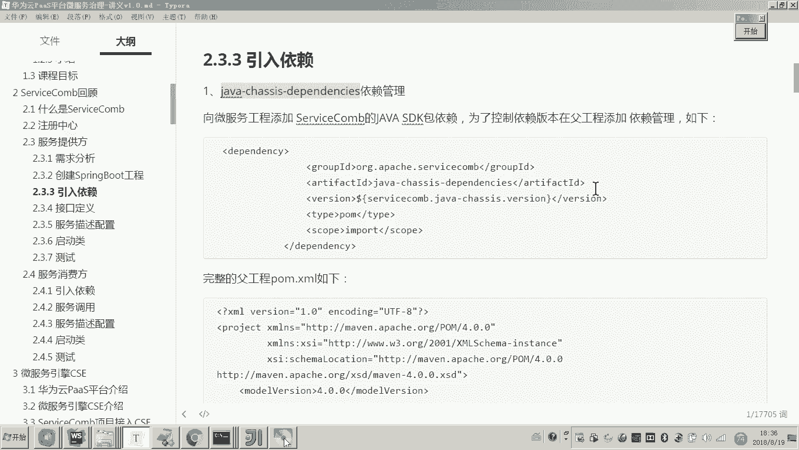

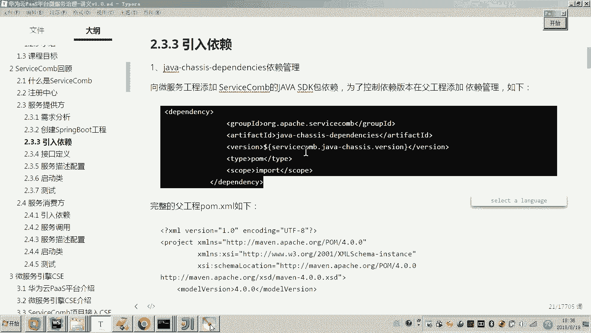

## 服务提供方交互流程

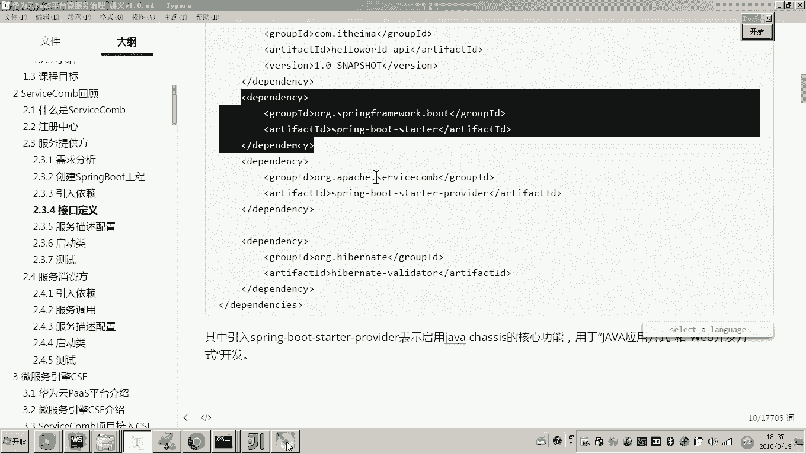

在开始编码前，我们先明确服务提供方在整个调用链中的角色。整个交互流程如下：
1.  客户端向服务消费方发起请求。
2.  服务消费方将请求转发给服务提供方。
3.  服务提供方处理请求并返回结果（一个Student对象）给消费方。
4.  服务消费方将结果返回给客户端。

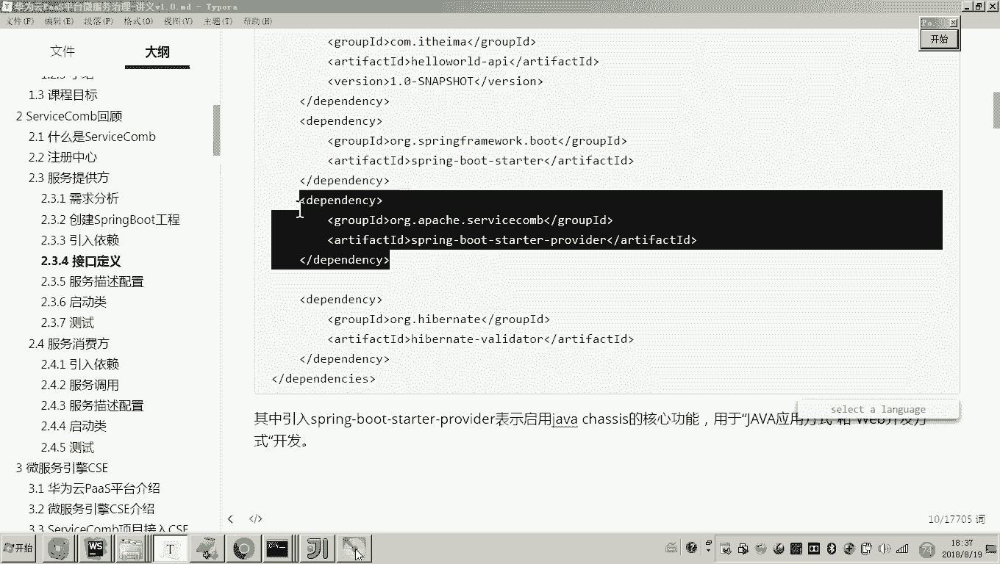

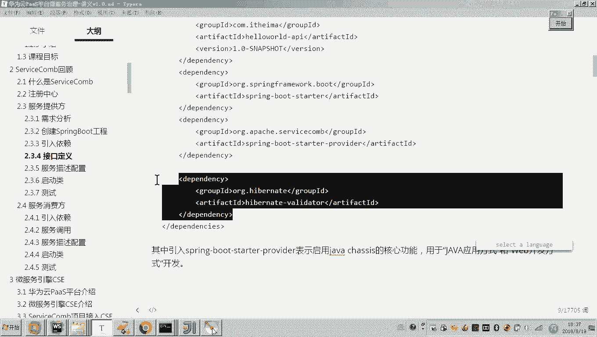

本节课，我们将专注于实现上述流程中的第3步，即服务提供方。

## 第一步：引入项目依赖

ServiceComb开发遵循“契约先行”的原则，但第一步通常是配置项目依赖。我们采用Maven多模块项目结构，在父工程中进行版本管理，在子工程（服务提供方模块）中引入具体依赖。

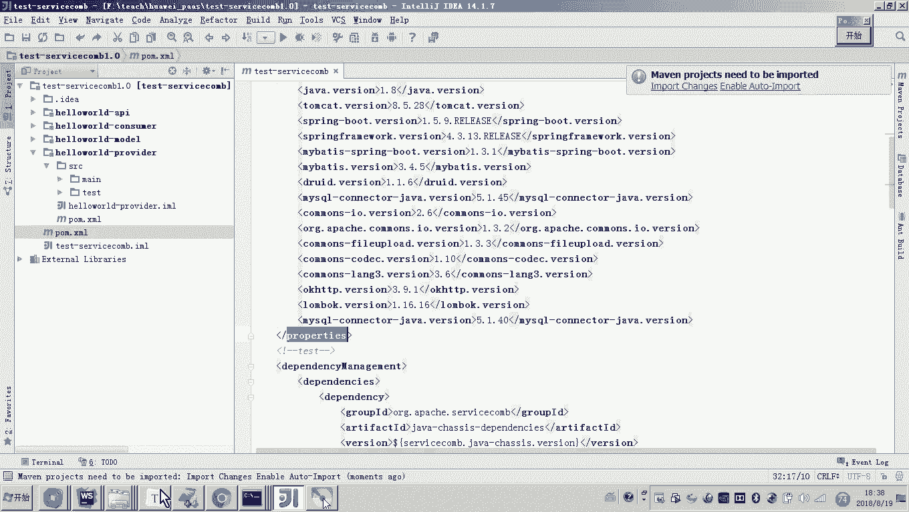

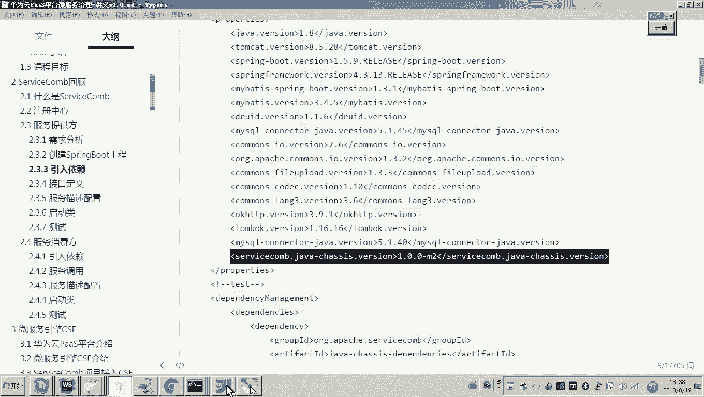

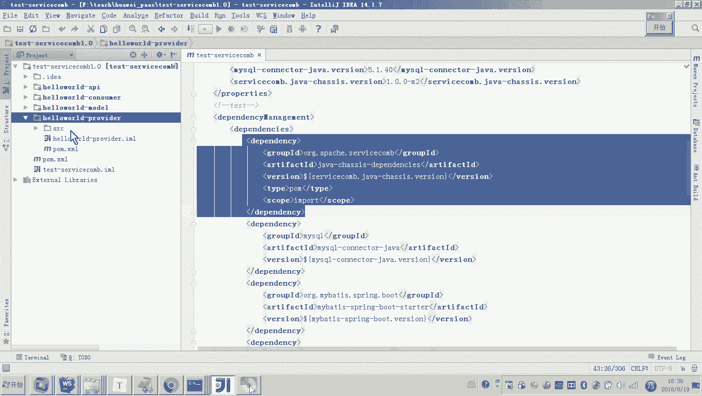

以下是需要添加的依赖项：

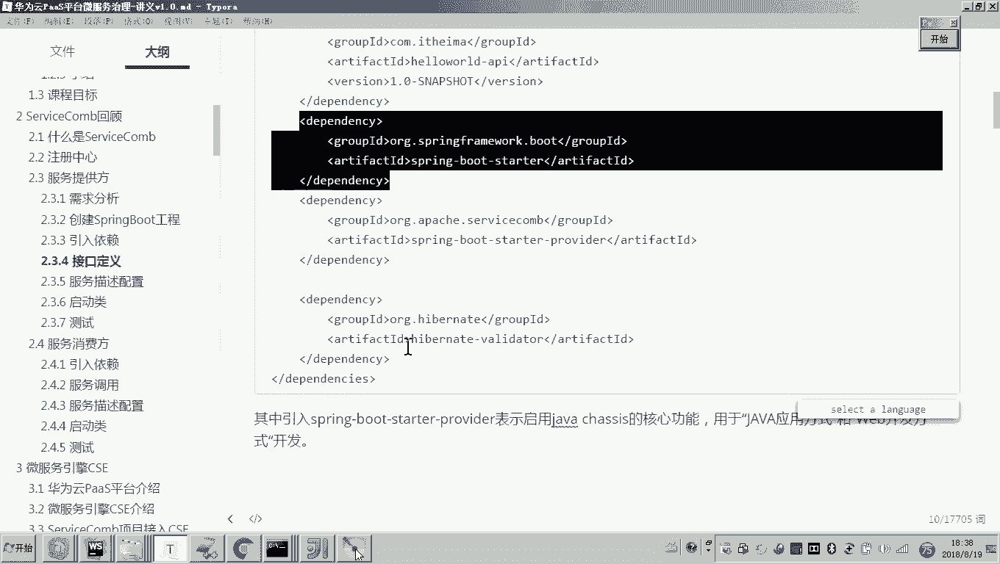

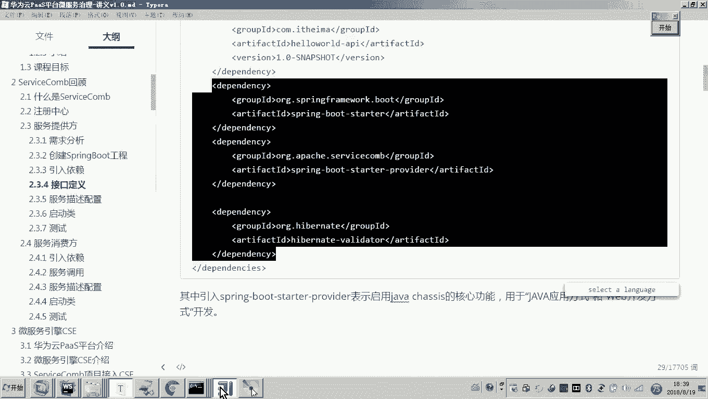

*   **父工程 (`pom.xml`)**：管理`Java Chassis`核心SDK的版本。
    ```xml
    <properties>
        <java-chassis.version>1.0.0-m2</java-chassis.version>
    </properties>
    <dependencyManagement>
        <dependencies>
            <dependency>
                <groupId>org.apache.servicecomb</groupId>
                <artifactId>java-chassis-dependencies</artifactId>
                <version>${java-chassis.version}</version>
                <type>pom</type>
                <scope>import</scope>
            </dependency>
        </dependencies>
    </dependencyManagement>
    ```

*   **服务提供方子工程 (`pom.xml`)**：引入三个必要的依赖包。
    ```xml
    <dependencies>
        <!-- Spring Boot 启动器 -->
        <dependency>
            <groupId>org.springframework.boot</groupId>
            <artifactId>spring-boot-starter</artifactId>
        </dependency>
        <!-- ServiceComb 与 Spring Boot 整合包，用于加载核心功能 -->
        <dependency>
            <groupId>org.apache.servicecomb</groupId>
            <artifactId>spring-boot-starter-provider</artifactId>
        </dependency>
        <!-- 用于接口参数格式校验 -->
        <dependency>
            <groupId>org.hibernate</groupId>
            <artifactId>hibernate-validator</artifactId>
        </dependency>
    </dependencies>
    ```

## 第二步：定义服务接口（契约先行）

上一节我们配置好了项目依赖，本节中我们来看看如何定义服务契约。ServiceComb提倡“契约先行”，即先定义清晰的API接口。

我们根据需求定义一个简单的接口。该接口包含一个方法 `hello`，它接收一个 `String` 类型的参数 `name`，并返回一个 `Student` 对象。

```java
public interface HelloService {
    Student hello(String name);
}
```

其中，`Student` 是一个包含 `name`、`age`、`address` 等属性的普通Java对象（POJO）。

## 第三步：实现服务接口

接口定义完成后，我们需要在服务提供方模块中编写它的实现类。这个类将包含具体的业务逻辑。

我们创建一个名为 `HelloServiceImpl` 的类来实现 `HelloService` 接口。

```java
import org.apache.servicecomb.provider.rest.common.RestSchema;
import org.springframework.web.bind.annotation.GetMapping;
import org.springframework.web.bind.annotation.RequestMapping;
import org.springframework.web.bind.annotation.RequestParam;

// 声明为ServiceComb的RESTful schema，并指定唯一的schemaId
@RestSchema(schemaId = "helloWorldController")
// 定义Spring MVC的根路径
@RequestMapping("/")
public class HelloServiceImpl implements HelloService {

    // 定义具体的REST端点，映射GET请求到/hello路径
    @GetMapping(path = "/hello")
    @Override
    public Student hello(@RequestParam String name) {
        // 示例逻辑：创建一个Student对象并设置名称
        Student student = new Student();
        student.setName("Hello, " + name);
        // 在实际项目中，这里通常会调用Service层处理复杂业务
        return student;
    }
}
```

**代码说明**：
*   `@RestSchema(schemaId = “helloWorldController”)`: ServiceComb注解，用于声明一个REST服务契约。`schemaId`应保持唯一，通常与类名对应。
*   `@RequestMapping(“/”)` 和 `@GetMapping(“/hello”)`: Spring MVC注解，定义了HTTP访问路径。最终完整的访问路径为 `/hello`。
*   `@RequestParam String name`: 声明接收的请求参数。

## 第四步：配置微服务信息

服务实现编写完毕后，需要配置该微服务的基本信息，如应用名称、服务名、监听端口以及注册中心地址。

在 `src/main/resources` 目录下创建配置文件 `microservice.yaml`。

```yaml
# 应用名称（项目名），同一应用下的微服务应使用相同的appId
APPLICATION_ID: helloProject
# 本微服务的名称
service_description:
  name: helloServiceProvider
  version: 1.0.0
# 服务监听端口
servicecomb:
  rest:
    address: 0.0.0.0:8081
# 注册中心配置（本例指向本地启动的ServiceCenter）
servicecomb:
  service:
    registry:
      address: http://127.0.0.1:30100
```

## 第五步：创建并运行启动类

最后，我们需要一个Spring Boot启动类来运行这个微服务。这个类将激活ServiceComb的核心功能。

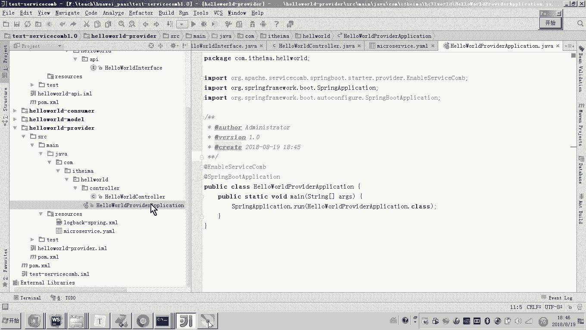

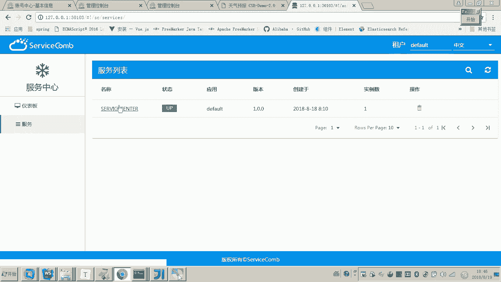

创建 `ProviderApplication` 启动类：

```java
import org.apache.servicecomb.springboot.starter.provider.EnableServiceComb;
import org.springframework.boot.SpringApplication;
import org.springframework.boot.autoconfigure.SpringBootApplication;

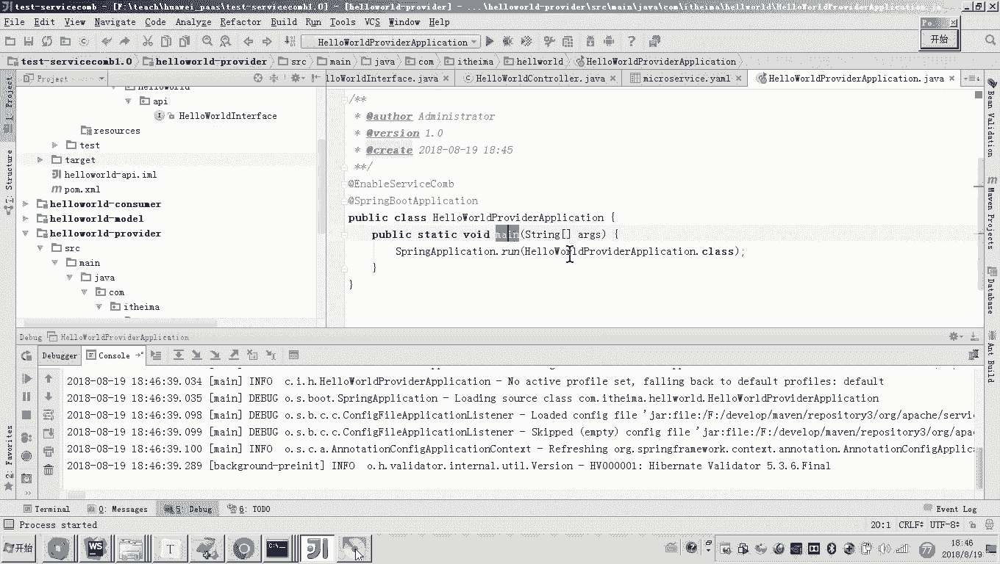

@SpringBootApplication // 标记为Spring Boot应用
@EnableServiceComb // 激活ServiceComb功能
public class ProviderApplication {
    public static void main(String[] args) {
        SpringApplication.run(ProviderApplication.class, args);
    }
}
```

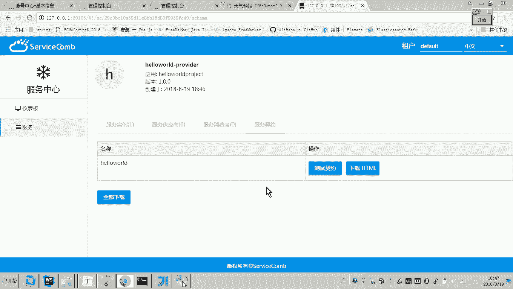

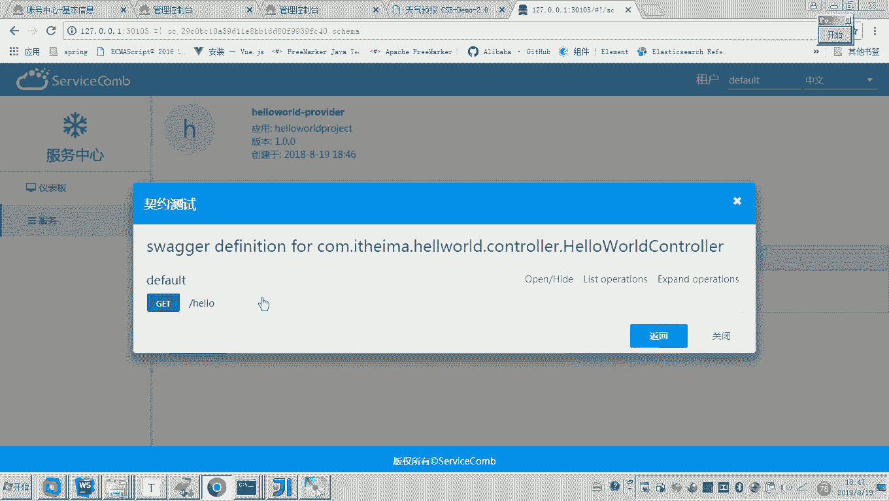

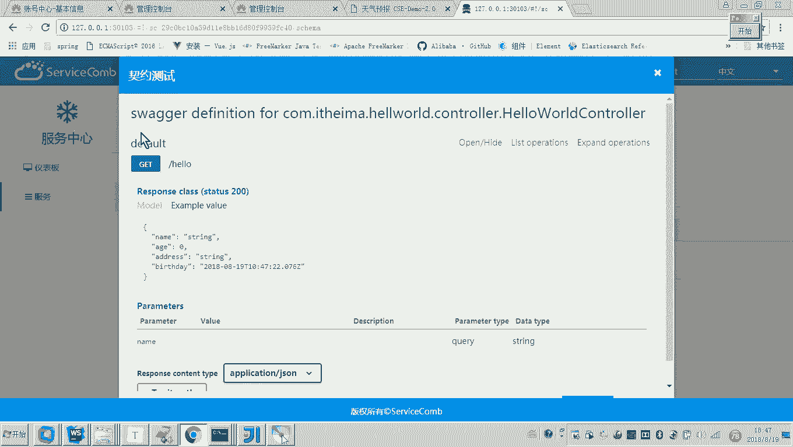

运行 `ProviderApplication` 的 `main` 方法。观察控制台日志，当看到服务启动成功的提示后，打开浏览器访问注册中心（默认为 `http://localhost:30100`）。

如果配置正确，你将在服务列表中看到名为 `helloServiceProvider` 的服务已成功注册。点击该服务，可以查看其自动生成的API文档（基于Swagger），其中应包含我们定义的 `/hello` 接口。

## 总结

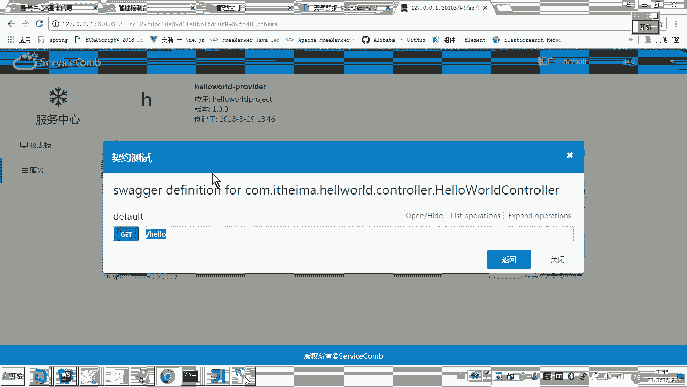

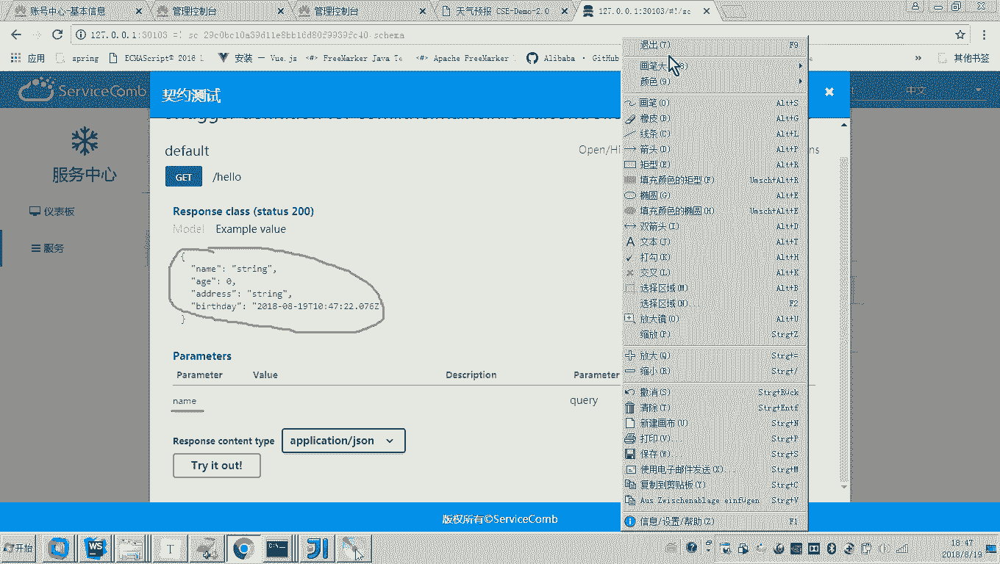

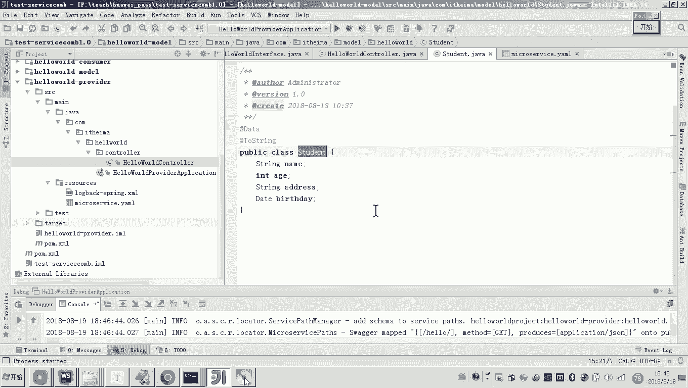

本节课中我们一起学习了使用ServiceComb开发服务提供方的完整流程。我们首先理解了服务提供方的定位，然后从**引入依赖**开始，遵循**契约先行**的原则**定义接口**，接着**编写实现类**并配置**REST映射**，之后通过 `microservice.yaml` **配置微服务元数据**，最后通过**启动类**运行服务并成功**注册到服务中心**。

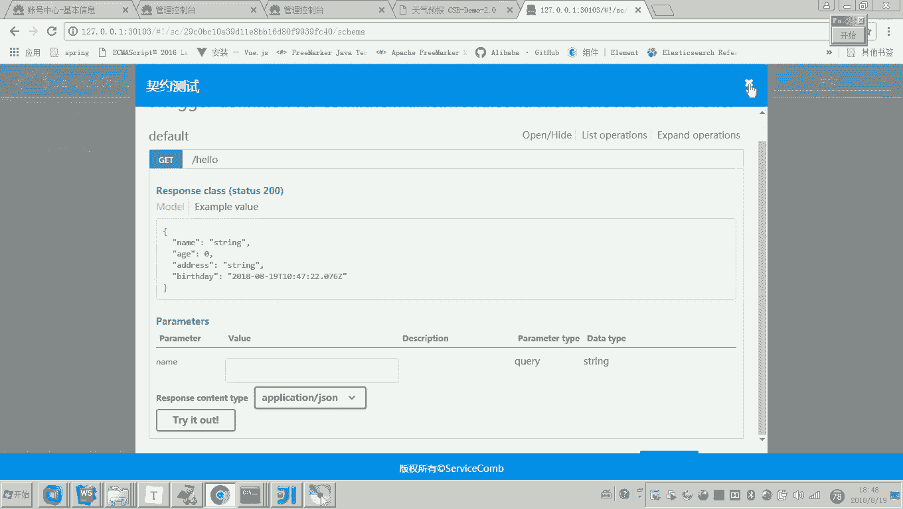

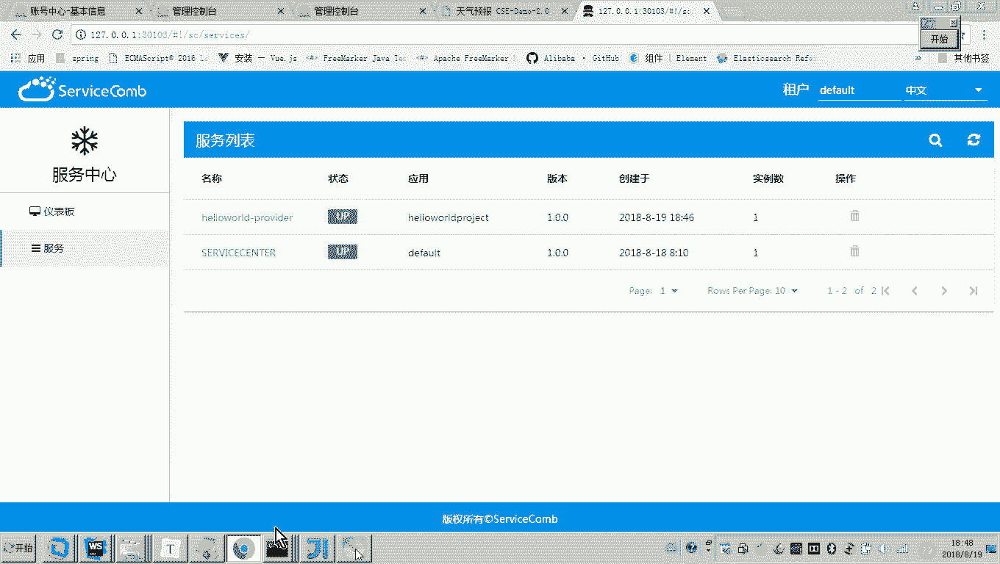

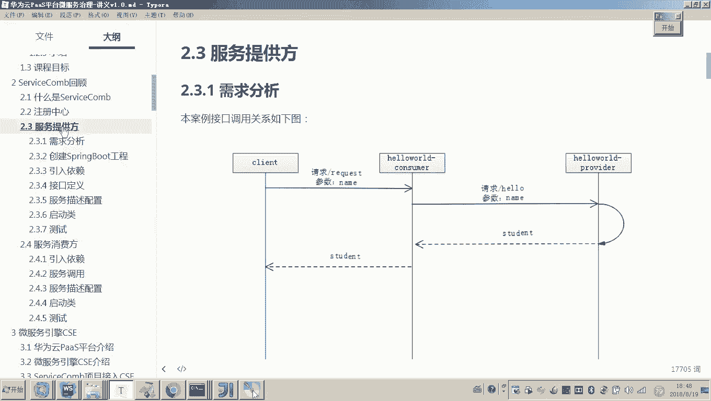

这个过程体现了ServiceComb与Spring Boot无缝集成、开发便捷的特点。服务提供方开发完成后，就为服务间的调用准备好了可靠的端点。