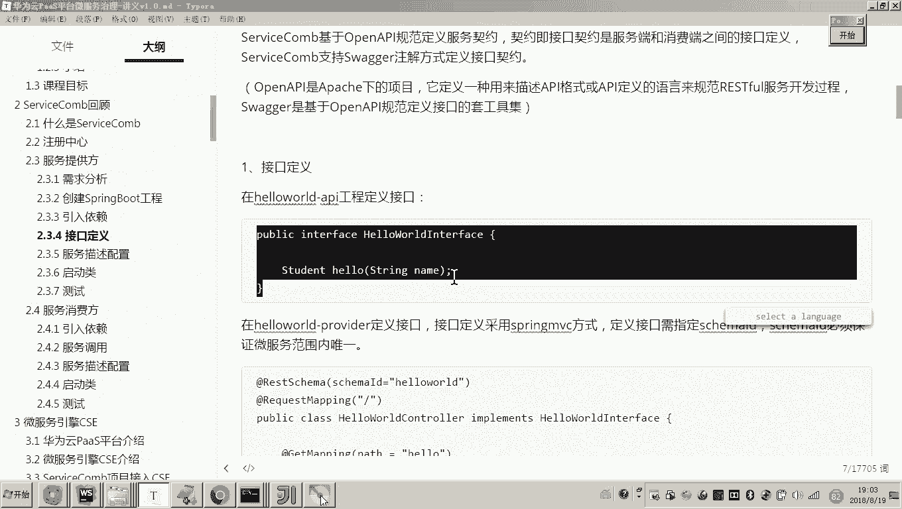

# 华为云PaaS微服务治理技术 - P83：7.ServiceComb回顾-服务消费方 - 开源之家 - BV1wm4y1M7m5

好，那下边呢我们是不是就可以来写服务消费方了，对吧？好，那么按照刚才服务提供方的这个编写流程呢，其实服务消费方和它类似啊，那首先呢它也要引入依赖啊，那好了。

那因为副工程我已经把那个java这个SDK的包已经引进去了哎，作为这个版本控制了。好，那现在呢我们只需要在子工程，现在我们要做的哪个子工程啊，是不是就是这个服务消费方的子工程啊，在这个当中呢。

我们把刚才我们说的spring的这三个包呀，我们加进去。😊。

然后我们把这个加进去之后呢，那接下来这个依赖OK了，现在我们是不是就可以干嘛呀？来写这个代码了。好，这个代码怎么写呢？这个代码啊，我们来再看一下需求。😊。

这个大家可以看到啊，这个客户端就是浏览器浏览器请求服务消费方是不是请求这个地址是不是叫做杠request，然后给他传一个内幕是吧？

然后这个 name幕这个这个这个请求到服务消费方消费方是不是再次请求到服务提供方。刚才我们这个服务提供方的接口是不是已经开发完成了？对，好，那现在呢我们来看。

那你是不是就需要写一个服务消费方的接口叫做杠request，而这个接口是不是要调服务消费服务提供方的这个杠hellow啊。😊，好，那现在呢我们就怎么样啊？我们在这个服务消费上的controller这。

我们定一个叫杠request的接口。然后在这个接口内部呢去调用服务提供方的杠hellow。就是刚才我们写的接口。好，那现在呢我们就定义一个什么呀？哎，我们定义一个controller。嗯。

然后在controller这个包下边，我们写一个controller。😊，好，那么呃我们来看啊，我们我我们定义怎么怎么做呀？😊，比说老师他要实现哪个接口呀？呃，注意呃。

现在它呢就是一个简单的什么简单的一个调用吧。所以也就是说这里面我是准备要调用hello哪个呀，hello word哪个呀叫做provider。哎，要调用它的杠hello方法。

所以这里边呢我们不需要让它去实现哪个哪哪个接口吧，直接我们这里边写一个方法测试就可以了。😊，好，那么我们来看呃，在写这个方法之前呢，我们先把一些准备工作做好。嗯呃做什么准备工作呀？

这是不是也是rest smer呀？然后呢，它里边是不是有一个叫skimer ID然后这里边我们是不是给他可以给他起个名字，哎，和它的这个类名保持一致呗。

这叫hello world consumerser。好，另外呢这里边是不是也是需要一个request mapping。对。😊，然后在这里边我是不是就可以来写这个什么呀？写这个调用的方法了吧。

写这个调用方法的话，这个方法的名字是不是就叫做杠request吧？所以在这里边我是不是就可以写get mapping。然后将来浏览器请求对浏览器请求我这个方法啊，我这个方法呢就是这个叫做request。

😊，那这个接口这个接口的路径是不是就是杠什么呀？request，对吧？好，那么在这个里边啊，就是我刚才说的要调用哎hellow world provider的杠hellow方法了。😊，那这个怎么调呢？

😊，大家回忆一下，当初我们讲这个。scom是怎么说的？😡，那首先的话各位在这个里边，我们是不是要进行远程调用了吧？😊，好，远程调用注意远程调用sice call提供很多种方法啊。

第一种方法基于res的方式。第二种方法RPC方式注意我要强调一下，当初刚才我们写的这个接口的这个方式，我们是不是采用res的方式？😊，那接口的这个调用是不是也是re的方式？😊，不是。

你注意就是说servicecom好就好在哪呢？就是你这个接口啊，你这个接口的哎，你这个接口的编系，你这个接口的提供方，我们说它这个传输的协议是不是采用res呀？但是我们说去调用这个接口呢。

其实它可以采用其他的方式。对，也就是说我们去提供和消费，我们可以采用不同的方式。对，所以这里边呢我为了方便哎，方便什么方便我哎，就是相当于针对方法进行调用。所以这里边呢我们就采用什么呀？对，我们就准备。

😊，准备基于RPC的。这个方式来调用远程的res接口。对，好，那这个有人说老师那怎么怎么做呀？RPC那首先我这里边要用一个RPC什么呀？refer。😊，然后在这个里边。

我们要指定你是要调注册中心的哪个服务。对哪个服务下边的那这个smer ID是哪一个，看懂了吧？所以在这里面我们要指定两个属性，一个是微服务的名字，一个是smer ID。😊，好了，那现在我们来写吧。

这个微服务的名字是不是就是这个服务提供方，他这个微服务的名字呀？这个微服务名字是不是叫做怎么呀hellow world杠 provider吧，所以你把它写进去。😊，那刚才你想调用的这个接口。

属于它的这个所属的smmer ID是哪个呢？这个接口的这个skimer ID是哪个的？那你就找到它是不是就是hellow word呀？😡，你现要调用这个provider下边的这个sma ID吧。

所以你把这个消费方这里边这里边哎这个s ID写上它。各位这个注解一旦写好了之后呢，这里边我是不是就可以干嘛呀？针对最终最终这个servicecom框架呀，就可以针对这个接口来生成一个什么对代理对象。😊。

这个的接口这个接口各位，这个接口是不是就是我服务提供方所实现的那个接口呀？😡，所以所以我现在这么写，他的最终他要执行的一个最终的结果是什么呀？就是从注册中心找到这个微服。😊。

并且找到这个接口的smer ID，然后框架它帮我们实现生成这个接口的代理对象。而这个接口代理对象一旦生成，那这里边我们就可以像调用方法一样来远程调用。各位看懂了吧？所以这里边呢我们是不是就写好了啊。

这个就是服务消费方，你会发现这里边是不是就是一个远程的调用。对。😊，好，那现在我们把这个远程调用这一块写好了之后呢。😊，来看到我们这个讲义啊，我这个讲义上面也写的很清楚啊。

说什么说servicecom提供rs time啊，还有一个就是什么呀？😊，哎，这个大家知道这个是不是就是基于rest的方式来进行调用啊，而后边这个前面加了一个叫什么呀？

叫as rest template，这是啥意思？这就是哎，这是同步的调用，这是异步的调用。还有一个什么透明RPC方式。而我们刚才所采用的调用方式。各位，你告诉我这是rest还是RPC。😊。

所以我们采用的是第三种透明RPC方式。所以呃我们在开发的时候，你可以开发这个接口，你可以基于这个res的协议来传输。但是我们去调用的话，哎，你就可以采用这种透明RPC方式来调用啊。

这种RPC的方式去调用的话就是非常方便啊，就是就跟调用方法一样，哎，就实现了远程调用。😊，好，那现在呢我们把这个写好了之后，哎，各位这个服务消费方可能同时他是不是也是一个服务提供方呀？对。

所以呃你在服务消费方这里边呢，我们也是需要来定义他的这个微服务的那方式跟提供方差不多。😊，也需要定一个叫miccroserviceYML这个文件。好，这里面已经有了啊，然后这就是一个消费方。😊。

你看各位这里边就有问题了。哎，我这个模板工程设计的就专门给你让你知道，你看好，这个是不是就是应用名。对，然后刚才提供方这里边是不是也是个应用名，对我故意这里边给你写错了，注意看。😊。

这里边的这个应用名哎，要和你什么呀？要和你这个因为他们都属于一个项目嘛，所以这个应用名你要让它保持一致。各位看懂了吧？哎，好，然后呢这个就是微服务的名字，这是消费，就 world这个消费方。

它同时也是对外提供服务。好，它的端口是8081，服务提供方是不是8080啊，好，那它也会启动完向这个服务注册中心去注册。好，到这儿来说的话，我这个服务的配置是不是就配好了，配好了之后。

接下来我们是不是就可以写这个ring boot的启动类了。好，这个启动类呢，各位我就不再写了。因为刚刚才这个提供方是不是一样呀？好，然后现在我是不是就可以来测试了吧？好，那我启动起来了啊。启动起来之后。

各位我们就要去观察哎，观察日志看它启动没有成功。然后呢，再看注册中心是否成功注册。😊，好，那现在呢我们来刷新。😊，各位现在的话，这两个服务是不是都已经注册成功了吗？好。

那现在呢我们是不是就可以来测试一下？😊，那怎么测试呀？其实各位就是你在写服务提供方的时候，是没有必要等到消费方的代码写完，然后你再去测提供方。其实你服务提供方写完了之后，哎。

你就可以直接针对它的接口去测了。😊，对吧？哎好，那现在呢我们既然两个符都写完了，现在呢我们就直接干嘛呀，直接来测消费方，然后调用提供方好。😊，来，我们怎么测试A呀，请求哪个呀？然后现在我打开浏览器吧。

现在呢。😊，local house后边要个写什么呢？😡，我现在是不是要请求服务消费法呀？😡，因为我就想直接测请求消费方，消费方哪个端口是不是叫做8081呀？对，然后我是不是就后边要请求谁呀？😊。

是不就是这个request的后边我可以随便嗯注意啊。😊，8081吧，然后后边是不是就是request内部等于黑嘛，可以吧。对，各位你来看现在这个数据是不是就已经出来了。对，有说候老师这个数据。😊。

怎么都是闹呢？各位我们来走一遍流程，你就知道了。消费方首先消费方到哪里呀？😊，首先，消费方是不是要到对，要到这个这个方法呀，request的这方法是吧？然后呢，这一步是不是就是远程调用啊。

而这一步远程调用，这一步远程调用是不是就是要调用我们说的这个provider这个里头。😊，各位，你看这里边你是不是只只写了一个叫做s name呀？对。

然后那你现在你返回的是不是就是这这些东西是不是就是那呀？哎，好，那现在呢我们来打一断点，我们来测一下，你大概就知道了。好，首先各位刷新，首先进入的是消费方吧。然后哎这是不是就是。😊，到这个提供方了。对。

哎，到这儿这个是不是就已经调用成功了，远程调用了吧。好，那这个以上呢就是我们说的这个啊一个servicecom的回顾，就是服务提供方哎，服务消费方哎，消费方呢要去调用提供方的接口。

然后我们采用的是透明RPC方式来进行远程调用。😊，通过这次呃这个章节的这个servicecom的回顾呀。呃我想必大家应该对这个servicecom的开发流程应该有一个呃有应该是回忆起来了吧。

有一个更加深入的认识了，更加清晰的认识。首先是我们回顾一下这个流程怎么说的呀。😊，呃，那我们是基于 boot的方式来来编来开发这个servicecom。呃，那首先你要创建ring boot工程。对。

然后其次呢我们要引入依赖。那这里面引依赖的话，我们是怎么引的呀？是在副工程，我们要把这个servicecom的java sDK包这个java，我们把这个包加进去，作为这个版本管理的这个控制。好。

我们在子工程里头呢，我们需要加入三个包就可以了。嗯，不管是消费方还是提供方啊，因为消费方也可能作为服务的提供方。所以我们不管是服务提供方还是消费方，我们都加这三个包。好，加进去之后呢。

我们就可以定义接口了。😊。

那定义这个接口呢，我们说你会发现这个接口我们统一在API工程来定义啊，这个接口就是一个普通的接口interface，对不对？然后呢，我们说那你现在要写接口实现怎么写呢？

我们是基于ring bootVC的方式来写呃，那这里边我们发现这些注解都是的注解啊，唯有一个是servicecom的注解。😊。

对，好，首先这里边我要强调一下，在类上边必须用request mapping呢，我们把它标一下。好，然后呢在这里边有一个smer ID啊，通常我们把这个ID呢和我们说这个这个类名呢。

我们让它一对一保持一致就可以。好，然后我们就需要配置这个什么呀service的这个微服务了。好，这个配置呢这是一个最最基本的一个配置，就是你起这个应用名属于哪个项目啊，这个微服务的名字还，属于哪个项目。

然后呢，版本号指定好。那另外的话就是这个re的接口的端口啊，后来还有就是你向注册中心注册的这个什么啊注册中心的地址。好。😊，那最后呢在启动类上边，我们说这些都是spring boot的注解。

唯一一个就是servicecom的注解。我们要把这个注解呢给它加上去。好呃，那到这儿呢我们这个servicecom的回顾啊，咱们就讲完了。😊。

