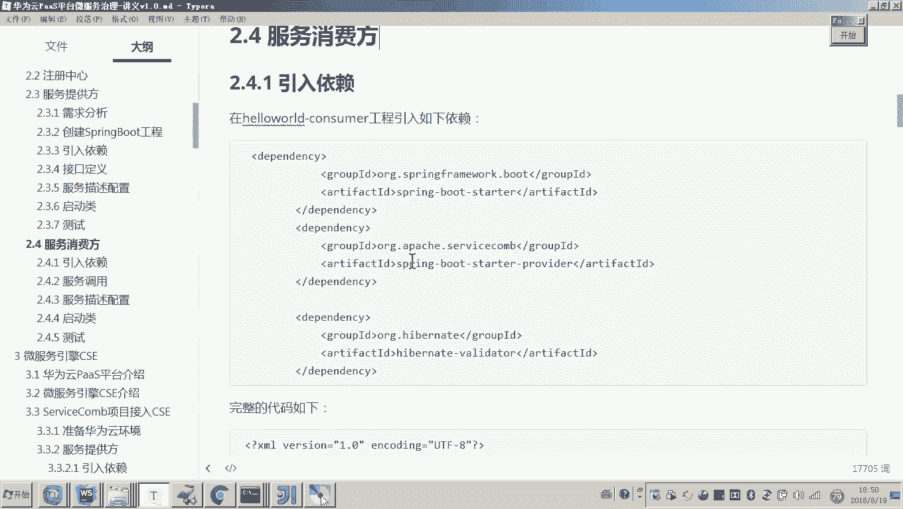
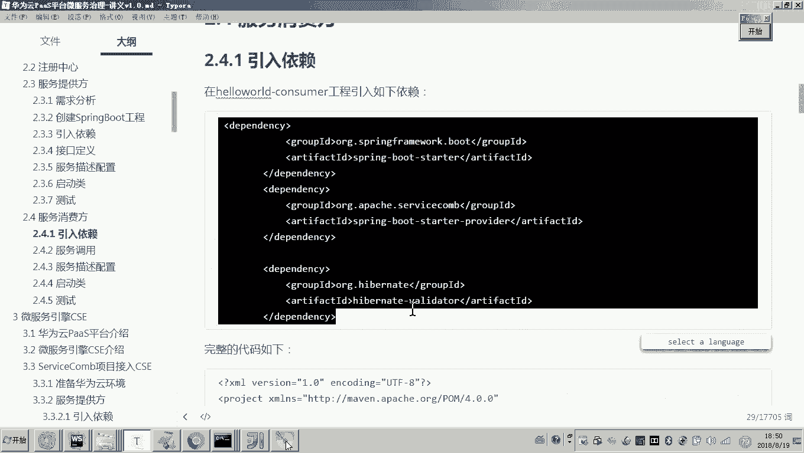
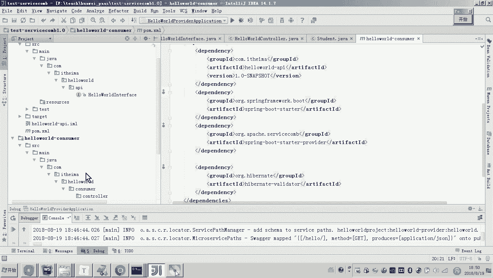
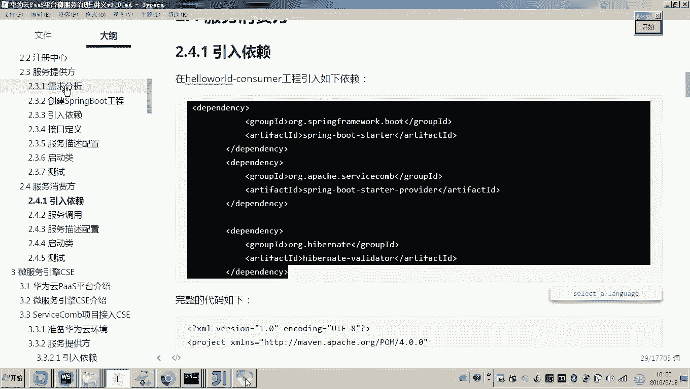
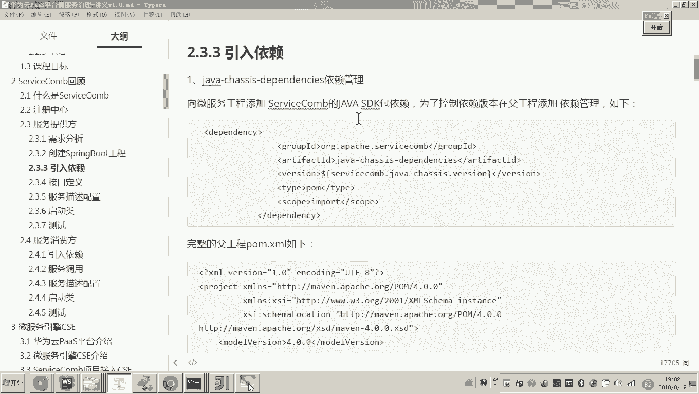
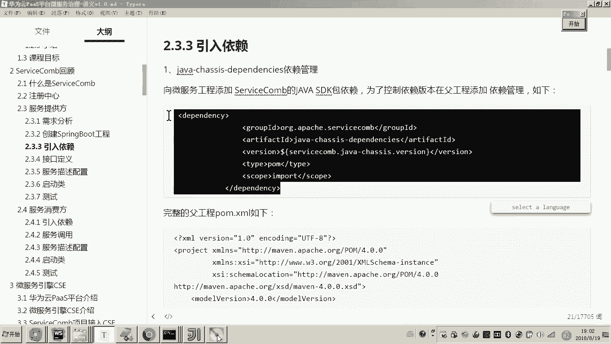
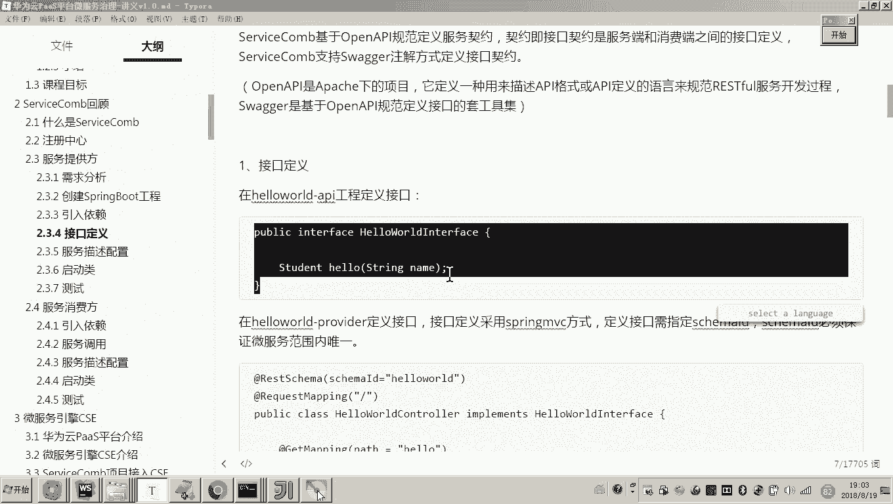
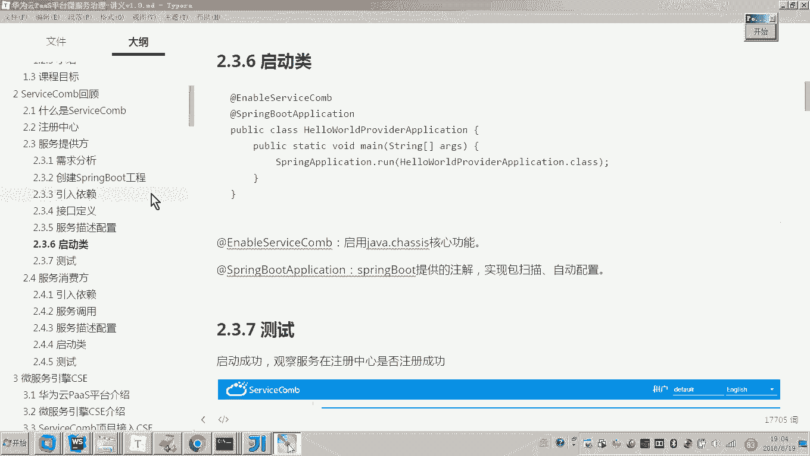

# 华为云PaaS微服务治理技术 - P83：7.ServiceComb回顾-服务消费方



在本节课中，我们将学习如何编写一个ServiceComb服务消费方，并了解如何使用透明RPC方式调用服务提供方的接口。我们将从引入依赖开始，逐步完成代码编写、配置和测试。





## 概述



上一节我们介绍了服务提供方的开发流程。本节中，我们来看看如何开发服务消费方。服务消费方的主要职责是接收客户端请求，并远程调用服务提供方的接口来完成业务逻辑。

## 引入依赖

服务消费方的依赖引入流程与服务提供方类似。由于父工程已经统一管理了ServiceComb Java SDK的版本，我们只需在服务消费方的子工程中添加必要的Spring相关依赖包。

以下是需要在子工程`pom.xml`文件中添加的依赖：

```xml
<!-- 示例依赖，具体groupId和artifactId需根据实际版本确定 -->
<dependency>
    <groupId>org.apache.servicecomb</groupId>
    <artifactId>spring-boot-starter-provider</artifactId>
</dependency>
<dependency>
    <groupId>org.apache.servicecomb</groupId>
    <artifactId>spring-boot-starter-discovery</artifactId>
</dependency>
<dependency>
    <groupId>org.apache.servicecomb</groupId>
    <artifactId>spring-boot-starter-transport</artifactId>
</dependency>
```

依赖添加完成后，我们就可以开始编写业务代码了。

## 编写消费方代码

根据需求，客户端（如浏览器）将请求服务消费方的 `/request` 接口，并传递一个 `name` 参数。服务消费方在接收到请求后，需要远程调用服务提供方的 `/hello` 接口。

首先，我们在服务消费方的Controller包下创建一个Controller类。

```java
@RestController
@RequestMapping("/")
public class HelloWorldConsumerController {

    // 后续将在这里添加远程调用代码
}
```

在这个Controller中，我们需要定义一个处理 `/request` 请求的方法。

```java
@GetMapping("/request")
public String request(@RequestParam String name) {
    // 后续将在这里调用服务提供方的接口
    return "Response from provider";
}
```

现在，关键步骤是在这个方法内部实现远程调用。ServiceComb支持多种调用方式，例如基于REST的方式和RPC方式。虽然服务提供方的接口是基于REST协议暴露的，但消费方可以采用更便捷的透明RPC方式进行调用。

以下是使用透明RPC方式调用远程接口的步骤：

1.  使用 `@RpcReference` 注解声明一个远程服务引用。
2.  指定要调用的微服务名称（`microserviceName`）和该服务下的Schema ID（`schemaId`）。
3.  框架会自动从注册中心发现服务，并为指定的接口生成代理对象。
4.  通过该代理对象，我们可以像调用本地方法一样进行远程调用。

假设服务提供方的微服务名称为 `hello-world-provider`，其接口的Schema ID为 `hello-world`，并且我们有一个定义在API模块中的接口 `HelloService`，那么调用代码如下：

```java
@RestController
@RequestMapping("/")
public class HelloWorldConsumerController {

    @RpcReference(microserviceName = "hello-world-provider", schemaId = "hello-world")
    private HelloService helloService;

    @GetMapping("/request")
    public String request(@RequestParam String name) {
        // 像调用本地方法一样进行远程调用
        return helloService.sayHello(name);
    }
}
```

通过 `@RpcReference` 注解，ServiceComb框架会为 `HelloService` 接口创建代理，并将调用转发到 `hello-world-provider` 微服务的 `hello-world` Schema对应的端点。

## 配置微服务信息

服务消费方本身也可能作为一个服务提供者对外提供服务，因此同样需要配置微服务的基本信息。我们需要在 `resources` 目录下创建 `microservice.yaml` 配置文件。

配置文件内容示例如下：

```yaml
APPLICATION_ID: servicecomb-demo # 应用ID，需与提供方保持一致
service_description:
  name: hello-world-consumer # 本微服务名称
  version: 1.0.0 # 版本号
servicecomb:
  service:
    registry:
      address: http://127.0.0.1:30100 # 服务中心地址
  rest:
    address: 0.0.0.0:8081 # 本服务监听端口（需与提供方不同）
```

**注意**：`APPLICATION_ID` 必须与同一项目内的服务提供方配置保持一致，以确保它们属于同一个应用。`service_description.name` 是本消费方微服务的唯一名称。端口（如8081）需要与服务提供方（如8080）区分开。

## 编写启动类

服务消费方的Spring Boot启动类与服务提供方类似，需要添加 `@EnableServiceComb` 注解以启用ServiceComb功能。

```java
@SpringBootApplication
@EnableServiceComb
public class ConsumerApplication {
    public static void main(String[] args) {
        SpringApplication.run(ConsumerApplication.class, args);
    }
}
```

## 测试验证

代码编写完成后，我们可以启动服务进行测试。





1.  **启动服务**：依次启动服务提供方（端口8080）和服务消费方（端口8081）。观察启动日志，确认服务成功启动并向注册中心注册。
2.  **检查注册中心**：访问ServiceCenter（例如 `http://localhost:30100`），确认两个微服务实例都已成功注册。
3.  **发起测试请求**：打开浏览器或使用API测试工具，访问服务消费方的接口。例如：
    `http://localhost:8081/request?name=World`
4.  **观察结果**：请求会先到达消费方的 `request` 方法，然后通过RPC代理调用提供方的 `sayHello` 方法，最终将结果返回给浏览器。你可以在代码中设置断点，跟踪整个调用链路。



## 流程总结

本节课中我们一起学习了ServiceComb服务消费方的完整开发流程。我们来回顾一下关键步骤：

以下是ServiceComb微服务开发的核心步骤：
1.  **创建工程与引入依赖**：创建Spring Boot工程，在父工程管理SDK版本，在子工程引入具体依赖。
2.  **定义统一接口**：在独立的API模块中定义服务接口（普通的Java Interface）。
3.  **实现服务提供方**：
    *   使用 `@RestController` 和 `@RequestMapping` 等Spring MVC注解。
    *   使用 `@RestSchema(schemaId = “...” )` 注解标识为ServiceComb Schema。
    *   配置 `microservice.yaml` 文件，包括应用ID、服务名、端口和注册中心地址。
    *   在启动类上添加 `@EnableServiceComb` 注解。
4.  **实现服务消费方**：
    *   使用 `@RpcReference` 注解声明并注入远程服务代理。
    *   同样需要配置 `microservice.yaml` 文件（注意应用ID一致，端口不同）。
    *   同样需要在启动类上添加 `@EnableServiceComb` 注解。
5.  **透明RPC调用**：消费方通过接口代理直接调用远程方法，如同调用本地方法一样简单。



通过本次回顾，你应该对基于ServiceComb进行微服务开发的流程有了更清晰和深入的认识。