# 华为云PaaS微服务治理技术 - P84：8.微服务引擎CSE-华为云PaaS平台介绍 - 开源之家 - BV1wm4y1M7m5

好，那接下来呢我们就开始哎我们本次课程第一部分的内容讲解叫微服务引擎CSE前边我们讲了这个servicecom的回顾。呃，这是为了我们更好的去讲CSE呢做准备。好。

那么我们在讲这个微服务引擎CSE之前呢，哎我们先来了解一下华为云pass平台。啊，这个华为云pass平台到底是什么呢？它包括哪些功能呢？因为我们本次的这个课程呢，都是离不开云平台的。哎。

所以说我们觉得非常有必要在最前边来给大家介绍一下华为云pass平台。华为云pas平台呢是以华为fuion stage2。0项目为基础。注意这里面有很多的名词啊，大家不要一看到这些名词呢都不想学下去了。

注意听啊，后边我都有解释。华为云云pass平台是以华为fusion stage2。0项目为基础，基于dockerkuernets等主流开源容器项目提供了注意注意看啊。

提供了开发测试部署运维的全流程自动化流水线能力。提供先进的微服务框架。丰富的服务组件。致力于让开发者专注于代码开发本身，提升开发效率。然后呢，这是丰富丰富的应用生态，推动企业更好的云化转型。注意听啊。

这里面有有有几个重点啊，也是我们整个使用云平台的一个流程。首先前边我们说介绍了。

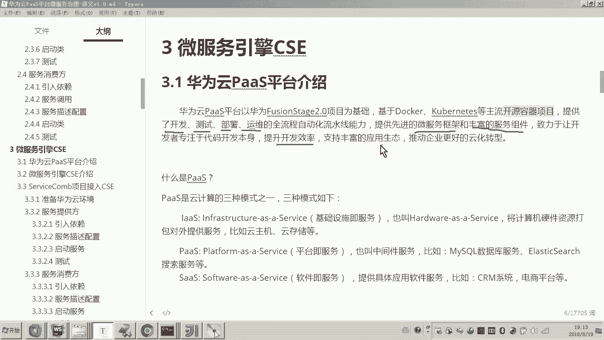

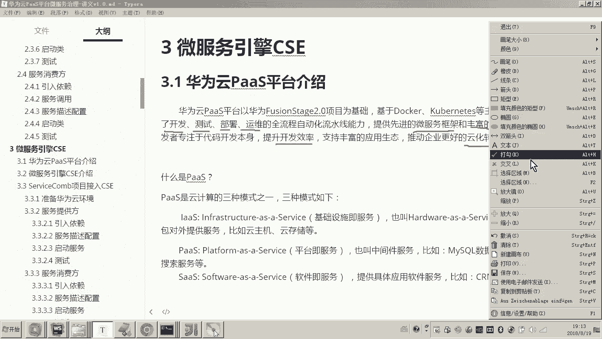

它是基于这个云平台，是华为的一个fusion stage2。0，以这个fusion stage华为内部的一个fusion stage2。0项目为基础。至于这个项目是什么。

一会儿我后边去说而以这个为基础呢，这个这个云pass平台呢是基于两呃等等。我这边列的是两种两种技术啊，这个技术的核心技术。基于dockernet等主流开源容器项目来构建。好。

那这个pass平台提供哪些功能呢？还得提供了开发，你可以基于云平台进行开发。哎，基于云平台进行测试，哎，把你的项目部署上云平台，然后呢，整个运维管理等等，它都支持。😊，好，这个云平台。它到底是什么云。

什么是云呢？首先我们看那云passpass又是什么呢？好，注意看我们一个一个解释啊。😊，有些同学知道呢，你可以就简单再来了解一下，不知道的注意听。😊，什么是pass平台？什么是pass？

其实这个pass来源于云计算的一个词汇。云计算有三种模式，对吧？

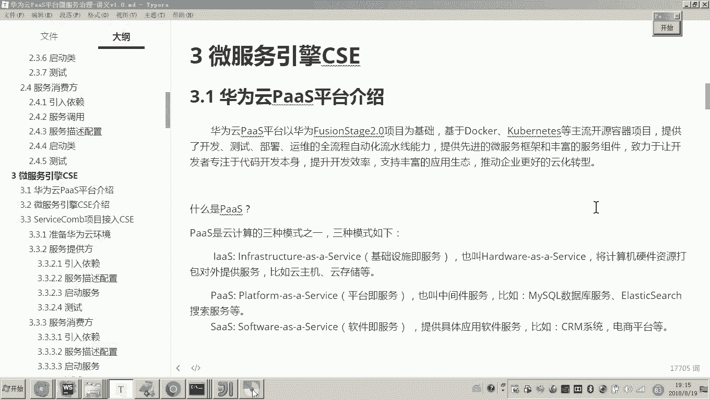

哪三种模式应该有有了解过吗？对云计算它有三种模式，这三种模式从最底层的IRS叫基础设施服务，就是把计算机硬件打包对外提供服务。你比如说现在我想在云上租一个服务器，对吧？云主机，这就是Ios。

这是这是云计算的一种模式。第二种模式就是我们所用的这个pass平台。这种模式叫平台记服务。就是说哎我给你提供一个mycyclcle数据库。😊，那这个meq数据库你是不是就不用再部署了。

你直接用我的数据库是不是就可以了，我给你提供一个叫搜索服务，你是不是就直接可以用我的搜索服务了？对，好比，你现在要开发微服务了。好，我给你提供一个微服务的注册中心。😡。

那这个微服务注册中心你是不是也不用部部署了？所以它其实是在基础设施的这个基础之上。也就是说在计算机硬件的基础之上，他是不是已经把软件给你装好了，并且把这个具体的这个呃各种业务啊。

各种支持的各种形态的这个服务也给你做好了，什么意思？做数据库的，我可以提供数据库的服务，做搜索的，我给你提供搜索服务，对不对？😊，好，最后一个模式叫做ss，这个模式叫软件寄服。

就说你现在想做1个CM系统，哎，做一个客户关系管理系统。好，那哎我给你我给你做一个。对我这个我这个客户关系管理系统啊，你只要注册一个账号，你就可以把你的客户信息放进去。对，所以你会发现你会发现。😡。

月这是最底层的这是计算机硬件啊，把计算机硬件打包对外提供服务。那这个是什么？把那些对把那些基础的软件，中间件类似的这种软件，然后呢把它打包对外提供。😊，哎，那么各位你你设想。如果你现在用pass平台。

你用它的mycyclcle服务，你用它的搜索服务。我问你软件是不是还是我们自己开发呀？比如说我现在要做一个学生在线，一个在线教育网站，那你是不是就是网站代码还得你写。

只不过你会用pass平台里边的部分服务，对不对？对？😡，但是这个到第三种模式叫sas这种模式呢，对它就直接具体到软件了，就连这个软件你都不用开发了。你只需要你作为一个操作用户，哎，作为一个操作用户者。

你只要来用我的软件就可以了。😡，大家理解吗？所以我们现在用的这个云pass平台，哎，就是在这个哎它已经给你提供了一些现成的中间件的这种服务的基础之上呢，我们来开发我们自己的软件。

那这样的话是不是就是说让我们开发者专注于什么，专注于代码，专注于业务本身。对我们不用非常关心。哎，我们要比如说部署一个什么搜索服务啊，这个搜索服务的性能，我们需要调参数啊，干嘛呀？嗯不用了。

他都给你干嘛呀，都给你封装好了，都给你打包好了。你只要干嘛用它的服务就行了。对，好，这就是我们说的云计算的三种模式。😡，好，那我们说这个pass平台，哎。

我们说是呃这个华为内部的一个叫fuion strategy2。0项目。那这个fuion2。0又是什么呢？注意。😊。

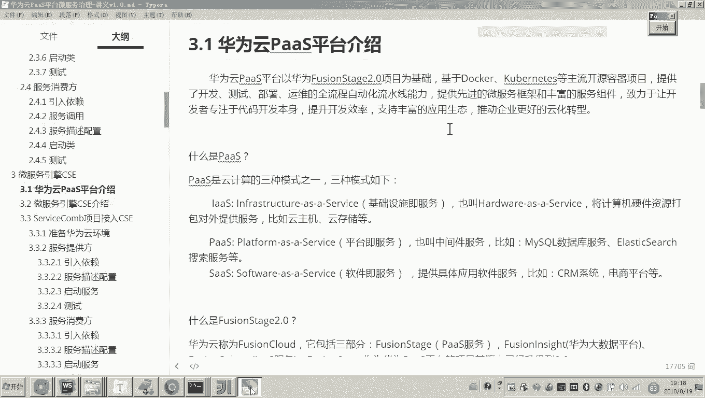

华为云称为整个华为云称为fuion cloud，它包括三部分，一部分就是哎pass平台的服务pass服务。哎，这个pass服务叫fuion。对，还有一部分就是提供对外提供大数据服务。哎。

有一个大数据平台，对外提供大数据服务。你说我要让你对你有一些很多的这个数据需要进行存储处理啊。哎，你用我华为云就可以。那这个项目呢叫做fuing in。对，还有一个就是我们说的基础设施，哎。

就是fuionpher。😊，所以华为云包括三部分，一个是pass服务，一个是大数据平台，一个是I us。对，所以我们现在用的就是我们所用的pass服务。

就是基于华为内部的这个叫fuions stage这个项目哎。😡，好了。呃，有人说老师，那这个sars呢，华为云是不是不做sars服务，没错，华为云不做sars服务。所以他其实就是做了前两种。哎。

那让我们软件公司哎，你只要在前两种的基础之上去构建你自己的软件就行了。所以说各位那我说到这，大家也是不是就大概理解了，对吧？哎，整个云平台，其实华为云包括三部分，而在包括这三部分呢。

其实它涉及到了云计算的前两种模式，嗯。😊。

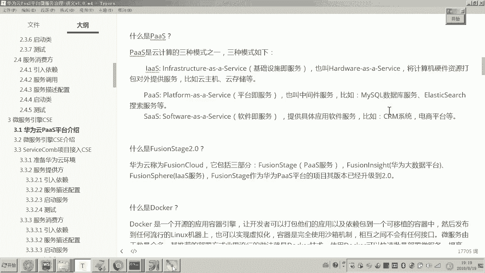

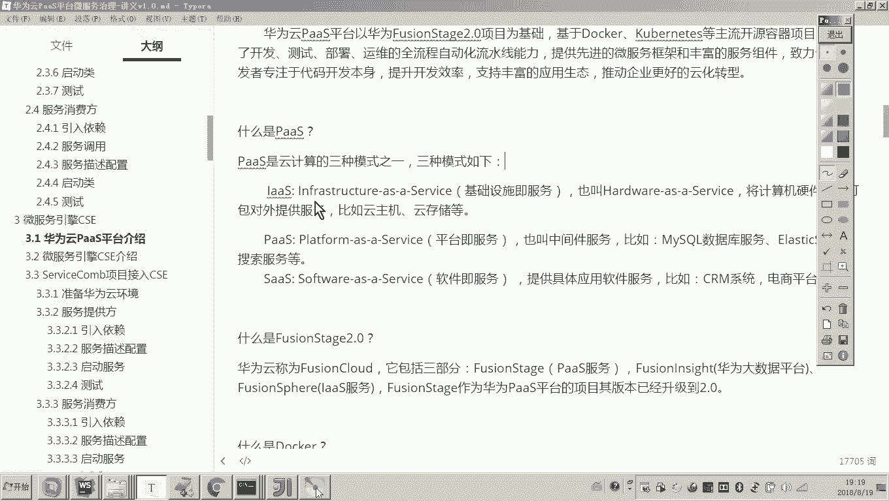

好，那么刚才又说了是基于docker和 Kubernetes等主流的开源容器，这个docker是什么呢？这个应该不陌生。哎，因为我们在黑马成员的项目当中，嗯，很多项目都用的是docker的部署，对吧？

它是一种开源的应用容器引擎。对，也当前非常流行的一种容器化、虚拟化的这个技术。😊。

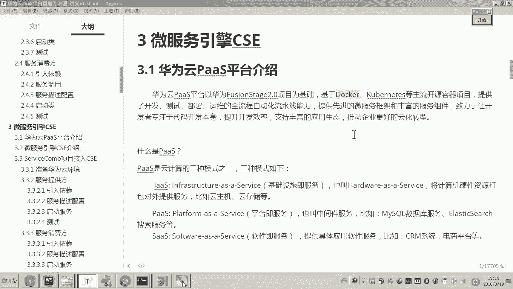

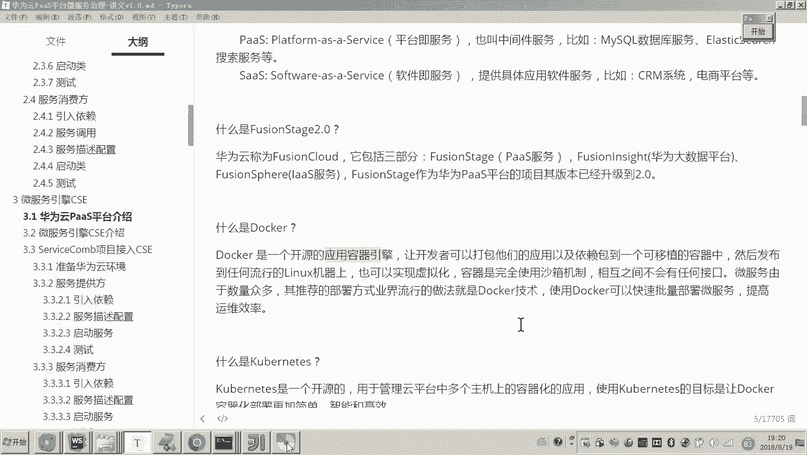

好。那么这个应该呃有些同学不太了解，哎，这个叫kuubernetes，这个是什么呢？我们读一下啊，它是一个开源的，用于管理云平台中多个主机上的容器化的应用。使使用kuubernetes的目标呢。

就让docker的容器化部署更简单智能高效。哎，好像它和docker是不是有关系啊。没错，那你就可以简单的把它理解成一个什么呀？对，把它简单理解为一个叫docker的一个管理应用，或者叫管理工具。😊。

那用coubernetes的目的就是让你去智能的高效的使用docker。好。那这个华为云pass平台，我们说你最终我们是不是想基于华为云pass平台来进行微服务的开发以及微服务的这个测试部署。哎。

我们可以把它叫做微服务的治理，对不对？好，那么到底说这个云平台。这个pass平台。华为云pass平台。有人说老师你讲这个华为云pas平台是不是只支持华为自己的这个框架的开发呀。

不是这个华为云pass平台呀。对它可以支持很多种微服务。甚至啊甚至啊你就是说我我我我不是啊我就是一个外部项目，我就是一个GS的一个前端的工程，你也可以把它发布成一个微服务。😊。

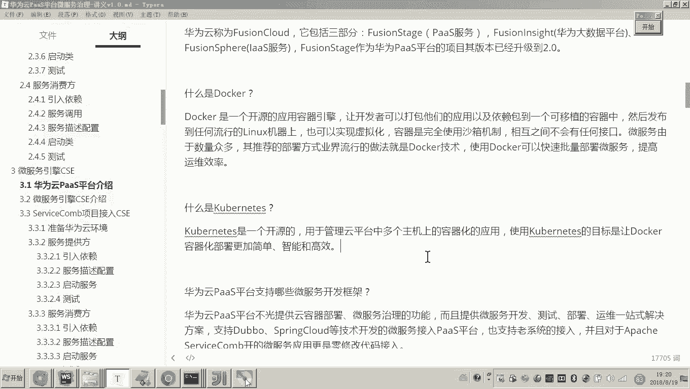

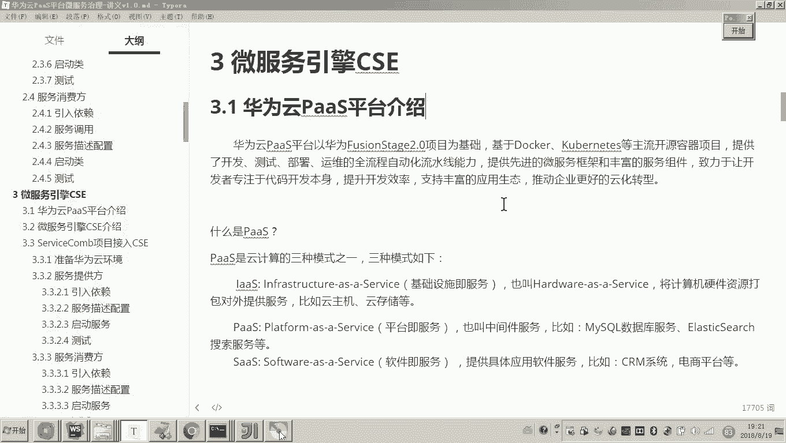

你注意听它的功能非常强大。华为云pass平台不光提供云容器的部署微服务治理，还提供了刚才我们所说的从开发测试部署运维等一站式解决方案。这个我在之前已经介绍过了啊。我现在要强调的是什么呢？

就是华为云pass平台。它不光是可以采用它自己的框架servicecom开发的这个微服务呢，可以非常简单的就把它接入到云平台了。那如果你说我用的是哎一些早期的这个double啊。

包括spring cloud等这些技术开发的微服务，我能接入华为云pass平台吗？可以它也支持对。😊，另外，华为云pas平台提供微服务引擎CSE框架。各位，这个我是不是之前介绍过了吧。

这个框架和servfacecom的联系是什么呢？当然下面我还会详细介绍啊，现在我先简单说一下华为云pas平台提供微服务引擎CSE这个微服务引擎CSE就是基于servicecom。😊。

它的一个商业版本就在这个service框呃service框框架基础之上提供了很多商业功能啊，所以呢它的目的只有一个就是让你用pass平台哎去呃从这个微服务的开发。

一直到测试部署运维等啊一站式的这个什么解决方案，它都给你提供了。😊，这个就是我们先了解一下华为云的pass平台。在我们的脑子当中，因为我们整个课程都是要用云平台。

在我们的脑子里边呢必须清楚啊这个云平台到底是个什么，它它提供哪些功能。它给我们做的到底是一个什么呀？它一个什么角色。对，所以我们总结一下，我们使用华为云pass平台。

我们可以从什么开发测试部署一直到运维等全自动流水哎，这些所有的这个工作的步骤。哎，我们都可以用云平台来帮助我们高效的来管理。😊。

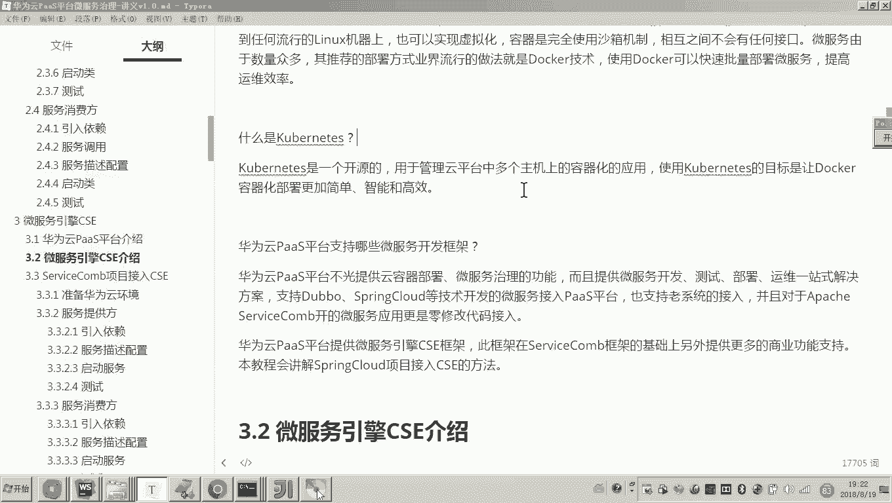

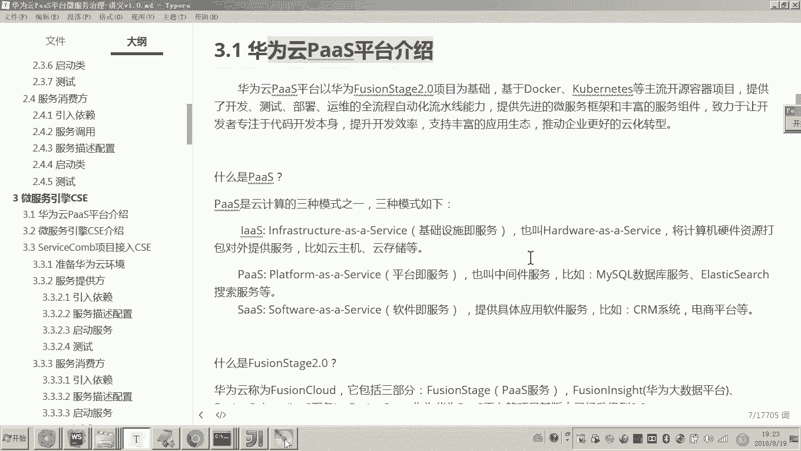

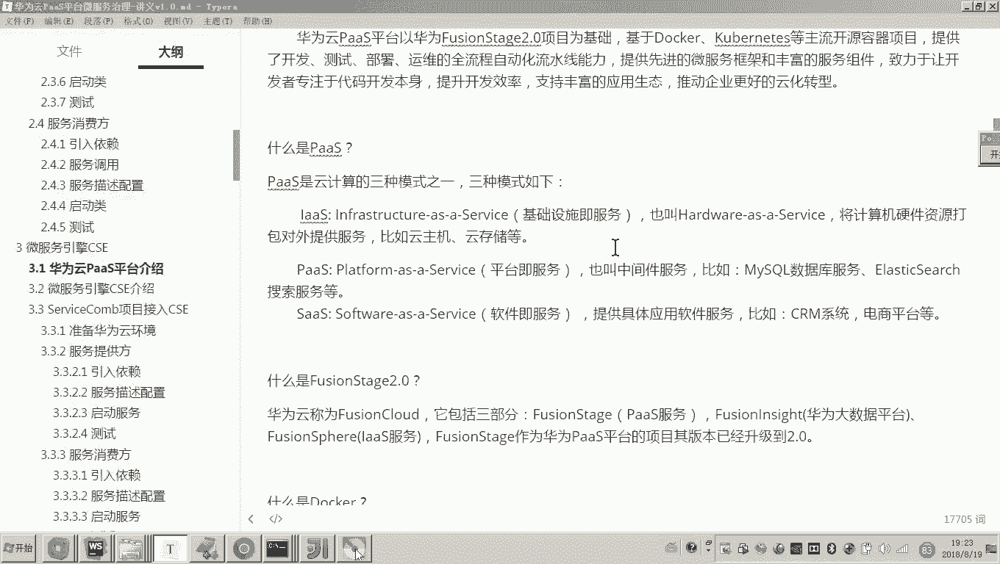

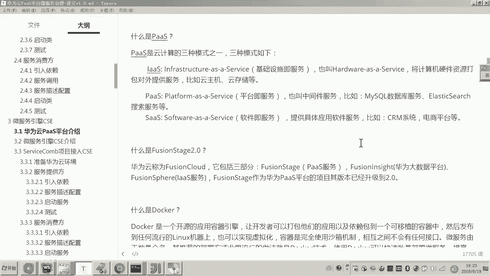

好，那么这个华为云pass平台的介绍呢啊我们就介绍到这儿。

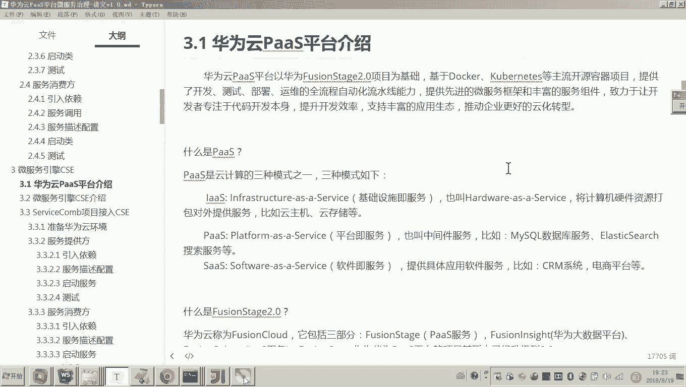