# 华为云PaaS微服务治理技术 - P84：8.微服务引擎CSE-华为云PaaS平台介绍 🚀

在本节课中，我们将要学习华为云PaaS平台的基础知识。了解这个平台是后续学习微服务引擎CSE的重要前提，因为我们的整个课程都将基于云平台展开。

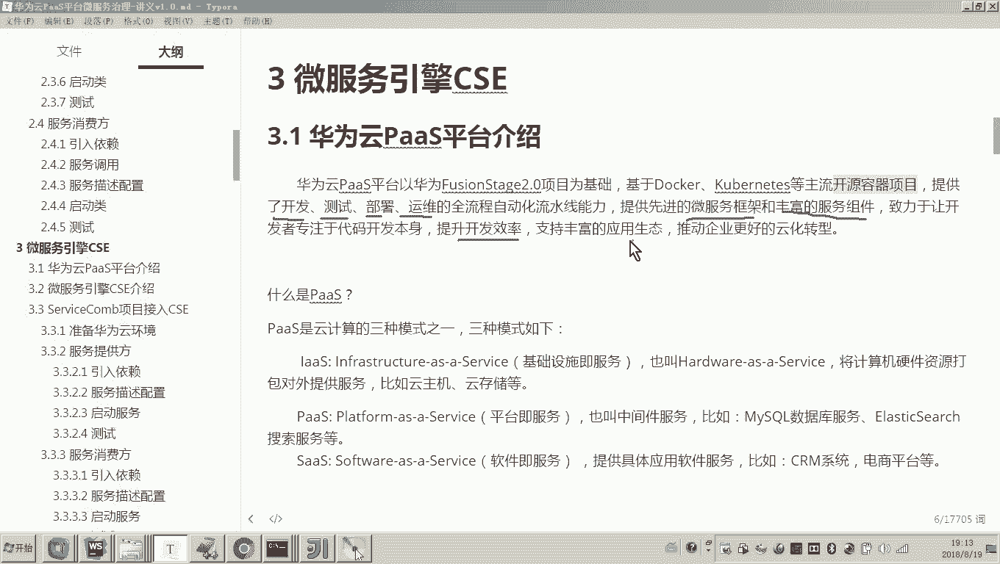

## 华为云PaaS平台概述

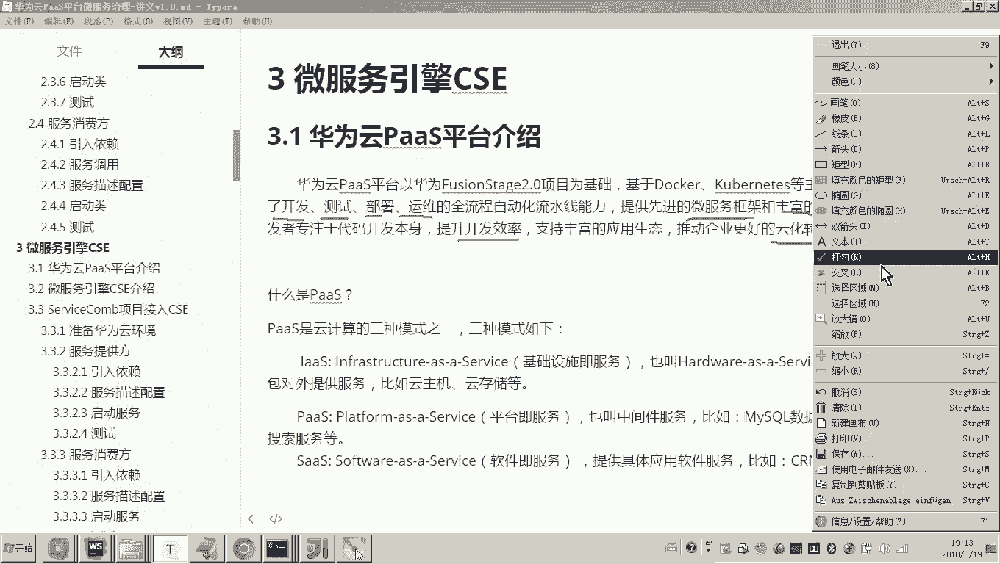

上一节我们回顾了ServiceComb，本节中我们来看看华为云PaaS平台。华为云PaaS平台是以华为FusionStage 2.0项目为基础，基于Docker、Kubernetes等主流开源容器技术构建的。它提供了从开发、测试、部署到运维的全流程自动化流水线能力，旨在让开发者专注于代码开发本身，提升开发效率。

## 云计算服务模式

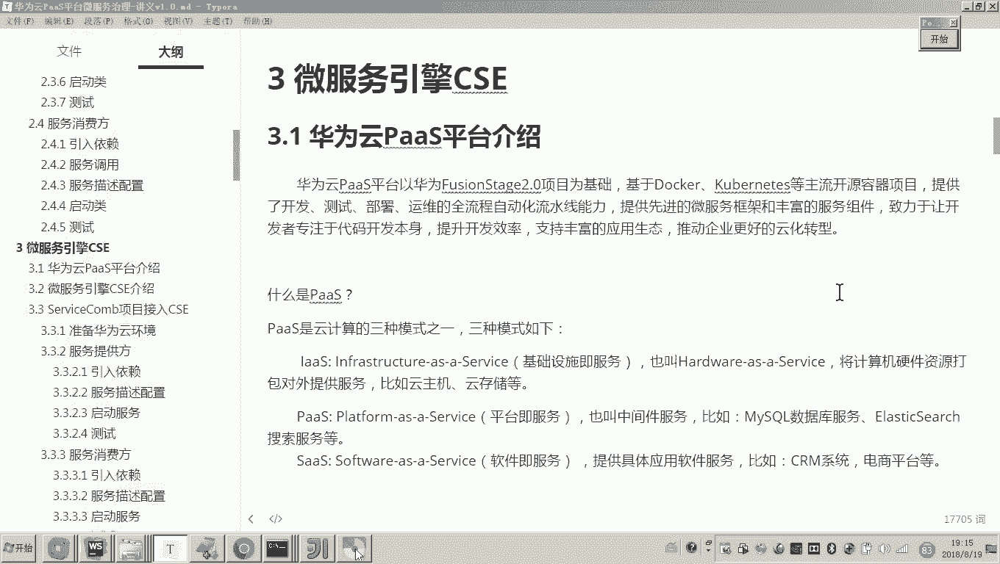

要理解PaaS，首先需要了解云计算的三种服务模式。

以下是三种主要的云计算服务模式：

*   **IaaS (基础设施即服务)**：将计算机硬件（如服务器、存储、网络）打包对外提供服务。例如，在云上租用一台云主机或虚拟机。
    *   **核心概念**：提供虚拟化的计算资源。
*   **PaaS (平台即服务)**：在基础设施之上，将软件平台（如数据库、中间件、运行环境）打包对外提供服务。开发者无需关心底层基础设施和平台软件的部署与维护。
    *   **核心概念**：提供应用程序开发和部署的平台。
*   **SaaS (软件即服务)**：直接提供完整的软件应用服务。用户无需开发或安装软件，只需通过客户端（如浏览器）使用即可。
    *   **核心概念**：提供可直接使用的软件应用。

华为云主要提供IaaS和PaaS服务，而SaaS服务则由其他软件公司在这些基础之上构建。

## 华为云FusionCloud架构

华为云整体称为FusionCloud，它包含三个核心部分。

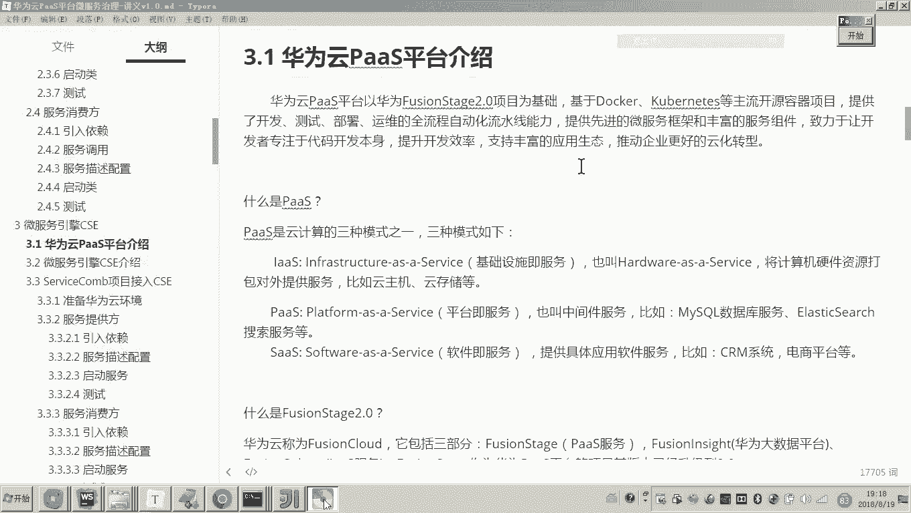

以下是华为云FusionCloud的三个组成部分：

*   **FusionStage**：提供PaaS平台服务，即我们课程中主要使用的部分。
*   **FusionInsight**：提供大数据平台服务，用于海量数据的存储与处理。
*   **FusionSphere**：提供基础设施(IaaS)服务。

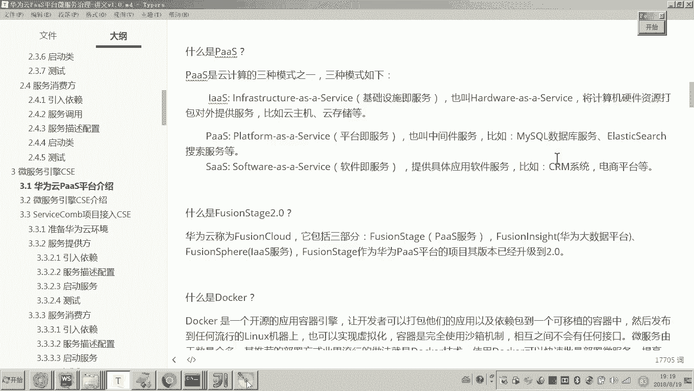

我们所使用的PaaS服务，正是基于华为内部的FusionStage项目发展而来。

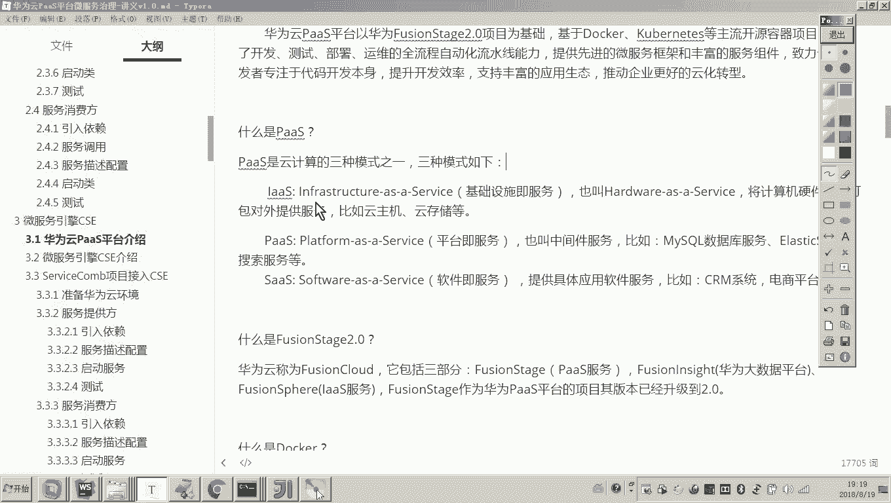

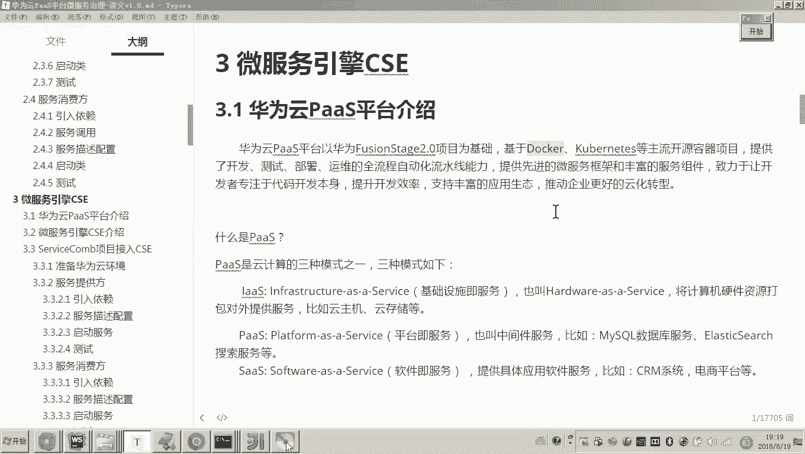

## 核心技术：Docker与Kubernetes

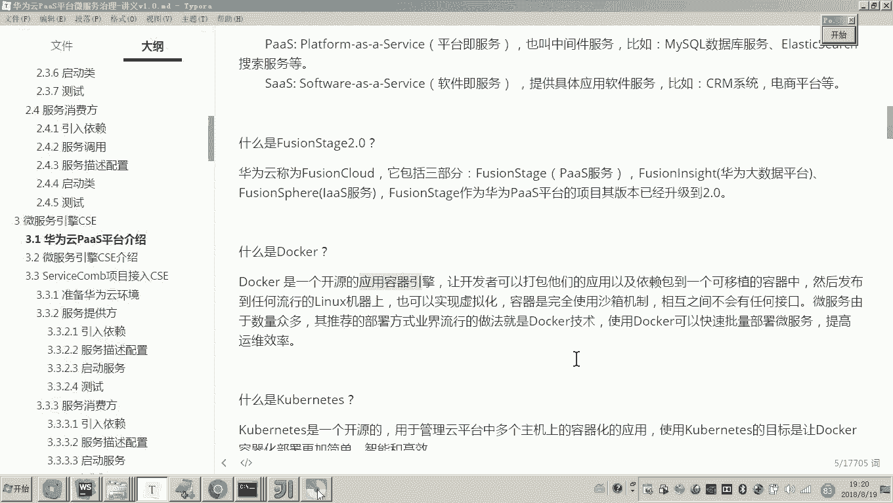

华为云PaaS平台的核心技术基于Docker和Kubernetes。

*   **Docker**：一种开源的应用容器引擎，是实现应用容器化、虚拟化的流行技术。
    *   **代码示例**：`docker run -d -p 80:80 nginx`
*   **Kubernetes (K8s)**：一个开源的容器编排系统，用于自动化容器化应用的部署、扩展和管理。它可以理解为Docker容器的智能管理工具。
    *   **核心目标**：使Docker容器的部署更简单、高效。

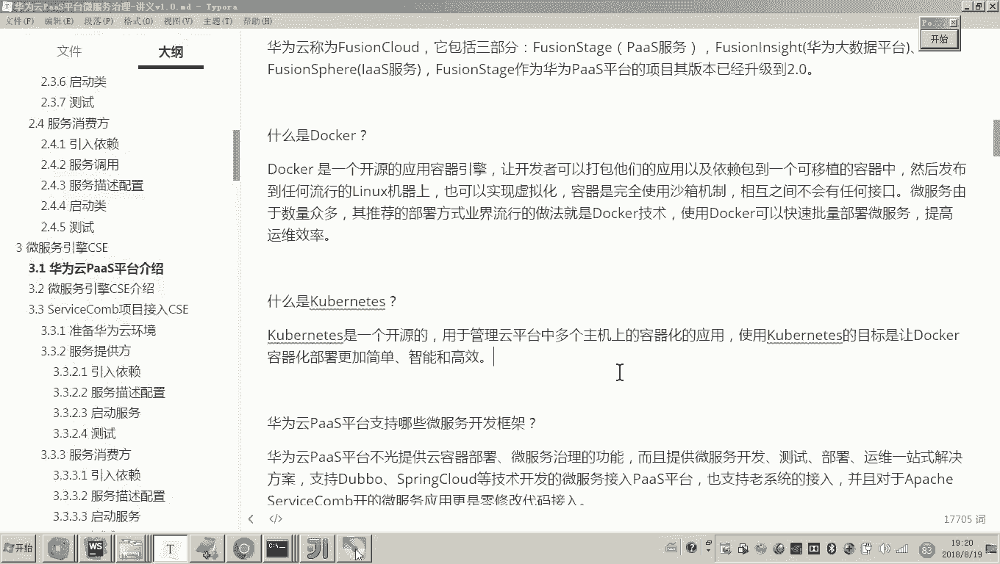

## 华为云PaaS平台的核心能力

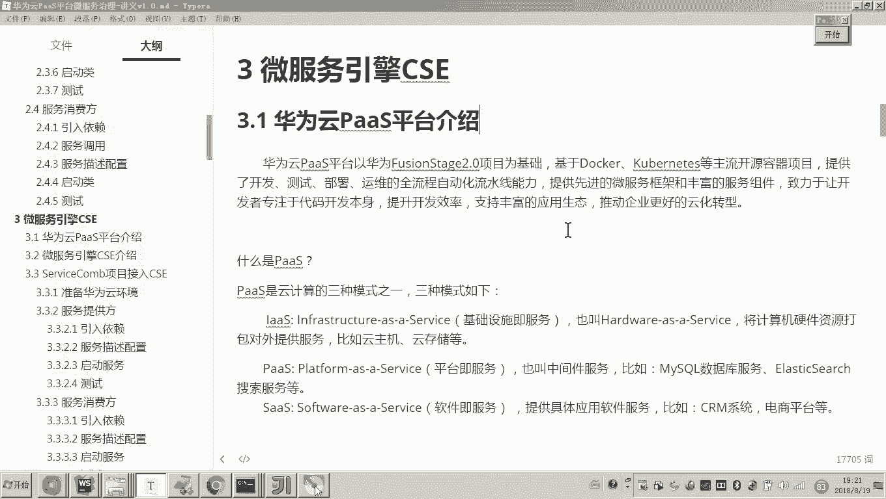

华为云PaaS平台的功能非常强大，它不仅支持微服务治理，还提供了一站式的解决方案。

以下是华为云PaaS平台的主要能力：

*   **支持多种微服务框架**：不仅支持华为自研的ServiceComb框架，也兼容Spring Cloud、Dubbo等主流微服务框架开发的应用程序。
*   **提供微服务引擎CSE**：这是基于ServiceComb的商业增强版本，提供了更多企业级功能，是本次课程的重点。
*   **全流程自动化**：覆盖从应用开发、测试、部署到运维监控的完整生命周期。
*   **丰富的服务组件**：提供数据库、缓存、消息队列等多种中间件服务，开发者可以直接使用，无需自行部署和维护。

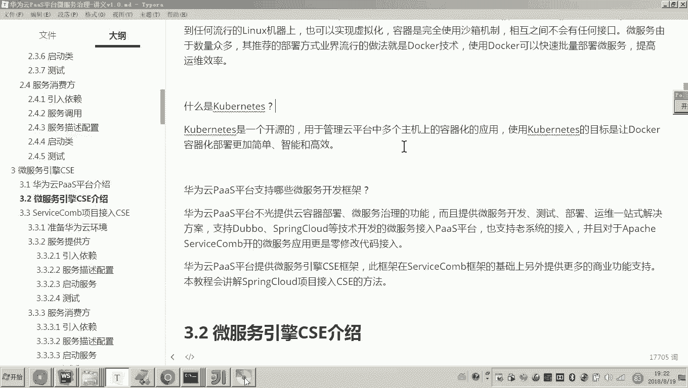

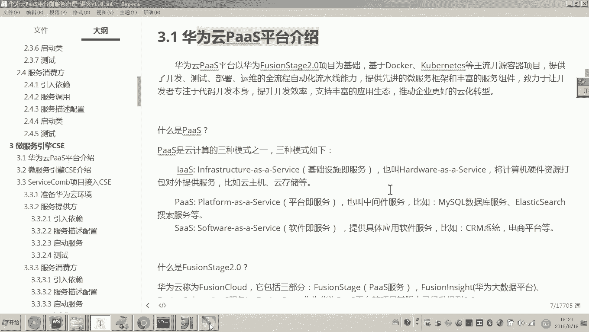

## 总结

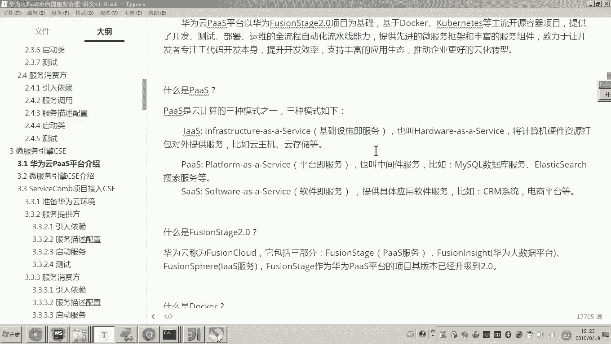

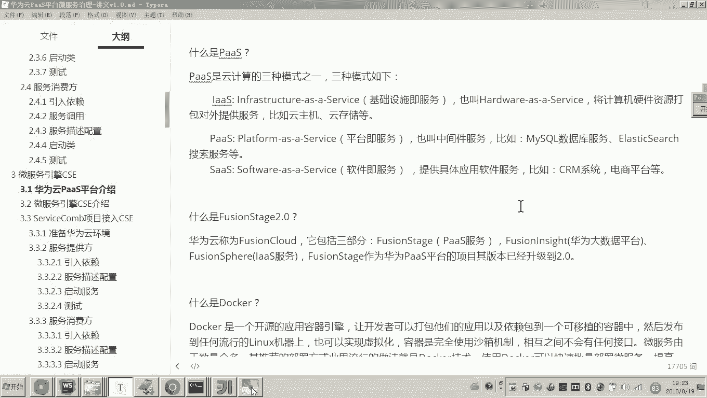

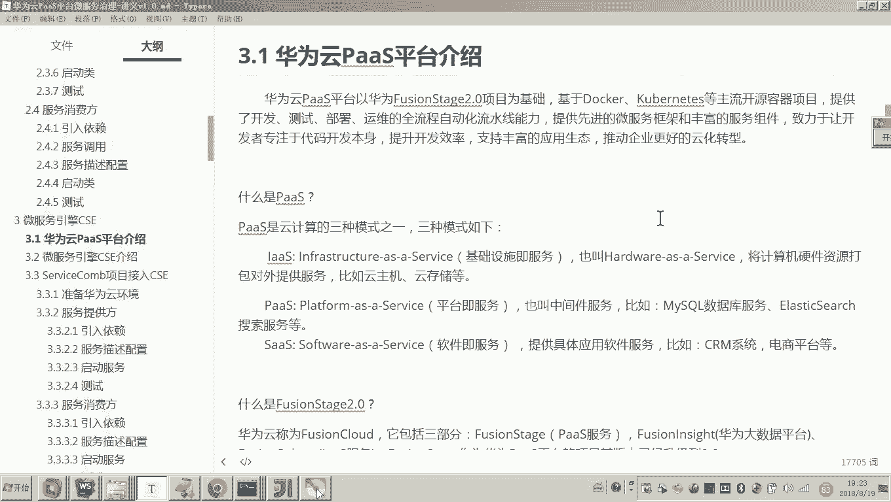

本节课中我们一起学习了华为云PaaS平台。我们了解到，华为云PaaS平台是基于FusionStage项目，利用Docker和Kubernetes技术，为企业提供从开发到运维的全流程自动化平台。它支持多种微服务框架，并提供了强大的微服务引擎CSE。使用这个平台，开发者可以更专注于业务逻辑开发，显著提升开发与运维效率。