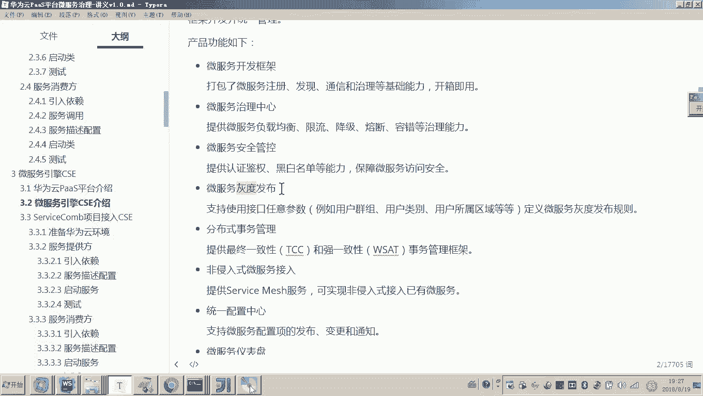
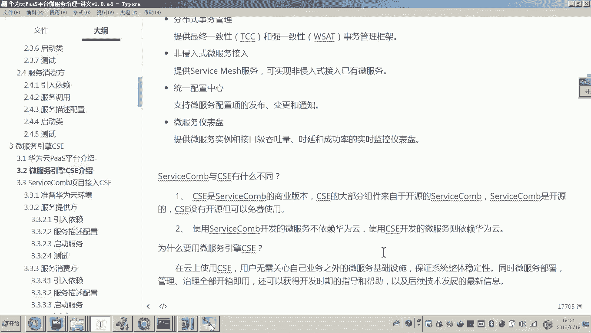

# 华为云PaaS微服务治理技术 - P85：9.微服务引擎CSE-微服务引擎CSE介绍 - 开源之家 - BV1wm4y1M7m5

好，那么接下来呢我们还是要介绍另外一个东西，就是刚才我们介绍的是华为云pass平台，对吧？现在呢我们要介绍，因为现在我们是不是要讲微服引擎CSE啊？好，我们介绍一下啊，前面我因我已经简单说过了。

它是一个什么平台，对不对？我们现在来详细的介绍一下微服引擎CSE。😊，他是华为云pass平台家族。各位，刚才我是不是介绍了华为云pass平台呀，他提供的是不是从开发测试、运维部署等等。😊，好。

那么他提供了这个流水线里边所有的这个呃功能。那么这个CSE呢是华为云pas家族提供的一个企业级微服务应用管理平台。哎，各位跟他的名字是不是比较对应啊，叫微服务引擎是吧？

它就提供的是企业级微服务应用的管理平台。那么这个微服务应用管理平台包括什么功能啊？对，包括微服务的开发。😊，然后包括服务的注册治理。啊，它包括从微服务开发，一直到后边服务上线。

然后呢哎治理啊监控等所有的工西。因为各位。因为大家主要是开发工程师，就是可能对这个后期的运维呢，包括这个服务的这个制力量，可能就是不是很清楚啊。大家一定要注意啊，这个服务的数量非常多。你开发完成之后。

对你开发完成之后，你要把它上线，然后再运行过程当中。如果遇到问题，我们怎么快速的去定位，然后去维护这个微服务这这个成本呢，这个这个工作量呢是远远要大于我们说的开发阶段的工作量的。

所以为什么我们强调的是微服务的治理就在这儿哎，好，那么这个微服务引擎CSE啊，它这个开发的模式门槛呢非常的低，通用性很强啊，并且支持这个契约优先。这个词应该大家清楚吗？就是先写接口啊。好。

那么这个服务接口统一规范管理微服务之间调用非常方便等等。它的具体的功能呢，我们先来看一下啊。😊。

他提供它是本身这个CSE我们说它是一个平台，对吧？它从开发一直到后边的什么监控运维都有叫微服务开发框架，它本身就是一个微服务开发框架。😊。

好，我问大家一个问题嘛，这个CSE这个微服务框架，它是基于基于谁？😊，基于谁的呀？各位有印象吗？CSE的这个他提供的这个微服务开发框架，是不是就是基于servicecom的对吧？

就是在servfaceicecom的基础上，是不是提供了很多的这个商业的功能啊，高级的功能嗯。😊，还有微服务的治理啊，微服务的安全管控，微服务的灰度发布啊，微服微服务的灰度发布是吧？啊。

还有一个分布是事物。

我简单解释一下啊，这个微服务治理中心的话，大家都清楚吧，是不是就是先把这个服务注册到注册中心。然后呢，我们呃这个应该是核心吧。我们啊可以对服务进行负载均衡限流降级。我在快速体验当中。

是不是就讲了一个降级的这个介绍，对不对？里边还有很多熔断容错等。😊。

还有安全管控啊，这里边有认证健全黑白名单。好哎，这是安全方面的啊。还有灰度发布啊，这个呢就是哎比如说我这个微服务有很多种版本，对吧？如何平滑的哎发布我这个微服务的新版本。哎。

我们这里边我们可以用灰度发布。还有分布式事务啊，这个应该是在分布式系统当中的一个难题。那么在这个微服引擎CSD当中呢，也给你提供了一些解决方案。😊。

还有非侵入式微服务接入。嗯，那提供service match。这个呢可能有些同学就没有听说过了。哎，那我给你举个例子吧。😊，就是就是说现在呢呃我我就是一个非常普通的这个外部程序，一个非常老的系统。

而这个老而这个非常老的系统呢，哎我也不想用什么微服务的这个框架了。那我如何接入你这个CSE啊，我让你给我管控起来呢嗯我就可以采用一种非侵入式的哎基于servicemat的这种方式呢来接入你的微服务。

甚至我们说哎我做了我用noteGS做了一个前端工程，我也想让你给我管控起来，怎么做呢？哎，你也可以采用这个servicemat，它所提供的方式来接入我们的CSE。😊。

好，还有统一配置中心，那这个应该也是非常重要的吧。因为微服务的配置信息特别多，我们怎样把配置统一管理起来，这个呢它也有提供，还有微服务的仪表盘。

那这个呢应该是应该这个大家应该之前我在快速体验的时候还见过吧，就是有一系列的这个监控指标。对，可以对微服务一个非常整体的这个这个监控。😊。

好，还有就是我们说说了这么多的话，说这个微服务引擎CSE啊是华宇华为云pass家族提供的一个企业级微服应用管理平台。那么它好像和这个servicecom是不是有关系啊。

因为它它是基于servicecom提供了一些商用的商用的一些功能的，对不对？那我们说servicecom和CSE到底有什么不同呢？😊。

那一个是CSE是3维com的商业版本。而这个servcom是不是就是一个开源的对吧？对各位各位CSE是servicecom的商业版本。在servicecom的基础之上，是不是写了呃提供了很多高级的功能。

而servicecom是开源的，开源的就是你把代码是不是直接可以拿来可以用啊。哎，但是虽然这个CID没有开源。这个源代码你看不到，但是你也可以免费使用。😊，好。

这个使用servicecom开发的微服务不依赖于华为云。各位，也就是说呀，我们现在用这个servicecom开发对微服务，对我们我们自己布一个注册中心。😊，哎，我们自己哎。

我们就可以玩很多的这个微服务的治理了。但是你要用这个CSE开发呢，它就依赖于华为云。😊，哎，那有时候老师那为啥还要用CSE啊，他依赖华为云，用华为云是不是得掏钱呢？嗯，因为我要用它的商业功能，对不对？

对，注意大家要注意了，为什么我们还要用微服务引擎CSE呢？😊。

因为。你把系统做完，你是不是要上线，你是不是要部署呀？还要维护运维吧？所以这些成本的投入是一定的是一定会有的。而CSE就是让你对提供了很多上云云上管理的解决方案，各位用云平台，各位我就问你个问题。

你用云平台和你自己去架设服务器，哪个成本低，对，肯定是云平台，是不是？所以说在云上使用CSE用户没有必要关心自己业务之外的微服务的基础设施，什么意思？比如举个例子，那个服务注册中心。

你就不用再自己去部署了，你也不用自己去管它了。那么这个CSE本身就给你提供了微服务治理的很多基础设施，你只要把微服务开发好，你就可以接入CSE。😡，所以并且呢他提供了很多这个治理的这些策略，哎。

包括监控等等。所以全部的功能呢它都提供了非常智能化的操作界面，全部治理的这个全部功能开箱即用，非常方便。😊。

所以我们为什么要用微服务引擎CSE就是因为我们说其实在后期的这个服务上线部署、维护、监控等等这些过程当中，这个成本是非常高的。也也是非常复杂的那如果我们要让它上云。好。

那么这些过程我们都通过云平台智能化去管理。那就非常方便了。好，那到这儿呢，我们就介绍了叫微服务引擎CSE它是一个怎么呀？是一个企业级微服务应用管理平台，它提供微服务的开发注册治理等呃。

各种一系列解决方案。好。

