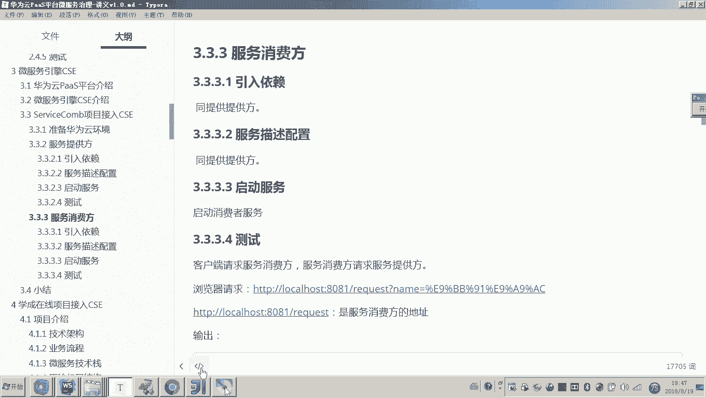
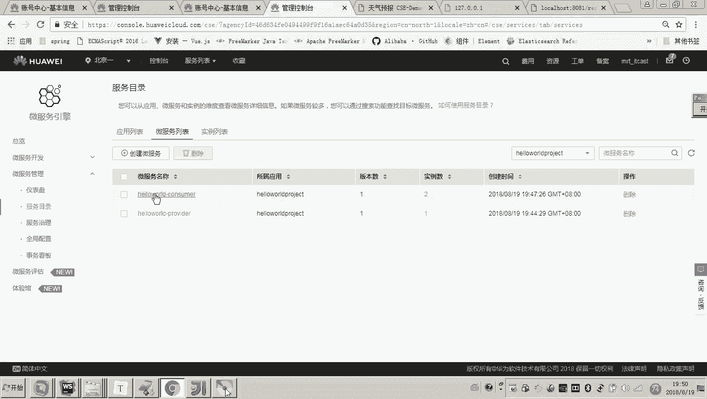

# 华为云PaaS微服务治理技术 - P86：10.微服务引擎CSE-ServiceComb项目接入CSE - 开源之家 - BV1wm4y1M7m5

好，那刚才我们介绍了微服引擎CSE那下边呢我们是不是就可以把我们的项目接入CSE了？😊，好，那现在呢我们要先接入哪一个项目呢？啊，注意，因为CSE是servicecom的商业版本。

那各位servicecom是不依赖于云平台的对吧？而CSE是不是就依赖于云平台啊？那现在呢我们说哦，那现在我们哎写的servicecom的这个项目如何接入云平台呢？😊。

好，后边我们会介绍两部分啊，一部分是servicecom项目，本身就是华为的框架，它是怎么接入CSE的？😊。

还有sprintring cloud的项目是怎么接入CSE呀？😊，所以我们这个课程呢在讲这个CSE平台的接入部分呢，我们会讲两种啊。

一种是servicecom项目接入CSE一种是spring cloud项目接入CSE。😊，那当然各位你就可以想一下，servicecom本身就是华为的东西。

CSE是不是也是servicecom的商业版本呢？所以各位servicecom接入CSE那基本上是一个代码就不用修改，就可以零修改代码的来接入了。😊。

但是spring cloud接入的话就稍微有些复杂了。😊，但是也不是很复杂啊，你不要害怕。所以啊我这个课程呢后边会通过两部分啊。那首先我们先讲第一部分啊，就servicecom接入啊。

servicecom项目接入CSE。😊，好，那么具体的流程我讲一下啊。😊，首先呢你要接入CSD是不是就依赖于云平台啊？所以我们要注册华为云的账号。这个在快速体验的时候，我们是不是已经注册过了吧？好。

那现在呢我们就可以干嘛呀登进去，嗯，看好。😊。

好，那现在呢我们是不是就登录的这个云平台的这个账号了，对吧？那登进去之后呢，注意看。😊。

嗯，注意看这里边呢各位这里边呢呃注意。😊。

呃，我来看一下啊，我把原来这个服务删掉。因为当初我们在讲这个快速体验的时候，我是不是说过在这个微服务引擎，这个就是CSE的这个管理界面。在这个微服务管理里面。

这个服务目录这儿这个部分是不是就相当于我们本地部署的这个服务注册中心。😊。

没错吧。对，也就是说CSE平台这个服务注册中心已经默认就在哪里啊，在云平台就是在公网了。

所以我们的微服务最终在接接入CSE之后呢，我们的微服务就已经注册到公网的服务注册中心了。😡，所以你是需要先干嘛呀？呃，你要先创建一个账号。然后呢，还要干嘛呀？我是不是当初在快速体验的时候。

是不是说过还要干嘛，是不是要管理我的凭证当中要拿到1个AKSK的密钥？😡。

因为你的本地的东西是不是要请求你云平台的东西要有一个什么，要有一个为了安全体，有一个密钥，对不对？对，所以。

所以我们第一步要准备华为云的环境，就是注册云账号获取密钥。好，那第二部分呢，我们现在就可以来开发了。那这怎么开发呢？我们要从头写嘛？没有必要。因为现在我们是不是就是servicecom项目接入CSE啊？

😡。

所以各位我们刚刚写的这个servicecom回顾过程的时候，我们写了一个hello world，这个是不是就是一个servicecom项目？😊，对，所以这个项目当初我们是不是也已经测试成功了，哎。

请求一个什么名称是黑马的，然后他是不是把这个信息给你返回了这个接口当初我们是不是已经调通？😊，那现在呢我就想在这个项目的基础之上呢，去通过什么？按照我们讲义上的要求，我们把它具体的配置该配一下啊。

代码一个就不用改，然后我们就可以把它干嘛接入到云平台。😊。

好，我的需求已经说过了啊，我就准备把hello沃这个项目呢把它接入CSE。😊，好，那现在呢我们要怎么做呢？我在准备在这这里面改了吧，但是改之前呢，注意，因为这个代码将来我要发给大家。

所以这里边呢我就先干嘛打一个包。😊，那这个包这个包我把它放在我们这个代码目录，故意注意这个里头，这就是一个叫servicecom的一个什么一个回顾的代码。对吧，而一会儿我再建一个目录。

这叫做servicecom。😡，是不是告不啥啊？啊，servicecom呢我们叫接入CSE一会儿我们把这个代码呢，我们把它呃在这个servicecom的这个代码的基础上改过的那个代码，我们放到这个目录。

将来你就知道这是原始servicecom的这个项目，这个是已经接入CSE的这个项目。😊，好，那有时候老师好复杂吧，注意不复杂，代码一个不用改。嗯，我们只要干嘛呀？我们要想一下啊。

我的咱们的脑子里边要想了，想什么呀？哎，你说我接入最为怎么接入啊，原来我是不是本地起了一个注册中心，现在相当于这个本地的注册中心没有用啊，因为我最终要把干嘛，要把服务啊，给他向云平台注册。😊。

所以各位这堆东西我都删掉了啊，都停了。这个注册中心现在你也你也请求不动了，对不对？他也没用了。好了，那现在我就准备开始改了啊。😊。

首先第一步引入依赖啊，原来我们说用开发servfacecom的时候，是不是也要引依赖，现在我们也要引依赖。😊。

怎么引呢？还是我们要在副工程当中，我们要演原来副工程当中，我们是不是加了一个叫java这个servicecom的1个SDK包啊，所以你把这个给我平了。😊。

对，现在我们要接CSE了啊。好，屏蔽。😊，OK然后呢，我们哎这个这个注意啊，这个有有问题。好，这样我们是不是就引进去了吧。好，我们把这个引进去之后呢，接下来怎么做？因为这个是在负工程价的。

就是一个版本的一个管理嘛。所以最终引依赖的话，是不是还是要从这个在子工程当中引依赖呀？对，那引哪些依赖呢？😊。

非常简单。

对你只要把之前哎我们在这个服务提供，因为现在我要改俩工程啊，一个是提供方，一个是消费方。在提供方里边，哎，我们现在要要做一个改动，怎么改啊？😊，把这些东西我们都把它屏蔽了，把哪些东西屏蔽啊？

对我们要在服务提供方添加一个叫CSE的这个包。嗯，然后我们在添加这个包的时候呢，我们注意注意听，我们是要把什么，要把要在原来的基础之上，原来的基础之上，我们把这个包添进去就可以了。

就是原来我们是不是写了这么多东西啊。对，这都不用改，你只要把这个包加进去就可以了。😊。

对，就这么简单。好，这就是我们说的引入依赖。在副工程，我们加上这个啊CSE dependency这个包。然后在子工程我们引入啊这个CSE啊，这个服务的引擎包。那有说老师。

你这里边怎么还把这个版把这个依赖给排除了。没错，因为这个和这个spring boot的这个用的日日志包呢有冲突。所以我们在这个啊CSE引擎的这个包里面，把它这个原来这个日志包啊。

就是SL4G的这个把它给排除掉。嗯，你按照我这么写。好，那现在呢我们把这个依赖加好了之后，接下来怎么做呀？😊。

有说候老师那不得开发接口嘛，接口我都已经做好了，所以我们说零代码嘛，这都这都不用改，这都不用改，那你要改啥呀？😡，你的脑子里边一定想，你不要死记啊。

你就想你说啊这个服务将来是不是要向公网的注册中心注册呀？所以那么你告诉我这个地址是不是得改？😡，因为你要向公网的注册中心注册注册到云平台嘛，所以这个是不是得改了。对，那这个怎么改呢？

有说老师直接把改改成云平台嘛？不是，所以这个配置呢我们要我们要变了这个配置呢，我们基本上要变什么样子呢？就是上边的部分不用变，我们把下边的部分把它变了。😡。

那下面部分怎么变？😡，把servicecom这一块的东西把它换成CSC。😡，这个是什么意思呢？你讲一下非常简单，这个就是公网云平台的地址。😡，这个地址是统一的啊这个地址哎，公网云平台的地址。

然后下边呢下边的这个就是我们说的那个什么密钥了。对，密钥最下边这个是不是什么？是不是就是我们说rice的这个端口号啊，对rice的端口号。你说跟当初我们配置这个servcom是不是类似，这是r端口号。

这是注册中心的地址，对吧？而现在你要改成这个模样的话，是不是就是公网的注册中心地址密钥，然后呢端口号，对不对？😊，好，那现在呢我们把这个配置呢就配好了，配好了之后，各位我们现在就可以干嘛呀？

启动我们的程序了。好，就这么简单，我们把这个依赖呢刷一下，然后再这个启动类这，比如说老师这用改嘛，这不用改。😊，这不用改，我们现在呢就怎么弄启动吧。😊，非常简单，对不对？嗯，哎把这个评了啊。

因为我原来有起的。😊，好，都都现在都删了吧，这个服务是不是都没有啊，现在我们启动。😊，那我启动起来之后，我要怎么去验证一下这个这个这个接入成功呢？首先你得看它启动成功不成功，对不对？好，各位来看一下。

这是不是都已经启动成功了。嗯，比如说老师怎么看启动成功。那这里边你看这个注册是不是就显示finish的，是不是已经完成注册了吧？那这个已经完成注册了，我要怎么验证一下呢？对，我们进到我们的微服务的。

不是这个云平台。啊，我们进到这个微服务引擎的这个云平台。哎，微服务引擎在哪呢？在这个CSE这点然后呢，点这个微服务管理的服务目录。😊。

然后这里边我们来看这里边是不是有一个叫hellow world project。😊，各位这就已经有了，这是不是就是我们说的这个服务提供方。

然后你点开各位这个界面是不是和我们当初的那个本机的服务注册中心的那个界面一样，比竟这里边是不是也有个服务契约，别的这个服务契约，你看写的非常好。你看他是把这个接口的内容都给你展示出来了。

对你就可以通过这个服务契约的内容，就看你这个接口，对，写的暴露的正确不正确。😊。

好，那这个就是我们说的什么服务提供方就OK了。😊。

那服务提供方OK了之后，我们接下来再继续改造，说这个服务消费方呢，当然我们说服务提供方弄好了之后，你是不是可以直接测试啊？对你可以直接测一下。哎，你就请求服务提供方就可以。好，现在我我就我就不测了。

我一会一块测，我就通过这个还是刚才我们写的这个服务消费方，我直接请求服务消费方哎，去请求一下。然后消费方请求服务提供方。好，那服务消费方的方法呀，跟刚才那个是一样的，也是要引入依赖。😊。

也是要怎么引呀？就在原来的依赖的基础之上啊，你把这个呃CSE的这个service引擎哎，这个包你给我加上就可以了。😊。

然后在最上边，你在这加。加上了吧，然后呢然后呢把它刷新一下，对吧？好，那么接下来要怎么做呢？接下来的话代码不用改呀，你是不是要改配置文件了，这个配置文件肯定得变了嘛，怎么变。

是不是这以下的部分是不是都要干掉，然后我们是不是把它换成ECSE的这个配置是不是就可以了？对，那怎么换呢？非常简单，各位看一下啊，😊，这个rice的端口是不是变成8081了，你给要改成8081吧。

这个密钥肯定不用动吧。不管什么样的微服务，是不是像像我们的云PY注册，是不是都用这个统一的密钥啊？这个是我们说公网的那个注册中心的地址，是不是不用变？对，上面的这种东西干掉。好，这个配置就OK了。😡。

你说这个东西我弄好了之后，接下来我要怎么做呢？我要启动服务吧。对，然后怎么办？测试对，就可以了。这就实现了接入。那我现在只要以启动服务的话。

我是不是就可以看一下我的这个呃公网的这个服务测测中心有没有这个服务地址，是不是就可以呀？对，好，注意看一下啊。😊。

好，那现在呢我们来刷新。😊，哎，不要这样刷新吧，这里面有一个其实有一个刷新，你看这是不是有一个刷新。好，大家来看现在这两个服务是不是都注册成功了。😊，那现在呢我们说这个服务都已经提起来了。

并且向注册中心注册成功了。那现在我们是不是就可以来测试了？😊，测试的方法怎么测试？对你还可以访问本地。因为本地和公网的服务注册中心已经连接起来了。你现在访问这个服务消费方。

服务消费方是不是就连接公网的注册中心，拿到服务提供方的地址，开始调用。好，我们回车试一下。😊，各位，你看看。可以吧。这是不是正常？对。没错，所以各位到这儿到这儿。

我们是不是已经完成了这个servicecom工程哎，接入CSE的整改就已经完成了。所以呃servicecom这个项目呢接入CSE的呃，它的过程非常简单呃，只呃只要修改一下依赖啊。

然后把这个服务的这个配置改一下，改成CSE的这个公网的注册中心的地址，然后再加这个什么呢？这个密钥就可以完成整个接入，你会发现这个过程是不是就。😊。

不复杂呀。哎，好，那最后呢我要说一点说说一点什么呢？就是各位我们少不了的就是接口的修改，对不对？那举个例子啊，举个例举个简单的例子。你，比如说比如说现在我把这个。😊。

我把这个提供方呢，我把它当掉。假如说我说啊这个这个接口的地址我想改一下，哎，我改我改什么，我改消费方吧，改哪个都行啊，改消费方。我比说我这个我不叫这个request的哎，我叫requestAA。好。

各位我们说这个接口是不是是不是改了呀？哎，这个接口改了，或者说我说把原来的get呢，我我我准备变成这个po的。好，注意看对我们起一下。😊。

有说老师想演示什么功能呢？就是说我这个接口更改了之后，注意他是不是也是要向这个服务注册中心去干嘛去注册吧。对，那这个时候各位他也向服务注册中心去注册，我们现在来打开服务注册中心，我们来瞧一下。😊。

刷新哎，不要用这种刷新啊啊呃用这种刷新。你看这里边是不是就有两个实例了，看见了吗？是不是就有两个实例，并且并且注意这两个实例，这两个实例的这个接口注意看一下啊。😊。

所以这个接口啊，你看啊，你我们来看。实例列表对不对？然后呢，在服务契约这。他有一个叫杠request，对不对？

哎，我现在我现在要做的是什么呀？😡，我现在是不是把我的这个消费方的这个地址给它改成requestAAA了？😊，没错吧，而现在在我们的这个里头。😡。

在这个里头，你看这个接口是不是还是这个request呀？😊，你没发现吗？所以说当你的接口进行变更了之后，各位。😡，你一定要做一件事儿，就是把你的这个注册中心是不是已经向公网这个这个数据已经注册进去了。

对吧？如果你的接口一旦变更，你把该服务呢从这个注册中心干嘛呀，你把它删了。😡。

然后再次执行，注意看好。

好，注意看这时候我们再来刷新。😊，好，是不是就是消费方也注册进去了吧。然后我们再来看服务的这个契约。你看各位，你看一下，这儿是不是就是request的 AAA。所以一定注意，就是当你的接口出现变更。

你要做一件事儿，就是把这个什么，把这个微服务引擎服务目录这个微服务啊，这个微服务啊，你把它删掉，你重新启动一下，它就会重新注册。😊。

はい。好，这一点要注意啊，因为这个开发的时候，我们免不了的要改接口。

还有一点就是说呃假如说原来我是这个ge，然后现在我把它改成post了，这个接口没有变。但注册中心的这个接口协议呢，它是get。那这个时候你要注册的话，它会会注册失败。所以遇到这种情况。

你就是把这个注册中心里边的这个信息把它删掉，让它重新注册一下就可以了。好，那到这儿为止，我们的这个呃servicecom项目接入CSE呢，我们就讲完了，它的过程就可以实现零代码修改就接入啊。

只要引入依赖，然后呢修改我们服务的这个配置文件。那最终我们就实现了接入。好。😊。

