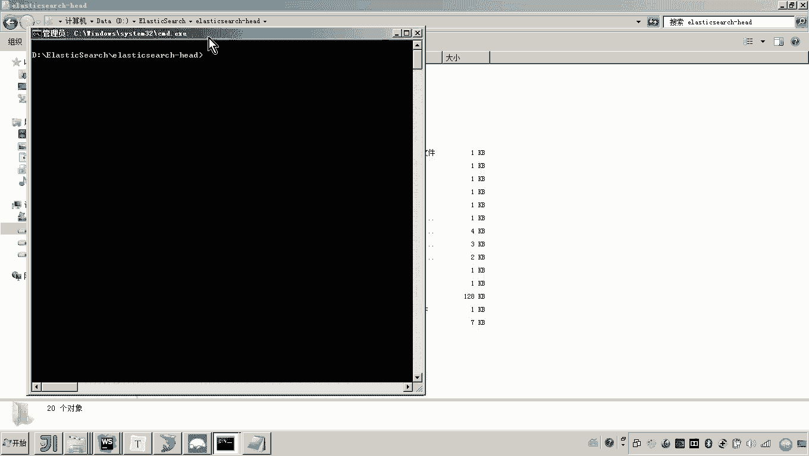
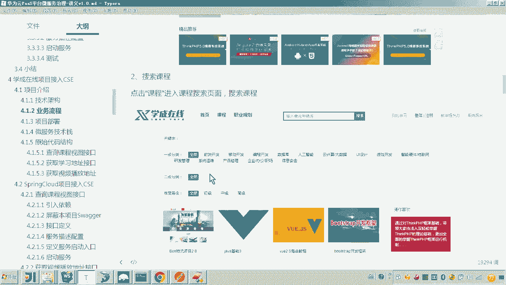

# 华为云PaaS微服务治理技术 - P88：12.学成在线项目接入CSE-项目介绍-项目部署演示 - 开源之家 - BV1wm4y1M7m5

好，那么接下来呢我们把学生在线项目呢部署一下。呃，那么这次部署呢，我说明一下呃，这个项目呢我们只是抽取了其中一个业务流程来进行演示。呃，上次课呢我们说到这个业务流程呃，应该进入门户搜索课程。

然后点击课程详情在线学习啊，播放视频这样一个流程。

好，那现在呢我们把它部署一下。首先呢各位我们呢按照这个呃，因为之前如果学习过这个学生在线呢，他手里边都有资料，那应该这个看起来呢就比较简单啊，因为学过呃，那么如果没有学过学生在线呢，也不要着急。

我给大家呢详细说一下。那我课后呢会给大家提供一个资料啊，在这个资料呃文件夹下呢有一个叫学程在线的目录。好，这个目录下边呢就是我刚才说的业务流程所需要的一些呃服务啊程序等。那好。

我们说第一点要安装mysl。嗯，安装mysl之后呢，我们来把这个myscle里边的这几个circle脚本呢，把它导进去。好，那这样的话，我们导进去之后呢，各位啊这里边我们就创建了几个数据库啊。

大也可以看到有一个课程的数据库，学习的数据库啊，那里边呢都已经在脚本当中都已经有表了。好。那么我们把这个my circlecle呢呃创建完成之后，我们接下来再来安装猫果地B。好。

这个mongoDB的安装呢，这里边呢我就不再详细的去说啊，然后如果不会安装的，可以参考嗯学程在线项目所提供的一些资料，也可以去网上呢去搜索一下。好。

那这里边我们把mongodb安装好了之后呢啊仍然我们要导入嗯mongodB的这个脚本。好，在这个学生在线目录呢，也有mongodb的这个目录。大家可以看一下呃。

那么你需要创建一个mongo dB下边的这个什么呀？集合，就相当于mysql的数据库。啊，来，这里边呢我也连上我本地的一个mongodiB。然后我们连上onegoDB之后呢。

各位来看一下这个最终我们把数据导出导入成功的这个效果啊。贸地创建一个集合，哎，叫做这个名字呢哎叫做这个XCportal view。好，然后呢，在这个。导入。导入这里边的这个文健身健身文件。好。然后呢。

这样我大家来看一下啊，然后我连上mongoDB。最终导入后的效果呢就是这呃一个集合里边呢有4个呃有4个这个什么呀collectction嗯，好。那么接下来我们还需要安装elastic search啊。

那么这个呢就是我们学生在线所用到的一个搜索服务。好，那么把elastic search创建好了之后呢，我们就需要把它启动起来嗯。

好，那当然还是这个这个具体的创建的过程呢，安装过程我就不再详细的说。然后呢，如果不太会的同学呢呃去找一下学生在线项目的一些相关资料，里边都有嗯elastic search的详细的安装。

好，这里面呢我就打开呃运行这个脚本。

好，这样的话，我们把这个elastic search呢就提起来了嗯。😊。

那么起起来之后呢，起起来之后呢，注意。还需要就是说你刚开始刚开始你创建了一个elastic search之后呢，它这里边的这个索引呢是空的对吧？没有索引。

所以呢我们是需要参考我给大家提供的学生在线这个目录里边的一个叫elastic search里边初始化数据这个文件呢，我们把这个索引库创建一下，包括这个映射创建一下啊，还有就是导入一些。基础的这个数据啊。

啊，因为我们要保证这个业务流程能走得通嗯。好，那这个具体的过程呢呃就是创建索引库。这里边我们用我我们创建了一个名字叫XC course的这个索引啊。啊，大家来看啊，我这样提起来了之后呢。

然后我给大家看一下导入后的效果。同样这个elastic search一般来说，我们去创嗯我们去启动完了之后呢，还需要把它的一个这elastic search head这个插件呢也起起来。因为什么呢？

因为我们用这个插件可以访问这个elastic search里边的数据啊。好，这里边呢咱们去。😊。

写一下。这个electastic search呢，我用的是啊六版本啊。好，这样的话我们来运行一下，打开这个插件啊。

打开这个插件呢，我们连上去看一下这个ellect search里边的数据。嗯，大家可以看到这里边呢，我都已经把这个索引呢给创建成功了啊。然后呢，如果你没有创建的话，你可以点索引，然后再新建啊。

这里边输索引的名称。然后分片数呢，这里边你咱们先部署单击的话，你就分片是一。好，然后这里边的副本就是0。嗯，这个呢就是XC什么呀？courses。好，然后OK就可以了。好，然后大家可以看到啊。

现在的话这个索引呢都已经创建成功了，里边都已经有数据了。我们可以看一下，里边现在是5条数据，对吧？啊，还有另外一个啊还有另外一个类型就是SC cross下划线里边啊应该也有四五条数据。好。

那么这些数据的导入的方法呢，因为数据不多，所以我们啊我们就用一个HTTP的工具啊，客户端工具post来导入就可以了。😊，具体的导入方法呢，我简单说一下啊，你首先打开pos门。

那这个呢是在post的这个工具，是我们在做前后端分离开发所经常使用的一个HTTP的客户端工具啊。好，那么你打开post之后呀，这里边各位我们呢就参考这个文档所说的啊。

然后首先啊你用post来post的请求这个地址那个内容呢就是这些内容，你把它粘进去。好，具体的过程呢是这样来。😊，比如说你打开一个post man，打开随便打开一个什么po这个这个这个标签。

然后我们复制进去。然后在这个body里边呢，你可以把这些内容呢贴进去嗯。😊，然后这样的话，是不是就相当于向这个地址呢发送pos的请求。然后内容是pos的请求的内容是我贴进去的这个建设数据是吧？

然后点send，这样的话我们就把这个什么呀映射啊，就创建成功了嗯。好，这个映射创建成功之后呢，那接下来是就向这个。索引当中添加数据了，添加的方法仍然是一样的啊，因为这没几条啊，你就按照我文档上所说的啊。

就一条一条往里边添，然后你复制。好，然后呢再把这个内容呢哎也复制一下，然后把它添进去，然后再干嘛呀，再的哎，这样的话这个数据呢就添加成功，就是这样啊，然后呢你就往下翻，没有几条数据。

我们把它添完就可以了。好，这样的话我们这个el search呢，我们说就导入数据成功了。😊，然后再接下来呢，我们就要启动什么微服务了。在上一次课呢，我们已经把这个微服务是不是就导入成功了吧？好。

导入成功之后呢，这里边各位我们稍后我会介绍这个微服务里面的代码。因为我们说一会我们是不是要把它改造，把它改造一下，然后接入一这个CSE平台啊，是吗？所以说这里边呢各位我们先把它跑起来。

让大家啊视觉上有这么一个呃流程，业务流程的效果，然后我们再改造。那启动什么呢？启动的话就是第一注册中心。😊。

这个注册中心是在开发微服务的时候说必须要有的吧。所以这里边我们的注册中心是哪一个呢？是这个X govern center哎，这个注册中心，然后哎就这个工程啊，然后因为它是spring boot工程啊。

所以说你就找到它的启动类，然后干嘛呀，就是得bug哎来运行。😊，好，然后还有什么呢？还有一个叫网关，还有一个网关。那微微服务开发过程当中，这个网关呢应该也是所必须要的。所以这里边呢。

我们就可以把网关呢也起起来嗯。好，然后另外呢还有就是三个微服务了。这三个微服务呢就是来获取一些相关数据的啊。首先我们启动有一个叫做什么呀，叫porttoportal view这个服务。

这个port view呢呃其实呃你看从这个字面意义上来说的话，就是为什么呀？为门户啊，为这个前端提供一些数据视图的这个服务啊，就是专门用来查询数据用的。好，提供数据查询的。

然后另外还有一个就是搜索的这个服务搜索。😊，嗯。这个搜索服务呢啊就是采用的是elastic search来完成这个全文检索。好，我们也把它起起来。然后最后一个就是lening。

这这个呢就是我们说的什么呀？呃，学习服务啊，就是当用户想学习某一个课程了。那么需要通过这个这个这个服务呢进行一个学习权限的校验校验通过呢，他会把这个学习地址呢给用户返回。好，这个学习服务我们也起起来。

嗯，那这样的话，我们说是不是就启动了应该是这几个5个微服务，对吧？好，然后这5个微服务起起来之后呢，接下来你看啊后端的东西都已经完成了。下面我们再把前端的也部署一下。😊，好，那前端的部署的方法呢？😡。

怎么步署呢？还是按照我这个讲义上所说的啊，你首先呢来解压嗯解压我这个学程在线这个呃目录下边的呃里边有几个zip包，看见吧？首先呢你把你把这几个zip包全部解压啊，全部解压。然后呢，其中有三有两个啊。

这个是前端工程。啊，这个是学习中心的这个工程。这个是搜索的前端。好，这个是这个静态门户呃静态门户，就是我们一会儿要首先进入门户嘛，就是门户的这个工程。

然后这个是一个视频播放的里边存放的一些视频视频信息的这个目录。那这个是静态资源的目录。好，这个是的配置文件啊，一会呢我来跟大家说，你就把这几个zip包全部解压。好，解压完了之后呢，首先我们啊安装外。😊。

st一个前端开发工具，然后我们打开这两个解压后的目录啊。好，那这样的话，我们这两个目录就打开了，打开这两个目录要干嘛呢？😊，打开这两个目录的话，各位其实各位虽然我们是java程序员。

其实有些前端的东西呢还是可以去适当了解一下的。好，那这这里边呢各位我们来看一下。😊，呃，两个工程，我们首先进入目录的根目录。因为这个是基于web park来进行呃这个依赖包的管理嘛。

所以我们进来之后呢运行这个NPMstore，然后呢我们把这个依赖的GS包的把它下载到我们的这个本地啊，运行这个命令之后呢，是不是就这个依赖依赖包就下载到这个目录下了，对吧？

这里面是不是全是GS的依赖包啊，然后呢我们就可以去干嘛去运行这个工程运行NPMrun dV，然后就可以来通过web park来进行打包启动这个工程。好，那这样的话我们怎么运行啊。

然后用webstore这里边是不是就可以自动的把这个package点文件打开，然后里面是是有一个DV啊双击。😊，然后呢，那个运行的方法也一样，找到NPM，然后呢，双击DV。好。

这样的话我们说这个前端工程呢就开始运行了。好，你让他启动啊。接下来我说其他的。然后刚才这两个工程呢，就是一个前两个前端工程，我们就已经运行起来了啊，运行起来之后呢。😊，然后再解压。

就刚才说的那5个Z包吧，这个是门户的，这个是静态资源，这个是视频。好。😊，呃，我们说那你把这几个目录解压开来之后呢，我们需要安装uning，因为这几个都是静态资源。

所以需要unin嗯in通过enin来干嘛呀，来这个浏览里边的资源。安装en之后，我们就需要配置eng confi这个文件了，对吧？那这个eng的 confi文件呢，我也给大家提供了嗯。

然后打开我简单给你点点一下啊。😊，好，这个里边有很多的虚拟主机啊呃，我们说这个业务流程呢只用到一个门户。和这个静态资源以及视频播放是吧？所以这个这个虚拟主机是门户，那你要关注什么呢？

就是你要关注这个门户的这个目录的地址。因为刚才我是不是说了，让你把这个zip包给解压，对吧？你解压到哪个目录呢？你得把这个虚拟主机这个门户的这个地址呢给配置正确。😊，那另外还有什么呢？呃。

刚才是不是说要让大家还解压这个静态资源，对吧？所以这个这个这个Z这个这个这个目录呢，你解压解压开来之后呢，你要注意配置它的什么，就是你下边最下边有一个叫90嗯，叫做91的这个端口看见吗？91这个端口。

那91的这个端口呢，就是用来浏览静态资源的。还有90是用来浏览这个视频文件的。而这个视频文件的，也也给大家提供了，里面有一个叫叫video点ip。那里边包括了几个视频啊。

就是用来我们说的是去测试这个这次业务流程用的啊好。😊，这样的话，我们就把这个N呢也配置好了嗯。可能有呃有些同学初次接触这个我刚才说的这一堆东西呢，可能有点这个什么有有有有点不清楚是吧？

你比如说呃如果学学过学生在线项目的同学应该很清楚。如果没有学过的话，可能不太清楚，你也不要紧啊，你比如我给你举个例子，比如说刚才说这个说这个让解压门户目录zip对吧？然后让你参考什么呀？

参考我给你提供的点fi这个文件，让你配置自己的这个 confi。那么主要注意的点，我这已经给你罗列好了。就是90端口视频播放，那你在这个里边呀，你就要找90。😊。

9090这里边你看是不是有一个叫video。那这个目录呢，这个位置啊就是你解压的这个啊video点zip的这个目录的位置啊，尽量不要有中文啊好。😊，然后呢，我们把这个安装好了之后呢。

我们就可以把它启动起来了。嗯，那因为我的开发环境是windows啊，所以这里边呢我就呃用什么用这个windows版的来运行我们的这个门户了。好，那在这个里边呢，各位我就安装完了之后。

你看我把我刚才配置的这个已经拷过来了，拷到这拷到这之后呢，现在我就双击这个然后这样的话这个就运行起来了。其实在这个什么任务管理器当中，你找一下这个它其实这个进程是不是都已经有了。好，这样的话。

我们现在就可以来干嘛呀，来运行哎来运行这个工程了。😊，那这个运行这个呃工程的话，这里边怎么运行呢？我们是呃需要在啊hose的这个文件。中啊来配置域名。好，那这个域名为什么要通过域名呢？呃。

因为我们说最终这个项目是不是就是通过域名来访问嘛，然后包括我们这个虚拟主机，这里边是不是也是配置了这个域名啊，看见吗啊，这里边配了两个域名啊，我们用后边这个啊我们用后边这个。😊，好，那么这里边呢。

我们就需要找到我们说的host文件，对吧？嗯，host文件。好，然后呢，你找到C盘。啊，windows啊，然后呢，stem32，然后drivers，然后还有ETC，然后我们打开看一下。

那这里边呢我们需要把这一堆域名给配置一下，嗯，把这一堆。然后我们把这堆域名配置好了之后呢。我们现在要运行的话，其实就是去浏览浏览浏览哪个例子呢？浏览门户，对不对？哪个是门户呢？😊。

这个是门户叫X呃叫学程cloud点java点ID card点CN。所以我们只需要去浏览这个地址呢，我们就可以看到我们这个学程在线的门户。各位可以看一下是吧？然后这个门户运行起来之后呢。

各位我们再回到这个业务流程啊。呃，我们这次部署，刚才我说了，因为学生在线项目呢比较大啊，我们现在呢去演示这个项目的所有功能。在这个课程当中呢不现实的。所以我就抽取了一个非常典型的在线学习的业务流程。

那首先第一步是不是进入门户啊？第二步的话是不是就要搜索课程了？那所以这里边怎么搜索课程呢？你可以点左侧的这个导航，你也可以点课程，这样的话我们是不是就可以进行搜索，对吧？嗯，好。

这个课程信息是不是就搜索出来了。那这里边其实是没有显示图片的啊？因为这里边呃学生在线用到了一个F的分布式文件系统，这里边我就没有部署啊，因为我不想把这个东西搞得非常复杂。啊。

如果你想学习这个学生在线分布式文件系统图片服务器的一个呃构建方法的话，你可以参考学生在线的相关课程啊？那么这里边呢我们就点击某一个课程。这里边我们是不是就进到了这个课程的详细页面，对吧？😊。

然后在这个课程的详细页面当中，我们点击马上学习各位。这样的话我们是不是就可以怎么弄，是不是就可以打开视频来观看了，各位可以看到对吧？然后你也可以通过这里切换章节。😊。

所以以上的这个呃讲解呢，其实就是我们把学程在线的这个在线学习业务流程所涉及到的呃数据库、微服务以及前端工程。哎，我就把它部署完整了嗯。呃，那么这个这块的东西呢。

有些同学说呃老师我要按照你的这个过程去部署呃，如果没有跑起来怎么办呢？那你也不要紧啊，因为各位我其实的目的只有一个，我是不是要让大家更直观的去看一下，体验一下这个业务流程呀。

也知也就是说你知道我现在做的这个案例啊，其实他最终实现的是这么一个功能，对吧？那有时说老师我还想部署怎么弄呢？没事呃，后边我是不是会要讲将学程在线的这个所有的这个功程，我是不是要部署到云平台呀，对。

到时候呢，到时候呢我还会去详细的讲解这一块的部署，所以目前来说你只要知道我们学成在线这个案例，在这个接入CSE里边我会去讲这个业务流程啊就行了。😊，好，那么呃那这个项目部署这一块呢，我先讲到这OK。

