# 华为云PaaS微服务治理技术：P88：学成在线项目接入CSE - 项目介绍与部署演示 📚

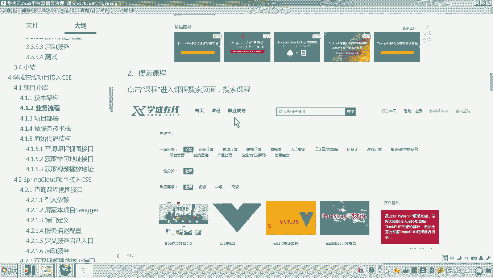

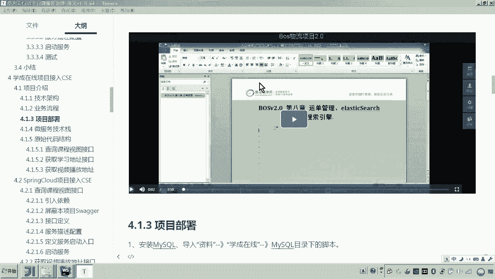

在本节课中，我们将学习如何将一个名为“学成在线”的微服务项目进行本地部署和演示。我们将重点关注一个核心业务流程：从门户搜索课程、查看课程详情到在线播放视频。通过本次部署演示，您将对项目的整体架构和运行流程有一个直观的了解。

## 项目概述与业务流程 🔄

上一节我们介绍了项目背景，本节中我们来看看具体的业务流程。本次演示仅抽取了“学成在线”项目中的一个典型业务流程进行。

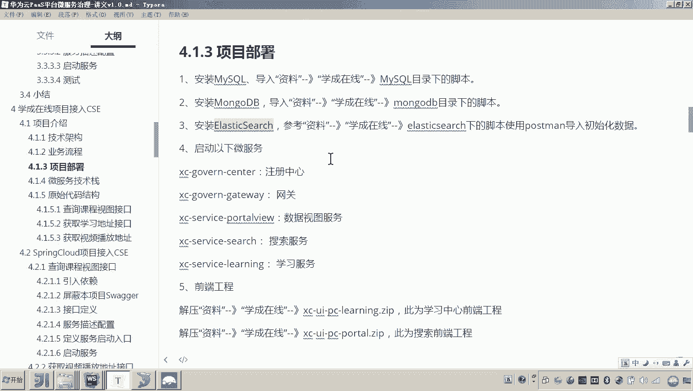

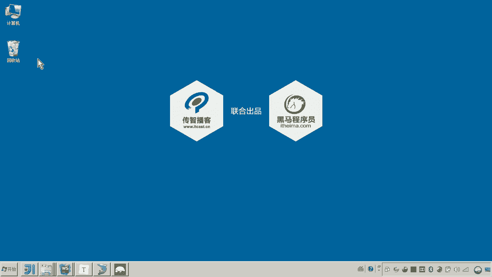

该业务流程包含以下步骤：
1.  用户进入门户网站。
2.  在门户中搜索课程。
3.  点击进入课程详情页面。
4.  在详情页点击“马上学习”，在线播放视频。

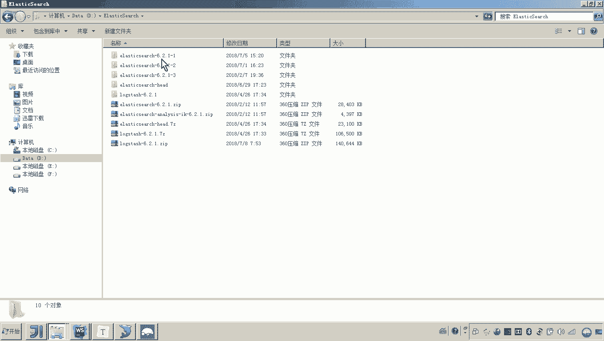

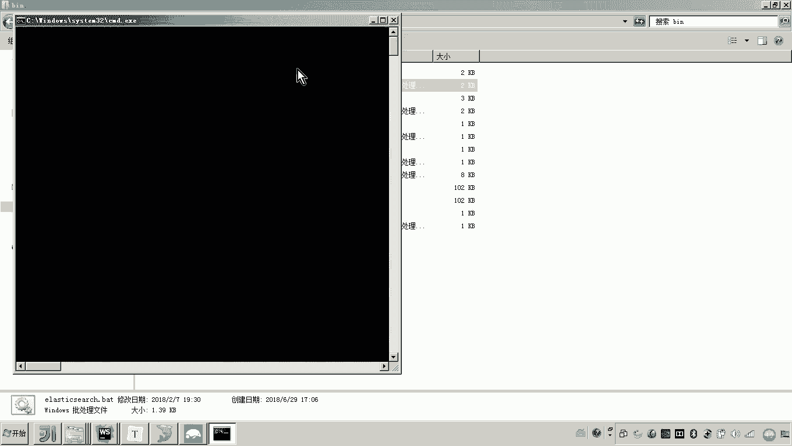

## 环境准备与数据库部署 🗄️

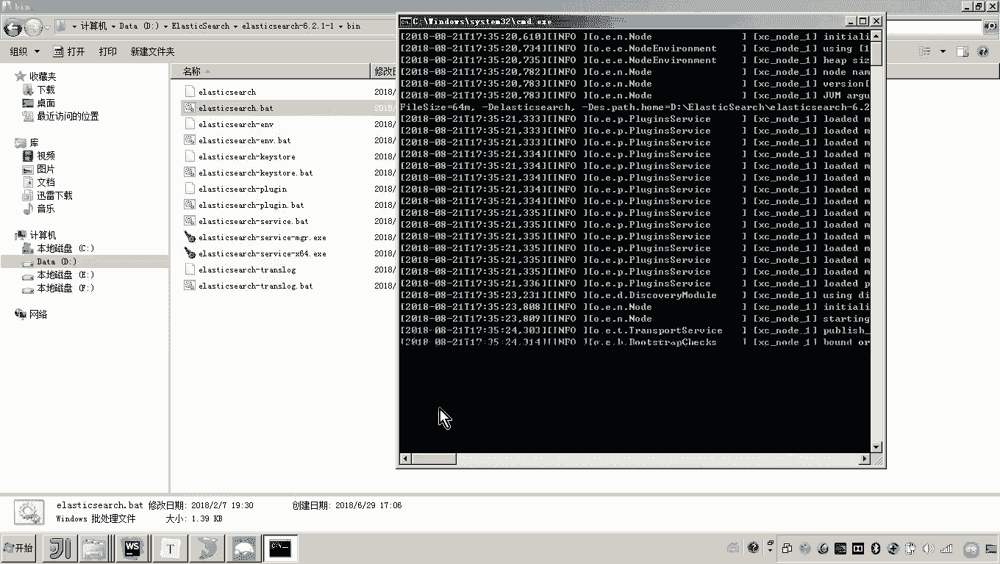

要运行此项目，首先需要准备并部署相关的数据库和中间件。

以下是部署所需的基础环境组件列表：
*   **MySQL**：用于存储课程、学习等核心业务数据。
*   **MongoDB**：用于存储门户视图等非结构化数据。
*   **Elasticsearch**：用于实现课程的全文检索功能。

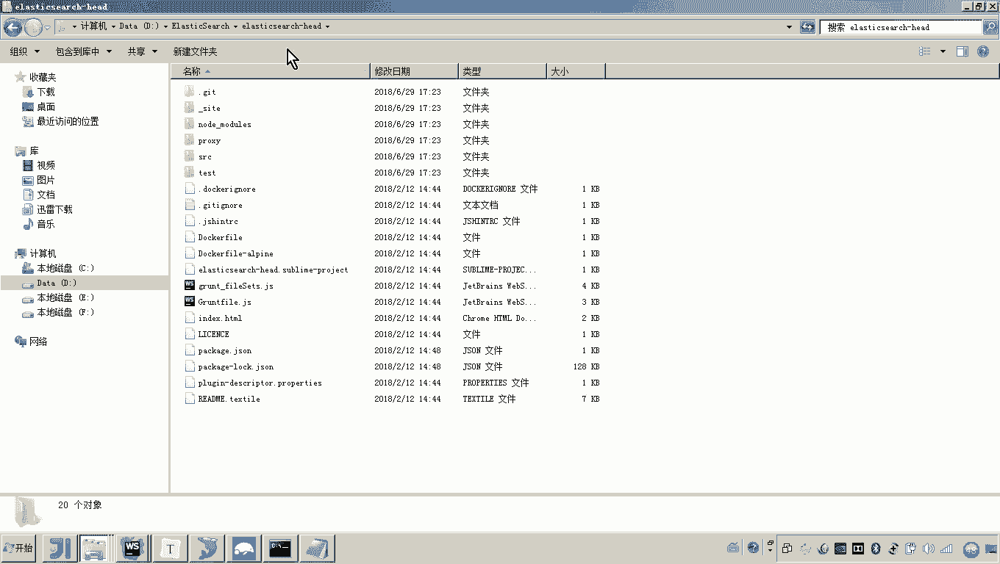

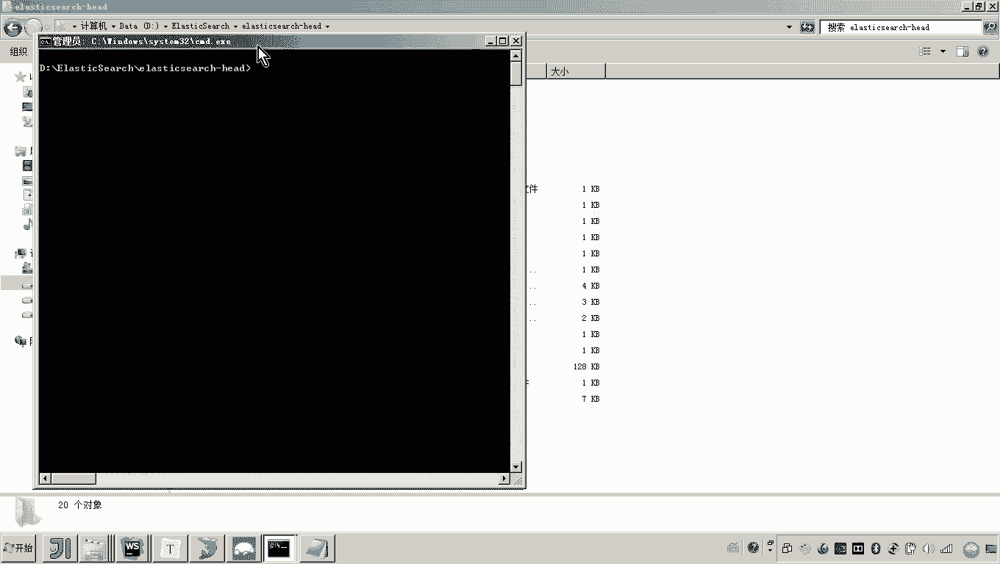

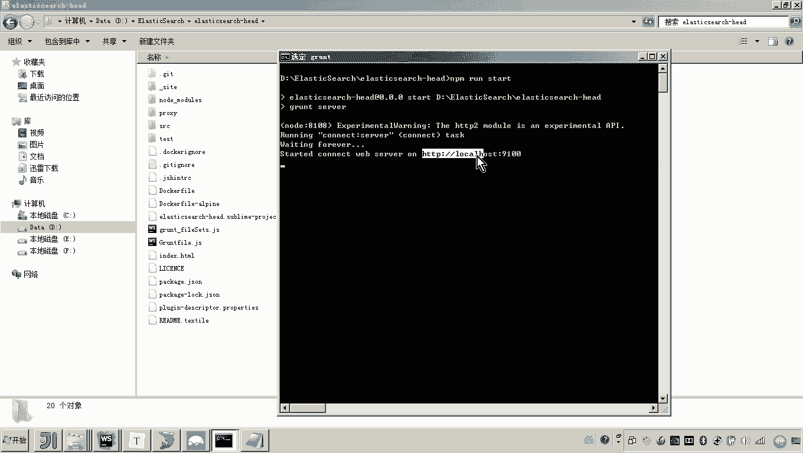

### MySQL 安装与数据导入

首先需要安装 MySQL 数据库。安装完成后，需要导入项目提供的 SQL 脚本以创建数据库和表结构。

具体操作步骤如下：
1.  安装 MySQL。
2.  找到资料包中“学成在线”目录下的 MySQL 脚本文件。
3.  执行脚本，创建 `xc_course`（课程）、`xc_learning`（学习）等数据库及表。

### MongoDB 安装与数据导入

接下来安装 MongoDB。安装完成后，同样需要导入初始数据。

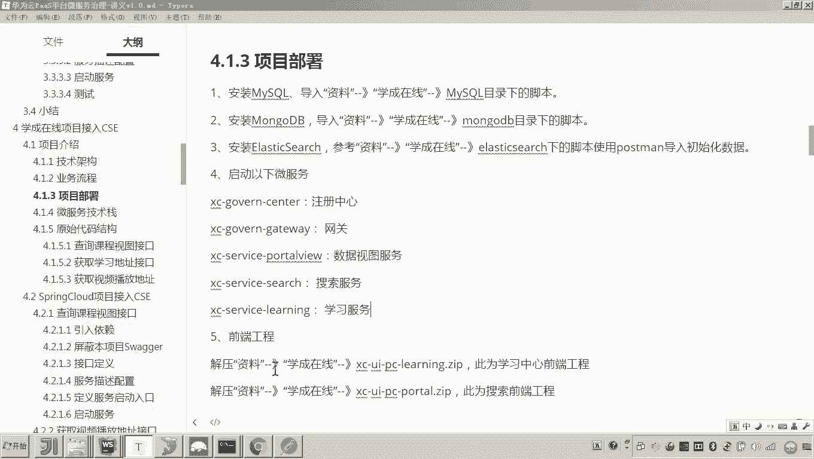

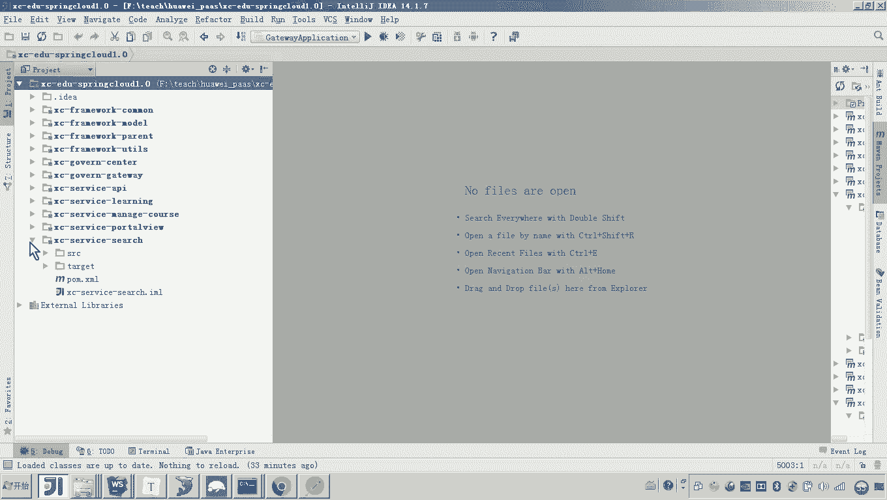

具体操作步骤如下：
1.  安装 MongoDB。
2.  连接至 MongoDB。
3.  创建一个名为 `xc_portal_view` 的集合（Collection）。
4.  将资料包中 MongoDB 目录下的 JSON 文件导入该集合。导入成功后，集合内将包含 4 个文档。

### Elasticsearch 安装与数据初始化

最后，需要安装并配置 Elasticsearch 作为搜索服务。

具体操作步骤如下：
1.  安装 Elasticsearch（本示例使用 6.x 版本）并启动服务。
2.  安装 Elasticsearch-head 插件，用于可视化查看数据。
3.  创建索引库并导入数据：
    *   使用 POST 请求创建名为 `xc_course` 的索引。
    *   使用 POST 请求为该索引创建映射（Mapping）。
    *   使用 POST 请求向索引中批量添加课程数据。可以使用 Postman 等 HTTP 客户端工具执行这些操作。

## 微服务工程启动 ⚙️

数据库环境就绪后，接下来需要启动项目的各个微服务。

以下是需要启动的微服务列表：
*   **注册中心 (XcGovernCenter)**：服务注册与发现的核心。
*   **API网关**：统一的请求入口。
*   **门户数据服务 (XcServicePortalView)**：为前端门户提供数据查询。
*   **搜索服务 (XcServiceSearch)**：基于 Elasticsearch 提供课程搜索功能。
*   **学习服务 (XcServiceLearning)**：处理用户学习请求，校验权限并返回学习地址。

启动方法：由于这些都是 Spring Boot 工程，找到每个工程的主启动类，以 Debug 模式运行即可。

## 前端工程部署与运行 🖥️

后端服务启动后，需要部署前端工程以提供用户界面。

前端部署涉及以下步骤：
1.  **解压前端资源包**：解压资料包中提供的多个 ZIP 文件，包括门户前端、学习中心、搜索前端、静态门户页面、视频资源等。
2.  **编译运行前端工程**（针对 Vue/React 等工程）：
    *   进入解压后的前端工程目录。
    *   运行 `npm install` 安装依赖。
    *   运行 `npm run dev` 启动开发服务器。
3.  **配置 Nginx 代理静态资源**：
    *   安装 Nginx。
    *   修改 Nginx 配置文件，主要配置两项：
        *   将门户域名指向解压后的静态门户页面目录。
        *   配置不同端口分别代理静态资源目录和视频文件目录。
    *   启动 Nginx。
4.  **配置本地 Hosts 文件**：在系统的 hosts 文件中添加项目使用的域名映射，例如 `127.0.0.1 xuechengcloud.java.itcast.cn`。

## 业务流程演示 🎬

所有服务部署完成后，即可体验完整的业务流程。

操作流程如下：
1.  在浏览器中访问配置好的门户域名，进入“学成在线”门户首页。
2.  在门户中点击“课程”或通过搜索框搜索课程。
3.  在搜索结果列表中点击任意课程，进入课程详情页面。
4.  在课程详情页点击“马上学习”按钮。
5.  页面将跳转至学习中心，并开始播放该课程的视频。您可以通过章节列表切换不同视频。

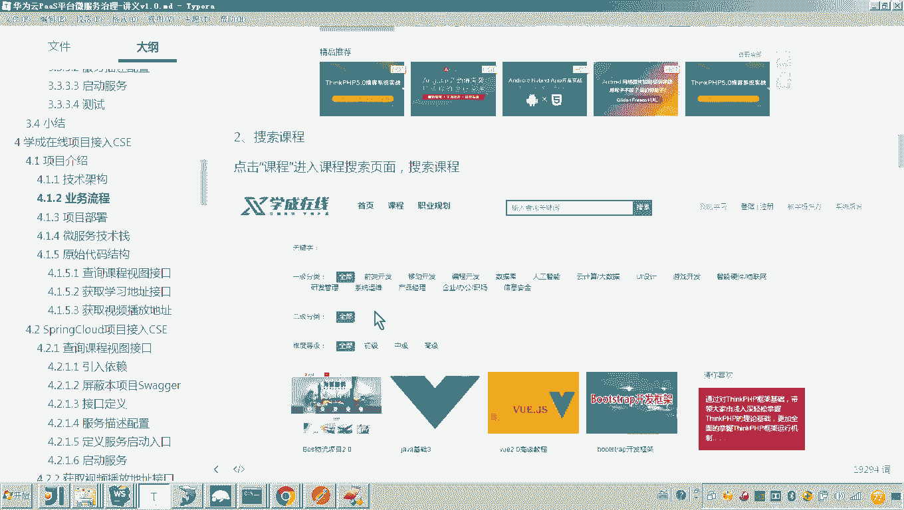

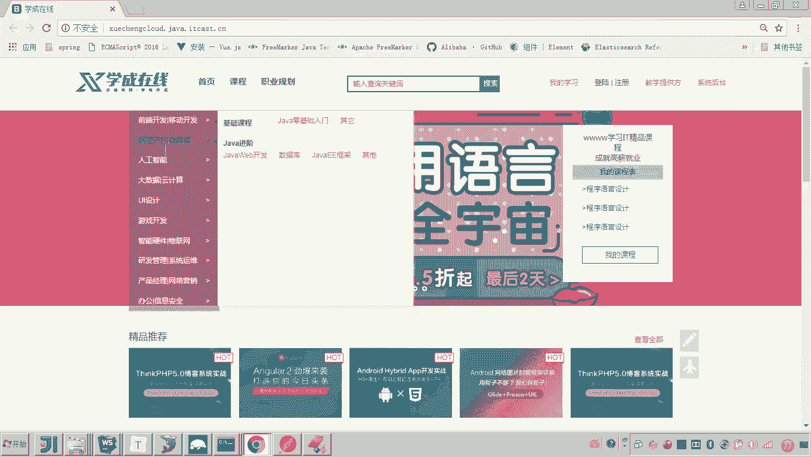

**注意**：本次演示未部署 FastDFS 分布式文件系统，因此课程图片可能无法显示，但这不影响核心业务流程的验证。

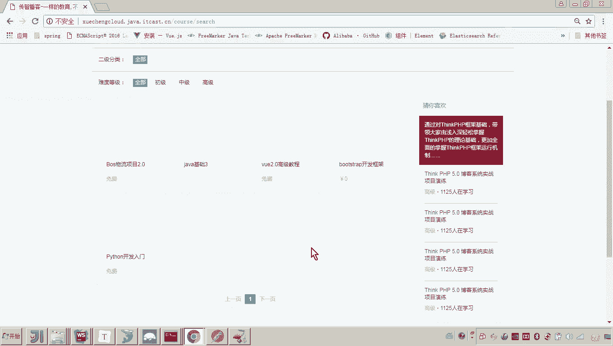

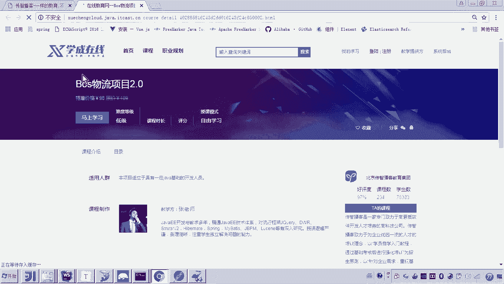

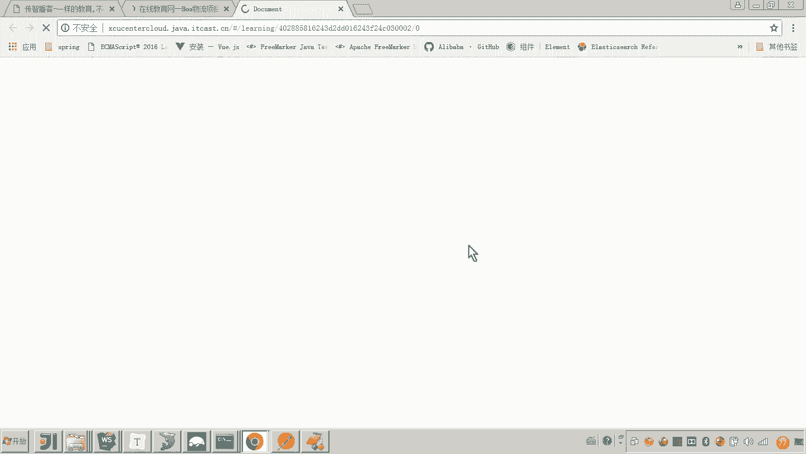

## 总结与后续 🏁

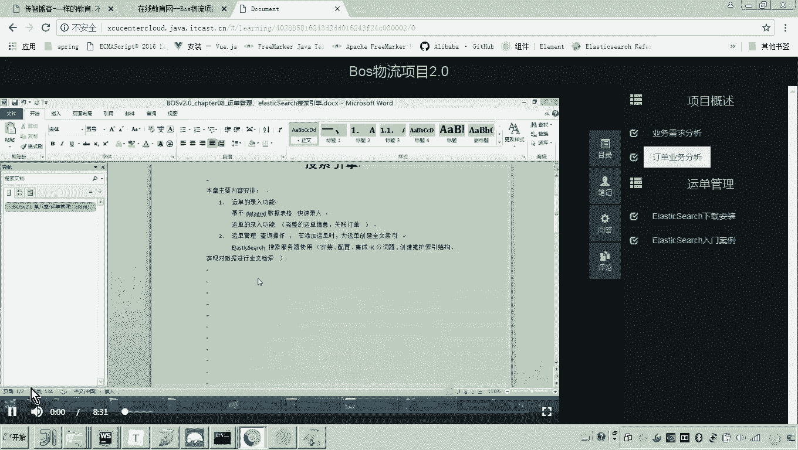

本节课中我们一起学习了“学成在线”项目的本地部署与演示。我们完成了从 MySQL、MongoDB、Elasticsearch 等后端依赖的安装，到微服务、前端工程的启动，最终完整演示了“搜索课程 -> 查看详情 -> 在线学习”的核心业务流程。

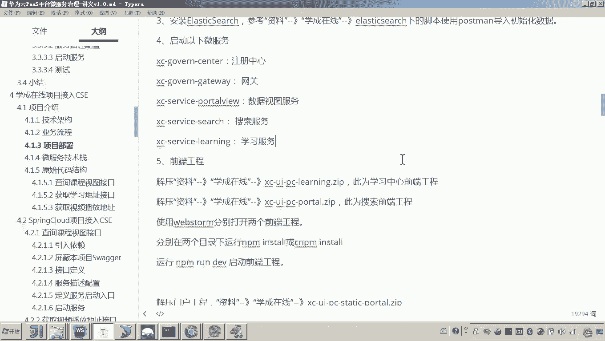

本次部署的目的是让大家对项目有一个直观的认识。如果您在部署过程中遇到问题，无需过于担心，因为后续课程中我们将重点讲解如何将这些服务改造并接入华为云 CSE 微服务治理平台，届时会在云环境进行更详细的部署讲解。当前阶段，您只需理解本项目实现的功能和流程即可。