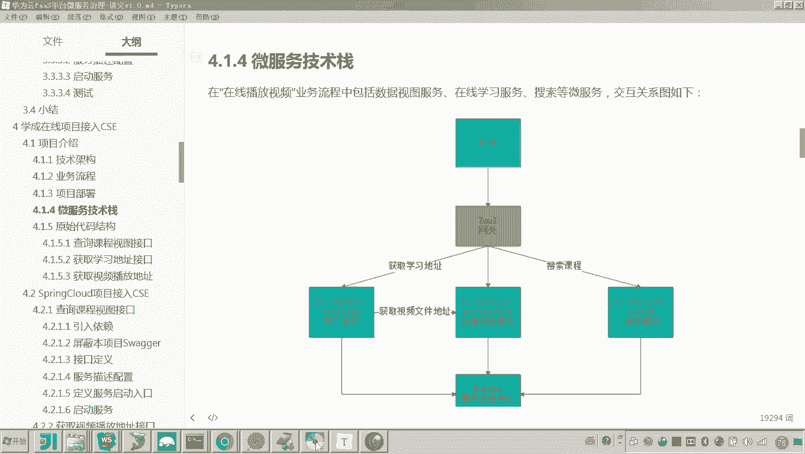
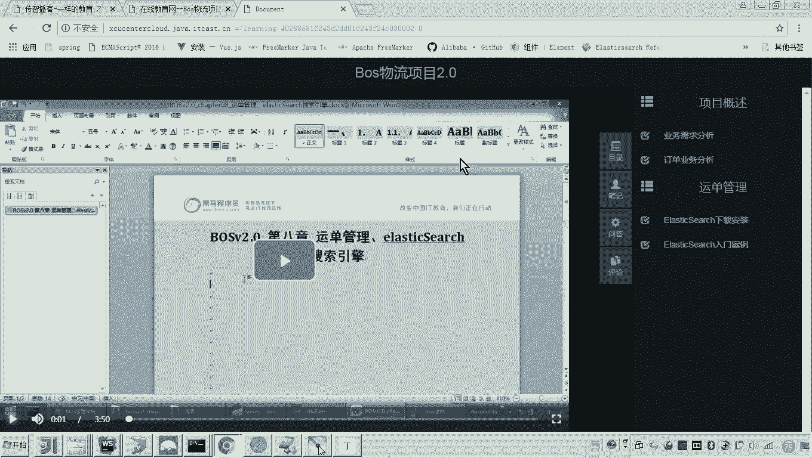
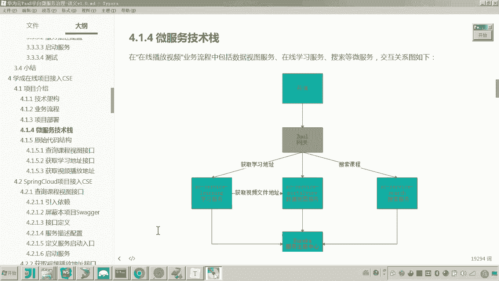
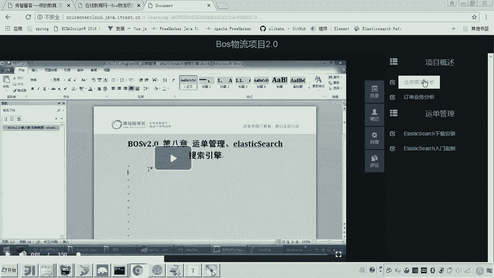
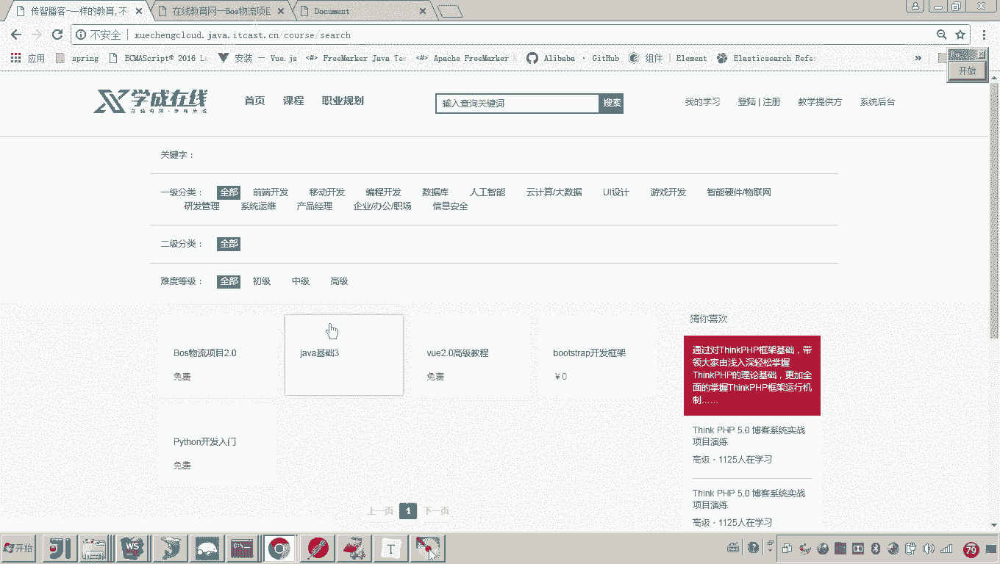
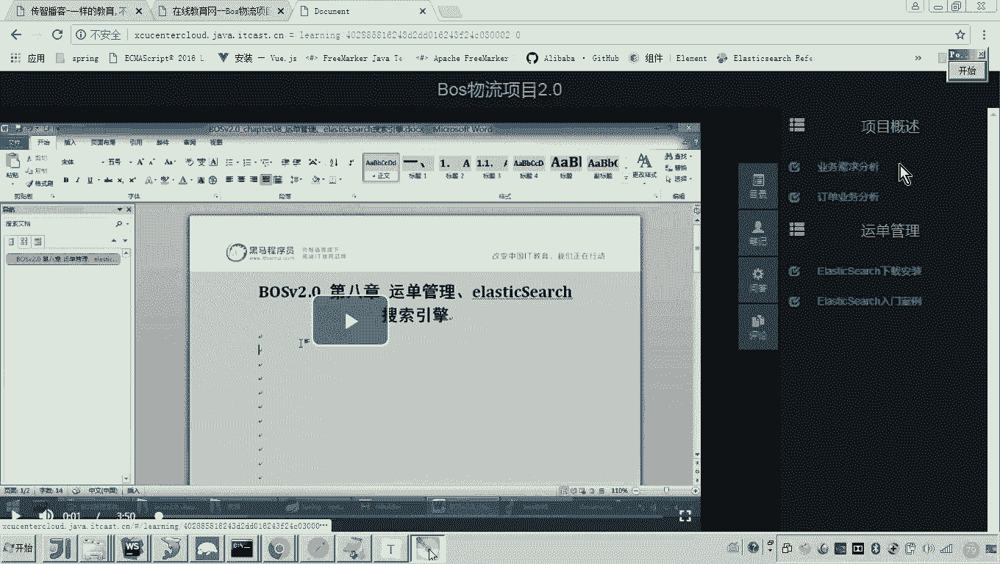
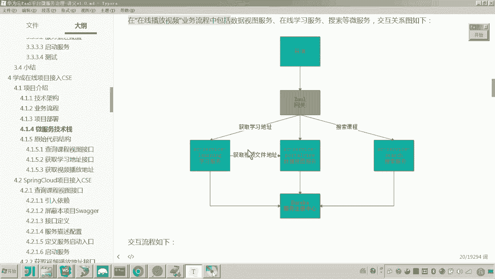

# 华为云PaaS微服务治理技术 - P89：13.学成在线项目接入CSE-项目介绍-微服务技术栈 - 开源之家 - BV1wm4y1M7m5

好。那么刚才我们把呃业务流程从门户到搜索，哎，一直到在线学习都走通了。那么接下来我们是需要去看一下呃，在这个业务流程当中，它有哪些微服务以及他们之间的交互流程。

哎，包括哎包括整个微服务的一个结构，哎，就是技术站，我们也需要来说一下呃，为后边呢我们对这个微服务的代码进行修改呢？哎做一个基础。好，那大家看这个图呢，这个图呢就是呃这个微服务的交互的一个结构图啊。

首先各位我们来看到这个前端啊前端这个前端呢是不是就可以是门户哎，包括学习中心这个前端。然后呢，他请求网关啊，通过网关呢来请求三个微服务。好，那么这里边我们重点的来介绍这三个微服务啊。好。

那么首先第一个微服务呢，大家来看它是不是叫做X service learning学习服务。嗯，这个服务的作用在哪里呢？哎，我对着这个业务流程来说。

就是当我们去点击这个目录的时候，各位左侧中间这一块是不是会播放视频呢？所以这里边当我一点击这个课程目录，他会去请求请求这个学习服务。

请求学习服务要干嘛呢？这个学习服务最终他会向前端返回视频的地址。但他在返回视频地址之前，他是需要去校验这个学生是否有学习的权限。如果有学习权限呢，他会去请求数据视图服务来获取视频的地址。

那有说老师他为什么去请求数据视图服务，他本身没有吗？对这个学习服务呢只是负责记录学生的一些学习的情况。那具体的这个呃课程所对应的视频文件的播放地址呢？这个是在数据视图服务提供查询。

所以这里边呢就有一个微服务之间的远程调用，对吧？嗯，好，那么接下来我们再说这个portto view这个数据视图服务，它是什么的作用呢？它就是对外提供数据查询。😊，嗯。

然后呢它里边呢它会连接mongodb数据库，并且呢啊也会使用到缓存来保证这个查询速度啊。这个这个服务呢就是专门对外提供数据查询服务的。😊，好。那这个服务用在哪里呢？这个服务这个服务大家可以看到。

刚才我在介绍这个获取视频播放地址的时候，它是不是会调用这个数据视图服务哎，来获取这个视频播放地址啊。而这个数据视图服务是不是要从这个猫godB数据库来查到这个数据这个视频的播放地址？😊，好。

第三个服务是搜索服务。搜索服务呢它用在哪里呢？😊，嗯，搜索嘛就是这个界面，大家可以看到这个界面是不是一个全文检索的，这里边输入关键字，是不是就可以搜索出课程了。所以这个课程信息的来源就来源于搜索服务。

并且搜索服务还用在哪里呢？注意除了刚才我说的这个这个课程搜索这一块，在这个学习页面也用到搜索服务了。大家可以看到这个信息是不是就是课程的一些相关信息啊。😊。

因为课程信息本来就在这个ellectastic search当中，所以在学习页面呢哎这个学习的这个前端，它也会请求搜索服务来获取到这个课程的呃相关信息。哎，这个就是课程的这个计划信息，它就会获取到。

所以就是说这个目录的右侧部分这个课程目呃这个课程目录啊。呃，这个它会去从搜索服务来获取。对，好，那这个就是这个微服务的呃，刚才我说到这个三个微服务啊。😊。

那么我们再介绍一下这个图的一些其他的部分。网关哎学习过spring cloud的同学呢都清楚网关的作用是什么呢？一个是路由的功能。哎，根据请求呢把这个请求路由到各个微服务。还有一个就是校验。😊。

就过滤器校验，我可以校验用户的身份信息，对吧？😊，好，那对于这个网关不太熟悉的同学呢，你可以参考学程在线的其他的呃这个课程部分啊，来学习这个网关。

当然也可以从网上找一些这个呃有关spring cloud相关的视频。哎，我们去学习一下。😊，下边一个就是服务注册中心。这个服务注册中心又是什么作用呢？大家可以看到来这个学习服务要远程调用数据视图服务。

那大家想一下这个数据视图服务的地址，这个学习服务是不是得拿到呀？所以他从哪里拿这个数据视图服务的地址呢，他需要从数据呃服务注册中心来拿到这个数据视图服务的地址，然后呢，再发起远程调用。😊。

所以这就是这个服务注册中心，它的作用啊，就是用来记录这个各个微服务的信息状态哎。好，那么这个微服务开发的过程中啊，他是呃用到了哪些技术呢？这里边我罗列了一些。

spring bootring cloud所有的微服务呢都是基于spring boot开发。然后呢针对微服务治理这块呢，我们用spring cloud给我们提供的一些框架。

还有swaer用于描述接口的一个工具ring mongo用于连接go数据库买用于连接my数据库ring也是用于连接me数据库这个呢是不是阿里出的一个数据库连接池好还有这个ri这个是什么呢？

啊ri和 client就是远程调用的还有一个这个是什么？是不是呃叫spring cloud提供的一个容错的框架，对吧？好，这里边呢我把几个典型的技术呢都罗列出来啊。

这个是我们这个学程在线微服务所用到的一些核心的技术。😊，好，那么到这儿来说这个呃微服务的技术站，包括刚才我说的微服务的这个各个微服务的作用，我是不是就介绍完了吧？好。😊。

