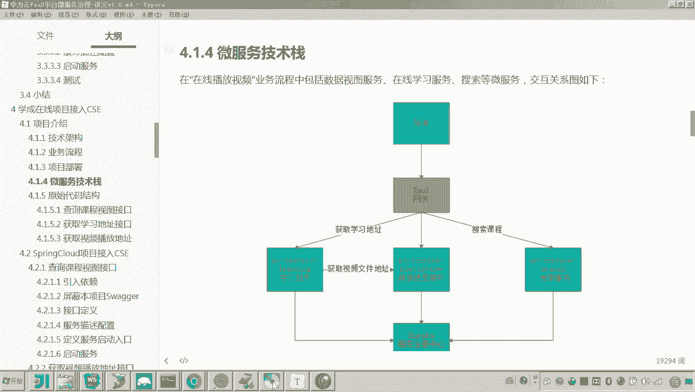
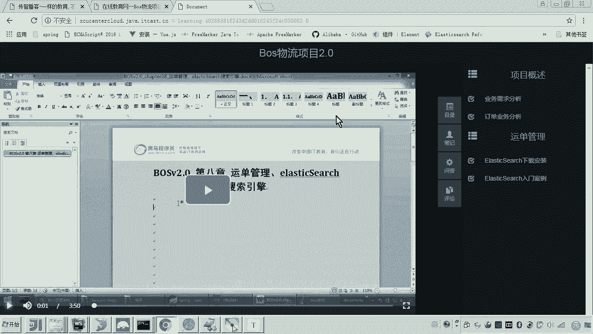
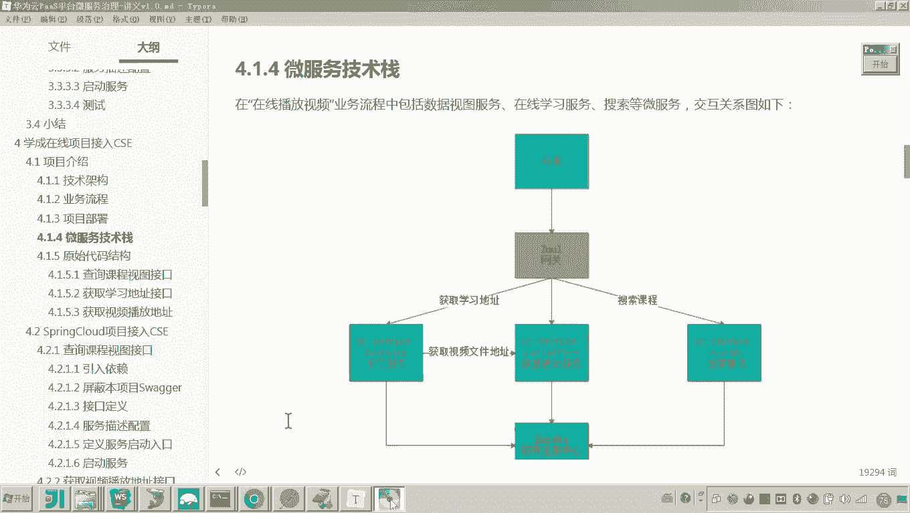
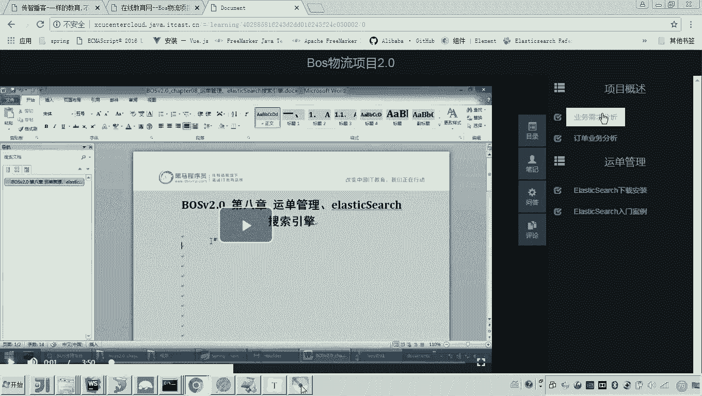
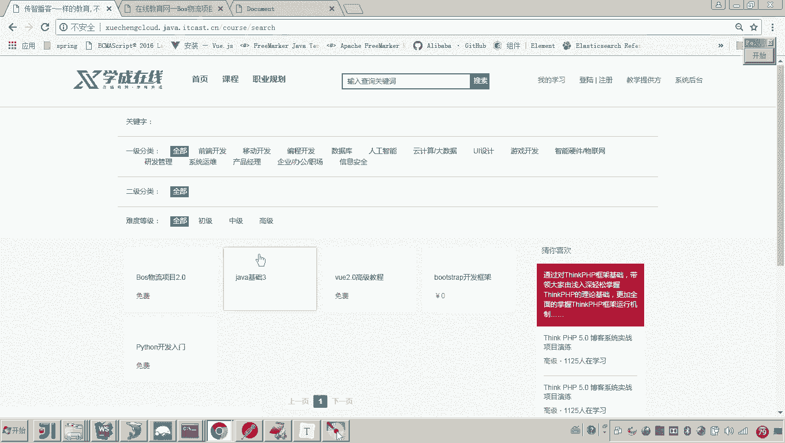
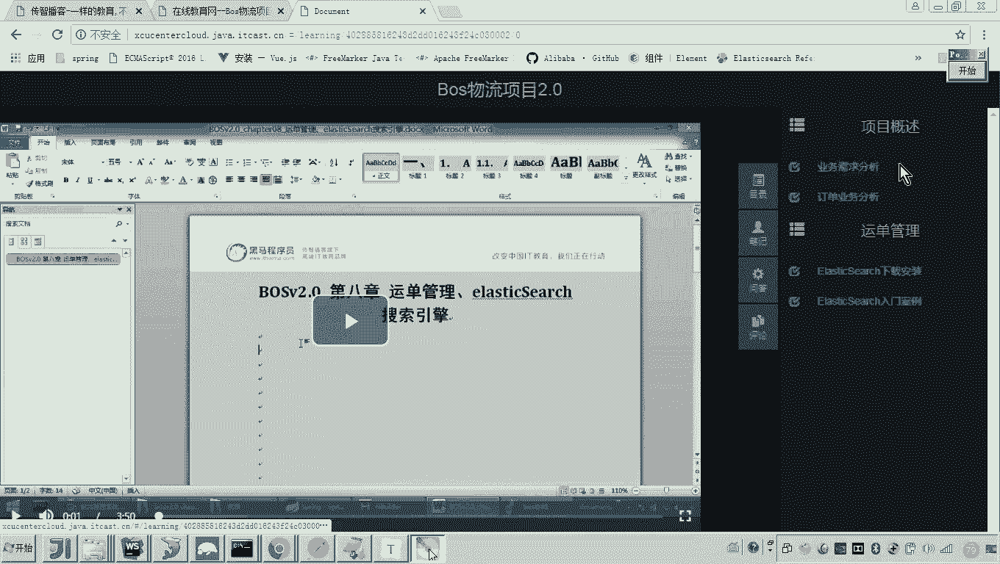
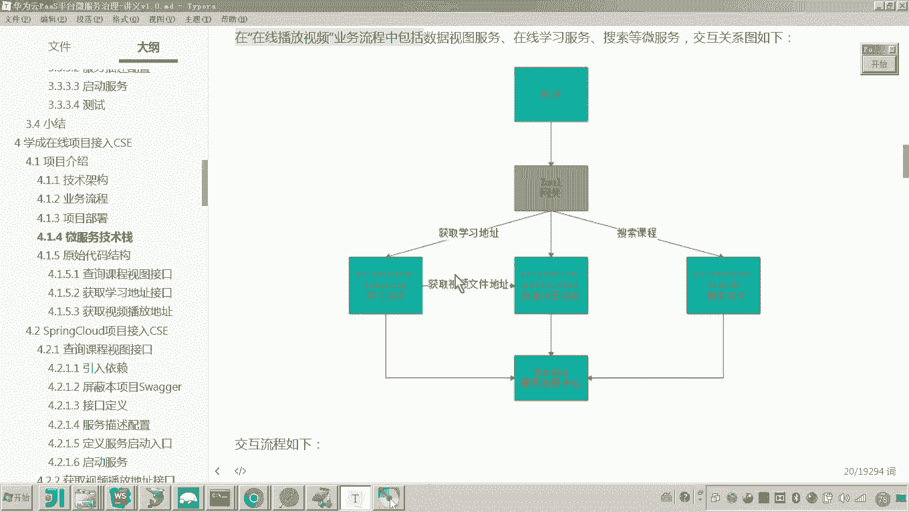

# 华为云PaaS微服务治理技术 - P89：13.学成在线项目接入CSE-项目介绍-微服务技术栈 🏗️

在本节课中，我们将要学习“学成在线”项目的微服务架构与技术栈。我们将了解项目中各个微服务的职责、它们之间的交互流程，以及构建这些服务所采用的核心技术。

上一节我们走通了从门户到在线学习的业务流程。本节中，我们来看看支撑这个流程的微服务架构。

## 微服务交互结构

下图展示了“学成在线”项目中微服务的交互结构：

前端（包括门户和学习中心）的请求首先会到达网关。网关负责将请求路由到后端的三个核心微服务。

以下是这三个核心微服务的介绍：

*   **学习服务 (X service learning)**：此服务负责处理与学习过程相关的核心逻辑。具体来说，当用户点击课程目录播放视频时，前端会请求此服务。该服务会校验用户的学习权限，然后通过远程调用从“数据视图服务”获取视频的实际播放地址。
*   **数据视图服务 (Portto view)**：此服务专门对外提供数据查询功能。它内部连接了MongoDB数据库，并可能使用缓存来提升查询性能。其核心作用是响应其他服务（如学习服务）的数据查询请求。
*   **搜索服务 (Search service)**：此服务提供全文检索功能。它被用于两个场景：一是在门户网站进行课程关键字搜索；二是在学习页面，用于获取并展示课程的相关信息（如课程目录右侧的课程计划详情）。

## 架构中的其他关键组件

除了核心业务微服务，系统中还包括以下关键组件：

*   **网关 (Gateway)**：网关承担两个主要职责。一是**路由**，根据请求路径将流量分发到对应的微服务。二是**过滤与校验**，例如对用户身份信息进行统一验证。
*   **服务注册中心 (Service Registry)**：这是实现服务发现的关键组件。例如，当“学习服务”需要调用“数据视图服务”时，它并不需要硬编码对方的地址，而是从服务注册中心动态获取“数据视图服务”的可用实例地址，然后再发起远程调用。

## 微服务技术栈

“学成在线”项目的微服务基于一系列成熟的开源技术构建。

以下是项目中使用的主要技术栈列表：

*   **Spring Boot**: 所有微服务的基础开发框架。
*   **Spring Cloud**: 用于微服务治理（如服务发现、配置中心等）。
*   **Swagger**: 用于描述和文档化RESTful API的工具。
*   **Spring Data MongoDB**: 用于连接和操作MongoDB数据库。
*   **MyBatis**: 用于连接和操作MySQL数据库的持久层框架。
*   **Druid**: 阿里巴巴提供的数据库连接池。
*   **Feign**: Spring Cloud提供的声明式HTTP客户端，用于简化服务间的远程调用。代码示例：`@FeignClient(name = “data-view-service”)`。
*   **Hystrix**: Spring Cloud提供的容错框架，用于实现服务熔断、降级等功能。

本节课中我们一起学习了“学成在线”项目的微服务架构。我们明确了学习服务、数据视图服务和搜索服务各自的职责与交互关系，并认识了网关和服务注册中心在架构中的作用。最后，我们梳理了构建这些服务所依赖的核心技术栈，为后续的代码接入与改造工作奠定了基础。