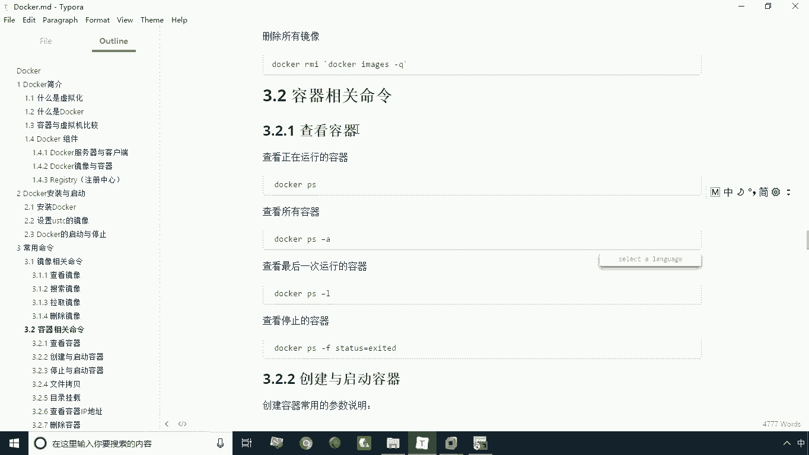
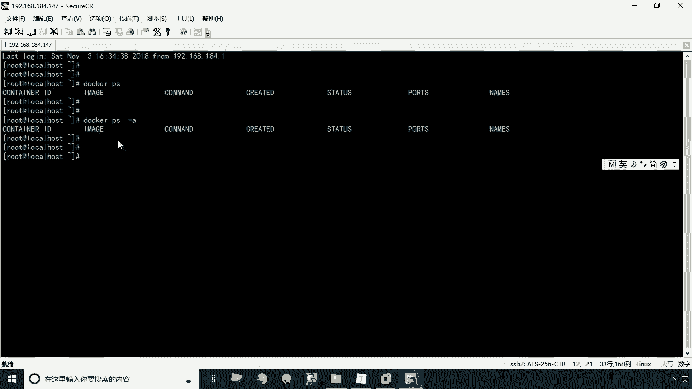
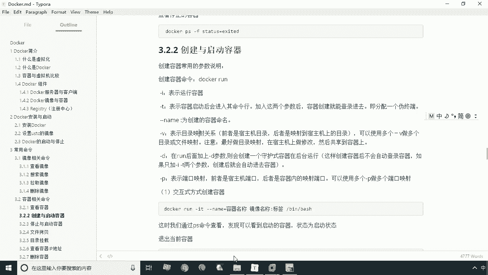
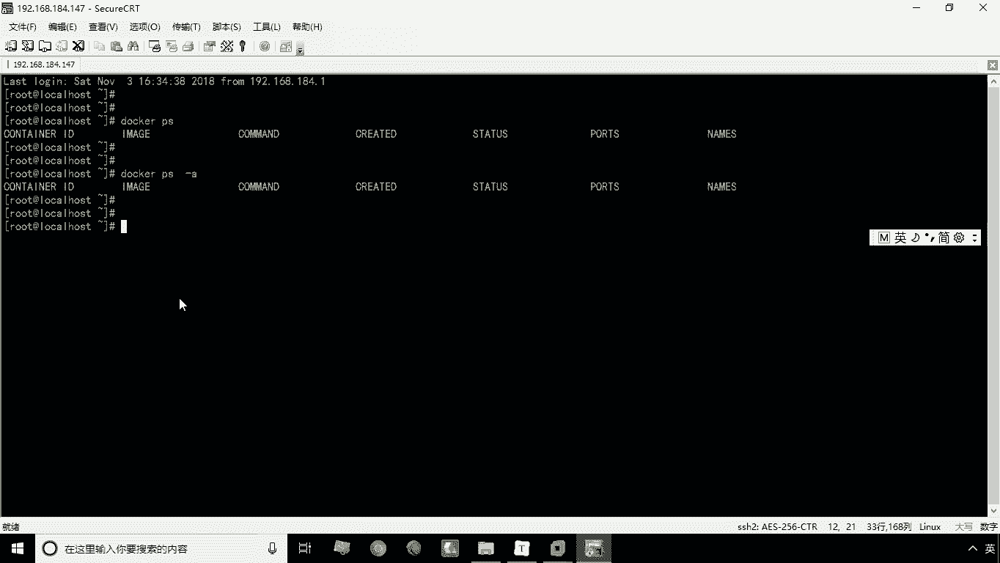
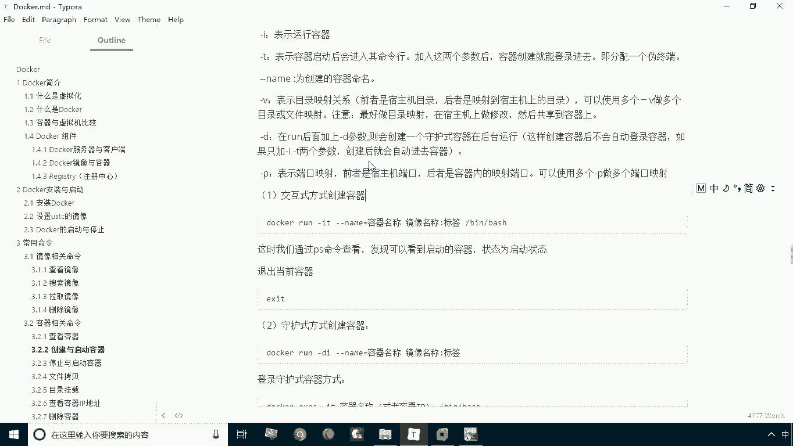
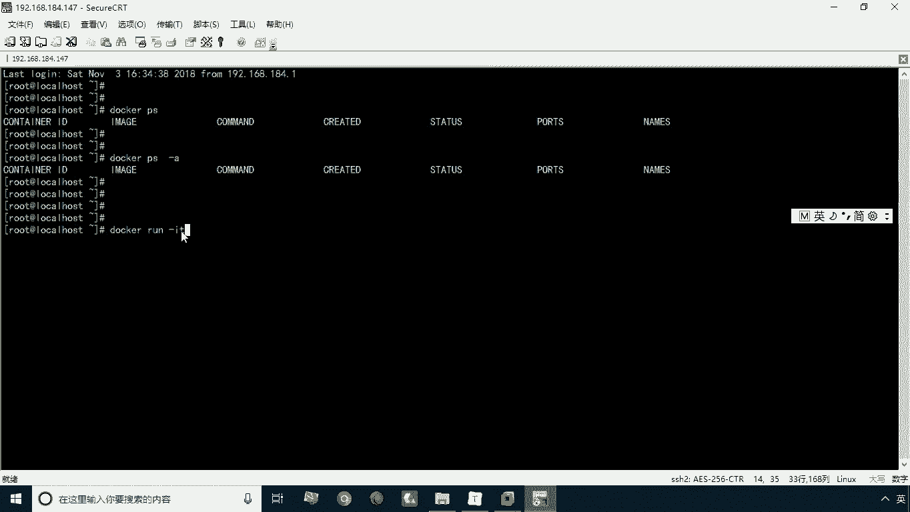
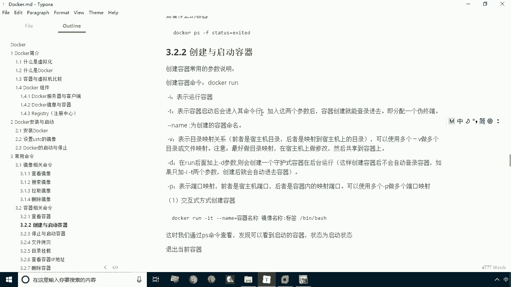
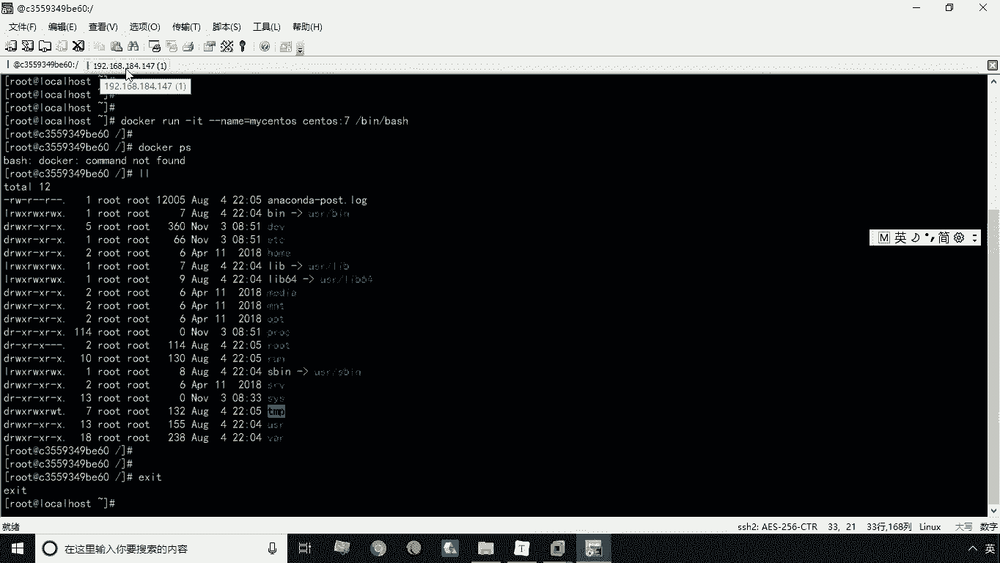
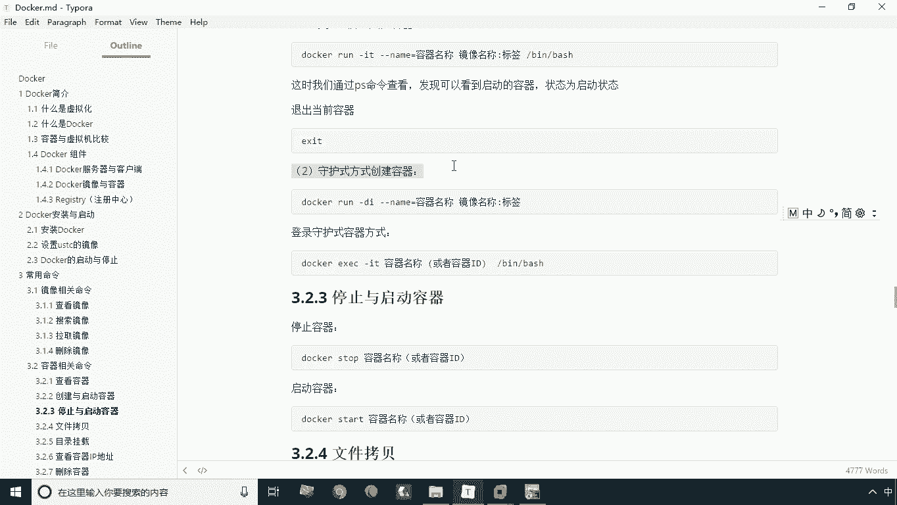
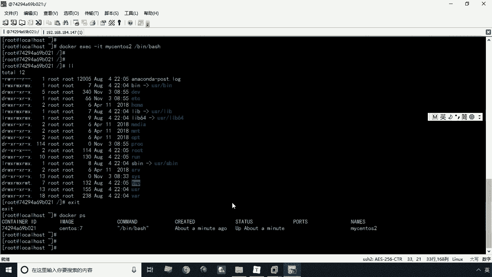

# 华为云PaaS微服务治理技术 - P8：08.创建启动与查看容器 - 开源之家 - BV1wm4y1M7m5

刚才呢我们学习的都是镜像相关的命令啊，那接下来我们要学习的就是容器相关的命令，那么容器相关的命令也不少啊，咱们就依次来学习，首先我们来看第一个就是查看容器啊。

这个比较简单，那么所谓查看容器是什么意思呢，就是你看一下当前正在运行的有哪些容器啊，那么查看容器的命令就是P，那么查看容器之后呢，这个时候会出现一个列表啊，出现一个列表。

我们看一下现在当前列表呢没有记录，因为当前并没有运行中的容器，那么所谓运行中的容器什么意思呢，这个容器呢其实是通过镜像来运行的，镜像相当于什么，相当于一个模板，我们只有把它运行起来。

这时候呢我们才能啊去操作容器，一个镜像可以去创建很多容器，就像一个类一样，我们可以通过一个类可以创建很多对象，是一个道理啊，那我们现在呢啊并没有运行这种东西，那么如果说我们想查看除了运行中的。

还有不运行的对吧，就是相当于我查询正在开着机的，还是关着几的都算在内的，那这时候我们就写杠A，那么当然你敲这个命令也查不到，因为不管是运行中的还是非运行的啊，没有运行的，那我们当前都是没有的。

因为我们这个docker是刚刚安装好的是吧，所以说这个呢肯定是常用的记录的，那么我们接下来要学习的就是什么呢。

就是我们来创建和启动容器了，那么我们在创建和启动容器之后，我们就可以去通过PS命令来进行查看了，那么接下来呢我们就学习这个创建与启动容器，那么创建与启动容器，这时候我们用的命令是什么呢，命令叫run啊。

run表示运行啊运行，那么这个run呢其实它包括了很多参数对吧，我们可以指定一些参数，我们来分别看一下啊，第一个呢是杠A杠A表示什么呢，表示我要运行容器啊，就是我创建之后，我要马上要运行这个容器。

那么还有一个呢就是杠七啊，杠七呢表示是啊，这个容器启动之后呢，会进入这个命令行啊，进入命令行，那么这个呢就表示我要以交互式的方式，来创建这种容器，还有一个就是杠杠name啊，为什么说这是两杠呢。

因为这个这个参数呢你是需要指定值的，而其他的参数呢，像这些参数都是你直接指定就可以了，它表示的是什么，表示一个选项，而这个杠杆name呢是你要为他去赋个值，比如说我这个杠杆name表示什么。

被为创建的容器去命名，那么你肯定要指定名称是什么，对不对，那么这时候呢我们后面会给大家讲，这个东西怎么用啊，还有一个就是杠V杠V表示是目录映射啊，这个我们后面会详细讲，那么目录映射呢就可以啊。

这个将你的这个容器内部的某个目录，和你的宿主机的目录啊，这个形成一个映射啊，也就是操作这个呃宿主机啊，就相当于这个操作数据，这个目录呢就相当于操作容器的目录啊，它其实啊表示同一个引用地址啊。

那么这个宿主机就是其实我们就装docker的，这个机器啊。

就是本身我们操作这个机器就是宿主机啊，那么我们在创建容器之后。

进到里头那里头那部分就叫容器了啊，嗯那还有一些就是杠D啊，这杠D呢表示的是一种守护式方式来运行的啊，后面也会给大家去演示啊，还有一个杠P啊，杠P呢表示一个端口映射啊，就是表示我通过这个宿主机的端口啊。

来映射容器内的某个端口，这样一来呢，我就可以通过这个端口来访问容器的某音啊，当然我们说这些呢，我们可能有的参数并不能完全的听懂啊，因为我们并没有去给大家去运行这个容器，所以说呢啊这个杠V啊。

杠P呢我们会在后边啊，在这个课程呢，这个这个下面这个环节呢，会给大家再去详细的讲解，我们先给大家来演示一个最基本的用法，那么最基本的两种用法，就是交互式方式和守护式方式，这里头我们不做映射，目录映射。

也不做端口映射啊。

那么再给大家演示一下，首先我们给大家演示交互式方式来创建容器，那么交互式方式创建容器，我们打docker，然后run run表示什么表示的是我要创建对吧啊，创建运行容器。

那这个时候呢我们加加参数加什么呢，加杠IT啊，那么I和T分别代表什么。

刚才给大家讲了，I代表运行，T代表什么呢，代表交互对吧。

哎进入这个命令方进行交互好了，那么这时候呢我们也可以这么写啊，就杠I空格杠T，但这么写的有点啰嗦对吧，哎有点繁琐，我们这里通常就是连着续写啊，叫杠IT，那么还有一个就是杠杠内幕。

这时候呢我们要指定什么呢，指定这个名称啊，指定名称等号杠杠name等于什么呢，MYSQS啊，买渗透S啊，那么买cs，那么接下来我们再看下面这个环节，下面这个环节要指定什么呃，要指定就是你的镜像对吧。

也就是说你当前系统有哪些镜像，我们这里要指定出来，你要通过哪一个镜像去创建这个东西，那么当前有哪些镜像呢，你可能忘了，对不对，好，我们现在再开一个窗口啊，克隆绘画再开一个啊，那开一个之后呢。

我们先把docker，然后呢IMAX啊，这这样一来我们就可以看到这些有哪些容器吗，这些容器你都可以用啊，我们这里找其中一个最基本的一个镜像啊，叫CDS7啊，那这时候呢我们就可以写TOS冒号七啊。

冒号就是后边就跟的就是你的什么，跟的就是你的tag，如果是这个la test这种啊，这个标签啊我们就可以省略不写啊，就可以省略不写，那好了，我们接下来呢再写什么，后面跟的就是杠并杠BH。

那么这一条呢其实就指定什么呢，指定你以交互式方式运行之后，我们运行的命令是哪个，那么这个BH呢实际上就是什么呢，就是要加载我们的森罗这个，这个深度S的命令行啊，就是SNLS就是能够去执行一些相等一些啊。

这个LINUX的一些命令好了，我们回车，这时候呢大家注意观察，观察前面这个部分是不是发生变化了，刚才还是local这个local host是吧，那么接下来我们看这个是发生变化了。

那么这里头我们当前在哪儿呢，实际上当前我们就已经进到这个容器里了，进到哪个容器就是买cs这个容器啊，那我们现在可以再打这个docker p s，我们会发现这个命令是错的对吧，哎比如说我们现在已经进去了。

那么接下来呢我们再去通过这个浏览，浏览这个命令，我们会发现诶，这里头也有这个CTOS的这种目录结构对吧，那我们说这里实际上就相当于什么，相当于一台相当于台服务器一样啊，相当于在宿主机的基础上。

又虚拟了一台服务器啊，又虚拟了一台服务器，这是我们说的这个呃，关于这个啊这个命令的创建，交互式方式创建，那么创建之后我们这时候呢再切换回来，再打开这个新的窗口啊，给大家看。

我们这时候再通过docker PS命令来查看，这时候你会发现啊就能看到这个记录了对吧，就能看到这个记录了，那么这个第一个其实就是容器的id，第二个呢，其实就是我们要这个容器，是根据哪个镜像来创建的。

第三个呢就是你运行的命令是什么对吧，这个和你一开始啊，这个创建容器是指定的命令是有关系的，那么接下来呢我们再看看下面这个部分呢，其实就是它的一些状态对吧，还有呢就是它的名称啊等等这些信息。

那么这个状态呢是up表示什么，表示是啊，正在运行的容器啊，就相当于这个电脑从开着呢，那么紧接着呢再切换回来，那我说我的我进去了，我怎么能退出来呢，很简单，E x i t，那这时候呢我们看。

这时候我们就退回到这个数字机上了，那么这时候我说退出的松鼠机，那这个容器究竟它是关着呢还是开着呢，这时候我们来验证一下，这时候我们会发现啊，通过docker PS，这时候就查看不到这条记录了。

然后呢我们通过docker PS杠A表示什么，表示我要查看所有的容器，不管是运行的还是没有运行，这时候我会发现唉，刚才的这个容器就被查出来了，这个状态什么状态是退出状态，也就相当于关机状态啊。

相当关注总裁，那么由此呢我们可以得出一个结论是什么，得出这个结论，就是我们以交互式方式来运行容器，当我们退出的时候，这个容器也自动的就停止了啊，这就是我们说第一种方式啊。

以交互式的方式来创建容器，那么第二种方式就是什么，就是以守护式的方式来创建容器。

那么守护式的方式创建容器，我们这里再创建一个啊，叫docker run，杠什么呢，杠DI啊，这个D呢就代表守护式方式来运行的啊，杠DI当然你杠ID也行啊，杠杠name等于什么呢，买c cos。

注意这个时候你还能叫MYSQS吗，不行了啊，这个B名称是必须唯一的，尽管这个容器已经关闭了，那这个名称也不能重复的啊，如果你重复这个是创建，肯定是失败的啊，它会提示你名称重复，所以说这个呢不能重复。

我们这里管它叫MYSNS2，那紧接着后面的是STOS冒号七啊，就可以了，后面这个杠B杠半是不用写啊，这个就不用写了，因为你是以手扶式方式来创建的啊，你并不需要去啊，这个去马上去去交互的啊。

所以说这个命令是不是后面命令是不用写的好，我现在回车，这时候你会发现一个很长的一串字符串对吧，你当你见到这个提示就表示什么，就表示你的这个容器创建成功了啊，那我们现在来运行一下docker PS啊。

当然你在这个窗口运行是一样的啊，因为我们现在看以守护式方式来创建的话，其实我们的命令行是吧，命令提示符仍然是在速度机，我们并没有进去是吧，那这时候我们会发现啊，当我们查看容器之后。

我们会发现这个这个什么，这个这个这个容器正在什么是正在运行的对吧，这个MYSLS2呢，就是正在刚才我们创建的这个这个容器，那么我们说怎么去进去呢，那这时候我们会涉及到另外一个命令啊，叫ex e c。

然后呢嗯杠IT啊，杠IT，然后紧接着呢就是你的什么，你的这个容器的名称，然后杠，刚，办事，那这时候呢我们会发现哎我们现在进去了是吧，进去了之后呢，我们还可以去查看它的一个目录结构对吧，查看目录结构。

我们仍然可以退出来，那这时候我们在想，这时候我们通过这种命令的推出，这个容器究竟是运行的呢，还是没有运行的，那这时候我们来验证一下啊，刚才呢我们是以交互式方式来来创建是吧，那这时候你退出来。

它就自动停止，那么如果说我以守护式的方式来创建呢，我进去之后，大家注意看是不是还是在运行状态啊，唉对了，这就是我们说这两种方式的一个区别啊，这两种命令的这个区别就是关于这个啊，容器的创建。

容器的创建两种方式啊，还有呢就是容器的一个查看的命令啊。

