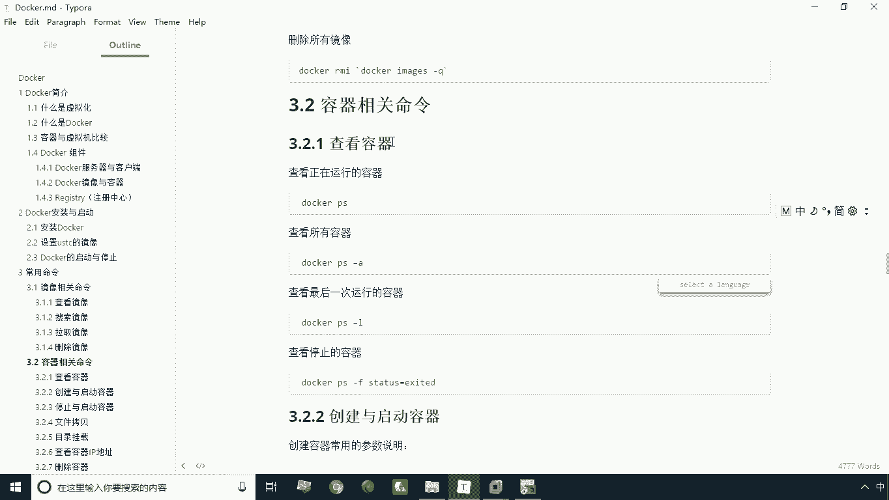
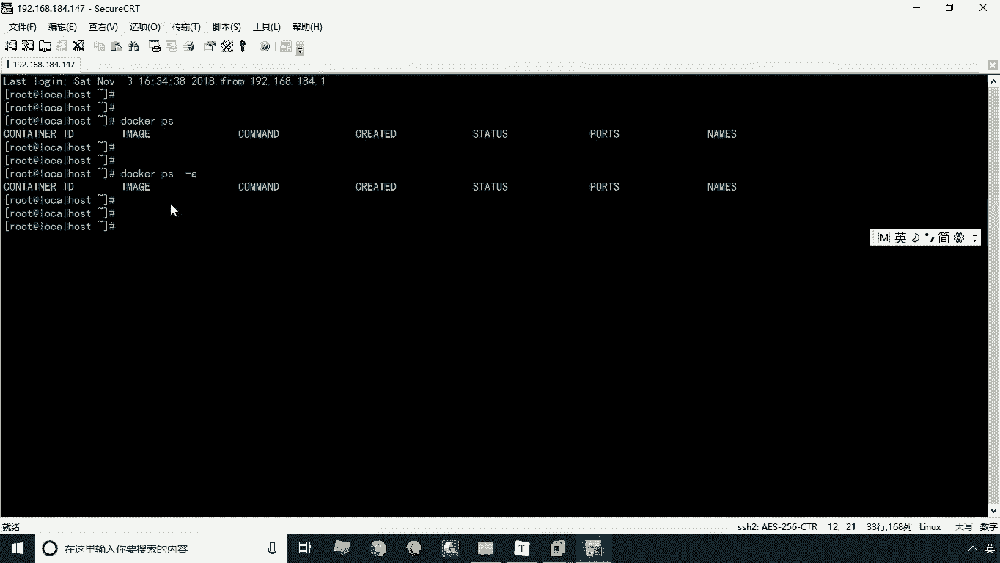
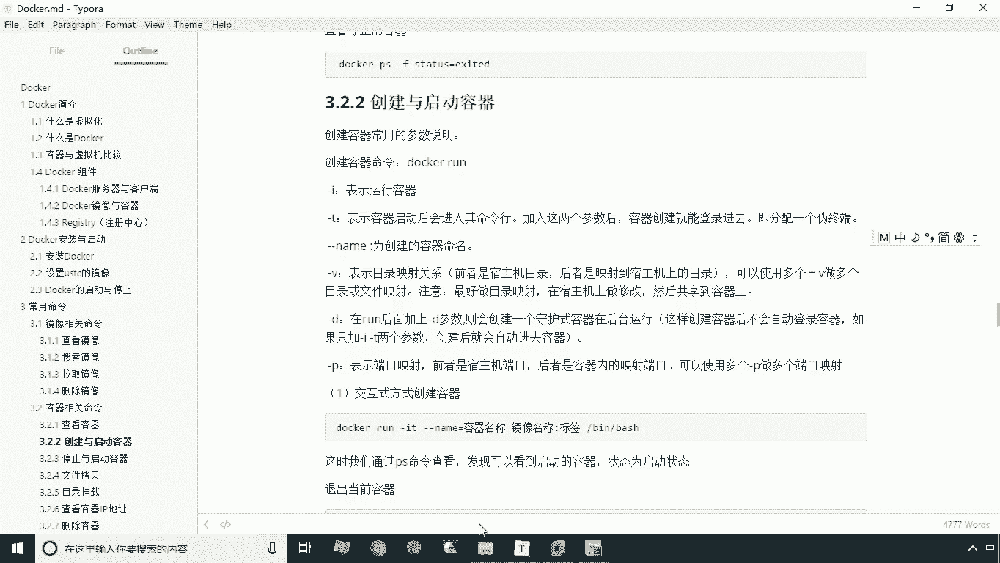
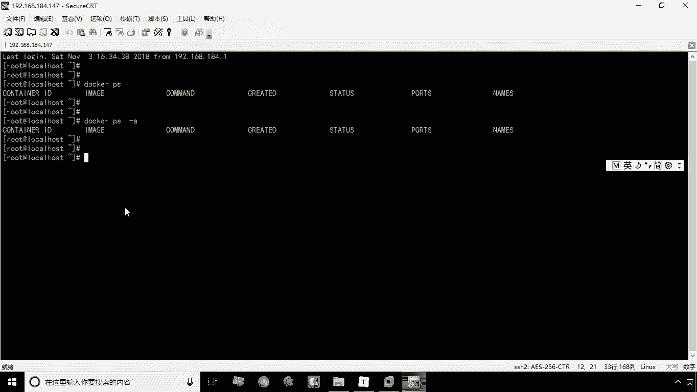
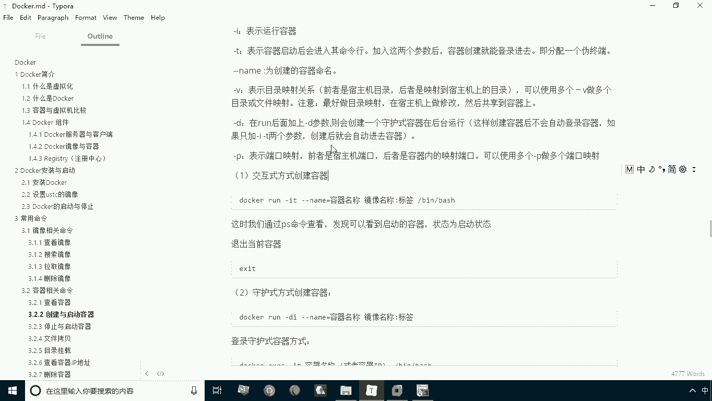
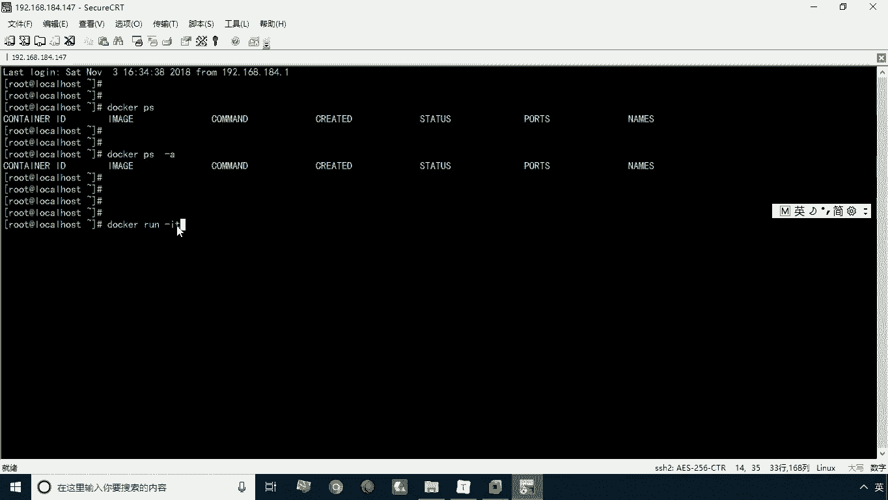
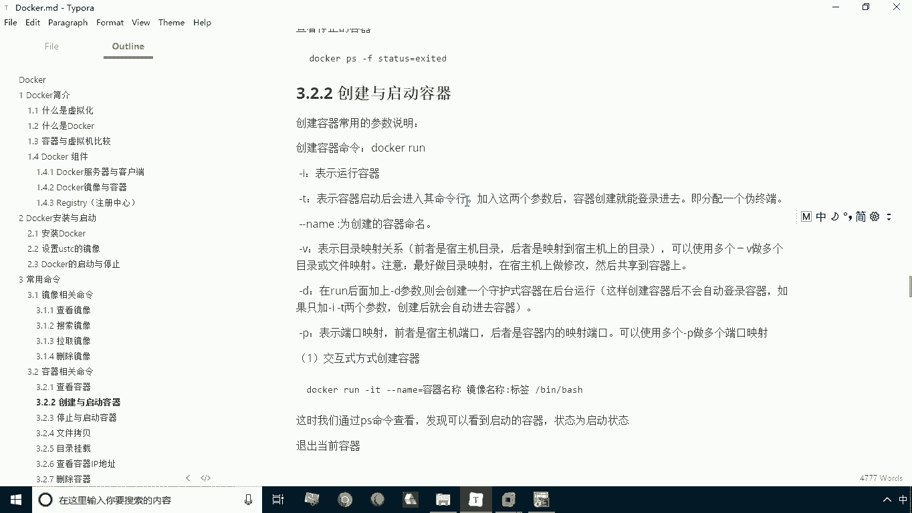
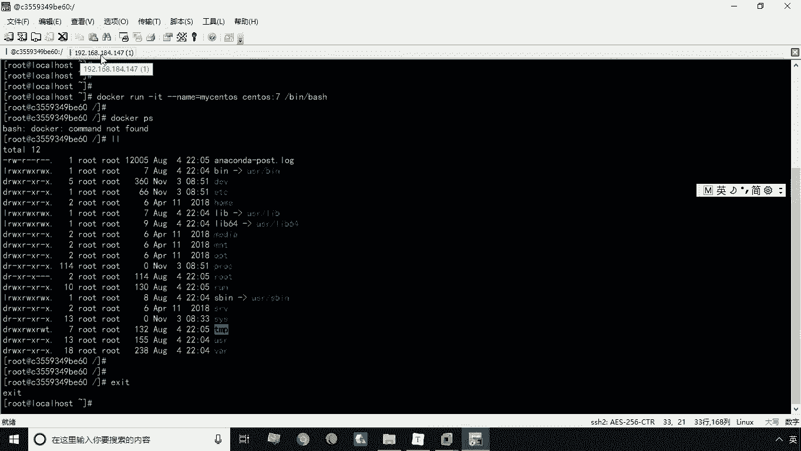
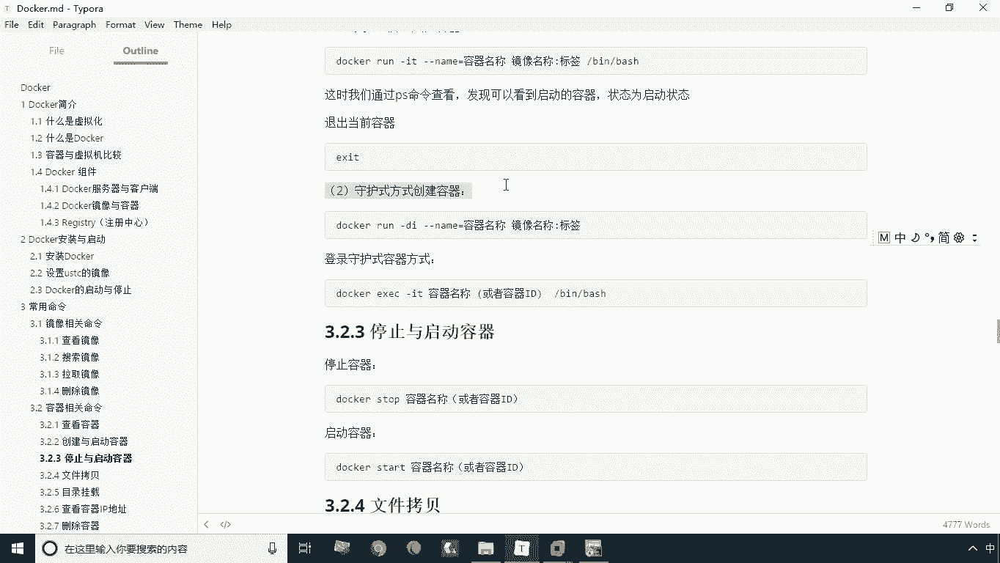
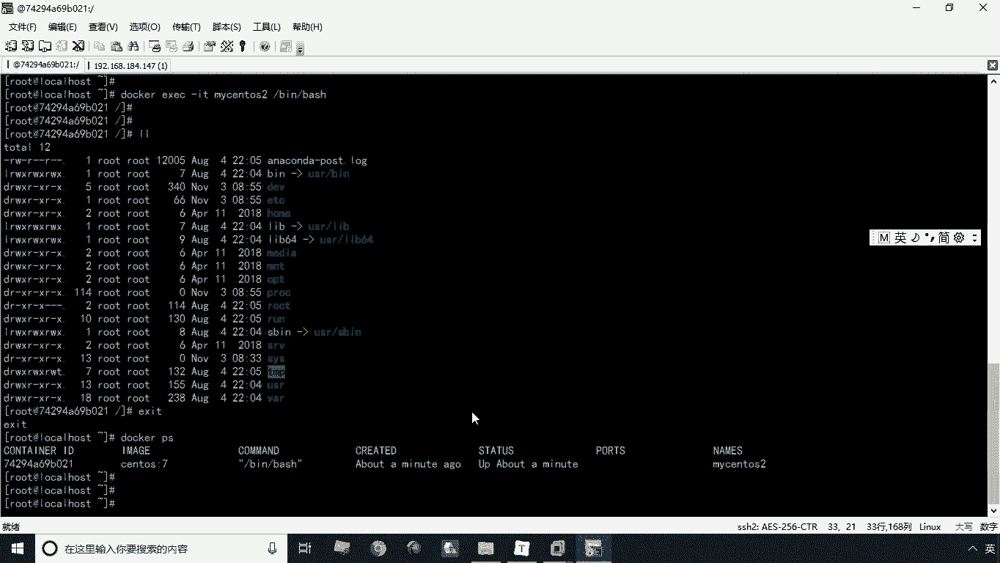

# 华为云PaaS微服务治理技术 - P8：08.创建启动与查看容器 🐳



## 概述
在本节课中，我们将要学习Docker容器相关的核心操作，包括如何查看、创建和启动容器。我们将重点介绍两种创建容器的方式：交互式与守护式，并通过实践演示来理解它们的区别。

---



## 查看容器 👀
上一节我们学习了镜像相关的命令，本节中我们来看看容器相关的命令。首先，我们来学习如何查看容器。

所谓查看容器，就是查看当前正在运行的有哪些容器。查看容器的命令是 `docker ps`。执行此命令后，会显示一个容器列表。

以下是查看容器的命令示例：
```bash
docker ps
```
当前列表没有记录，因为当前并没有运行中的容器。容器是通过镜像来运行的，镜像相当于一个模板，只有将其运行起来，我们才能操作容器。一个镜像可以创建多个容器，就像一个类可以创建多个对象。

如果想查看所有容器，包括运行中的和已停止的，可以使用 `-a` 参数。
```bash
docker ps -a
```
当然，现在执行这个命令也查不到记录，因为我们的Docker是刚刚安装好的，还没有创建任何容器。这个命令是常用的。



---



## 创建与启动容器 🚀
在学习了如何查看容器后，本节中我们来学习如何创建和启动容器。创建并启动容器后，我们就可以通过 `docker ps` 命令进行查看了。

创建与启动容器的命令是 `docker run`。`run` 命令包含许多参数，可以用来指定容器的行为。



以下是 `docker run` 命令的一些常用参数：
*   **`-i`**： 表示运行容器，即创建后立即运行。
*   **`-t`**： 表示容器启动后会进入命令行，即以交互式方式创建容器。
*   **`--name`**： 为创建的容器命名。这是一个需要指定值的参数，例如 `--name=mycentos`。
*   **`-v`**： 表示目录映射，可以将容器内部的目录与宿主机的目录形成映射关系。
*   **`-d`**： 表示以守护式（后台）方式运行容器。
*   **`-p`**： 表示端口映射，通过宿主机的端口来映射容器内的端口。





`-v`（目录映射）和 `-p`（端口映射）我们会在后续课程中详细讲解。本节我们先演示最基本的两种用法：交互式方式和守护式方式，且不涉及目录和端口映射。

---

### 交互式方式创建容器
首先，我们演示以交互式方式创建容器。

交互式方式创建容器的命令如下。`-it` 是 `-i` 和 `-t` 的合并写法，表示以交互式运行。`--name=mycentos` 为容器命名为“mycentos”。`centos:7` 是指定用于创建容器的镜像。`/bin/bash` 指定容器启动后运行的命令，即加载Bash命令行。
```bash
docker run -it --name=mycentos centos:7 /bin/bash
```
执行命令后，命令行提示符会发生变化，这表明我们已经进入了名为 `mycentos` 的容器内部。此时，我们相当于在宿主机上虚拟出了一台服务器。

此时，我们打开一个新的命令行窗口，执行 `docker ps` 命令，可以看到正在运行的容器记录。记录中包含了容器ID、使用的镜像、运行的命令、状态（`Up` 表示正在运行）和名称等信息。

在容器内部，输入 `exit` 命令可以退出容器，返回到宿主机。退出后，再次执行 `docker ps` 命令，会发现查不到 `mycentos` 容器的记录。执行 `docker ps -a` 查看所有容器，可以看到 `mycentos` 的状态变为“Exited”（已退出）。

由此我们可以得出结论：**以交互式方式运行容器，当我们退出（`exit`）时，该容器会自动停止。**

---

### 守护式方式创建容器
接下来，我们学习以守护式方式创建容器。

守护式方式创建容器的命令如下。`-di` 中的 `-d` 代表以守护式（后台）方式运行。`--name=mycentos2` 为容器命名（名称必须唯一）。`centos:7` 是指定镜像。以守护式方式创建时，不需要在命令末尾指定 `/bin/bash`。
```bash
docker run -di --name=mycentos2 centos:7
```
命令执行后会输出一串长字符串，这表示容器创建并已在后台成功启动。此时，我们的命令行提示符仍然在宿主机，并没有进入容器。





执行 `docker ps` 命令，可以看到 `mycentos2` 容器正在运行。

那么，如何进入一个以后台方式运行的容器呢？这需要用到另一个命令 `docker exec`。
```bash
docker exec -it mycentos2 /bin/bash
```
执行此命令后，我们就进入了 `mycentos2` 容器的命令行。在容器内，我们同样可以执行各种命令。当我们输入 `exit` 退出容器后，再次执行 `docker ps` 命令，会发现 `mycentos2` 容器**仍然处于运行状态**。

这就是交互式与守护式创建容器的主要区别：**以交互式方式创建，退出则容器停止；以守护式方式创建，退出后容器仍在后台运行。**

---

## 总结
本节课中我们一起学习了Docker容器的核心操作。

我们首先学习了如何使用 `docker ps` 和 `docker ps -a` 命令查看运行中的及所有容器。接着，我们重点讲解了如何使用 `docker run` 命令创建和启动容器，并详细演示了两种方式：
1.  **交互式方式（`-it`）**： 创建后直接进入容器命令行，退出时容器停止。
2.  **守护式方式（`-di`）**： 容器在后台运行，需要使用 `docker exec` 命令进入，退出后容器继续运行。



我们还学习了为容器命名的 `--name` 参数。掌握这些基础命令是进行后续更复杂容器操作（如目录映射、端口映射）的前提。