# 华为云PaaS微服务治理技术 - P90：14.学成在线项目接入CSE-项目介绍-原始代码结构 - 开源之家 - BV1wm4y1M7m5

好，那么在介绍了这个微服务的技术站之后呢，呃我们是来有必要去看一下各个微服务的这个原始的代码结构了。呃，那这样做的目的呢，也是为了后边我们去改造我们的这个spring cloud的代码呢。

把它接入CSE啊打一个基础。

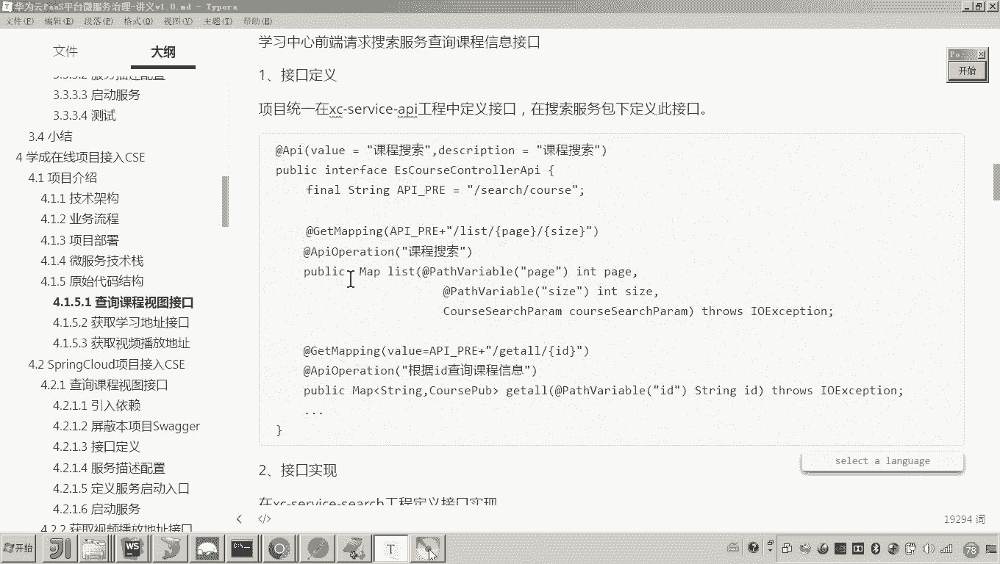

好，那么这个代码呢有很多啊，我们怎么去看呢？这里边有这么多工程。嗯，我先把这个工程呢，这个大概的这个工程的这个定位呢啊作用呢给大家介绍一下。😊。

首先以这个framework打头的啊framework打头的都是我们系统架构级别的这个呃工程啊。比如说第一个啊提供了很多一些抽抽象的呃封装的一些这个呃代码啊，比如说这个exception。

这里边是用在做这个什么异常处理的对吧？这是写了一些呃拦截器，还有这个是模型对象的啊一些呃抽象类，还有就是这个是什么呢？这个是base controllertroller啊，好，还有什么呢？

还有一个叫做model，这是存放模型模型类的一个独立的工程。😊，这是一个负工程啊。好，这里我说明一下呃，这里边没有把这个po文件呢放到这个目录的根目录，而当时是呃建了一个独立的一个工程，作为副工程了。

好。😊，还有一个叫做工具类工程。还有一个这个就是注册中心注册服务注册中心，这个是网关。这个是专门用来放接口的，哎，专门用来存放接口的一个工程，也是代码级别的依赖啊，代码级别的依赖。好。

就像这种frame呃这个framework打头的和这个service APII都是代码级别的依赖，嗯，都是其他工程要依赖它。而这个呢这个就是独立的一个工程。这个工程呢就是一个微服务了。😊。

所以除了这个framemework呃，这个framemework和这个service APII啊，其他都是独立的独立的微服务。这是注册中心，这是网关啊，这是学习中心学习服务啊，这个是课程管理的一个服务。

😊，好，这个是数据视图服务。这三个其实刚才我已经介绍过了，嗯，这个是搜索啊，这个是数据视图，这是学习，对吧？好，那现在这个代码我们要怎么看呢？我们看哪些代码呢？😊，上面的这些代码我们不看了。

因为我们在看这个微服务的时候呢，这些common model啊这个API啊，我们就会顺便的看一下。呃，我们看这个代码呢，我们有一个按照具体一个顺序吧，呃，就是什么顺序呢？

就是按照各位按照这个学习页面请求接口的顺序来说。首先进到这个页面，它是不是会先去请求右侧的这个课程目录啊啊，然后呢当用户去点击的这个目录的话，它是不是会请求获取这个目录所对应的视频地址啊。

所以我们按照这个顺序呢来讲这个接口来看这个接口的代码这个右侧的这个课程目录，哎，它需要请求哪个接口呢？各位看我讲义里边的这一角节，它需要去请求搜索服务下边的哎这个接口。所以你现在呢要找到搜索服务哎。

就是这个service search，然后呢找到那这个接口在哪个哎包下边呢，这个工程是一个点。😊。

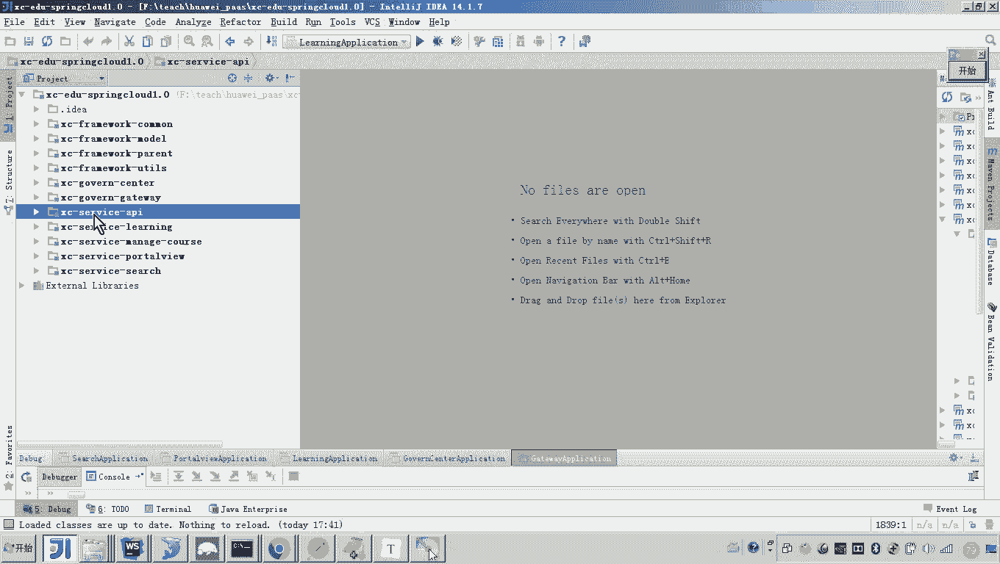

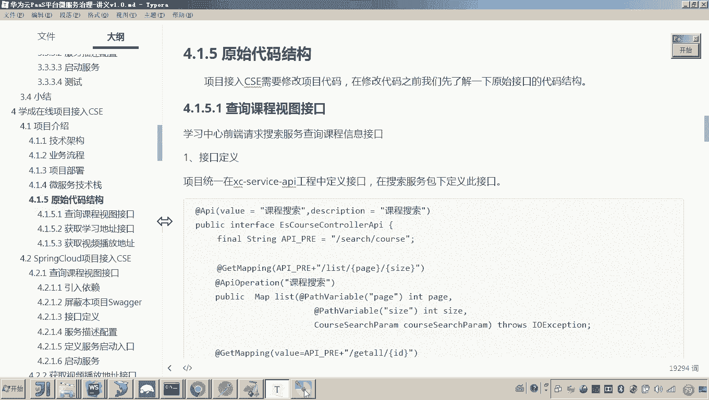

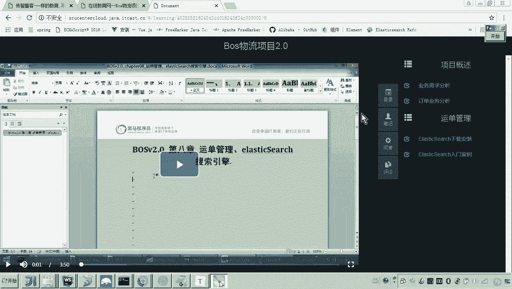

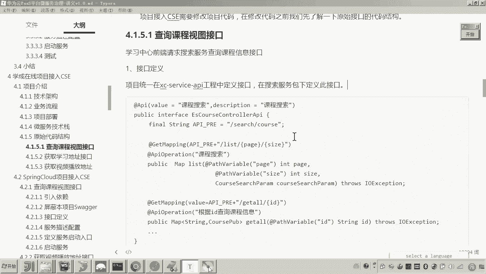

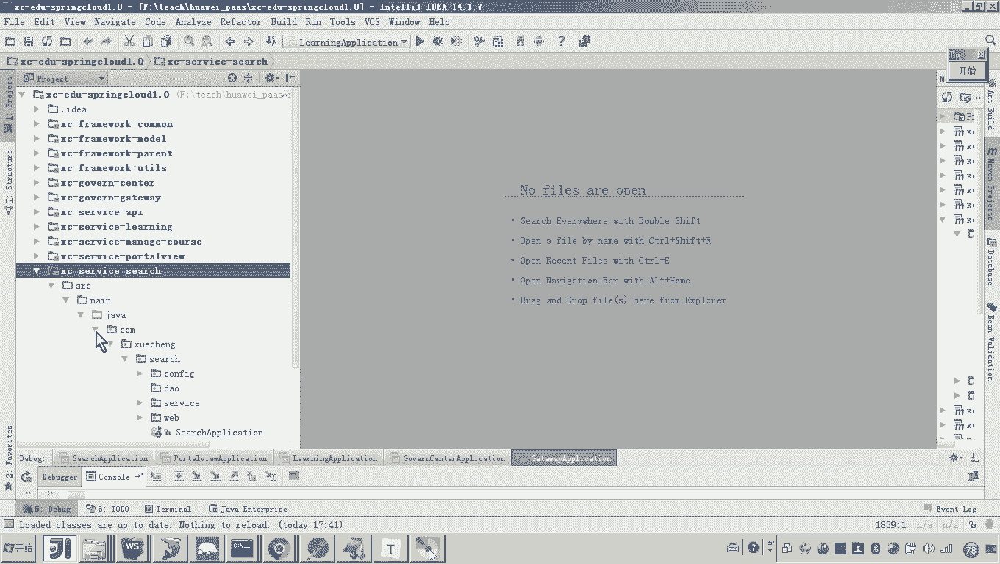

spring boot工程。首先你找到spring这个bo的启动类啊，这里边是不是就是spring boot的启动类了，对吧？好，然后再找就是它这里边的一系列包，这个confi是一些配置的这个包。

所以不管它啊，回头我们用它再说DAO访问数据库的这里边是空，因为这个工程要和这个服务做交互。所以这个DAO呢当时就没有写然后service service业务逻辑的。

还有web这个web呢controlll这个词应该大家比较熟悉吧。哎，这个web因为spring boot工程，是不是就采用springC来完成的这个web接口的开发。

所以这个conttrol类呢都是采用springVC来开发的。😊，然后呢，我们点开这个接口，那这个就是我们说的一个接口文件。大家可以看到这个包，其实这个包呢就来源于这个service APII。

也就是说所有的接口都在service APII在定义。😊，好，那么我们来看这里边假如说我需要去呃搜索课程的信息呃，那哪哪些信息啊？是不是右侧的这些课程目录啊，对不对？好，那这个课程信息各位来看。

我们走到哪个这个接口呢？啊，这个是搜索的课程列表，对吧？这是课获取课程的基本信息，这是课获取课程的全部信息啊，get或者获得全部信息。那这个呃获取右侧的课程目录。

这个信息就是从这个get O杠ID这个接口来获取的。😊。

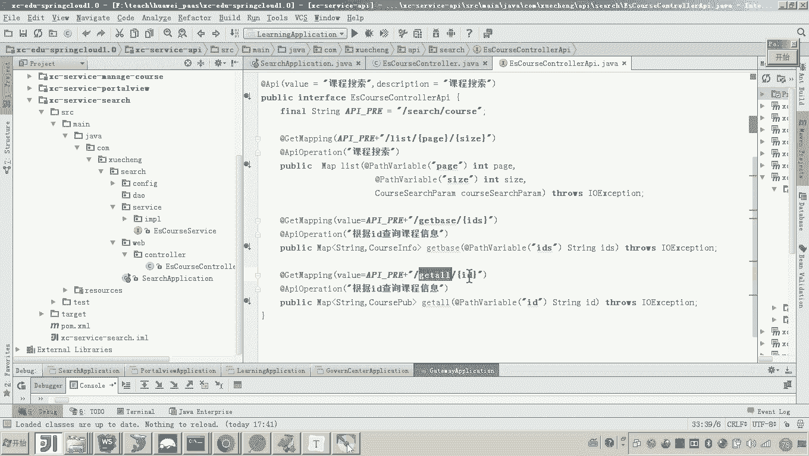

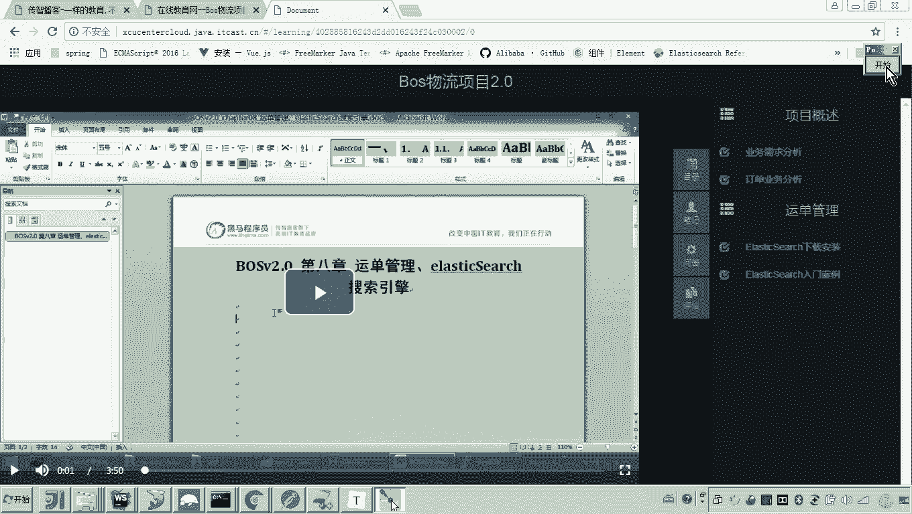

所以这个接口是我们要讲的第一个接口，哎，就是这个。就是这个get O就get O。嗯，当然我这个文档上也列出了这个list的，因为这个list的这个接口是哪里用到呢？

就是我们说的这个搜索这个页面所用到这个前端，他要去请求这个呃请求这个什么呀，请求这个list的这个接口啊，请求这个接口来查询这个搜索的这个信息。😊，好。注意啊。

因为这些代码各位代码这个代码你们都没有写过啊，除非你之前学过学生在线这个项目。所以呢你看起来很陌生，不要着急。因为这些代码呢，我后边会翻过来服务区里的给大家去呃讲哎还要改造这些代码。

所以你刚开始呢呃我们没有听懂，不要着急。你因为说有人说老师这个get all是啥意思呀？这个get这个接口干在哪用啊？对我说的是获取这个呃课程的这个目录信息。比如说老这个课程目录信息。

这个结构又是什么呢？啊，所以说这些因为这些你没有去开发这个学生在线。所以这些信息呢，你可能不知道，但是啊也不要着急，后边呢我都会去讲到。😊，好。

那这个接口我们主要现在来看到的不是说这个呃接口里边的一个细节啊，这个业务流程怎么走。我主要看到的这个技术上啊，大家应该都认识吧。

所以这个get mapping是不是这个注解来源于 VC啊嗯然后这些这个注解呢API这个注件，包APIoperation这注解啊，就是waer的一个注解wa是不是就是一个接口文档的一个工具啊。

生成接口文档的工具。😊，好，然后这个接口这个接口呢，大家可以看到这是一个interface，对吧？啊，然后呢，这个接口实现呢，我们来看一下这个接口实现。😊，啊，ge这里边是不是有一个service啊。

然后呢点开我们来看一下点开看一下它里边的代码结构，大家应该也能看得懂。哎，学过学过 search的同学应该都知道这一部分是不是用的来搜索我们的索有库，最终拿到这个课程的信息，然后把它包装起来。

最终返回是这样一个过程对吧？所以这个接口啊就是纯粹用的sp在开发的这个注解大家有印象吗？叫re，就是HT的接口我们采用解来写那它返回的结果是什么？是不是一个对象结构。哎，好，这个接口就说完了。

那接下来再看另外一个接口另外一个接口是什么呢？就是获取了这个目录信息之后呢，当用户去点击一个目录，它是不是要前端请求获取视频的播放地址啊。所以这个请求是先请求到哪里。😊。

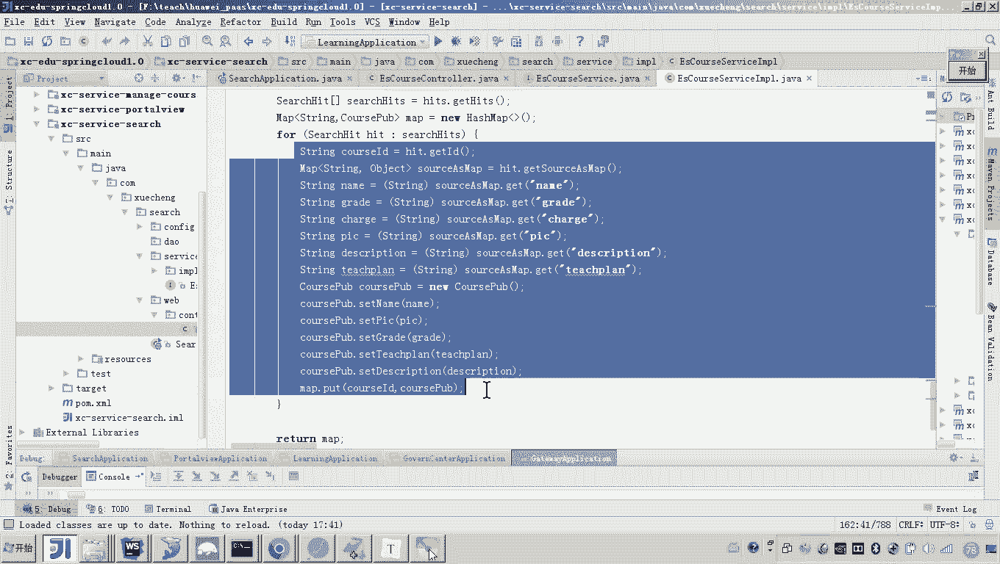

先请求到这个呃学习服务。还有印象吗？刚才我说的这个图先请求到学习服务，拿视频播放地址，学习服务再请求数据视图服务。那数据视图服务是不是会请求猫goB数据库，然后把这个视频的这个地址拿到，然后给他返回。

它呢给前端返回是这样一个过程，对吧？好呃，所以说大家来看获取学习地址这个接口呢，我们应该从哪里找呀。😊，应该从哪里找呀？对，应该从学习服务上。哎，因为他要提供一些学习信息方面的这个管理。好。

那大家来看在这个接口当中，大家来看，那我要找哪个包啊，我要找接口找哪个包呀？刚才我讲这个search的时候，是不是讲过呀，是不是在这个web这个包下边，然后这里边是不是所有的都是接口啊。

并且这个这个接口的这个实现类呢，它是这个实现的这个接口，这里边是不是都是定义的。我们说的这些所有的接口啊，那么这里边我们呃调用哪个接口呢？大家来看就是调用这个接口叫get media。

然后后边有两个参数啊，一个是这个cos ID课程I哎，一个是课程计划ID。😊。

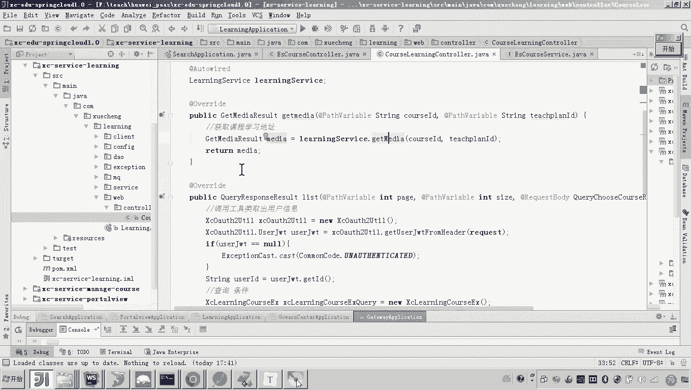

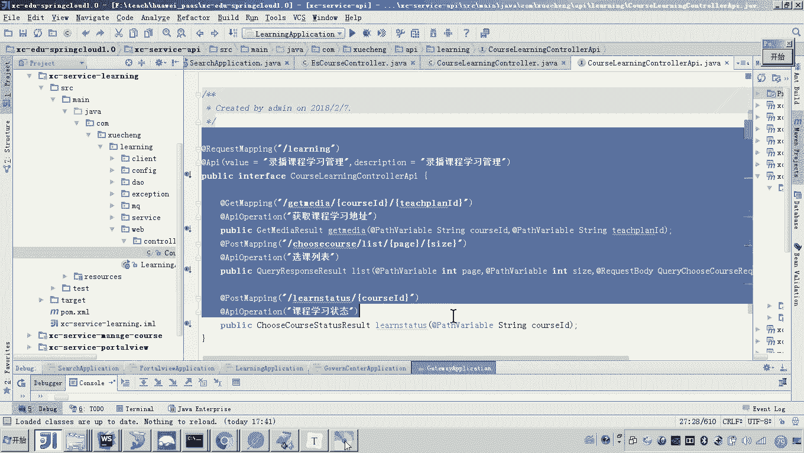

哎，就是我想获取哪一个课程的哪一个什么哪一个目录，哪一个计划。哎，就是这个ID。😊，好，那么你给我传俩参数呢，这里边呢他就开始就干嘛呀？获取课程的哎计划哎，获取课程计划所对应的这个视频播放地址。😊。

那他是怎么获取的呢？我们来看，虽然代码只有一行，所以我们来看这个service的调用啊。😡，首先这里边是不是校验学习权限，这里边我点点点啊，因为这个校验的过程呢，就是要看你收费没有收费。

这个过程呢我们不要重点的去关心我们关心什么呢？我们关心就是它这个数据从哪来。然后后边大家来看这一行是不是远程调用，获取课程没字信息，就是课程的这个视频的播放地址啊。

所以这一行代码其实就是来获取课程的视频。哎，课程的视频地址。😊，那这个代码的工作原理又是什么呢？😡，大家可以点开看一下，学过spring cloud的应该都知道认识这个fin client，对不对？哎。

这个是不是就是用来做远程调用的，对不对？然后它的工作原理是不是就最终会生成一个接口代理对象。然后呢，从这个有瑞卡当中去找到这个服务名，就是这个微服务，哎，这个微服务的一个什么地址，然后进行远程调用。

然后来获取到哎这个数据这个数据里边的内容大家可以看到是不是就有我们说的mediaUL，这是不是就是我们说的视频播放地址。😊，好，拿到了这个视频播放地址之后呢，他就开始干嘛获取这个视频的播放地址。

然后呢把它封装到一个对象当中返回。😊，是这样一个过程吧。所以所以在我们讲第二个接口的时候呢，这里边就用到了一个什么远程调用，就是采用spring cloud提供的fin cloud来完成远程调用。😊。

然后最后一个接口是什么呢？就是呃我们刚才看到嘛，就是说首先前端请求的是不是请求的我们说的学习服务，然后学习服务是不是才请求我们说的portal view这个数据视图服务来取这个视频的地址啊？

所以最后一个接口就是portto view。😊，哎，port view提供一个获取视频播放地址的接口，由学习服务。哎，刚才我们讲的这个接口去调用。好，portal view哎，我们打开这个服务。😊。

P头 view。在这个portto view当中，这里边提供的就是所有的就是这个接口，就是数据查询的接口。哎，那他这个数据查询的这个来源于哪里呢？呃，最他他它连接的这个缓存啊，如果缓存当中没有的话。

它就会来源于这个mongodb了。所以说它的这个数据的最终来源就是mongodb数据库，嗯，所以你要取这个视频的这个播放地址呢？

大家可以看到我们前期是不是已经把这个这个这个mongod的这个集合已经创建好了，就是在这个集合当中，在这个集合当中，这里边是不是就有这个视频播放的什么地址吧，对不对？😊，这就是视频播放地址。好。

这个表结构，你有人说老师我没学过这个学生在线，我就不太熟悉嘛。嗯不要着急。哎，回头你还会去看，并且呢我还会将来去部署。所以你不要着急，你现在就理解理解这个接口的功能就行了。那这个接口的功能我们找到啊。

把这个接口找到哎，这个接口在哪里呢？就是在来点击这个接口文件啊，这接口所有接口都在这儿嘛，这个接口大家可以看到啊，我我从哪里找啊，就在这儿叫做get media给我传一个什么哎ID。😊。

根据教学计划的ID来查询课程梅字的视图。所以这就是我们说的啊被学习服务所调用的来获取视频播放地址的这个接口。好，那么你可以看到这个里边是不是就是通过DO哎查询mongoDB来查询到一条记录。哎。

然后返回这条记录。那这条记录里边是不是有一个叫media UL，对吧？😊，好，那么以上呢就是我们把这个代码的原始代码结构啊给了解清楚了。那么呃主要的目的呢，大家一定要明确，其实就是让你看一看这些代码。

明确这个接口的功能，以及这个代码是怎么实现的。这个代码用到的全是spring MVC的注解，对不对？好，那么这个原始的代码结构呢，我们先讲到这里。😊。

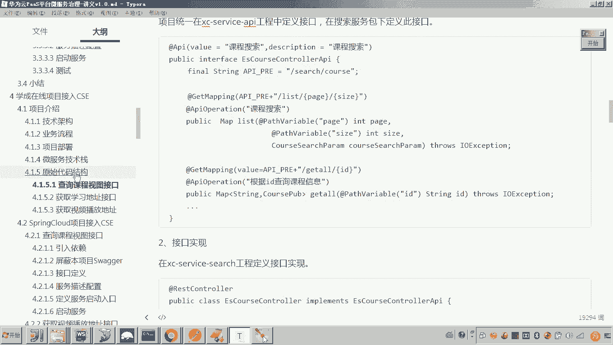