# 华为云PaaS微服务治理技术 - P90：14.学成在线项目接入CSE-项目介绍-原始代码结构 🏗️

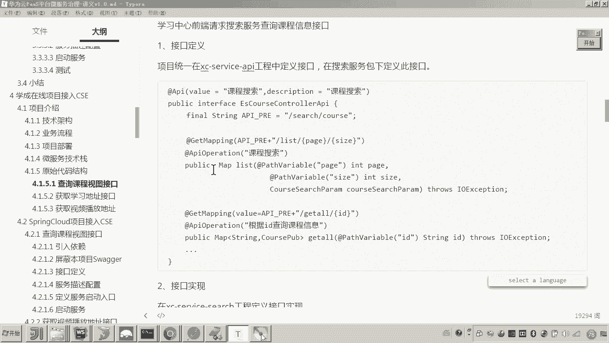

在本节课中，我们将要学习“学成在线”项目的原始代码结构。了解现有基于Spring Cloud的微服务架构，是为后续将其改造并接入华为云CSE（微服务引擎）打下坚实基础。

## 项目工程概览 📦

上一节我们介绍了微服务的技术栈，本节中我们来看看各个微服务的原始代码结构。

以下是项目中的主要工程及其定位：

*   **`framework-*` 系列工程**：这些是系统架构级别的工程，提供公共的抽象封装和工具。
    *   `framework-exception`：异常处理相关代码。
    *   `framework-interceptor`：拦截器相关代码。
    *   `framework-model`：模型对象的抽象类。
    *   `framework-controller`：基础控制器。
    *   `framework-common`：存放通用模型类的独立父工程。
    *   `framework-utils`：工具类工程。
*   **`service-api` 工程**：专门用于存放接口定义的工程，是代码级别的依赖。
*   **独立的微服务工程**：除了上述`framework-*`和`service-api`，其余均为独立的可运行微服务。
    *   `service-registry`：注册中心（如Eureka）。
    *   `service-gateway`：API网关。
    *   `service-search`：搜索服务。
    *   `service-learning`：学习中心服务。
    *   `service-content`：课程管理服务。
    *   `service-portalview`：数据视图服务。

## 核心业务流程与代码追踪 🔍

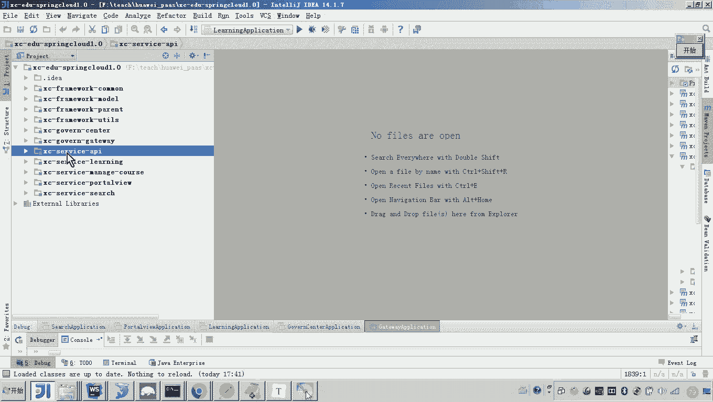

我们将按照用户在学习页面的操作顺序，来追踪关键接口的代码实现。

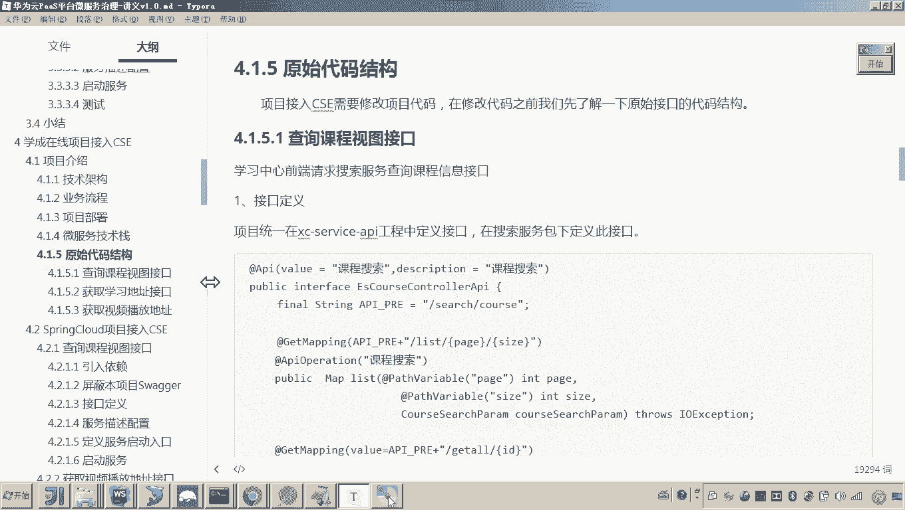

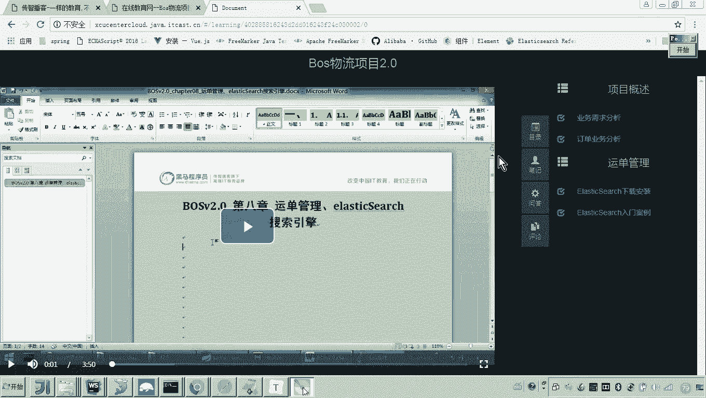

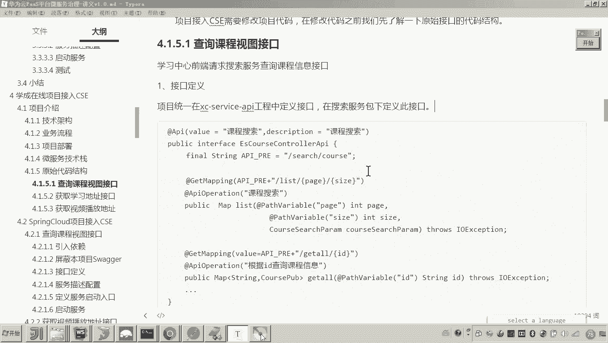

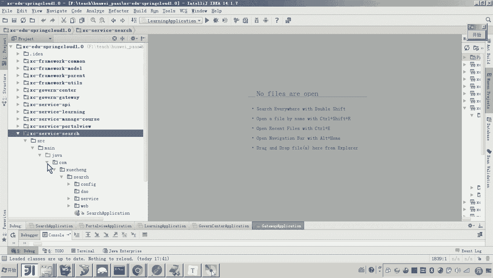

### 1. 获取课程目录接口

当用户进入学习页面时，前端会首先请求右侧的课程目录信息。这个请求会调用搜索服务（`service-search`）下的接口。

以下是查找并理解该接口的步骤：

1.  打开 `service-search` 工程，这是一个标准的Spring Boot工程。
2.  找到Spring Boot启动类 `XcServiceSearchApplication`。
3.  查看工程包结构：
    *   `config`：配置类包。
    *   `dao`：数据访问层（本例中为空，因为该服务与Elasticsearch交互）。
    *   `service`：业务逻辑层。
    *   `web`：控制器层，包含使用Spring MVC开发的接口。
4.  在 `web` 包下找到控制器 `CoursePubController`。其中的接口定义来源于 `service-api` 工程。
5.  我们关注获取课程全部信息的接口：`getById`。该接口用于获取学习页面右侧的课程目录。

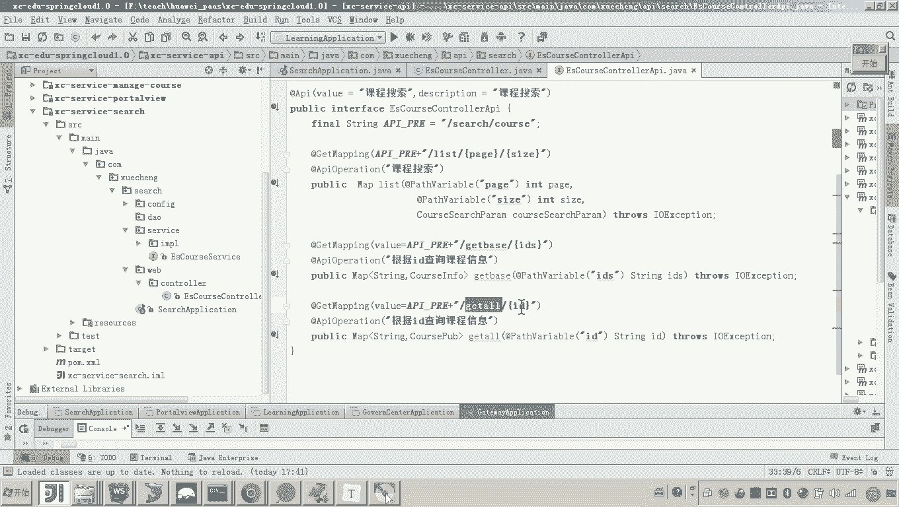

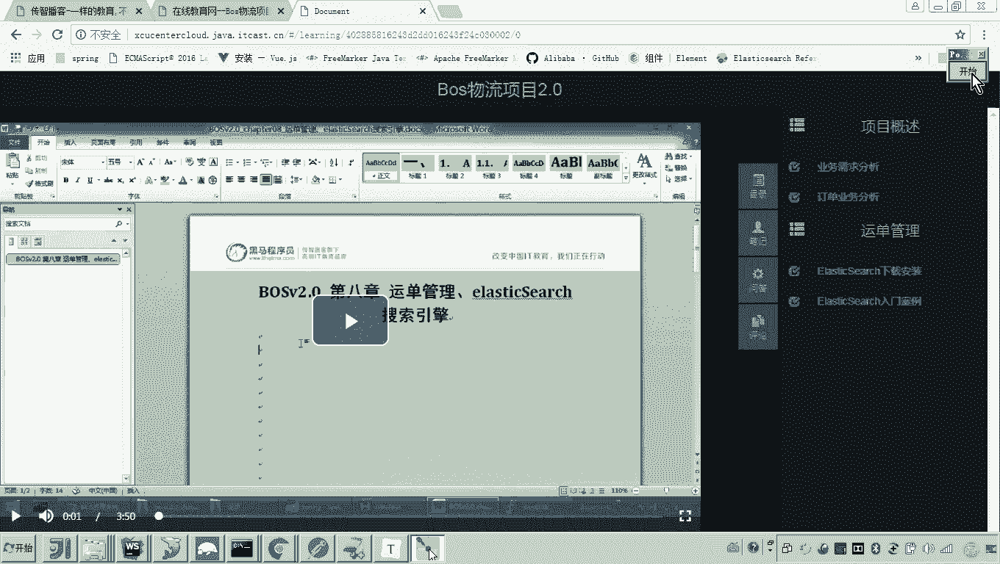

```java
// 代码示例：CoursePubController 中的接口定义
@ApiOperation("根据课程id查询课程全部信息")
@GetMapping("/getall/{id}")
public CoursePub getById(@PathVariable("id") String id) {
    // ... 实现逻辑
}
```

这个接口使用了Spring MVC的 `@GetMapping` 注解和Swagger的 `@ApiOperation` 注解。其实现类会调用Elasticsearch客户端查询课程信息，并封装成 `CoursePub` 对象返回。

### 2. 获取视频播放地址接口

当用户点击课程目录中的某一节时，前端需要获取该节对应的视频播放地址。这个请求首先到达学习服务（`service-learning`）。

以下是该接口的分析：

1.  打开 `service-learning` 工程。
2.  在 `web` 包下的 `LearningController` 中找到 `getmedia` 接口。它接收课程ID (`courseId`) 和课程计划ID (`teachplanId`) 两个参数。

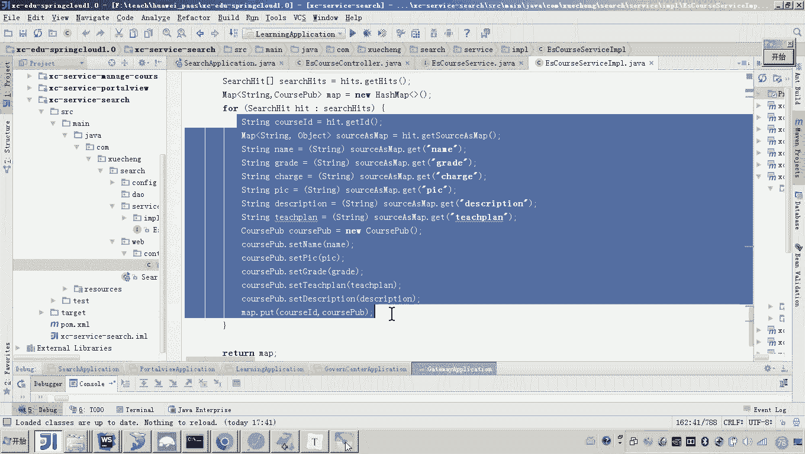

```java
// 代码示例：获取视频地址的接口
@GetMapping("/getmedia/{courseId}/{teachplanId}")
public RestResponse<String> getmedia(@PathVariable String courseId, @PathVariable String teachplanId) {
    // 1. 校验学习资格...
    // 2. 远程调用获取视频地址
    String mediaUrl = learningService.getMedia(courseId, teachplanId);
    return RestResponse.success(mediaUrl);
}
```

该接口的核心是 `learningService.getMedia(courseId, teachplanId)` 这行代码，它通过**远程调用**来获取视频地址。

```java
// 代码示例：使用FeignClient进行远程调用
@FeignClient(value = "search-service") // 指定要调用的服务名
public interface CourseSearchClient {
    @GetMapping("/search/course/getmedia/{teachplanId}")
    TeachplanMediaPub getmedia(@PathVariable("teachplanId") String teachplanId);
}
```

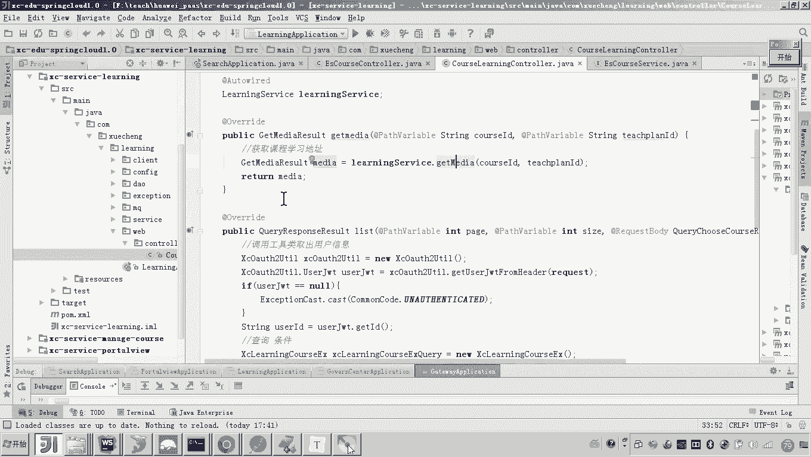

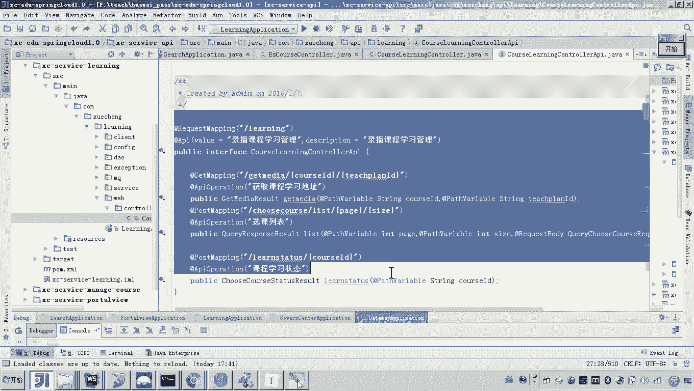

这里使用了Spring Cloud的 `@FeignClient` 注解。其工作原理是生成一个代理对象，通过服务名（`search-service`）从注册中心找到目标服务的地址，然后发起HTTP调用，返回包含 `mediaUrl`（视频播放地址）的数据对象。

### 3. 数据视图服务提供视频地址

学习服务调用的实际上是数据视图服务（`service-portalview`），该服务负责从数据库（MongoDB）中查询视频地址。

以下是该数据接口的分析：

1.  打开 `service-portalview` 工程。
2.  在 `web` 包下的 `MediaController` 中找到 `getmedia` 接口。它根据教学计划ID (`teachplanId`) 查询视频信息。

```java
// 代码示例：数据视图服务提供的接口
@GetMapping("/getmedia/{teachplanId}")
public TeachplanMediaPub getmedia(@PathVariable("teachplanId") String teachplanId) {
    // 通过DAO层查询MongoDB
    return mediaRepository.findById(teachplanId).orElse(null);
}
```

该接口的实现非常简单，直接通过 `mediaRepository`（数据访问对象）查询MongoDB中对应的集合（例如 `xc_learn_media`），并返回整条记录，其中就包含 `mediaUrl` 字段。

## 总结 📝

本节课中我们一起学习了“学成在线”项目的原始代码结构。我们明确了项目的工程划分，并沿着“获取课程目录 -> 获取视频地址”的核心业务流程，追踪了三个关键微服务（`service-search`, `service-learning`, `service-portalview`）的代码实现。

可以看到，现有代码完全基于Spring Cloud体系构建：
*   Web接口使用 **Spring MVC** 注解（如 `@GetMapping`）开发。
*   服务间通信使用 **Spring Cloud OpenFeign** 进行声明式远程调用。
*   接口文档使用 **Swagger** 注解生成。

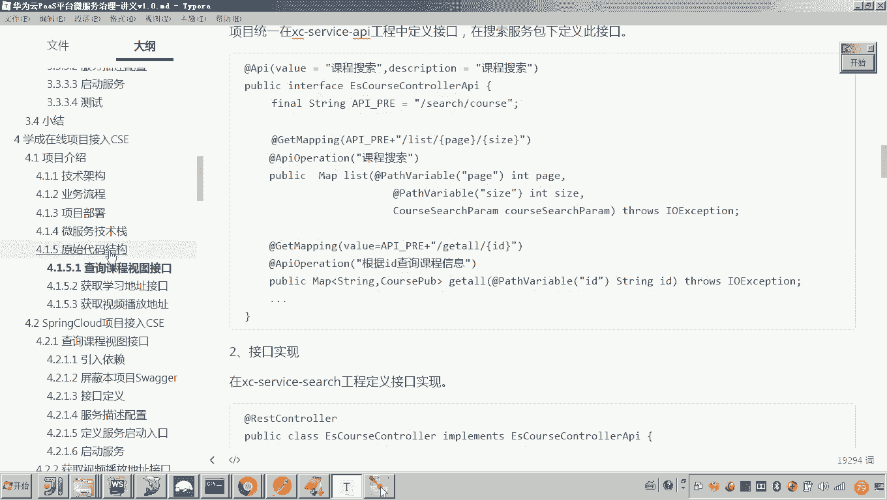

理解这份原始代码是至关重要的第一步。在接下来的课程中，我们将逐步把这些基于Spring Cloud的微服务改造并接入华为云CSE，实现服务治理能力的升级。