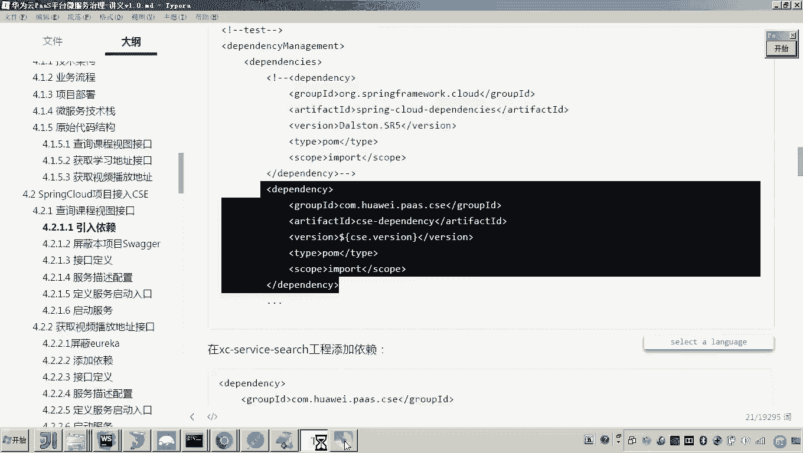

# 华为云PaaS微服务治理技术 - P91：15.学成在线项目接入CSE-搜索服务接入CSE - 开源之家 - BV1wm4y1M7m5

好，那么下面呢我们就开始将我们刚才说的那几个微服务啊接入CSE。好，呃，那么我们先将第先从第一个接口开始吧，还是按照这个顺序啊，叫查询课程视图接口。嗯，那么我们先改到这个接口，哎，大家来看啊。

这个接口是哪里的接口呢？😊，这个接口是不是我们刚才说的是首先是在前端的页面，哎，我们说这是不是就是右侧的这个课程目录啊？那这个目录的信息来源于搜索服务。哎，就是这个 search区。好，我们打开。😊。

那我们准备呢把这里边的这个接口呢给它改造一下。哎，在这里边我们改造一下。

好，打概。那怎么改造呢？各位首先哎我们说要接入CSE当初我们学过servicecom项目呢，接入CSE是不是代码不用更改就可以了。哎，我们先回顾一下啊，先回顾一下，看一下当初是怎么接入的。然后呢。

我们呃再来把spring cloud项目接入。首先各位他是怎么做的。首先它是不是引入了依赖，对，引入了CSE的这个依赖，对吧？啊，然后呢就配置了呃描述的这个啊服务描述文件啊，然后呢启动服务就完事了。😊。

因为本身这个就是用的servicecom项目啊来开发啊，为了用了这个servicecom的框架来开发，所以我我们只需要引入CSE的这个依赖，然后呢呃配置一下这个配置文件就可以了。

而现在你要将spring cloud项目来接入CSE怎么做呢？😊。

呃，第一步我们是需要哎还是先引入依赖。哎，然后引入依赖了之后呢，我们就要去哎把spring cloud的这个接口的开发方式呢，把它改为servicecom接口开发的方式。

，然后呢最终就完成了这个CSE的依赖。首先我们先来引入依赖啊啊引入依赖的方法跟当初servfacecom项目接入CSE的方法一样啊，咱们在副工程当中，我们来引入这个CSE dependency这个依赖。

😊。

好，那么我们来做啊。引入的方式呢，首先我们引入的这个CSE的这个dependacy的呃版本呢是2。3。30。然后我们找到负工程，找到负工程。😊，所以这个这个复工程当刚刚才我是不是强调了。

它没有在这个目录下面这个泡沫啊，我专门建了一个目录啊，在这儿，然后呢，我们把这个版本贴进去。然后接下来哎我们再来引入这个dependencySEdependency。😊。

啊，因为这里边我们要更换这个微服务的框架了嘛，所以原来的这个spring cloud dependency，我们把它屏蔽。然后在下边呢，我们引这个华为的这个嗯CSE的这个依赖。好。

然后我们呢刷新一下我们的这个呃泡m文件。好，然后呢这样的话我们就把这个。呃，负工程的依赖呢就变了。那变完了之后呢，我们说那你在子工程，负工程这这个依赖呢只是个版本管理嘛，只是个依赖管理嘛。

所以真正的要引入依赖是在子工程当中，我们来引入哎具体的这个依赖。大家还有印象吗？当初servicecom是引入什么依赖呢？这里面啊也引入什么依赖就可以了。哎，我们引入CSE的这个啊service引擎。

然后再引入这个啊部的开发的一个启动包，还有就是这个部的这个provider这个包，然后呢我们把这三个依赖呢？把它拷贝到啊这个搜索的这个工程下。😊。

注意这里边呢有一些东西，哎，我们来看一下啊，考到这儿。好，然后把它刷新一下。嗯。好，我们先把这个依赖的包给他换一换啊。好，然后现在呢我们把这个依赖的包就换完了。接下来一步呢，我们就要更改接口了吧。😊。

因为这个。这个CSE的这个接口啊，包括servicecom的接口啊，它也都可以基于这个springVC来开发嘛。所以说这个接口的变动呢不是很大的。嗯，我们来看一下啊，首先我们要怎么改呀。😊。

原来这个学生在线呢，它是采用自己来扫描呃接口文件来生成这个swagger，通过使用swagger来生成这个呃接口的文档。所以现在呢我们由于用的这个CSE框架，所以呃就不用我们自己在做这个接口文档了。😊。

就不用我们自己再生成这个swagger的接口文档了。所以啊我们在这个API工程当中啊，要做一件事儿，就是把原来我们自己手动扫描哎这个类来生成swagger文档的这个注解呢，我们把它屏蔽。

这是这是我们要在做做接口开发的前边，我们要做这么一件事儿。好，然后接下来呢我们就开始进行接口的定义了。那么要定义接口的话，这里边我们就因为本身这个搜索的服务是不是没几个接口啊，这己注意大大家来看一下。

这里边有几个接口，是不是三个接口啊，对，所以我们就一个一个改就行了。嗯，那么我们先改第一个吧。第一个的话，大家来看它是不是呃get请求呃，然后呢然后呢这里边是不是有一个在这个URL里边传了两个参数。

一个是配一个size，后边是不是用了一个叫做呃自定义的这个PUGO的类型来接收我们说的这些参数，看到了吗？对，😊，然后注意啊，在这里边我们当初学这个servfacecom的时候应该有印象吧。

就是说servfacecom在定义这个参数的时候呢，对于get请求，哎，querry就查询类型的这个参数啊，哎它是不建议用这个对象来接收的。它建对于get请求。哎查询类的参数呢。

它建议用哎用使用简单的这个基本类型。哎，不要用这个自定义的POG。所以哎我们现在要把这个里边的这些哎字段呢把它拆出来，猜到哎基本类型放到这儿。😊。

有说老师，那怎么猜呢？其实很简单，哎，就是说呃我们页面会传过来这个关键字哎，传过来分类这些这些信息。哎，我们就呃简单的把这个自定义POGO的这些属性呢，你把它抽取出来。

独立的哎把它单独的把它放在这个接口当中，看懂了吗？就这么做。😊。

原来我们是不是哎用这个类型来接啊这些请求参数是吧？但是如果我们要采用CSE哎，或者说我们现在的目的是不是要把它更改为当初我们开发servicecom的这个过程，对吧？对。

所以所以这个servicecom在呃开发get接口的时候，对于查询类的参数呢，它建议你使用基本类型，所以我们要把这个类型里边的这些属性呢把它抽出来。好啊，这样的话，我们就把这个呃接口给改了。呃。

如果一旦接口更改的话，这里边你这个接口的实现类是不是也要改了。😊，看懂吧？所以我们把把它稍微给它变变换一下啊。好。😊，这样你改完了之后，这里边。😡，这个这个service的这个接口是不是要传这个类型啊。

看见吗？所以有人老师是不是要把service接口也改了，那当然不用了，我们可以这么玩。😡，怎么做啊？我们可以这个参数被你改成基本类型了，但是service肯定不用我改了吧。

service的话我就定义一个这么一个对象，然后怎么弄啊，然后你把这些参数给它set进去。😊，是不是就可以了？😊，对吧。哎，这么做。然后再来。各位，你说这样的话。

我是不是就把这些参数呢把它放到这个对象里边，然后传给serverice，是这样做吧。好，那这个接口大家来看啊，我我是不是第一步啊，第一步啊，我把这个接口的这个传参呢是不是给改过来了，对吧？好。

那么第二步我要做什么呢？😊，第二步我要做的话，就是原来的这个rest controlt的这个注解，我得屏蔽了。就说为啥呢？😡，对，因为哎采用servicecom这个接口的开发，哎。

我们就不需要这个注解了。😡，那就不需要这个注解，我们我们我们需要什么注解呢？大家应该还有印象吧。当初servicecom我们讲解的时候，是不是说要哎要显示的来声明这个request麦。😊，看懂了吧？对。

这个request的m呢，各位我们来看这里边是不是有这么一个东西，看见了吧？就是在原来的接口里边，是不是有一个前缀，对吧？你把这个前缀复制出来，把它放到这里头，看见了吗嗯。😊，然后也要注意一点。

因为原来我们这个swa接口是我们自己写的，我们在这个接口类里面是不是加了这个get mapping。注意现在现在你要采用servicecom，哎，或者说采用CSE它这两个框架来改的话。

那你必须把这个注解呢，你把这个get mappingrequest mappingrequest mapping要写在类上边。那get mapping呢，你要明确的把它写在这个实现类上边。

不要写在接口里头了。对。😊，对，这个是我们原来学生在线的做法。原来学生原原来学生在线的做法是不是哎放到这儿，是不是？而现在你要把它放在实现类里头。哎，这么做好，这样的话，我们把所有的接口都这么改。😊。

就是都把这个呃get mapping啊，post mapping啊这些注点呢移到实现类里头。一定记着啊。如果你不移的话，这个这个是有问题的。😊，嗯，好，那有说老师那当初学生在线怎么可以？我说了嘛。

学生在线，当初在这个启动类的时候，你可以看到它是会扫描这个里边的这个接口，对不对？然后扫描完了之后，因为这个接口这个注解在这儿它也被扫到了嘛，所以就可以。但现在你用的是servicecom这一套。

而servicecom它来生成swagger接口的时候呢，它要它要扫这个实现类，然后看这个实现类里面有没有这个注解。对，然后最终生成接口。好，这样的话，我们是不是就基本上。😊，啊，一个一个来看啊。

不着急啊，这个这个是个一个基础的路径，是不是就可以。然后后边你看这个接口，我是不是把那个对象呃，把它把那个自定义的POGO把它提取出这个基本类型嗯。😊，对于get请求啊。

注意对于get请求我们都要用基本类型。那对于pos的请求，你可以用自定义POGO哎传这个阶son数据。哎，回头我们遇到了再说。好，这样的话各位我们看这也是get请求吧。对，这个也是get请求。

没问题了吧。好，这个就是接口的变化呢，我基本上就改完了，一会儿遇到问题，我们再改好。那么接口改完了之后，我们接下来要配置的就是这个服务的配置文件了。😊。

这个配置文件当初我们是不是在servicecom项目改造的时候，哎，接入CSE的时候，是不是做过在哪里配啊？在resource下边，嗯，然后我们新建一个file。

然后名字叫做microservice YAML，对吧？然后嗯我们把这个配置项呢哎把它拷过去。😊，考过去之后注意啊，我要给你讲一下啊，因为这些信息我们当初在servicecom的时候是不是讲过。

我大概提一下。😊，这个应用名啊，这次改造的这个接入学生在线哎，接入CSE的这个这个应用名啊，我们定义为叫XCEDUcloud1。0嗯。😊，好。

这个微服务的名字这个微服务的名字叫X service呃X service search。这个微服务的名字其实你可以从这儿拿。对，这是原来spring boot的这个配置嘛嗯。😊，好。哎，有人说老师。

你这里边配这个微服务的名字叫他那我问你就这个这个这个是不是就没有用了。就原来spring boot这个配置文件，这个微服务的名字是没有用了。没错，这个微服务的名字就没有用了，包括这个端口也没有用了。

所以这些东西都可以干嘛删掉了不过你可以留着嘛，你可以留着，但是你得知道啊，你可以知道这个东西已经没有用了。现在我们走的是这个微服务的名字，包括端包括这个版本啊啊好。

那这个呢是是否允许这个跨APP访问默认就是不用改。然后这个是CSE这个注册中心。各位这注这个注册中心的地址是不是就是公有云的地址。各位还有印象吗？如果这个服务我更改成功，一会我们去重启微服务之后。

我是不就可以干嘛登录华为云平台。😊，哎，我我登录一下啊。😊，然后我登录这个云平台，然后进到这个呃微服务引擎这里边，我在这个服务目录里头，各位我是不是就可以应该查到了，对不对？哎。

就在这里边应该查到有一个应用叫做什么XCDOcloud，对吧？现在还没有啊，因为我还没有启动。😊，好。好，然后呢这个watch默认就是fors啊。

这是这个监控这个查询实例的这个这个这个呃服务发现查询实例的一种方法啊。默认就是forse好，我们不用改，然后下边呢，我们这个是配置的是什么？是不是就是那个AKSK的密钥了，对吧？好。

那这个密钥的获取方式，当时我是不是讲过怎么怎么做的，是不是在这个账号的这个基本信息当中，然后在这个管理我的凭证里边，然后在这里管理密钥，各位在这儿咱们是不是可以获取到对吧？当初你在获取的时候是怎么做的。

是不是就是发送这个手机号之后，呃，然后自动下载到本届的对吧？哎，所以这里边呢啊我们来看一下嗯。😊。

在我的这个里头呢，应该有哎我们之前的这个密钥啊，我们把它拿到。就这个密钥还，我们把它配一下。好。然后呢，配成我这个云平台账号的。啊，因为我这里边测试这个系统呢，我当时注册了好几个账号。

所以这里边呢我用哪个账号呢？我要拿哪个账号的密钥。好，备好了嗯。😊，然后这个是一个加密算法的这个加密的这个加解密工工具啊，默认就是default不用改。好。

然后下边这个是不是就是res的这个呃开放的这个端口号叫40100，对不对？然后这个0。0。0这个也不用改啊，默认我们将来部署到公网是可以这个公网访问的啊。好，那这样的话，我们说这个就OK了。嗯，好。

有同学可能有疑问说老师这有个410040100。那你这个原来的spring boot里面也有个40100，那这个端口号。😊，那用哪个了？注意，现在我们一定注意对于微服务的微服务的地址也好，名字也好。

我们统一走的是这个配置文件了。而这个配置文件里边的针对服务名称啊，针对端口的这些东西都已经没有用了嗯。😊，哦，那这个这个信息有用没有啊？

这个信息是我们说这个搜索服务是不是要去呃连接lect search来进行搜索的是吧？当然这个肯定有用。因为我的程序要读，要要通过spring boot的方式来读这个配置啊，所以也就是说呃改造了之后。

spring boot原来的这个端口微服务的名字都已经没有用了。好，那好，我到这儿呢，我就把这个配置文件呢就配好了。接下来我是不是就开始启动服务了，对吧？而启动服务的时候，大家有印象吗？

我是不是要在这个启动类上边要做一些文章，对吧？怎么做呀？😊。

就是在呃在这两个注解应该也没有用了。就是我不会从这个瑞卡 server当中去发现服务了。对我也将来我这个远程调用啊，如果我要用远程调用了，我也不会用这个fin client了。哎哎。

我们会用service co哎，service co给我们提供了远程调用方法。所以这两个就可以干掉了。那当然我这里边要启动的是什么呢？

哎启动的就是这个呃激活的啊激活的是这个enable servicecom哎，就这个注解O那这样的话我们就把这个就改造好了。好，那接下来我要做一件事哎，就是要启动嗯。😊，好，那启动之前呢。

我还是建议你做一件事儿啊，因为这里边可能有一些已经编译生成的这个class文件呃，可能会报错或者怎么地。我建议你呢把它给清理一下啊，找到这个man的这个视图，然后呢找到这个呃life lifecycl。

然后里面有一个cle，然后把它清理一下。😊，好，清理成功之后呢，我们现在呢就可以来去启动嗯启动。啊，启动之前呃不要不要着急啊，因为这刚才我是不是变了一个在这个负工程是不是做了这个什么啊更改了这个配置啊。

所以我还是建议你把这个负工程呢。😊，把它因死倒一下。把它发布到我们的这个仓库里头。因为副工程一般很少变啊，变完了之后呢，你ins到完了之后，后边也就不用再ins到了。好，然后呢。

我们在里边再呃运行运行我们这个社区。😊，Hao。😔，相当于这里边就跟给一个病人做手术一样是吧？里边应该是已经换血了。😊。

好，那么我们来看啊，大家改造完了之后呢呃看一下它是否报错啊，报错了我们再说。好，然后呢我们哎往上翻看一下日志。😊，好，那么到这里呢我们可以看到这个日志呢，这个呃注册呃已应该已经是成功了，对吧？好。

那么这个这个这个这个实力已经注册成功了之后呢，我们怎么观察呢？应该是可以通过。😊，这个管理控制台啊，然后呢啊是不是可以通过控制台控制台哪里呀？是不是有一个叫做嗯。😊，服务列表。啊。

在应用服务里面是不是有一个叫做。呃，应用呃微服务引擎CSE对不对啊？我们现在讲的是不就是微服务引擎CSE然后在这个服务目录里边，我们找到里边是不是有一个叫XCEDUcloud1。0。各位。

那各位你来看这个服务是不是已经正确的注册成功。😊，对吧注册成功。好o。哎，注册成功这里边我现在发现一个问题啊，各位呃，这个问题是什么呢？你没发现啊。😊，这个这个服务是注册成功了。

但是这个服务契约你你没发现吗？却没有，对不对？好，稍后呢我们再来看一下这个问题的解决方案。好。😊。

