# 华为云PaaS微服务治理技术 - P91：15.学成在线项目接入CSE-搜索服务接入CSE

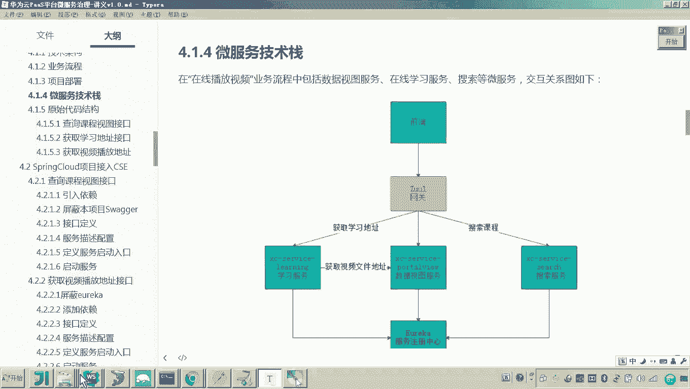

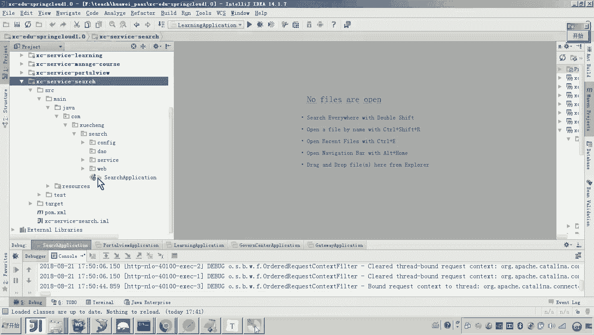

在本节课中，我们将学习如何将一个基于Spring Cloud的微服务项目（学成在线）接入华为云CSE微服务引擎。我们将以搜索服务为例，详细介绍从引入依赖、修改接口到配置文件的完整改造过程。

## 概述

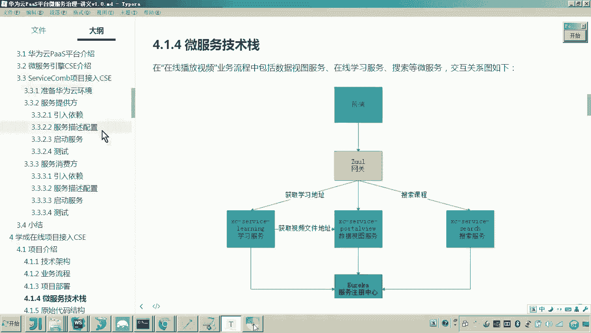

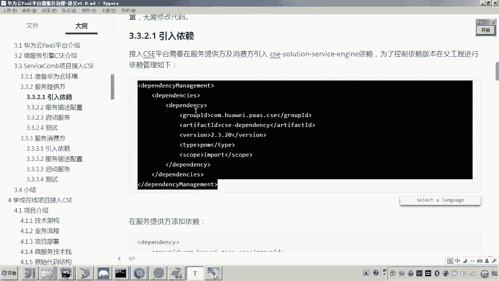

上一节我们介绍了项目接入CSE的整体规划。本节中，我们来看看如何具体实施，首先从搜索服务的“查询课程视图接口”开始改造。

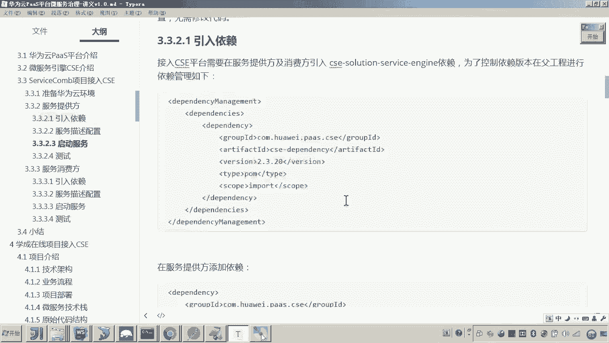

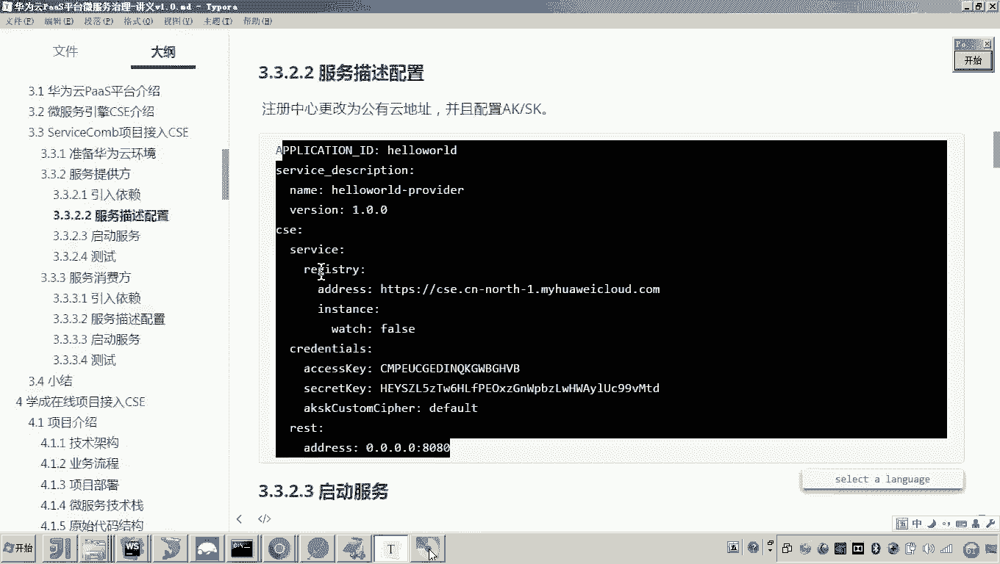

## 改造目标接口

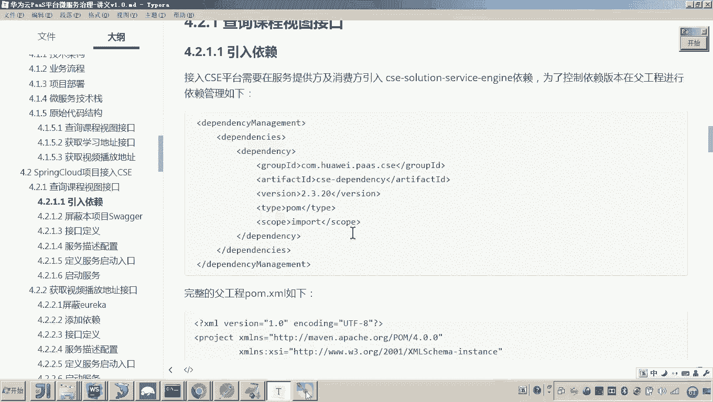

首先，我们需要明确要改造的接口。该接口位于前端页面右侧的课程目录，其数据来源于搜索服务（`search`模块）。我们的目标是将这个基于Spring Cloud的接口，改造为兼容CSE（及ServiceComb）框架的接口。

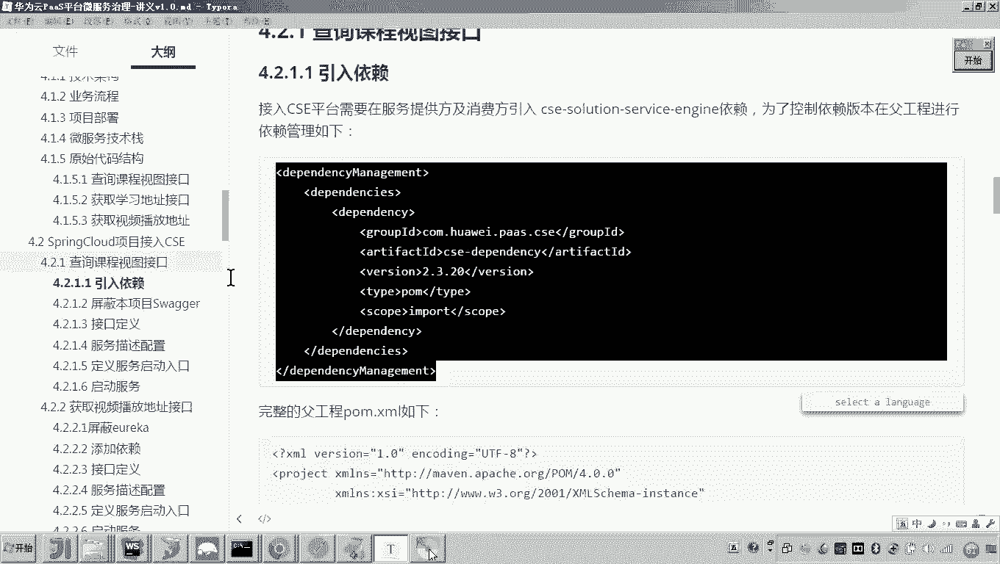

## 改造步骤回顾

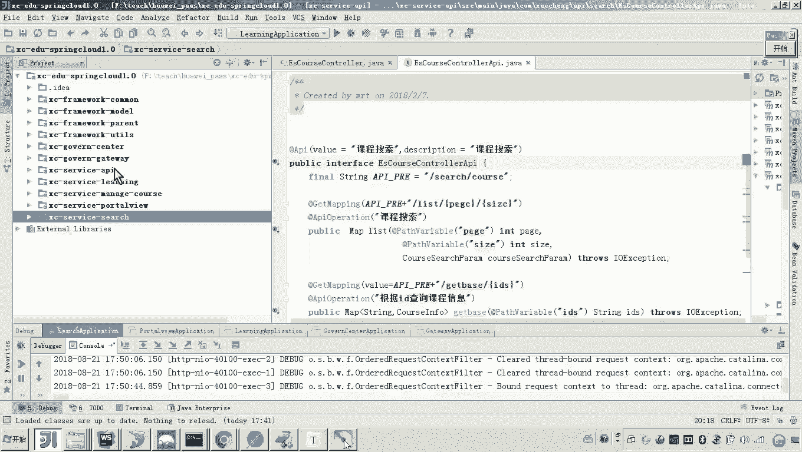

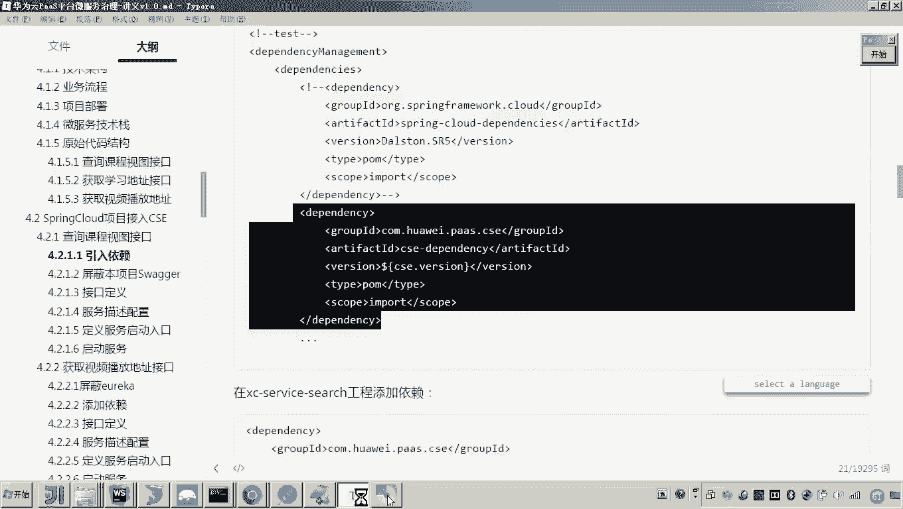

在开始具体操作前，我们先回顾一下ServiceComb项目接入CSE的标准流程：

1.  **引入CSE相关依赖**。
2.  **配置服务描述文件**（`microservice.yaml`）。
3.  **启动服务**，完成注册。

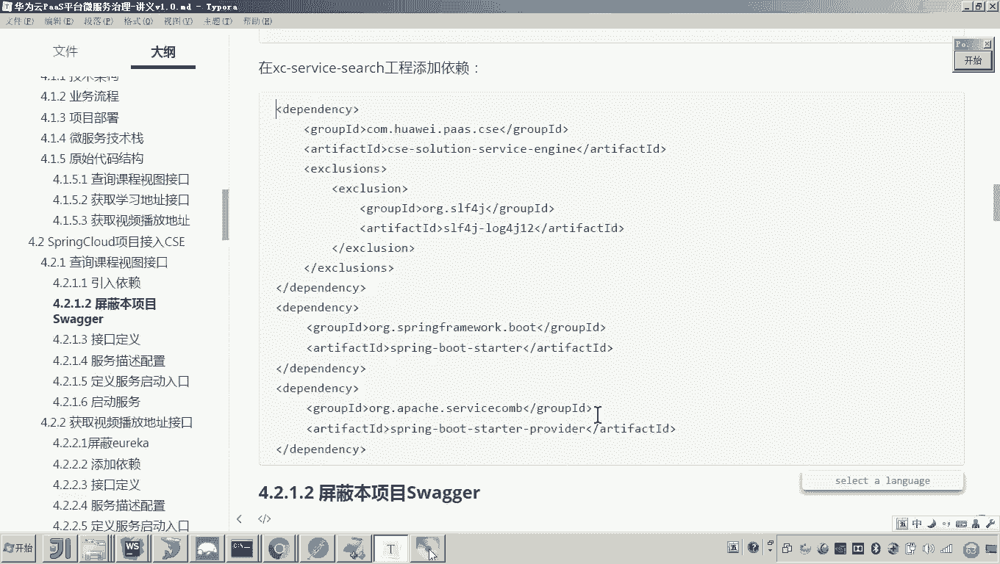

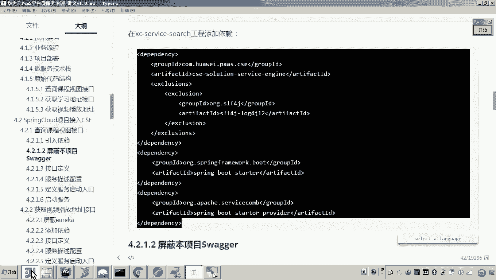

对于Spring Cloud项目，核心改造思路是将其接口开发方式转变为ServiceComb的方式。主要步骤同样分为三步：

1.  **引入依赖**：替换原有的Spring Cloud依赖为CSE依赖。
2.  **修改接口**：将接口定义和实现调整为ServiceComb风格。
3.  **配置文件**：添加CSE所需的`microservice.yaml`配置文件。

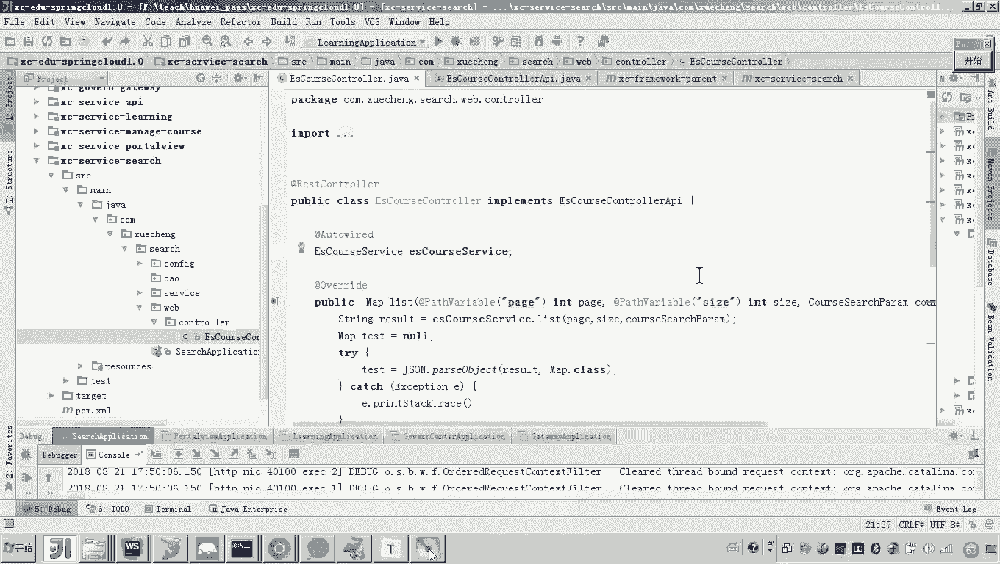

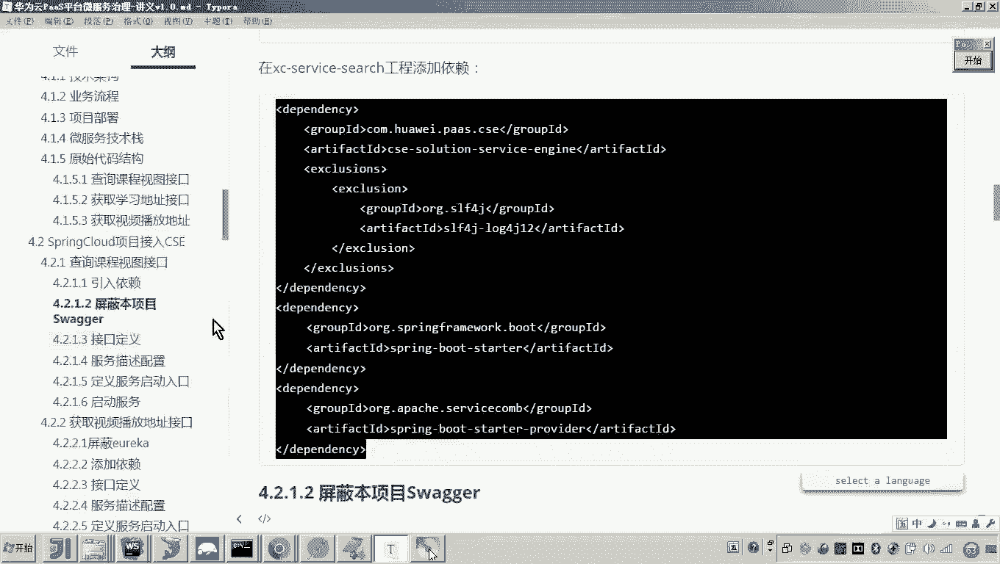

## 第一步：引入依赖

首先，我们需要在项目中进行依赖管理。在父工程（`pom.xml`）中，定义CSE的依赖版本并替换原有的Spring Cloud依赖管理。

**父工程 `pom.xml` 修改示例：**
```xml
<!-- 定义CSE版本 -->
<cse.version>2.3.30</cse.version>

<!-- 注释或移除原有的spring-cloud-dependencies -->
<!-- <dependencyManagement>...</dependencyManagement> -->

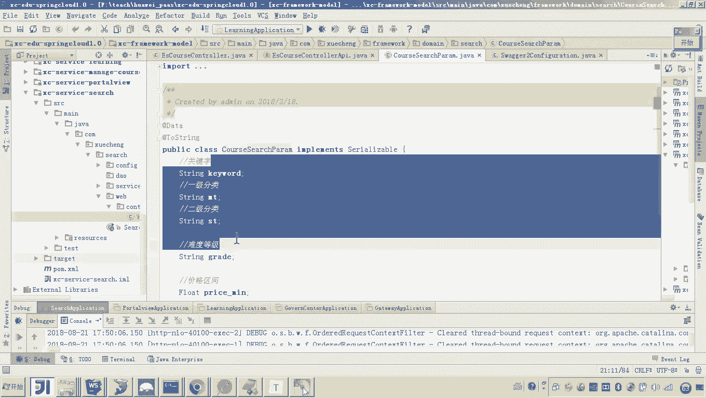

<!-- 添加华为CSE的依赖管理 -->
<dependencyManagement>
    <dependencies>
        <dependency>
            <groupId>com.huawei.paas.cse</groupId>
            <artifactId>cse-dependency</artifactId>
            <version>${cse.version}</version>
            <type>pom</type>
            <scope>import</scope>
        </dependency>
    </dependencies>
</dependencyManagement>
```

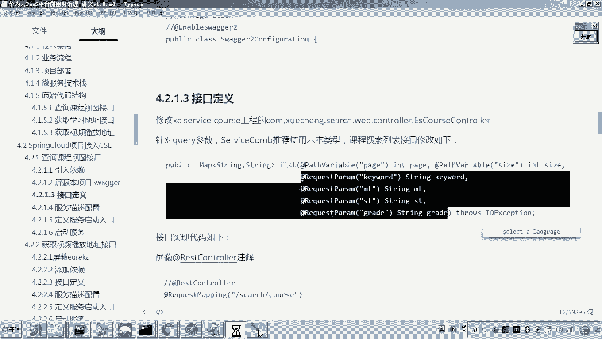

完成父工程配置后，需要在具体的子模块（即搜索服务模块）中引入必要的CSE依赖包。

**搜索服务模块 `pom.xml` 修改示例：**
```xml
<dependencies>
    <!-- 引入CSE核心依赖 -->
    <dependency>
        <groupId>com.huawei.paas.cse</groupId>
        <artifactId>cse-solution-service-engine</artifactId>
    </dependency>
    <dependency>
        <groupId>com.huawei.paas.cse</groupId>
        <artifactId>spring-boot-starter-provider</artifactId>
    </dependency>
    <dependency>
        <groupId>com.huawei.paas.cse</groupId>
        <artifactId>spring-boot-starter-development</artifactId>
    </dependency>
    <!-- 移除或注释原有的Spring Cloud相关依赖，如spring-cloud-starter-netflix-eureka-client -->
</dependencies>
```

## 第二步：修改接口定义与实现

引入依赖后，我们需要调整接口的编码方式。学成在线项目原本使用自定义方式生成Swagger接口文档，接入CSE后，将使用框架自动生成契约，因此需要移除原有的相关注解。

### 1. 调整API层（接口定义）

首先查看需要改造的接口。以“查询课程”接口为例，原接口可能使用`@GetMapping`并接收一个自定义的POJO对象来封装查询参数。

**原Spring Cloud风格接口示例：**
```java
@RestController
@RequestMapping("/search")
public interface CourseSearchApi {
    @GetMapping("/course/list")
    PageResult<CourseIndex> queryCoursePub(SearchCourseParamDto searchCourseParamDto);
}
```

在ServiceComb/CSE框架中，对于GET请求的查询参数，建议使用基本类型（如`String`, `Integer`）逐个声明，而不是用一个POJO对象接收。因此，我们需要拆分参数。

**改造为ServiceComb风格接口示例：**
```java
// 注意：移除了 @RestController 注解
public interface CourseSearchApi {
    // 将POJO中的字段拆分为基本类型参数
    PageResult<CourseIndex> queryCoursePub(String keywords, String mt, String st, String grade);
}
```

### 2. 调整服务实现层

接口定义修改后，对应的实现类也需要调整。主要变化有两点：
*   将`@RestController`、`@RequestMapping`等注解移到实现类上。
*   在实现类的方法中，将分散的基本类型参数重新组装成原Service层所需的POJO对象。

**改造后的实现类示例：**
```java
// 将路径注解标注在实现类上
@RestController
@RequestMapping("/search")
public class CourseSearchController implements CourseSearchApi {

    @Autowired
    private CourseSearchService courseSearchService;

    @Override
    @GetMapping("/course/list") // 将HTTP方法注解标注在实现方法上
    public PageResult<CourseIndex> queryCoursePub(String keywords, String mt, String st, String grade) {
        // 将基本类型参数组装成原Service需要的DTO对象
        SearchCourseParamDto dto = new SearchCourseParamDto();
        dto.setKeywords(keywords);
        dto.setMt(mt);
        dto.setSt(st);
        dto.setGrade(grade);
        // 调用原有的业务逻辑
        return courseSearchService.queryCoursePub(dto);
    }
}
```
**关键点说明：** ServiceComb框架扫描契约时主要关注实现类。因此，必须将`@RequestMapping`、`@GetMapping`等注解从接口移至实现类，契约才能被正确生成。

## 第三步：配置CSE服务文件

接口改造完成后，需要添加CSE的配置文件。在搜索服务模块的`src/main/resources`目录下，创建`microservice.yaml`文件。

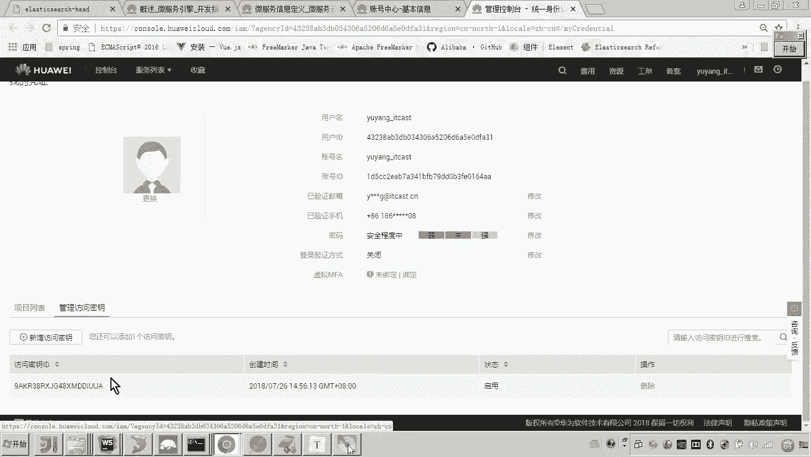

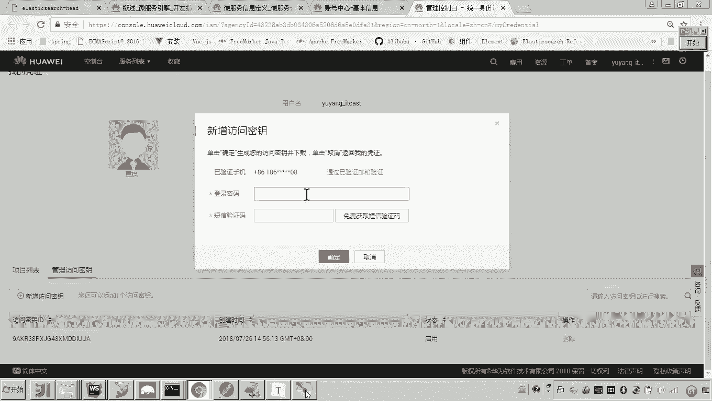

**`microservice.yaml` 配置示例：**
```yaml
# 应用名称，用于在CSE平台分组服务
APPLICATION_ID: XCEduCloud1.0
# 微服务名称
service_description:
  name: xc-service-search
  version: 1.0.0
# 跨应用访问设置，通常保持默认
cse:
  service:
    registry:
      # 华为云CSE服务注册中心地址
      address: https://cse.cn-north-1.myhuaweicloud.com
      # 服务发现配置
      instance:
        watch: false
  credentials:
    # 从华为云控制台获取的AK/SK，用于鉴权
    accessKey: your_access_key_here
    secretKey: your_secret_key_here
    akskCustomCipher: default
  rest:
    address: 0.0.0.0:40100 # 服务监听地址和端口
```
**配置项解读：**
*   `APPLICATION_ID`：在CSE控制台展示的应用名。
*   `service_description.name`：微服务名，将取代原`application.yml`中的`spring.application.name`。
*   `service_description.version`：微服务版本。
*   `cse.service.registry.address`：华为云CSE服务注册中心的地址。
*   `cse.credentials`：华为云账号的访问密钥（AK/SK），需从控制台获取。
*   `cse.rest.address`：本服务启动后监听的地址和端口。**此配置将覆盖原Spring Boot配置文件中的`server.port`。**

## 第四步：修改启动类并启动服务

最后，我们需要修改Spring Boot启动类，启用ServiceComb框架并移除原有的Spring Cloud客户端注解。

**启动类改造示例：**
```java
@SpringBootApplication
// 移除原有的 @EnableDiscoveryClient, @EnableFeignClients 等注解
@EnableServiceComb // 添加此注解以启用ServiceComb框架
public class SearchApplication {
    public static void main(String[] args) {
        SpringApplication.run(SearchApplication.class, args);
    }
}
```

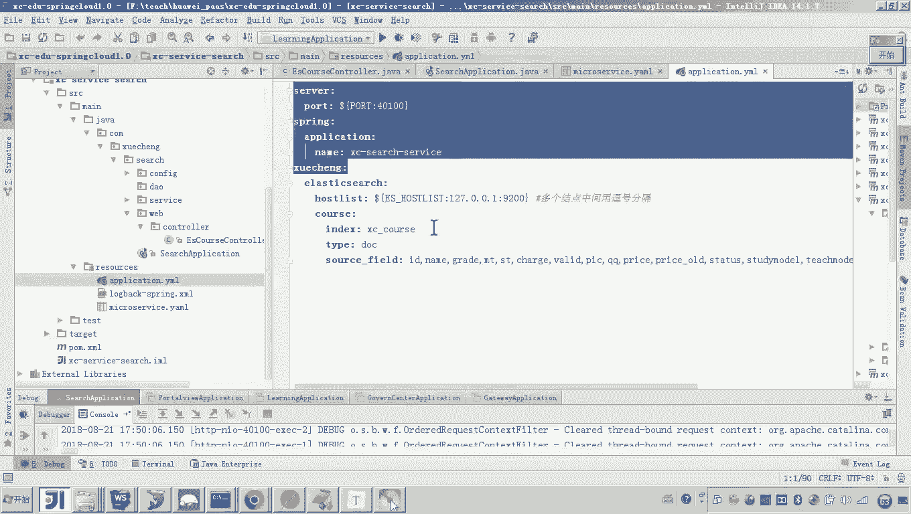

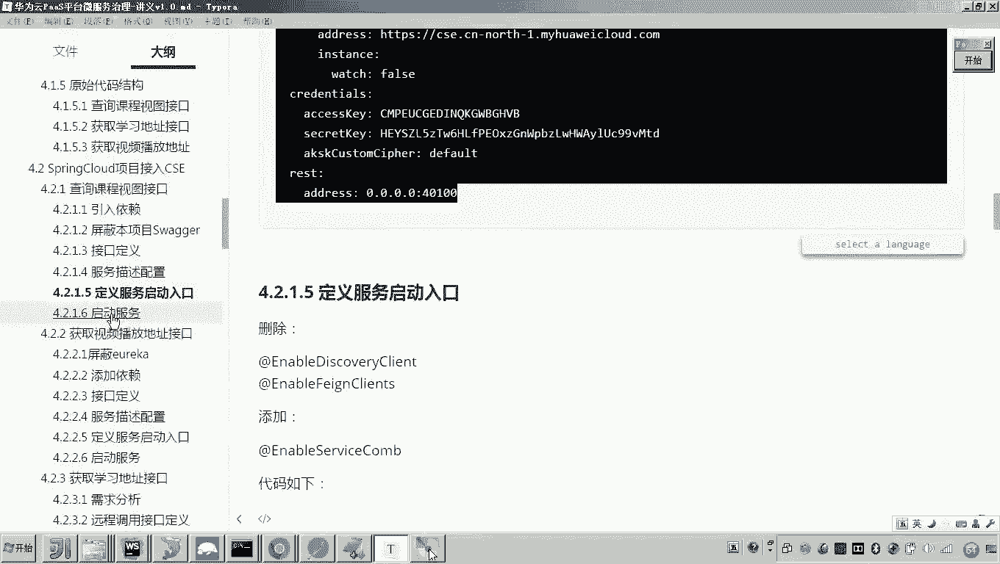

完成以上所有步骤后，清理项目并重新编译，然后启动搜索服务。观察日志，若出现服务注册成功的提示，即表示改造成功。

## 验证结果

服务启动后，登录**华为云控制台**，进入**微服务引擎CSE > 服务目录**。在对应的应用（`XCEduCloud1.0`）下，应能看到名为`xc-service-search`的微服务实例。

**可能遇到的问题：** 服务实例注册成功，但“服务契约”未显示。这通常是因为接口注解（如`@RequestMapping`）未正确移至实现类，导致框架未能扫描生成契约，请按前述步骤检查。

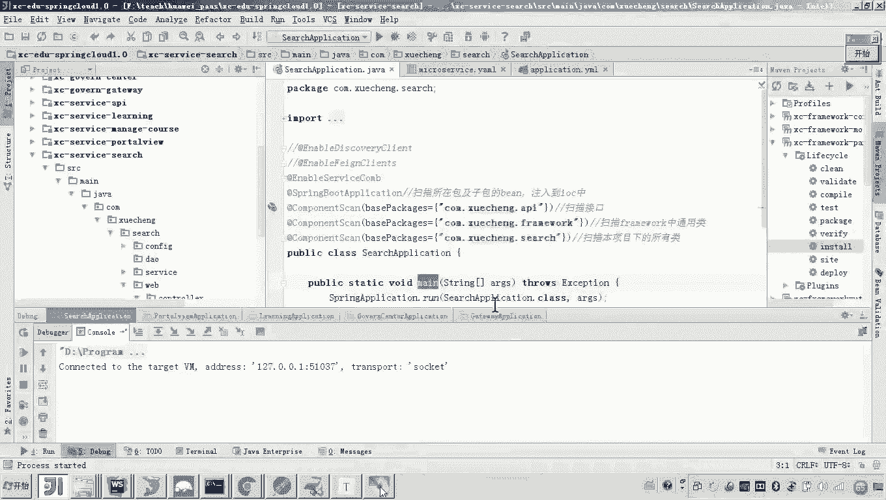

## 总结

本节课我们一起学习了将Spring Cloud微服务接入华为云CSE的完整流程。我们以学成在线项目的搜索服务为例，详细演练了四个核心步骤：
1.  **引入依赖**：在父工程和子模块中替换为CSE依赖。
2.  **修改接口**：将接口参数拆分为基本类型，并将相关注解移至实现类。
3.  **添加配置**：创建`microservice.yaml`文件，配置应用名、服务名、注册中心及AK/SK。
4.  **改造启动类**：添加`@EnableServiceComb`注解并移除旧注解。

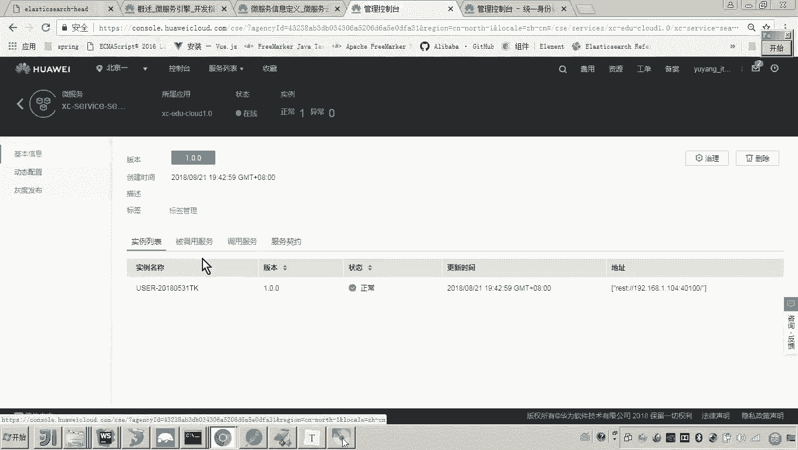

完成改造后，服务即能从Eureka注册中心迁移至华为云CSE，并利用其提供的服务治理能力。后续其他服务的改造均可遵循此模式进行。