# 华为云PaaS微服务治理技术 - P92：16.学成在线项目接入CSE-搜索服务接入CSE问题处理和总结 - 开源之家 - BV1wm4y1M7m5

好，那么刚才呢我们应该已经完成了呃这个搜索服务接入CSC啊，但是接入完成了之后呢，我们发现这个服务契约在这是不是没有啊，这个服务契约是不是就是你的这个接口的文档啊？好，那这是为什么呢？对。

那各位说接口的文档没有，或者说接口的文档有问题，我们应该从哪里查找呢？对，应该找你的接口，哎，然后找你的接口定义的地方？😊。

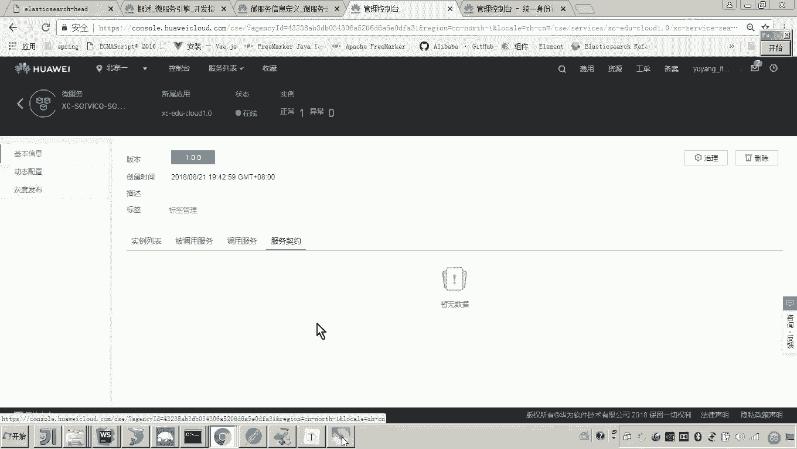

各位这个接口呢，因为我们是采用sIVC的方式来开发，所以你就找到你的controller就行了。在你的conttrol里边，各位这是些注解是不是都有啊？😊，但永说老师这些注解都有啊。

为啥为啥这个接口契约没有啊？😊，对，我们仔细想一下，对这个servicecom当初我们开发的时候是不是讲过？现在我们要做的是不是把这个sp cloud项目呢哎改为servicecom方式，然后呢。

我们是不是就可以顺利接入CSE了。哎，所以各位servicecom当初强调过哎，在写接口的时候，首先类上面是不是要加一个request mapping。然后其次这里边要加一个re有印象吧？哎。

因为它提供两种方式嘛，一种是rest的方式，一种是RPC方式，我们这里边用res的方式，然后这里边是不是有一个叫smer ID对不对？哎，好，这个 ID呢通常是和我们说这个类呢。

这个接口的类呢保持一致就可以了哎，一对一。然后这里边我们要写哎写一个名字吧。嗯这里边我们用一个叫service一个常量啊，这个常量这个这个名字，我们就把它叫做这个s的这个I。😊，可以吧。

我说老师这这这个不太理解。其实简单嘛，这就是个字符串，对不对？你你这么写是不是也可以啊？😊，没错吧，哎，这就是一个命名空间的名称嘛。然后这里边这儿是不是就我可以用常量代替嘛？对。

这个就是我们的这个微服务的名字嘛嗯。😊，好了，那现在呢我们就把这个skim呃res con呃smmer呢把这个注解呢就加上去了。加上去之后呢，你是不是要把它给干掉呀？重启啊？对，那各位这个接口这个接口。

😊。

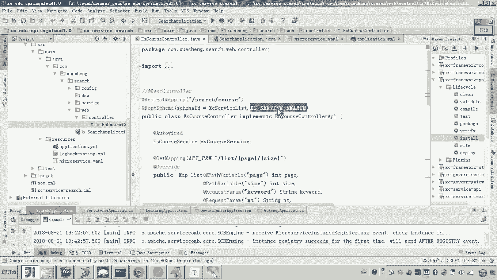

我是不是有改动，凡是接口有改动的，我之前教过大家应该怎么做呢？对我都建议你只要接口有改动，你就把服务目录里边的这个服务啊，你给我干掉，删掉。好，然后呢我们再次来启动。😊。

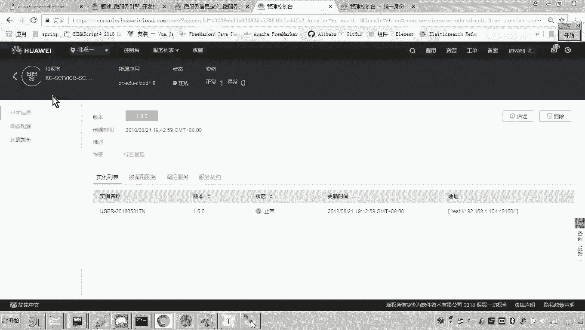

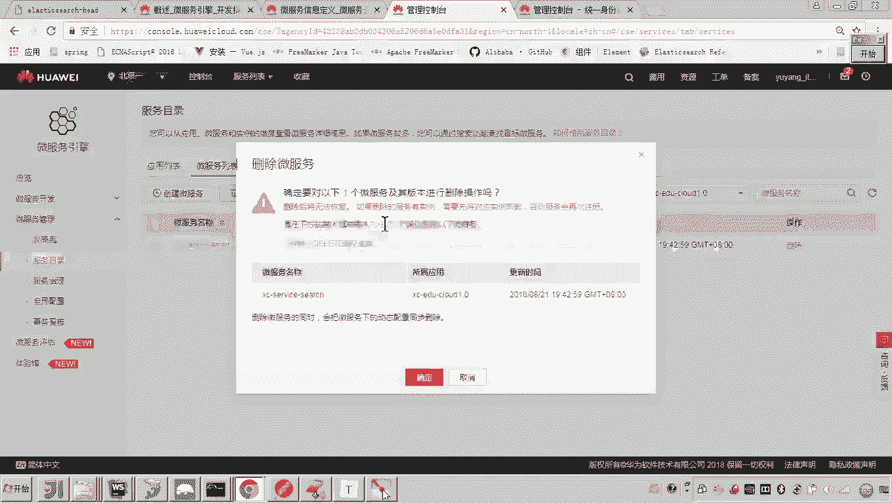

好，那这样的话，它启动时候呢，它就报了一个错。对，报了一个什么错呢？说这个type of key in map哎必须是什么字符串。哎，哎，什么意思？😊，这个是哪个接口应该导致的吧。

所以那你都想啊这个这个这个接口嘛，这个接口你看这里面是不是有一个叫swagger，对吧？哎，这个呃在生成swagger文档的时候啊，他报了这么一个错。哎，他报这个错，我们就看这个接口，我们找到接口。

找到接口。😊，哎，这个接口里边哪里头用到map了？各位，你来看这些是不是都用到map了，对不对呀？哎，那么都用到map了。但是这里边各位就这个map就存在问题。😊，存在什么问题？

这个map各位这个范型里头我是不是就没有加它的这个key啊，这个key必须是str。😡，看懂了吧？哎，然后这里边呢后边你可以你可以叫做opic。😡，哎，你可以叫奥布杰给他。

我们先看一下这个map是啥意思啊，这个map它返回的结果嘛，返回的结果啊，你看下这个你看一下这个方法。😡，这个方法返回这个mapm在哪？😡，是不是在这？

这个是不是就是调用service哎来搜索一electastic searcharch，拿到搜索数据，拿到这个搜索数据是不是字符串啊？这个字符串其实这个字符串的这个本身的内容就是阶层数据。然后呢。😡。

我这个代码当中做了一件事儿，是不是把jason转换成了map类型，然后这里边是不是把它。😊，返回这个m了，对吧？那这个接森串接森串我要返回麦画，其实各位。😡，那这里头我是不是可以写作这个呃。😊，怎么写？

object可以吧。没问题吧。哎，但是这个K必须是死t。😡，嗯，好，这样弄完了之后，我们再来启动。😊。

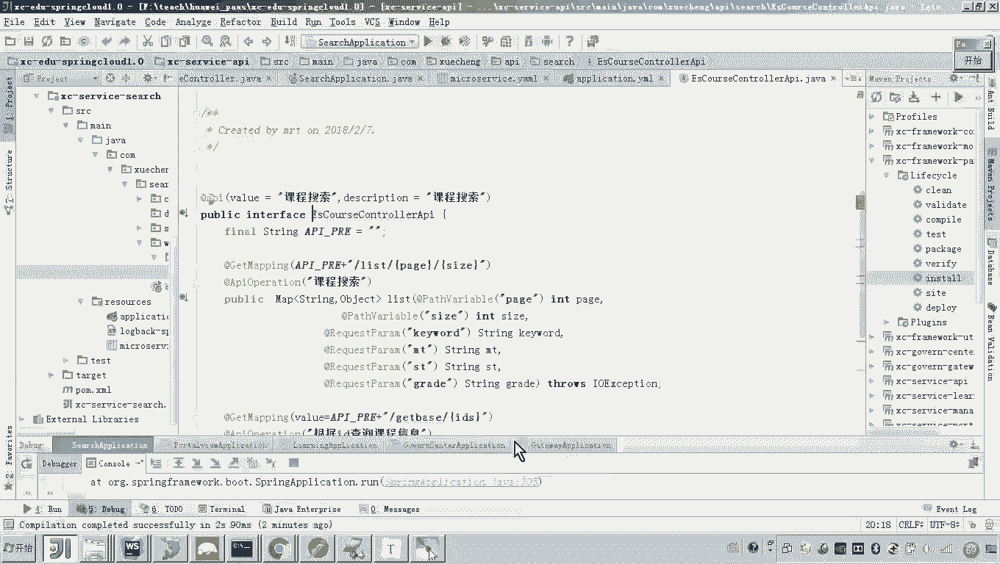

因为本身现在服务没有没有启动成功嘛，所以这里边你可以刷新，它其实是没有的，还没有注册成功呢嗯。😡，对，好，那这样的话我们来再次启动来看一下。😊，最后它是不是就注册成功了，然后呢，我们再来刷新这个服务。

可可以看一下它这里边是不是就有了。然后我们点开嗯来看服务器约有了吧，然后和我们这个接口的描述是不是一致的？哎。

这个base pass是不是 search course这个base pass是不是就对应于这个类上边的这个啊注解呀，就是这个request mapping的注解呀？😊。

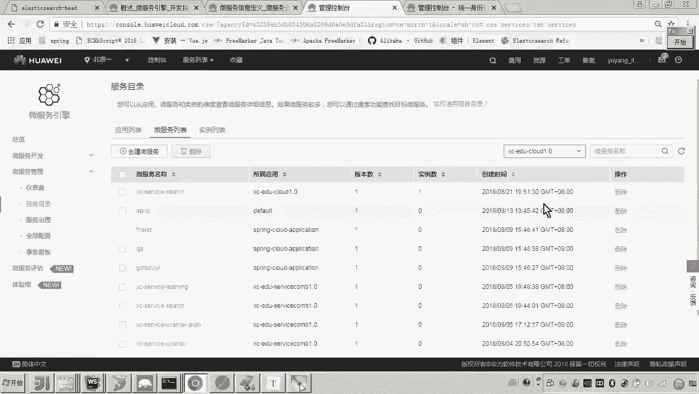

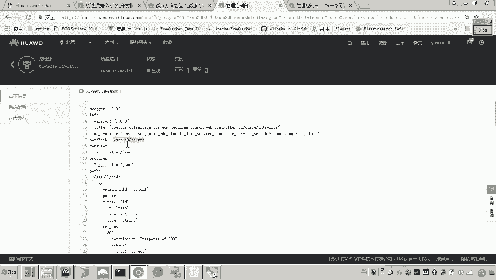

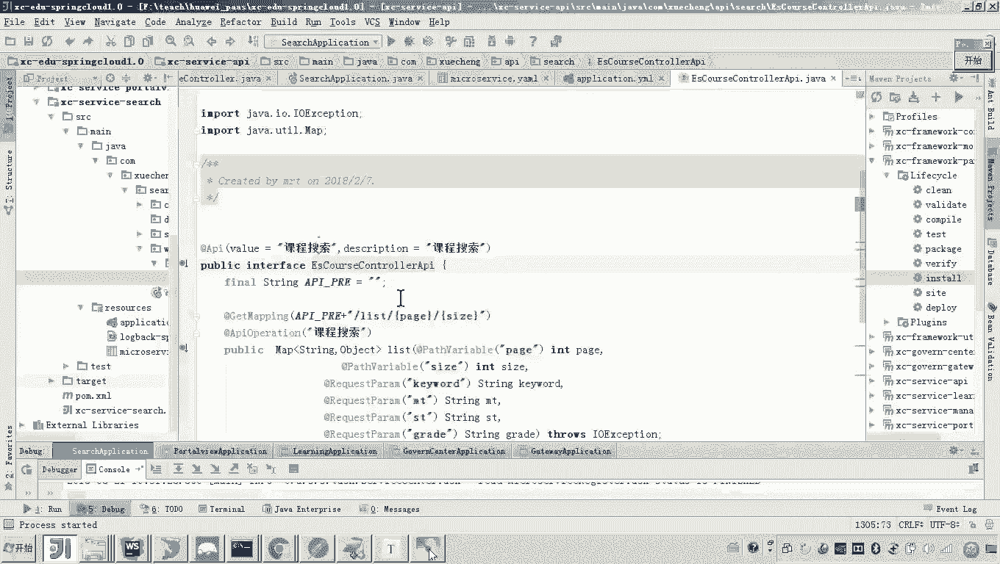

然后里边呢就是各个各个方法，各个方法的URL了。那你可以大概的对照一下啊，这是get O，对吧？这是get base嗯。😊，还有类似的。看见了吧？这应该就没有问题了。好，那到这儿来说。

我们这个搜索服务应该就接入成功了。嗯，那有说老师那你接入成功了，能不能测一下呢？😊。

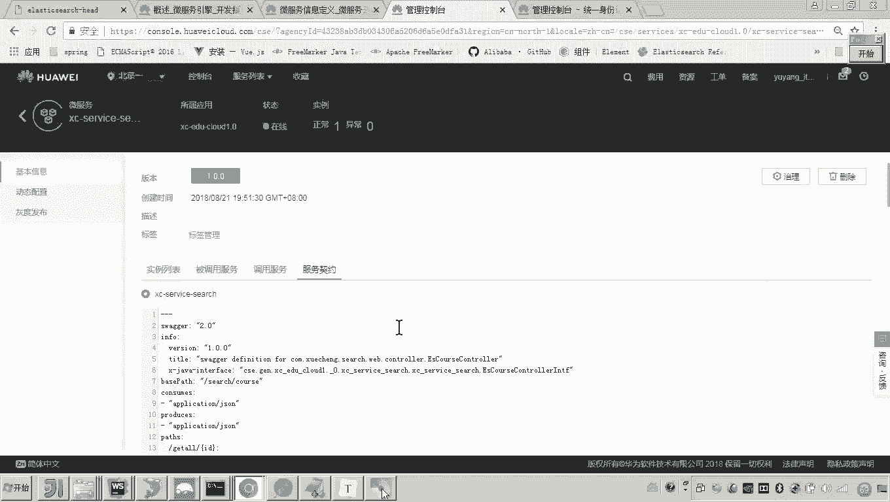

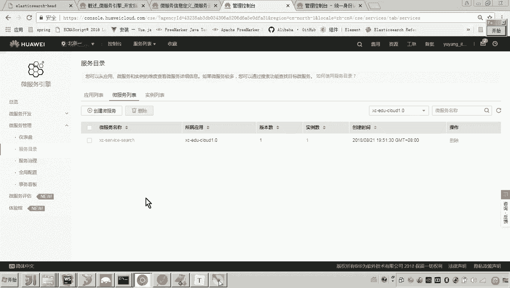

当然可以啊，我们是可以去，比如说我们测哪个呀，我们测这个吧，可以吧？好，那这样的话我们就只需要非常简单的在，因为它是get请求。哎，我在浏览器上面输。😊。

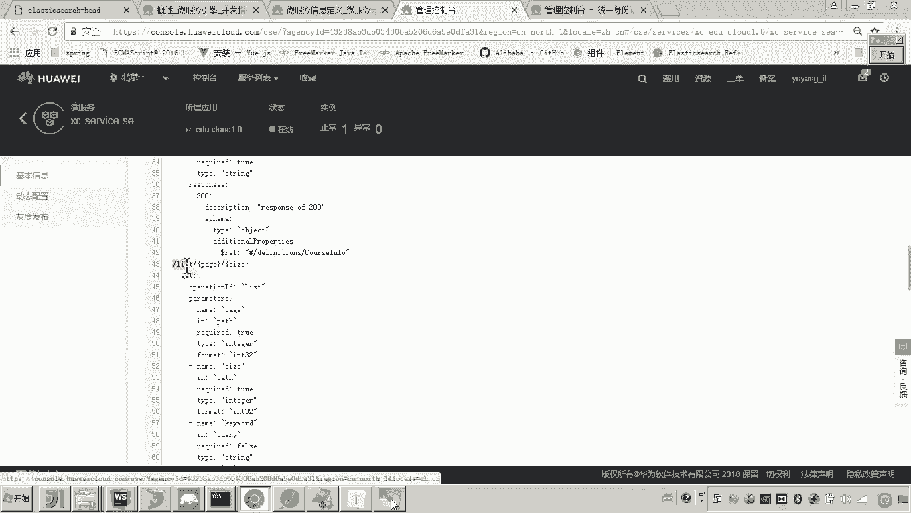

啊，属一个locgo house的啊，它是它这个它这个端口是不是叫40100啊，然后list。😊，嗯，是吗？我们来看一下啊。

找到它这个配置文件，它这个端口是不是叫40100啊，然后它的这个接口呢是不是就是se取cos，然后list后边跟一个页码和每一页的记录数，对不对？所以这里边呢我们就嗯跟个前缀，然后list1-2。😊。

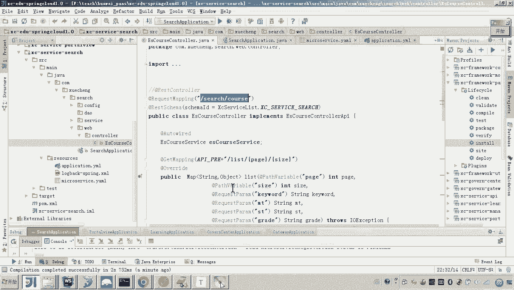

各位看一下数据是不是就出来了。所以这样的话，我们这个搜索服务呢啊就接入成功。😊。

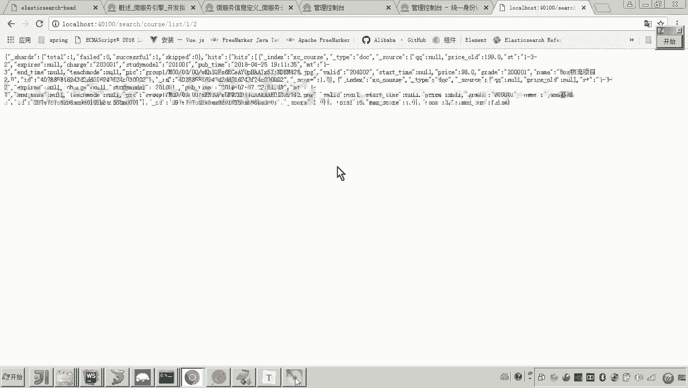

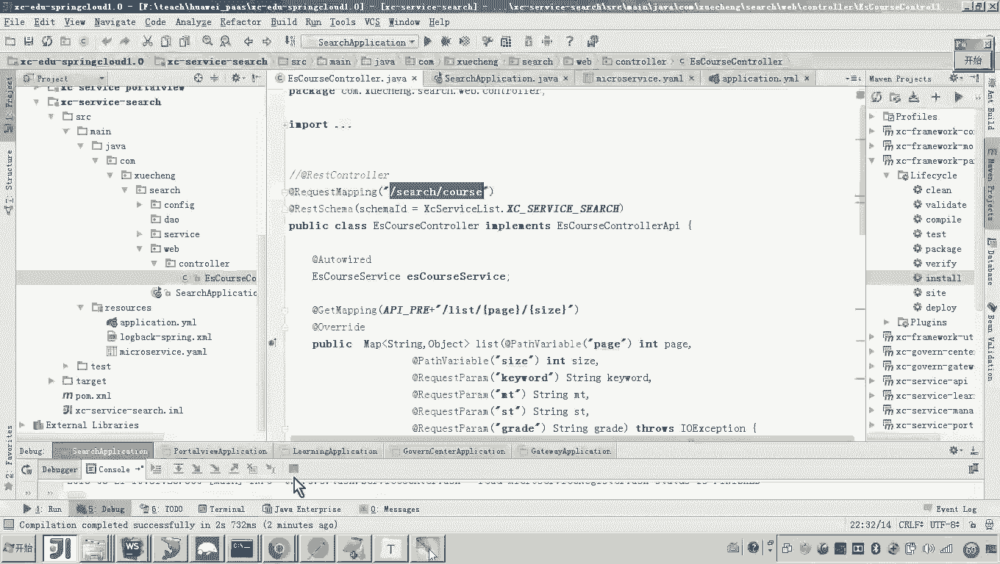

好，那么这个搜索服务接入成功之后，其实我们也可以简单回顾一下，看一下它这个过程是什么，就是引入依赖啊，引入CSE的依赖。然后啊因为我们是之前学生在线是自己扫描这个呃包下边的类型，然后呢来生成swaer。

所以这里面我们呃由于采用的是servicecom框架，它自己来呃生成这个呃swagger文档，所以我们就把自己的原来这个扫描呃，这个swagger的这个注解就去掉了，然后定义接口定义接口的时候。

这里边有一个点要给大家提醒的是什么呢？就是说这个对get请求呢，我们要呃定义这种基本类型的参数。😊，然后服务的描述配置啊，最后再启动入口，哎，再启动上边，我们把这个注解删掉。

然后再加上这个servicecom的这个enable注解。最后我们就完成了这个服务的改造。

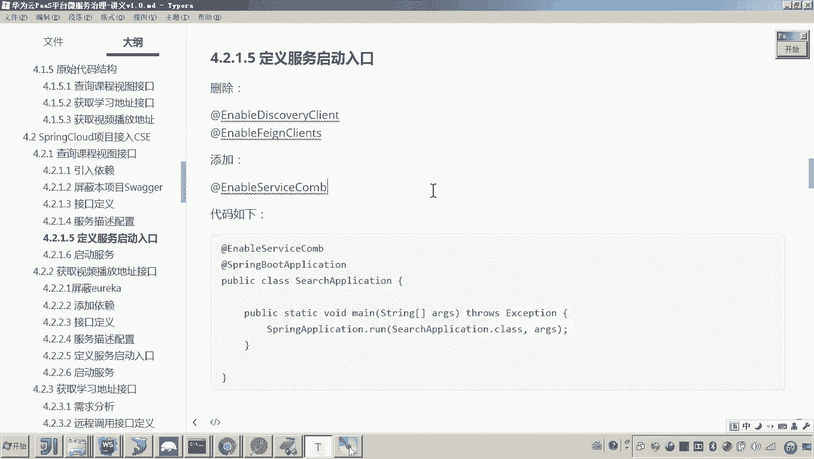